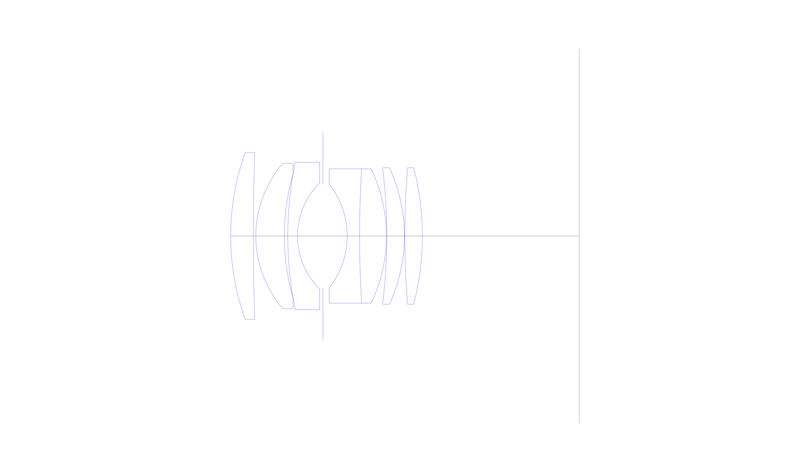
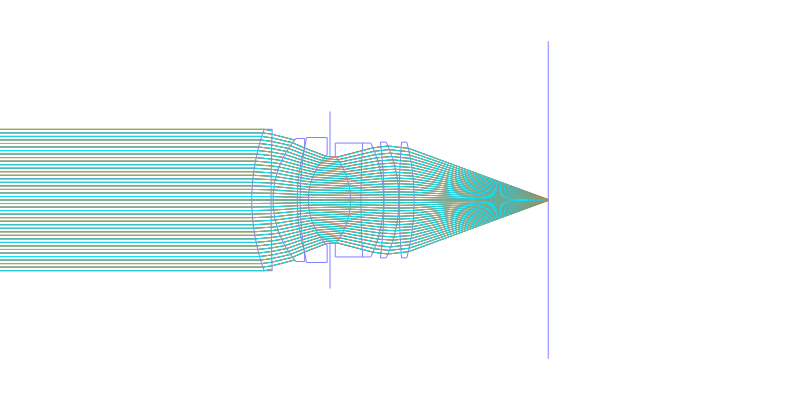
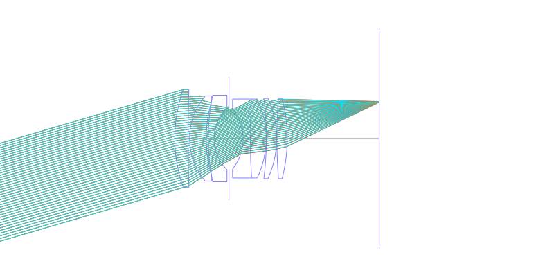
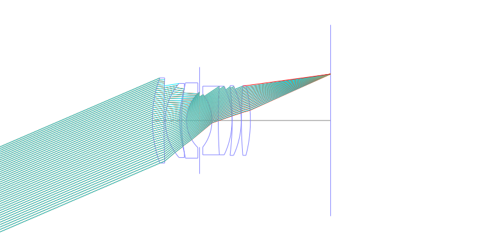
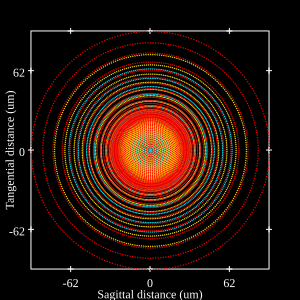
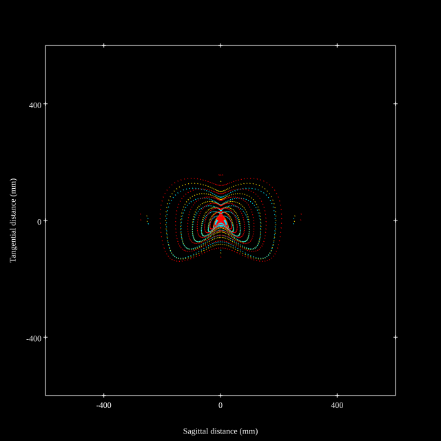
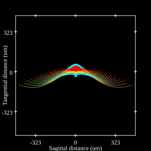
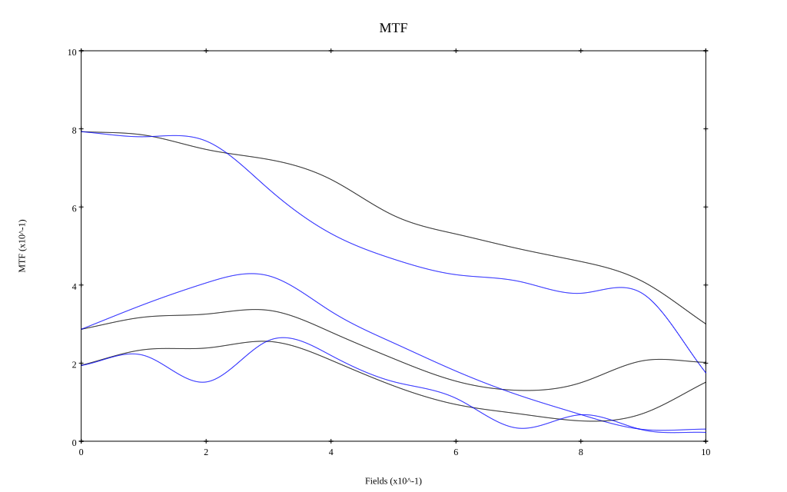
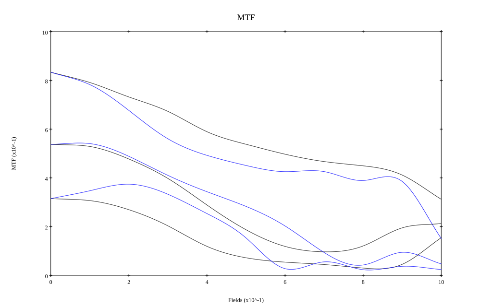

# Leitz / Leica Summilux-R 50mm f1.4 v1
## Patent Information
| Country | Patent Number | Example | Year of Application | Inventors | Organisation | Link |
| ---     | ---           | ---     | ---                 | ---       | ---          | ---  |
|US | US3552829 | EX 1 | 1967 | Heinz Marquardt | Ernst Leitz Wetzlar GmbH | [link](https://patents.google.com/patent/US3552829A/en) |
## Surface Data
Note that where glass types are shown the refractive index and abbe number is as per assigned glass type

| ID  | Radius | Thickness | Diameter | nd  | vd  | Glass Make | Glass |
| --- | ---    | ---       | ---      | --- | --- | ---        | ---   |
| 1 | 56.655 | 5.24 | 38.5 | 1.816 | 46.62 | Ohara | S-LAH59 |
| 2 | 600.0 | 0.565 | 38.5 |  |  |  |
| 3 | 25.68 | 6.56 | 33.5 | 1.69101 | 54.79 | CORNING | C90-55 |
| 4 | 51.875 | 0.8 | 28.716 |  |  |  |
| 5 | 84.6 | 2.255 | 34.0 | 1.62588 | 35.7 | Ohara | S-TIM1 |
| 6 | 17.295 | 5.865 | 24.5 |  |  |  |
| 7 | AS | 5.565 | 24.1 |  |  |  |
| 8 | -19.475 | 2.855 | 24.0 | 1.7847 | 26.08 | Schott | SF56A |
| 9 | 246.02 | 6.185 | 31.0 | 1.79619 | 43.22 | CORNING | D96-43 |
| 10 | -35.965 | 0.095 | 31.0 |  |  |  |
| 11 | -125.895 | 4.05 | 31.5 | 1.79619 | 43.22 | CORNING | D96-43 |
| 12 | -37.625 | 0.095 | 31.5 |  |  |  |
| 13 | 198.13 | 4.05 | 31.5 | 1.713 | 53.83 | Schott | N-LAK8 |
| 14 | -63.025 | 36.412 | 31.5 |  |  |  |
## Layouts

## Spot Diagrams

## Paraxial Parameters
| parameter | value |
| ---       | ---   |
| effective_focal_length |49.953
| back_focal_length | 36.486
| optical_invariant | 7.659
| object_distance | 1.0E10
| image_distance | 36.486
| power | 0.02
| pp1_H | 37.178
| ppk_H' | -13.466
| ffl_F | -12.774
| fno | 1.408
| enp_dist_P | 24.078
| enp_radius | 17.742
| exp_dist_P' | -31.15
| exp_radius | 24.049
| m | -0
| red | -2.0018938458346564E8
| n_obj | 1
| n_img | 1
| img_ht | 21.565
| obj_ang | 23.35
| obj_na | 0
| img_na | -0.335|
## Spot Analysis
| Field | Spot Mean Radius | Spot Max Radius |
| ---   | ---              | ---             |
 | Field(x=0.0, y=0.0) | 14.666 | 40.89|
 | Field(x=0.0, y=0.1) | 23.995 | 116.664|
 | Field(x=0.0, y=0.2) | 39.048 | 191.115|
 | Field(x=0.0, y=0.3) | 54.817 | 248.958|
 | Field(x=0.0, y=0.4) | 65.628 | 265.996|
 | Field(x=0.0, y=0.5) | 63.242 | 254.772|
 | Field(x=0.0, y=0.6) | 66.425 | 225.403|
 | Field(x=0.0, y=0.7) | 72.68 | 276.505|
 | Field(x=0.0, y=0.8) | 77.076 | 344.436|
 | Field(x=0.0, y=0.9) | 91.16 | 431.982|
 | Field(x=0.0, y=1.0) | 108.721 | 476.49|
## Polychromatic Geometric MTF

* 10,30,50 cycles/mm
* Black lines represent sagittal, blue tangential
* To generate above, MTFs for wavelengths 587.5618(d), 486.1327(F), 656.2725(C) were calculated across 10 fields, and then averaged
## Polychromatic Geometric MTF (Weighted)

* 10,30,50 cycles/mm
* Black lines represent sagittal, blue tangential
* To generate above, MTFs for wavelengths 587.5618(d) wt(1.0), 656.2725(C) wt(0.475), 546.074(e) wt(0.98), 486.1327(F) wt(0.49), 435.8343(g) wt(0.15) were calculated across 10 fields, and then combined using weighted average
## Resources
* [OpticalBench Compatible Data File, tab delimited](./prescription.txt)
* [Zemax file](./US003552829_Example01.zmx)

Report / Zemax file generated using [Beam42](https://github.com/BeamFour/Beam42) on 2026-04-18
