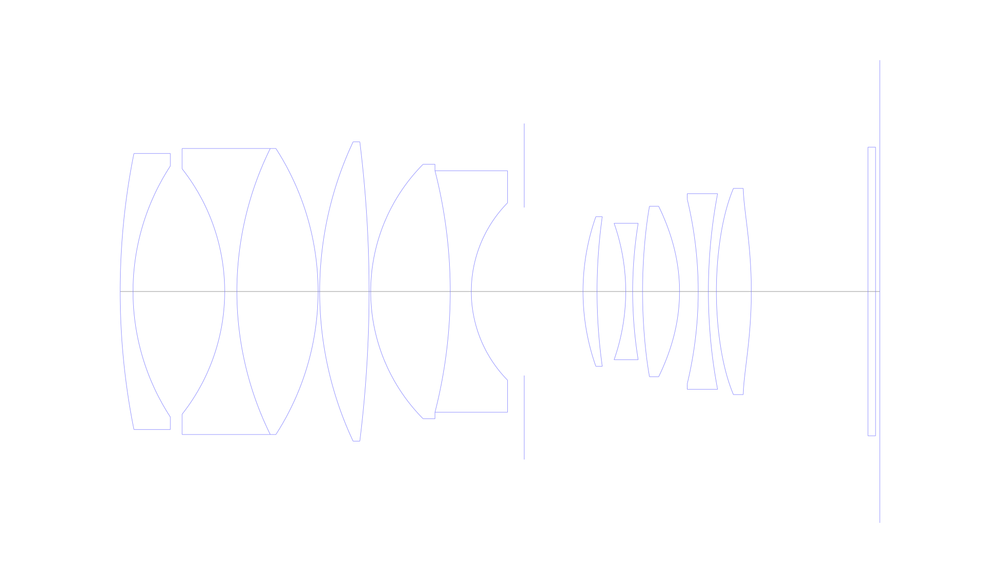
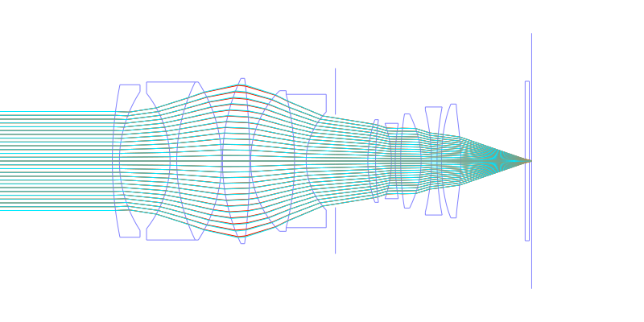
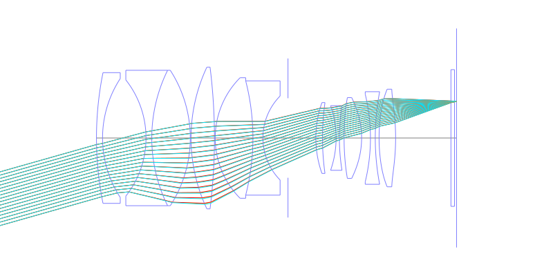
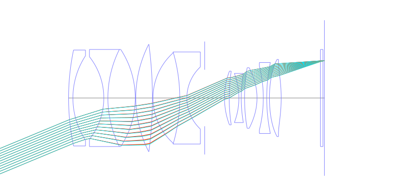
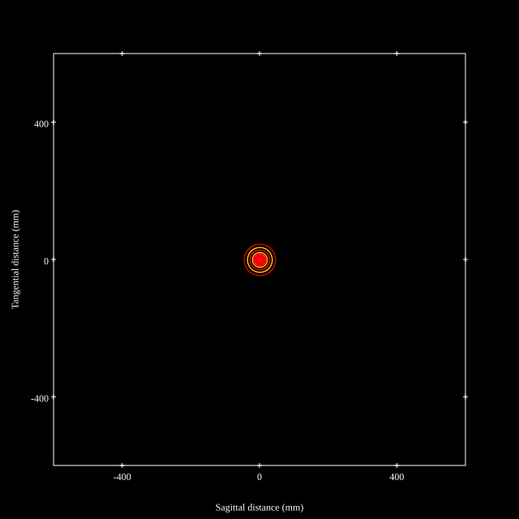
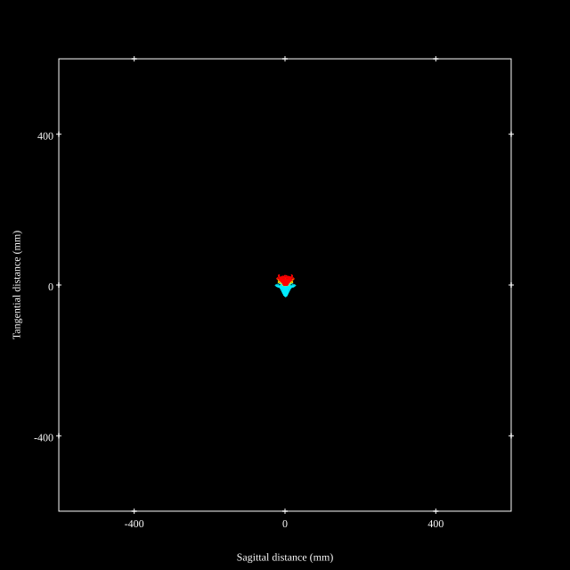
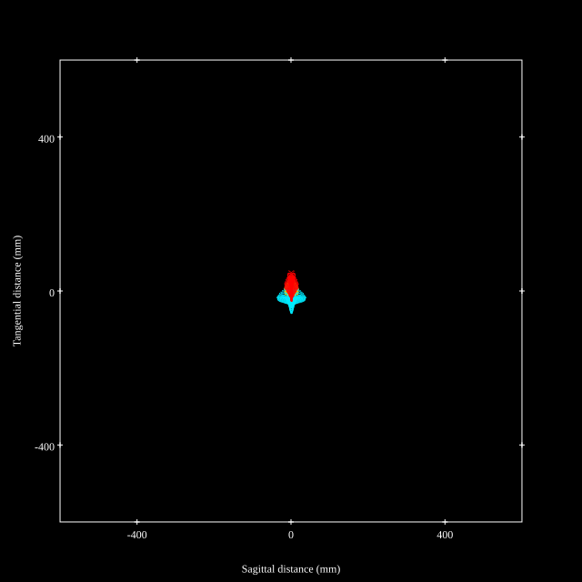
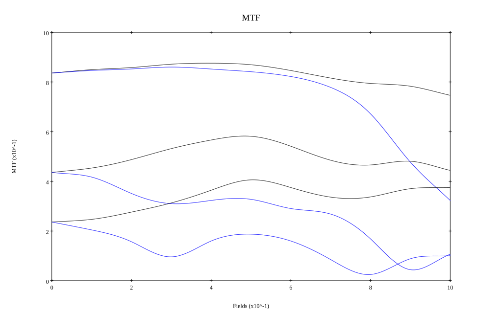
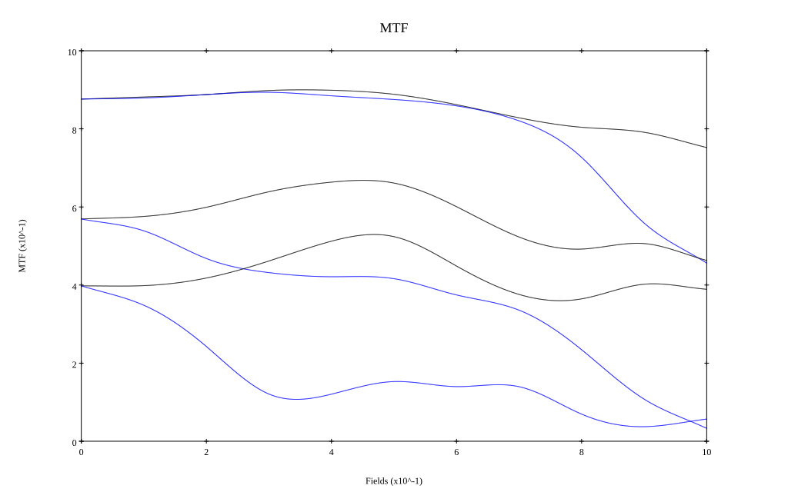

# Summilux-SL 50 f/1.4 ASPH
## Patent Information
| Country | Patent Number | Example | Year of Application | Inventors | Organisation | Link |
| ---     | ---           | ---     | ---                 | ---       | ---          | ---  |
|EU | EP3136147 | 01 | 2016 | TANAHASHI DAISUKE, SOUMA YOSHIHITO | KONICA MINOLTA INC | [link](https://worldwide.espacenet.com/patent/search?q=pn%3DEP3136147A1) |
## Surface Data
Note that where glass types are shown the refractive index and abbe number is as per assigned glass type

| ID  | Radius | Thickness | Diameter | nd  | vd  | Glass Make | Glass |
| --- | ---    | ---       | ---      | --- | --- | ---        | ---   |
| 1 | 130.905 | 2.4 | 51.65 | 1.5168 | 64.17 | Schott | BK7 |
| 2 | 42.994 | 17.142 | 46.98 |  |  |  |
| 3 | -37.064 | 2.277 | 45.9 | 1.74077 | 27.76 | Hoya | E-FD13 |
| 4 | 60.459 | 15.182 | 53.51 | 1.6968 | 55.46 | Hoya | M-LAC14 |
| 5 | -49.318 | 0.3 | 53.51 |  |  |  |
| 6 | 65.854 | 9.237 | 56.01 | 1.92286 | 20.88 | Hoya | M-FDS1 |
| 7 | -226.822 | 0.3 | 56.01 |  |  |  |
| 8 | 33.813 | 14.873 | 47.62 | 1.59282 | 68.62 | Hoya | FCD515 |
| 9 | -90.894 | 3.936 | 45.16 | 1.72825 | 28.32 | Hoya | E-FD10 |
| 10 | 23.69 | 9.901 | 33.2 |  |  |  |
| 11 | AS | 10.989 | 31.431 |  |  |  |
| 12 | 42.044 | 2.622 | 27.99 | 1.83481 | 42.72 | Hoya | TAFD5F |
| 13 | 100.805 | 5.363 | 27.99 |  |  |  |
| 14 | -38.554 | 1.3 | 25.53 | 1.76182 | 26.61 | Hoya | FD140 |
| 15 | 79.645 | 1.849 | 25.53 |  |  |  |
| 16 | 100.609 | 6.914 | 31.91 | 1.73077 | 40.51 | Ohara | L-LAM69 |
| 17 | -32.664 | 3.491 | 31.91 |  |  |  |
| 18 | -73.645 | 1.9 | 34.57 | 1.69895 | 30.05 | Hoya | E-FD15 |
| 19 | 98.001 | 1.5 | 36.59 |  |  |  |
| 20 | 69.849 | 6.526 | 38.57 | 1.8086 | 40.46 | Schott | P-LASF50 |
| 21 | -86.432 | 21.82 | 38.57 |  |  |  |
| 22 | 0.0 | 1.41 | 54.02 | 1.5168 | 64.2 | Hoya | BSC7 |
| 23 | 0.0 | 0.8 | 54.02 |  |  |  |
## Aspherical Data
| ID  | Type | k   | P1 | P2 | P3 | P4 | P5 |
| --- | --- | --- | --- | --- | --- | --- | --- |
| 16| EVEN | 0.0 | 0.0 | -1.3716E-6 | 6.8119E-9 | 0.0 | 0  |
| 17| EVEN | 0.0 | 0.0 | 2.6675E-6 | 5.9131E-9 | -8.3101E-12 | 1.7159E-14 |
| 20| EVEN | 0.0 | 0.0 | 8.1707E-7 | 6.9086E-9 | 0.0 | 0  |
| 21| EVEN | 0.0 | 0.0 | 1.5593E-6 | 5.537E-9 | 1.095E-11 | -6.5642E-15 |
## Layouts

## Spot Diagrams

## Paraxial Parameters
| parameter | value |
| ---       | ---   |
| effective_focal_length |51.963
| back_focal_length | 0.845
| optical_invariant | 7.515
| object_distance | 1.0E10
| image_distance | 0.845
| power | 0.019
| pp1_H | 69.707
| ppk_H' | -51.117
| ffl_F | 17.744
| fno | 1.44
| enp_dist_P | 46.726
| enp_radius | 18.045
| exp_dist_P' | -92.274
| exp_radius | 32.353
| m | -0
| red | -1.924456122080937E8
| n_obj | 1
| n_img | 1
| img_ht | 21.64
| obj_ang | 22.609
| obj_na | 0
| img_na | -0.328|
## Spot Analysis
| Field | Spot Mean Radius | Spot Max Radius |
| ---   | ---              | ---             |
 | Field(x=0.0, y=0.0) | 9.657 | 34.453|
 | Field(x=0.0, y=0.1) | 7.404 | 34.826|
 | Field(x=0.0, y=0.2) | 6.871 | 34.511|
 | Field(x=0.0, y=0.3) | 7.143 | 33.804|
 | Field(x=0.0, y=0.4) | 7.452 | 32.796|
 | Field(x=0.0, y=0.5) | 8.101 | 32.351|
 | Field(x=0.0, y=0.6) | 9.442 | 32.518|
 | Field(x=0.0, y=0.7) | 11.457 | 32.134|
 | Field(x=0.0, y=0.8) | 14.684 | 41.687|
 | Field(x=0.0, y=0.9) | 18.536 | 48.472|
 | Field(x=0.0, y=1.0) | 22.058 | 56.624|
## Polychromatic Geometric MTF

* 10,30,50 cycles/mm
* Black lines represent sagittal, blue tangential
* To generate above, MTFs for wavelengths 587.5618(d), 486.1327(F), 656.2725(C) were calculated across 10 fields, and then averaged
## Polychromatic Geometric MTF (Weighted)

* 10,30,50 cycles/mm
* Black lines represent sagittal, blue tangential
* To generate above, MTFs for wavelengths 587.5618(d) wt(1.0), 656.2725(C) wt(0.475), 546.074(e) wt(0.98), 486.1327(F) wt(0.49), 435.8343(g) wt(0.15) were calculated across 10 fields, and then combined using weighted average
## Resources
* [OpticalBench Compatible Data File, tab delimited](./prescription.txt)
* [Zemax file](./EP3136147_Example01.zmx)

Report / Zemax file generated using [Beam42](https://github.com/BeamFour/Beam42) on 2026-05-21
