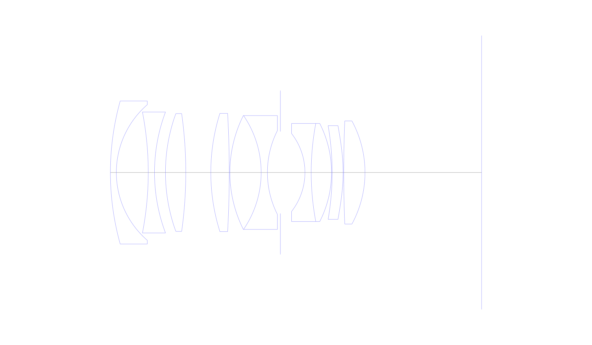
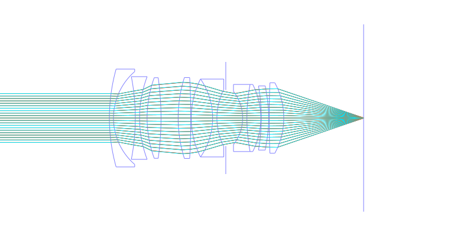
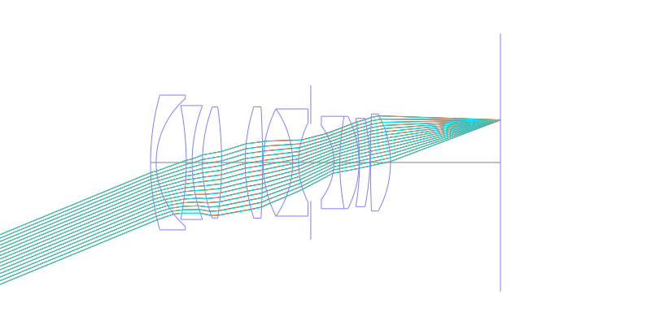
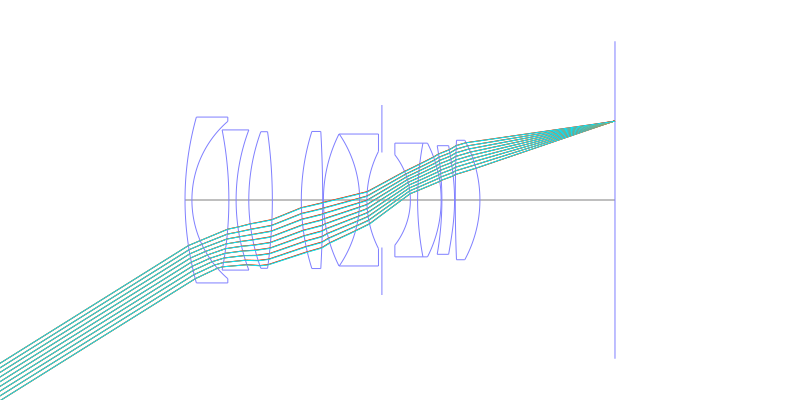
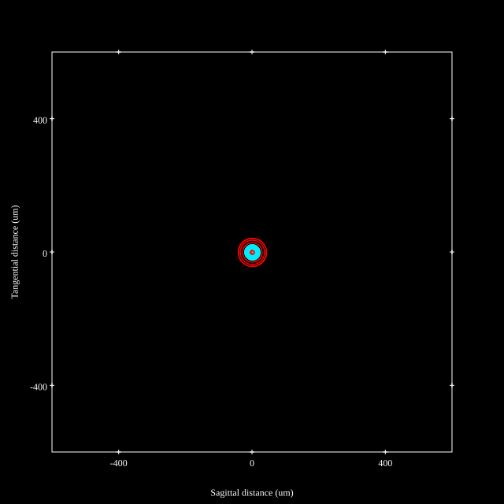
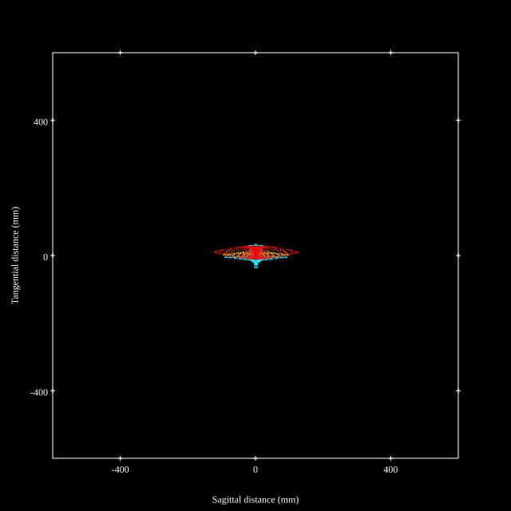
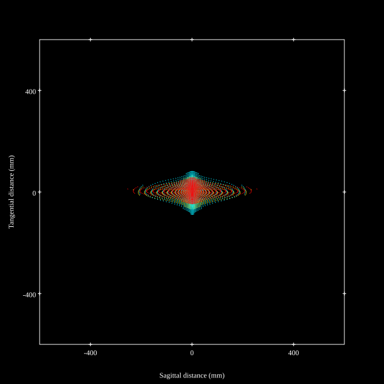
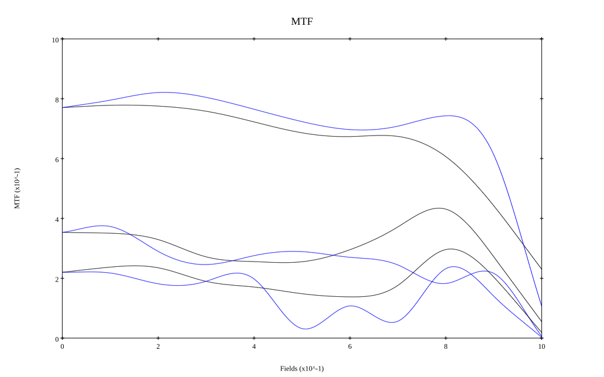
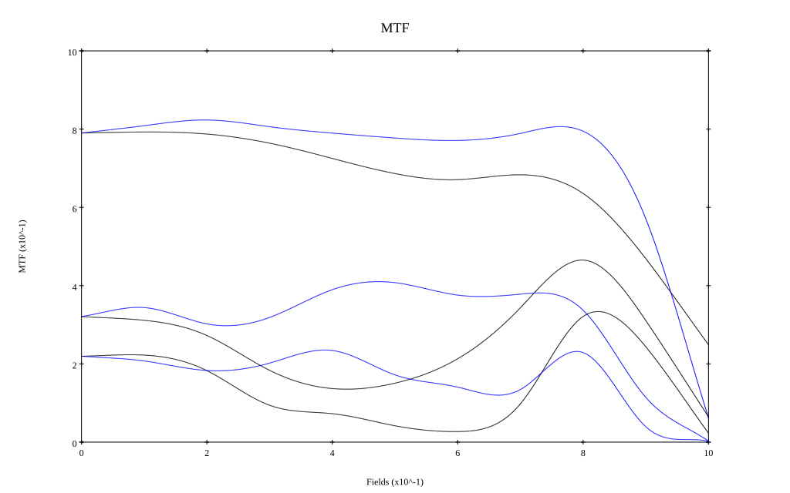

# Minolta AF 35mm F1.4
## Patent Information
| Country | Patent Number | Example | Year of Application | Inventors | Organisation | Link |
| ---     | ---           | ---     | ---                 | ---       | ---          | ---  |
|US | US4806003 | EX 2 | 1986 | Hiromu Mukai, Hisashi Tokumaru | Minolta Co Ltd | [link](https://patents.google.com/patent/US4806003A/en) |
## Surface Data
Note that where glass types are shown the refractive index and abbe number is as per assigned glass type

| ID  | Radius | Thickness | Diameter | nd  | vd  | Glass Make | Glass |
| --- | ---    | ---       | ---      | --- | --- | ---        | ---   |
| 1 | 83.953 | 1.877 | 45.14 | 1.6228 | 57.05 | Ohara | S-BSM10 |
| 2 | 28.356 | 10.056 | 42.83 |  |  |  |
| 3 | -100.191 | 1.972 | 38.15 | 1.6172 | 54.06 | Ohara | S-BSM21 |
| 4 | 54.322 | 3.451 | 38.15 |  |  |  |
| 5 | 54.413 | 6.409 | 37.17 | 1.788 | 47.37 | Ohara | S-LAH64 |
| 6 | -133.208 | 7.887 | 37.17 |  |  |  |
| 7 | 62.134 | 5.817 | 37.31 | 1.788 | 47.37 | Ohara | S-LAH64 |
| 8 | -338.39 | 0.197 | 37.31 |  |  |  |
| 9 | 40.144 | 9.859 | 35.91 | 1.765 | 46.25 |  |
| 10 | -31.819 | 1.972 | 35.91 | 1.72342 | 37.96 | Ohara | S-BAH28 |
| 11 | 29.324 | 4.087 | 26.45 |  |  |  |
| 12 | AS | 7.744 | 25.856 |  |  |  |
| 13 | -20.018 | 1.972 | 24.58 | 1.7552 | 27.51 | Ohara | S-TIH4 |
| 14 | 83.456 | 6.409 | 30.95 | 1.72 | 50.34 | Hoya | LAC10 |
| 15 | -34.062 | 0.197 | 30.95 |  |  |  |
| 16 | -86.327 | 3.451 | 29.56 | 1.72 | 50.34 | Hoya | LAC10 |
| 17 | -55.847 | 0.197 | 29.56 |  |  |  |
| 18 | 403.961 | 6.704 | 32.52 | 1.72 | 50.34 | Hoya | LAC10 |
| 19 | -34.154 | 36.76 | 32.52 |  |  |  |
## Aspherical Data
| ID  | k   | P1  | P2  | P3  | P3 | P5 | P6 | P7 | P8 | P9 | P10 |
| --- | --- | --- | --- | --- | --- | --- | --- | --- | --- | --- | --- |
| 17 | 0.0 | 0.0 | 6.8224E-6 | 6.9938E-9 | -7.2722E-12 | 0.0 | 0.0 | 0.0 | 0.0 | 0.0 | 0.0 |
## Layouts

## Spot Diagrams

## Paraxial Parameters
| parameter | value |
| ---       | ---   |
| effective_focal_length |34.985
| back_focal_length | 36.787
| optical_invariant | 7.538
| object_distance | 1.0E10
| image_distance | 36.787
| power | 0.029
| pp1_H | 49.285
| ppk_H' | 1.803
| ffl_F | 14.301
| fno | 1.45
| enp_dist_P | 29.405
| enp_radius | 12.064
| exp_dist_P' | -44.217
| exp_radius | 27.942
| m | -0
| red | -2.858399180263231E8
| n_obj | 1
| n_img | 1
| img_ht | 21.861
| obj_ang | 32
| obj_na | 0
| img_na | -0.326|
## Spot Analysis
| Field | Spot Mean Radius | Spot Max Radius |
| ---   | ---              | ---             |
 | Field(x=0.0, y=0.0) | 16.269 | 43.055|
 | Field(x=0.0, y=0.1) | 15.133 | 45.472|
 | Field(x=0.0, y=0.2) | 14.861 | 49.124|
 | Field(x=0.0, y=0.3) | 15.976 | 55.397|
 | Field(x=0.0, y=0.4) | 18.075 | 64.821|
 | Field(x=0.0, y=0.5) | 20.655 | 78.328|
 | Field(x=0.0, y=0.6) | 24.009 | 97.106|
 | Field(x=0.0, y=0.7) | 29.469 | 123.747|
 | Field(x=0.0, y=0.8) | 38.326 | 160.628|
 | Field(x=0.0, y=0.9) | 52.145 | 205.761|
 | Field(x=0.0, y=1.0) | 73.489 | 254.513|
## Polychromatic Geometric MTF

* 10,30,50 cycles/mm
* Black lines represent sagittal, blue tangential
* To generate above, MTFs for wavelengths 587.5618(d), 486.1327(F), 656.2725(C) were calculated across 10 fields, and then averaged
## Polychromatic Geometric MTF (Weighted)

* 10,30,50 cycles/mm
* Black lines represent sagittal, blue tangential
* To generate above, MTFs for wavelengths 587.5618(d) wt(1.0), 656.2725(C) wt(0.475), 546.074(e) wt(0.98), 486.1327(F) wt(0.49), 435.8343(g) wt(0.15) were calculated across 10 fields, and then combined using weighted average
## Resources
* [OpticalBench Compatible Data File, tab delimited](./US004806003_Example02.txt)
* [Zemax file](./US004806003_Example02.zmx)
