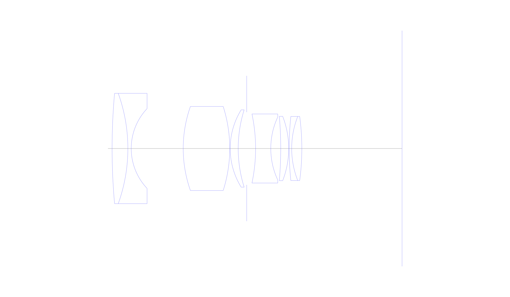
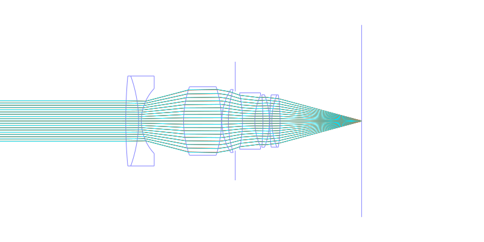
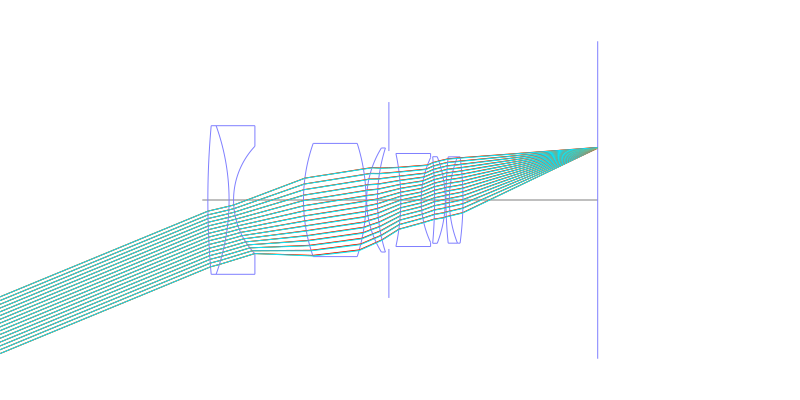
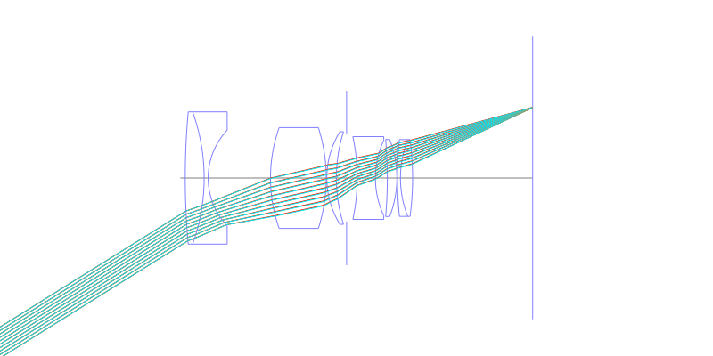
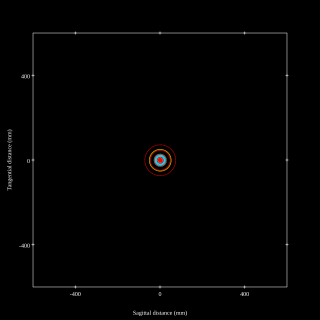
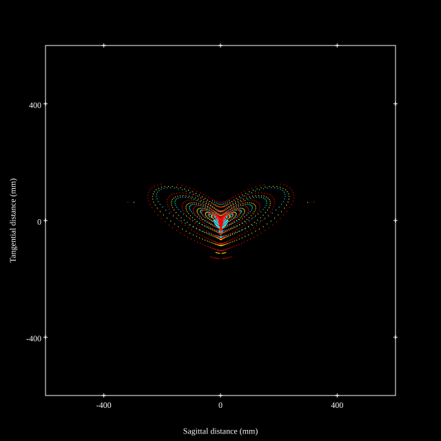
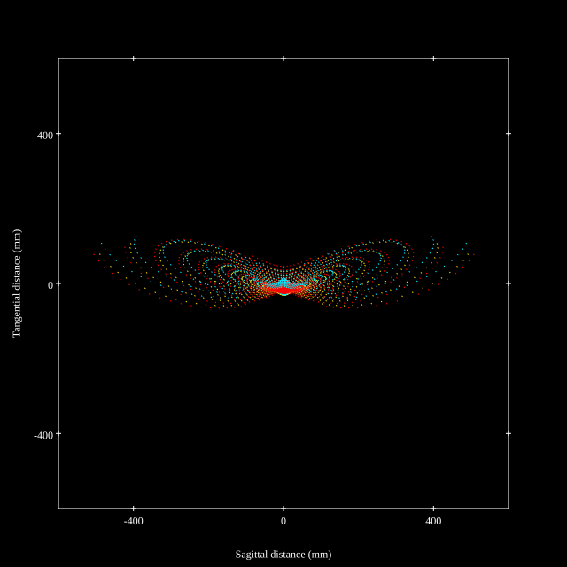
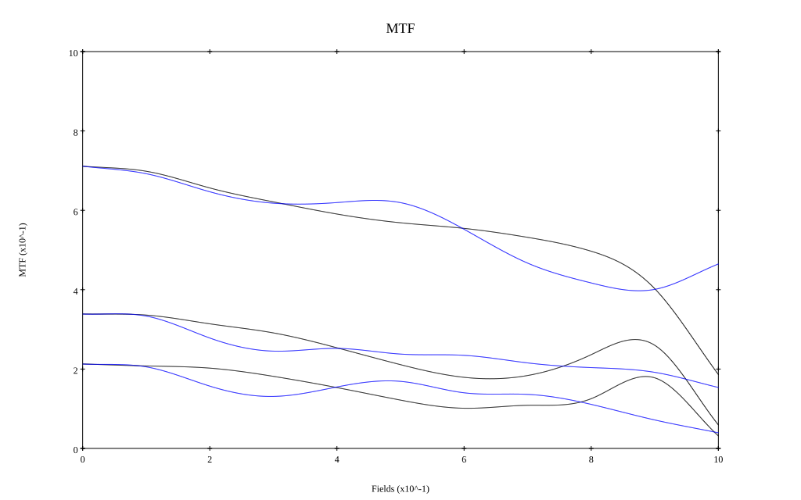
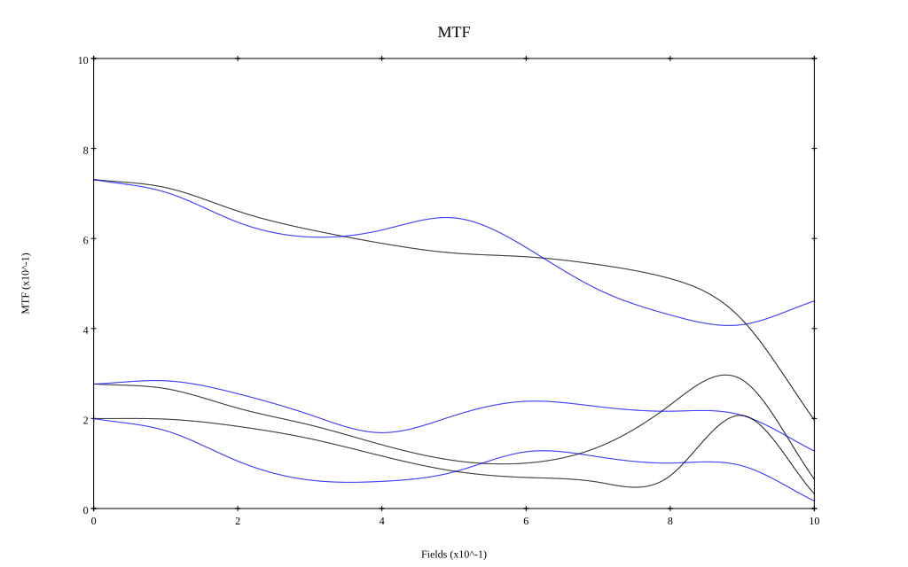

## Surface Data
Note that where glass types are shown the refractive index and abbe number is as per assigned glass type

| ID  | Radius | Thickness | Diameter | nd  | vd  | Glass Make | Glass |
| --- | ---    | ---       | ---      | --- | --- | ---        | ---   |
| 1 | 225.19 | 5.775 | 40.44 | 1.72 | 50.3 |  |
| 2 | -59.7625 | 1.225 | 40.44 | 1.6176 | 52.7 |  |
| 3 | 21.3325 | 19.0295 | 29.26 |  |  |  |
| 4 | 46.34 | 17.0205 | 30.81 | 1.6775 | 55.4 |  |
| 5 | -50.68 | 0.1715 | 30.81 |  |  |  |
| 6 | 27.0235 | 2.9295 | 28.32 | 1.6775 | 55.4 |  |
| 7 | 47.2255 | 3.1195 | 28.32 |  |  |  |
| 8 | AS | 3.24 | 26.65 |  |  |  |
| 9 | -60.9665 | 5.558 | 25.32 | 1.6477 | 33.9 |  |
| 10 | 27.349 | 3.64 | 23.08 |  |  |  |
| 11 | -135.3695 | 2.9155 | 23.56 | 1.708 | 53.3 |  |
| 12 | -32.739 | 0.175 | 23.56 |  |  |  |
| 13 | 113.085 | 0.9205 | 23.5 | 1.7557 | 27.2 |  |
| 14 | 32.2175 | 3.7135 | 23.5 | 1.708 | 53.3 |  |
| 15 | -88.403 | 36.67 | 23.5 |  |  |  |
## Layouts

## Spot Diagrams

## Paraxial Parameters
| parameter | value |
| ---       | ---   |
| effective_focal_length |35
| back_focal_length | 36.752
| optical_invariant | 6.075
| object_distance | 1.0E10
| image_distance | 36.752
| power | 0.029
| pp1_H | 38.824
| ppk_H' | 1.752
| ffl_F | 3.823
| fno | 1.8
| enp_dist_P | 25.224
| enp_radius | 9.722
| exp_dist_P' | -20.408
| exp_radius | 15.901
| m | -0
| red | -2.857122473379877E8
| n_obj | 1
| n_img | 1
| img_ht | 21.871
| obj_ang | 32
| obj_na | 0
| img_na | -0.268|
## Spot Analysis
| Field | Spot Mean Radius | Spot Max Radius |
| ---   | ---              | ---             |
 | Field(x=0.0, y=0.0) | 22.488 | 72.798|
 | Field(x=0.0, y=0.1) | 22.513 | 100.934|
 | Field(x=0.0, y=0.2) | 26.491 | 111.353|
 | Field(x=0.0, y=0.3) | 29.249 | 121.531|
 | Field(x=0.0, y=0.4) | 33.723 | 153.54|
 | Field(x=0.0, y=0.5) | 40.04 | 199.319|
 | Field(x=0.0, y=0.6) | 50.159 | 250.003|
 | Field(x=0.0, y=0.7) | 65.248 | 324.966|
 | Field(x=0.0, y=0.8) | 77.743 | 341.041|
 | Field(x=0.0, y=0.9) | 103.127 | 467.628|
 | Field(x=0.0, y=1.0) | 124.837 | 512.406|
## Polychromatic Geometric MTF

* 10,30,50 cycles/mm
* Black lines represent sagittal, blue tangential
* To generate above, MTFs for wavelengths 587.5618(d), 486.1327(F), 656.2725(C) were calculated across 10 fields, and then averaged
## Polychromatic Geometric MTF (Weighted)

* 10,30,50 cycles/mm
* Black lines represent sagittal, blue tangential
* To generate above, MTFs for wavelengths 587.5618(d) wt(1.0), 656.2725(C) wt(0.475), 546.074(e) wt(0.98), 486.1327(F) wt(0.49), 435.8343(g) wt(0.15) were calculated across 10 fields, and then combined using weighted average
## Resources
* [OpticalBench Compatible Data File, tab delimited](./JP1970-039874_Example03.txt)
* [Zemax file](./JP1970-039874_Example03.zmx)
