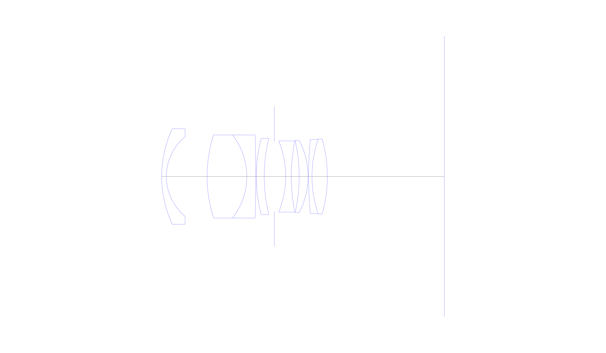
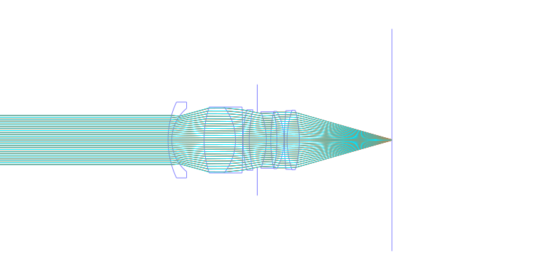
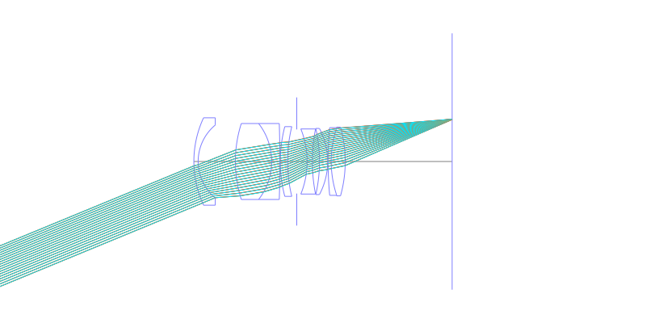
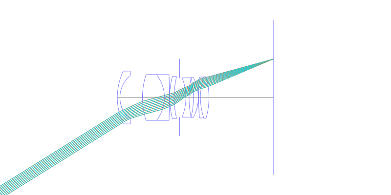
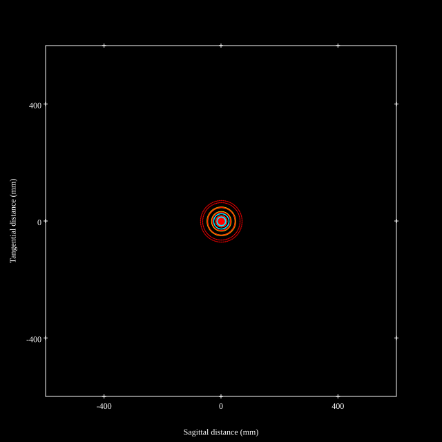
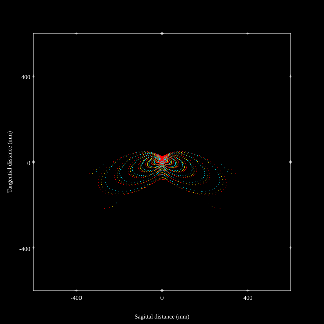
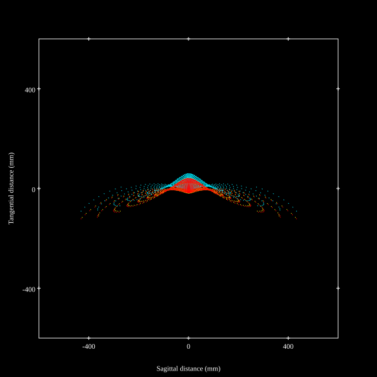
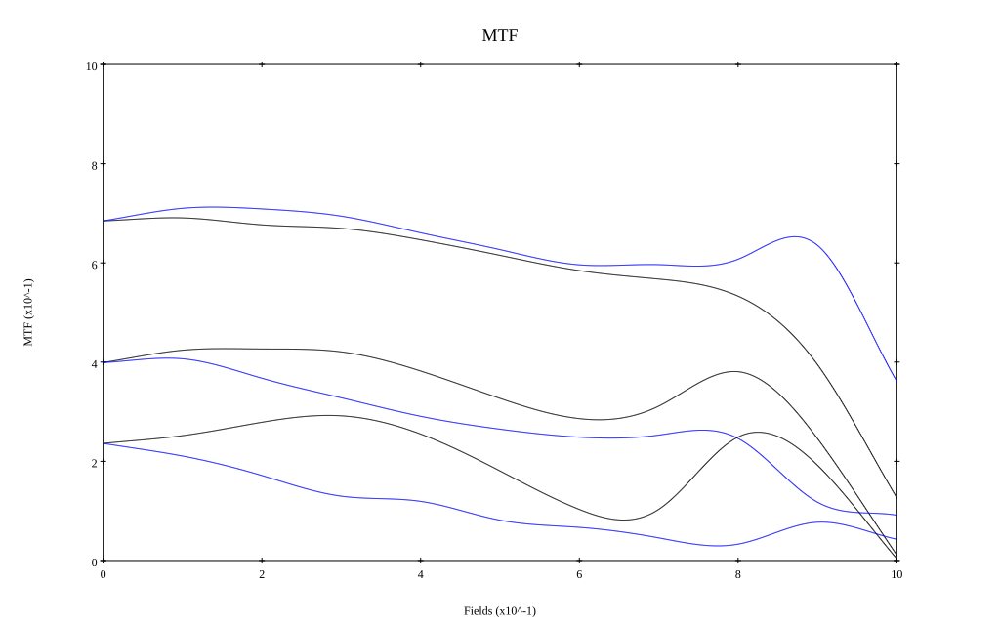
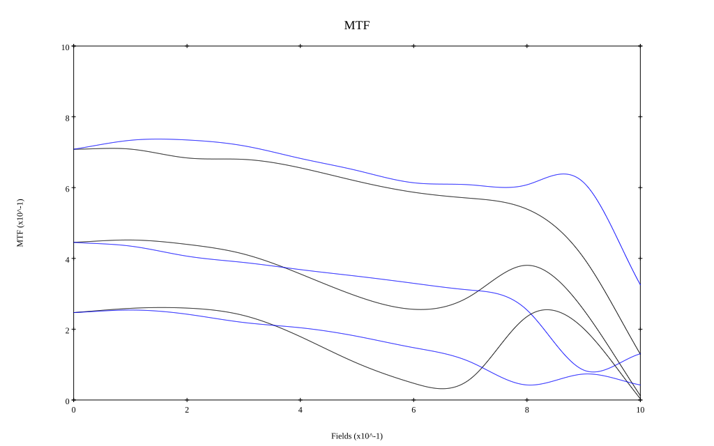

## Surface Data
Note that where glass types are shown the refractive index and abbe number is as per assigned glass type

| ID  | Radius | Thickness | Diameter | nd  | vd  | Glass Make | Glass |
| --- | ---    | ---       | ---      | --- | --- | ---        | ---   |
| 1 | 34.8597 | 1.446 | 29.46 | 1.5699 | 48.0 |  |
| 2 | 15.9796 | 12.544 | 24.58 |  |  |  |
| 3 | 42.0791 | 12.229 | 25.6 | 1.7883 | 47.7 |  |
| 4 | -20.8415 | 2.765 | 25.6 | 1.571 | 50.9 |  |
| 5 | -407.4858 | 0.147 | 25.6 |  |  |  |
| 6 | 46.4716 | 2.45 | 23.5 | 1.757 | 48.0 |  |
| 7 | 49.3651 | 3.098 | 23.5 |  |  |  |
| 8 | AS | 3.5 | 21.601 |  |  |  |
| 9 | -29.3867 | 1.75 | 21.94 | 1.7006 | 30.0 |  |
| 10 | 56.3997 | 2.415 | 21.94 |  |  |  |
| 11 | -49.8614 | 2.748 | 22.28 | 1.7883 | 47.7 |  |
| 12 | -23.7314 | 0.147 | 22.28 |  |  |  |
| 13 | 122.0282 | 1.05 | 22.82 | 1.8052 | 25.2 |  |
| 14 | 36.0385 | 4.725 | 22.82 | 1.7725 | 50.1 |  |
| 15 | -42.8943 | 36.03 | 23.16 |  |  |  |
## Layouts

## Spot Diagrams

## Paraxial Parameters
| parameter | value |
| ---       | ---   |
| effective_focal_length |35.009
| back_focal_length | 36.139
| optical_invariant | 6.077
| object_distance | 1.0E10
| image_distance | 36.139
| power | 0.029
| pp1_H | 33.711
| ppk_H' | 1.13
| ffl_F | -1.299
| fno | 1.8
| enp_dist_P | 21.196
| enp_radius | 9.725
| exp_dist_P' | -18.237
| exp_radius | 15.135
| m | -0
| red | -2.8563904724356705E8
| n_obj | 1
| n_img | 1
| img_ht | 21.876
| obj_ang | 32
| obj_na | 0
| img_na | -0.268|
## Spot Analysis
| Field | Spot Mean Radius | Spot Max Radius |
| ---   | ---              | ---             |
 | Field(x=0.0, y=0.0) | 24.791 | 70.986|
 | Field(x=0.0, y=0.1) | 23.742 | 108.308|
 | Field(x=0.0, y=0.2) | 27.911 | 143.86|
 | Field(x=0.0, y=0.3) | 34.734 | 177.996|
 | Field(x=0.0, y=0.4) | 45.571 | 210.678|
 | Field(x=0.0, y=0.5) | 58.84 | 245.456|
 | Field(x=0.0, y=0.6) | 71.967 | 282.531|
 | Field(x=0.0, y=0.7) | 77.912 | 345.518|
 | Field(x=0.0, y=0.8) | 92.57 | 444.434|
 | Field(x=0.0, y=0.9) | 107.113 | 561.122|
 | Field(x=0.0, y=1.0) | 106.806 | 448.467|
## Polychromatic Geometric MTF

* 10,30,50 cycles/mm
* Black lines represent sagittal, blue tangential
* To generate above, MTFs for wavelengths 587.5618(d), 486.1327(F), 656.2725(C) were calculated across 10 fields, and then averaged
## Polychromatic Geometric MTF (Weighted)

* 10,30,50 cycles/mm
* Black lines represent sagittal, blue tangential
* To generate above, MTFs for wavelengths 587.5618(d) wt(1.0), 656.2725(C) wt(0.475), 546.074(e) wt(0.98), 486.1327(F) wt(0.49), 435.8343(g) wt(0.15) were calculated across 10 fields, and then combined using weighted average
## Resources
* [OpticalBench Compatible Data File, tab delimited](./US004174886_Example05.txt)
* [Zemax file](./US004174886_Example05.zmx)
