# AF-S Nikkor 120-300mm f/2.8E FL ED SR VR
## Patent Information
| Country | Patent Number | Example | Year of Application | Inventors | Organisation | Link |
| ---     | ---           | ---     | ---                 | ---       | ---          | ---  |
|JP | JP2020-177057 | 1 | 2019 | Take Toshinori,Yamashita Masafumi | Nikon Corp | [link](https://patents.google.com/patent/JP2020177057A/en) |
## Surface Data
Note that where glass types are shown the refractive index and abbe number is as per assigned glass type

| ID  | Radius | Thickness | Diameter | nd  | vd  | Glass Make | Glass |
| --- | ---    | ---       | ---      | --- | --- | ---        | ---   |
| 1 | 321.6694 | 5.2 | 101.62 | 1.90265 | 35.77 | Hikari | J-LASFH9A |
| 2 | 151.607 | 13.4 | 99.22 | 1.49782 | 82.57 | Hikari | J-FKH1 |
| 3 | -748.4933 | 0.1 | 99.22 |  |  |  |
| 4 | 135.4106 | 13.2 | 98.42 | 1.43384 | 95.26 | Hikari | NICF-V |
| 5 | 0.0 | d5 | 98.42 |  |  |  |
| 6 | 124.3594 | 7.6 | 70.94 | 1.72047 | 34.71 | Ohara | S-NBH8 |
| 7 | 1981.8668 | 12.972 | 70.94 |  |  |  |
| 8 | 275.6157 | 4.7 | 55.74 | 1.71736 | 29.57 | Hikari | J-SF1 |
| 9 | -275.46 | 2.85 | 54.42 | 1.6968 | 55.52 | Hikari | J-LAK14 |
| 10 | 109.0902 | 3.124 | 50.47 |  |  |  |
| 11 | -1986.3568 | 2.65 | 50.47 | 1.804 | 46.6 | Hikari | J-LASF015 |
| 12 | 57.14 | 3.7 | 48.54 | 1.75575 | 24.71 | Hikari | J-SFH5 |
| 13 | 86.0604 | 6.757 | 47.48 |  |  |  |
| 14 | -84.2865 | 2.5 | 47.48 | 1.8707 | 40.73 | Hoya | TAFD32 |
| 15 | -651.8818 | d15 | 48.54 |  |  |  |
| 16 | 605.0183 | 4.7 | 50.36 | 1.755 | 52.34 | Hikari | J-LASKH2 |
| 17 | -156.1367 | 0.1 | 50.36 |  |  |  |
| 18 | 88.3742 | 6.8 | 49.86 | 1.43384 | 95.26 | Hikari | NICF-V |
| 19 | -277.5645 | 1.626 | 49.86 |  |  |  |
| 20 | -115.6316 | 4.7 | 49.0 | 1.65412 | 39.68 | Ohara | S-NBH5 |
| 21 | 88.6408 | 1.061 | 49.0 |  |  |  |
| 22 | 123.7096 | 5.3 | 49.0 | 1.91082 | 35.25 | Hoya | TAFD35 |
| 23 | -404.2232 | d23 | 49.0 |  |  |  |
| 24 | 0.0 | 4.0 | 46.96 | 1.804 | 46.6 | Hikari | J-LASF015 |
| 25 | -118.3357 | 0.1 | 46.96 |  |  |  |
| 26 | 63.0226 | 6.8 | 43.88 | 1.59349 | 67.0 | Hikari | J-PSKH4 |
| 27 | -199.138 | 1.8 | 43.54 | 1.84666 | 23.8 | Hikari | J-SF03 |
| 28 | 199.011 | d28 | 43.54 |  |  |  |
| 29 | -145.6141 | 1.9 | 36.72 | 2.001 | 29.12 | Hikari | J-LASFH16 |
| 30 | 91.0903 | 5.002 | 36.72 |  |  |  |
| 31 | AS | 8.0 | 34.295 |  |  |  |
| 32 | 375.1468 | 5.0 | 36.1 | 1.72916 | 54.61 | Hikari | J-LAK18 |
| 33 | -83.7956 | 3.919 | 36.1 |  |  |  |
| 34 | 368.0922 | 2.0 | 34.18 | 1.8707 | 40.73 | Hoya | TAFD32 |
| 35 | 93.4714 | 2.746 | 34.18 |  |  |  |
| 36 | -148.9288 | 3.6 | 33.96 | 1.80518 | 25.45 | Hikari | J-SF6 |
| 37 | -54.337 | 1.9 | 33.96 | 1.5168 | 64.13 | Hikari | J-BK7A |
| 38 | 107.7701 | 5.617 | 33.96 |  |  |  |
| 39 | FS | 8.829 | 34.0 |  |  |  |
| 40 | 79.609 | 4.4 | 38.44 | 2.001 | 29.12 | Hikari | J-LASFH16 |
| 41 | -1873.4336 | 0.782 | 38.44 |  |  |  |
| 42 | 64.0354 | 3.0 | 38.66 | 1.804 | 46.6 | Hikari | J-LASF015 |
| 43 | 33.609 | 10.0 | 36.74 | 1.48749 | 70.32 | Hikari | J-FK5 |
| 44 | -77.3539 | 6.728 | 36.74 |  |  |  |
| 45 | -70.8535 | 2.0 | 34.6 | 1.90043 | 37.37 | Hoya | TAFD37A |
| 46 | 224.495 | d46 | 34.6 |  |  |  |
## Variables
| Variable | 120mm f2.8 | 300mm f2.8 |
| --- | --- | --- |
| Focal length |123.6 |291.0 |
| F-Number |2.91 |2.91 |
| Angle of View |19.57 |8.29 |
| d5 | 5.114 | 66.471 |
| d15 | 62.916 | 1.56 |
| d23 | 21.244 | 18.669 |
| d28 | 5.968 | 8.542 |
| d46 | 54.819 | 54.819 |
# 120mm f2.8
## Layouts
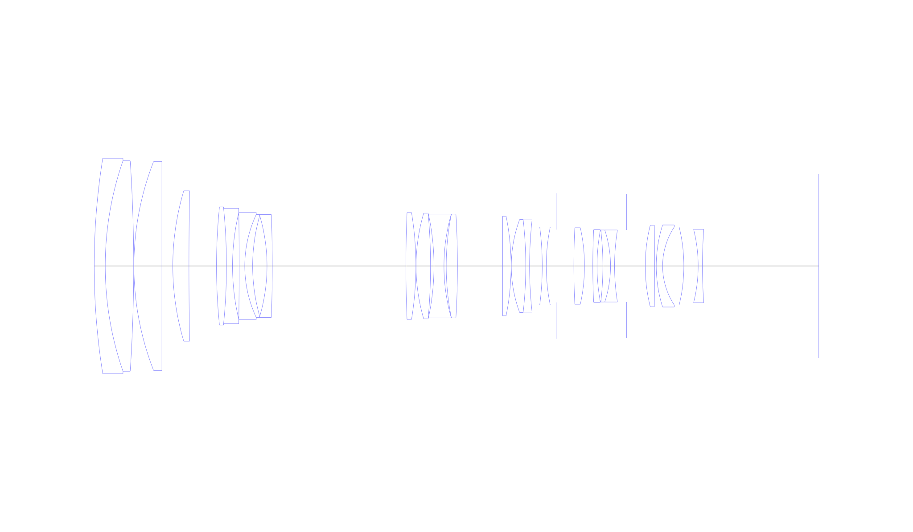
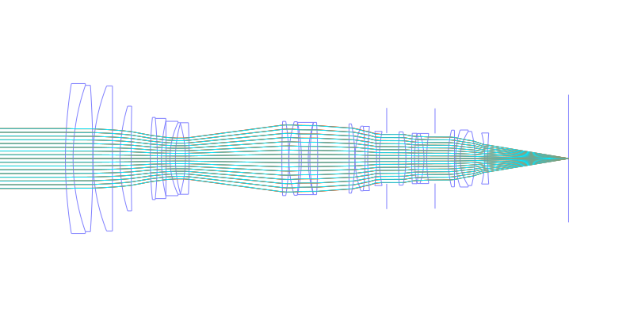
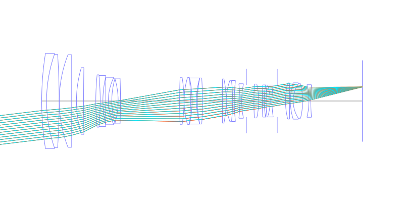
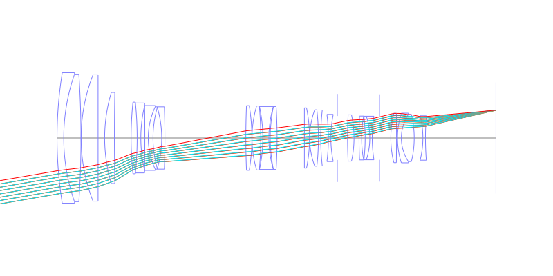
## Spot Diagrams
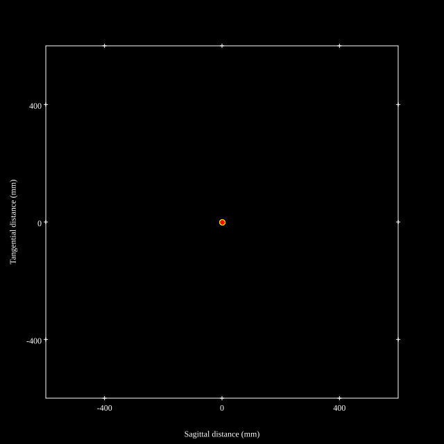
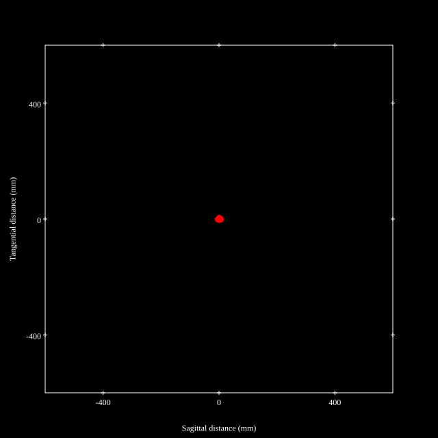
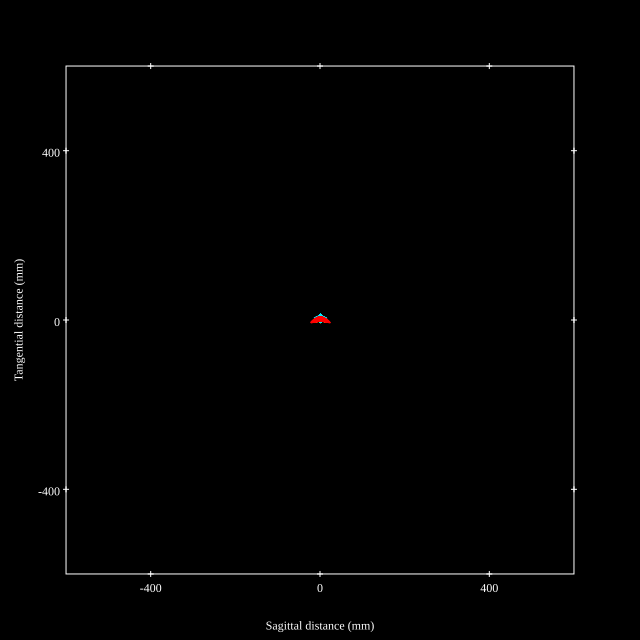
## Paraxial Parameters
| parameter | value |
| ---       | ---   |
| effective_focal_length |123.594
| back_focal_length | 54.813
| optical_invariant | 3.662
| object_distance | 1.0E10
| image_distance | 54.813
| power | 0.008
| pp1_H | 204.431
| ppk_H' | -68.781
| ffl_F | 80.837
| fno | 2.91
| enp_dist_P | 230.927
| enp_radius | 21.235
| exp_dist_P' | -46.968
| exp_radius | 17.487
| m | -0
| red | -8.090997340814377E7
| n_obj | 1
| n_img | 1
| img_ht | 21.315
| obj_ang | 9.785
| obj_na | 0
| img_na | -0.169|
## Spot Analysis
| Field | Spot Mean Radius | Spot Max Radius |
| ---   | ---              | ---             |
 | Field(x=0.0, y=0.0) | 3.375 | 8.449|
 | Field(x=0.0, y=0.1) | 3.306 | 9.45|
 | Field(x=0.0, y=0.2) | 3.527 | 8.927|
 | Field(x=0.0, y=0.3) | 3.666 | 8.227|
 | Field(x=0.0, y=0.4) | 3.876 | 9.465|
 | Field(x=0.0, y=0.5) | 4.182 | 10.745|
 | Field(x=0.0, y=0.6) | 4.779 | 12.014|
 | Field(x=0.0, y=0.7) | 5.854 | 14.351|
 | Field(x=0.0, y=0.8) | 7.166 | 20.828|
 | Field(x=0.0, y=0.9) | 8.626 | 29.373|
 | Field(x=0.0, y=1.0) | 7.749 | 23.146|
## Polychromatic Geometric MTF
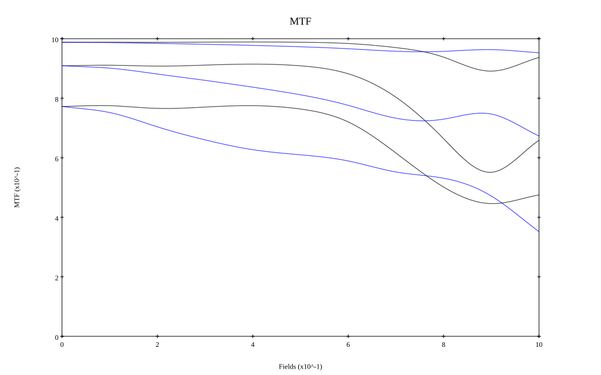
* 10,30,50 cycles/mm
* Black lines represent sagittal, blue tangential
* To generate above, MTFs for wavelengths 587.5618(d), 486.1327(F), 656.2725(C) were calculated across 10 fields, and then averaged
## Polychromatic Geometric MTF (Weighted)
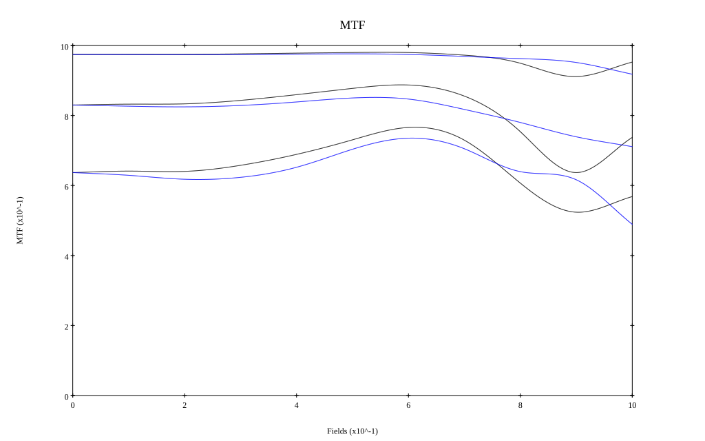
* 10,30,50 cycles/mm
* Black lines represent sagittal, blue tangential
* To generate above, MTFs for wavelengths 587.5618(d) wt(1.0), 656.2725(C) wt(0.475), 546.074(e) wt(0.98), 486.1327(F) wt(0.49), 435.8343(g) wt(0.15) were calculated across 10 fields, and then combined using weighted average
# 300mm f2.8
## Layouts
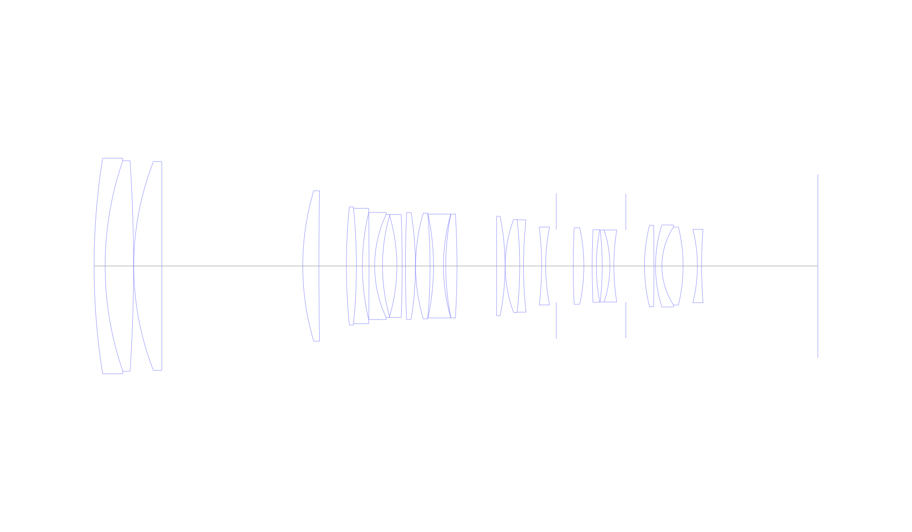
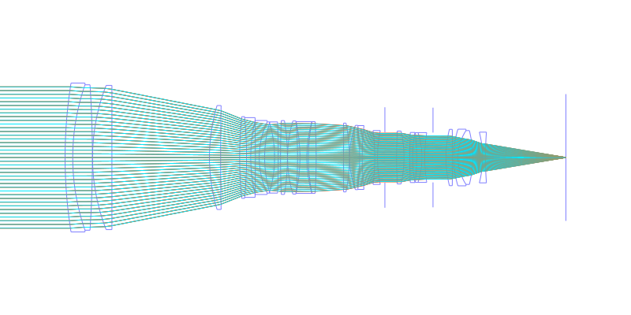
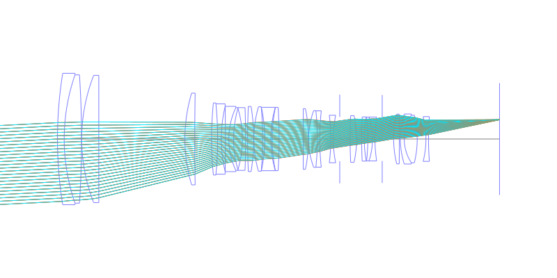
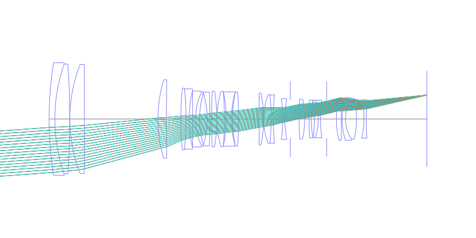
## Spot Diagrams
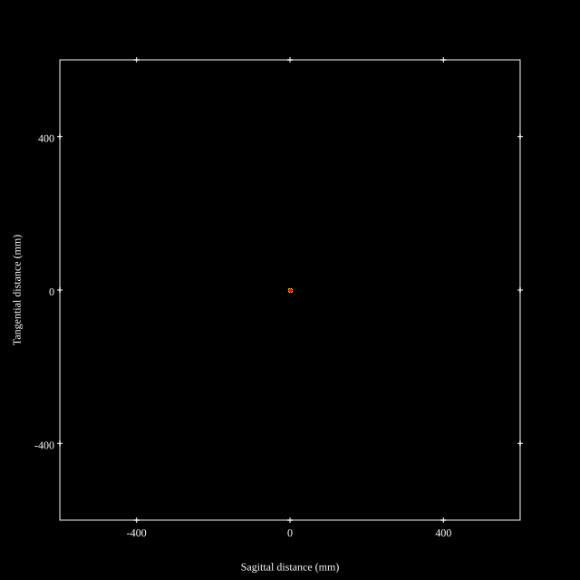

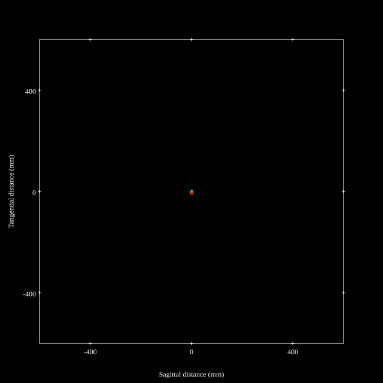
## Paraxial Parameters
| parameter | value |
| ---       | ---   |
| effective_focal_length |290.989
| back_focal_length | 54.817
| optical_invariant | 3.622
| object_distance | 1.0E10
| image_distance | 54.817
| power | 0.003
| pp1_H | 35.833
| ppk_H' | -236.172
| ffl_F | -255.156
| fno | 2.911
| enp_dist_P | 576.786
| enp_radius | 49.982
| exp_dist_P' | -46.964
| exp_radius | 17.482
| m | -0
| red | -3.43655381167511E7
| n_obj | 1
| n_img | 1
| img_ht | 21.088
| obj_ang | 4.145
| obj_na | 0
| img_na | -0.169|
## Spot Analysis
| Field | Spot Mean Radius | Spot Max Radius |
| ---   | ---              | ---             |
 | Field(x=0.0, y=0.0) | 1.579 | 4.11|
 | Field(x=0.0, y=0.1) | 1.444 | 4.107|
 | Field(x=0.0, y=0.2) | 1.368 | 3.823|
 | Field(x=0.0, y=0.3) | 1.353 | 3.352|
 | Field(x=0.0, y=0.4) | 1.44 | 3.483|
 | Field(x=0.0, y=0.5) | 1.671 | 4.095|
 | Field(x=0.0, y=0.6) | 2.011 | 5.183|
 | Field(x=0.0, y=0.7) | 2.451 | 6.284|
 | Field(x=0.0, y=0.8) | 2.995 | 7.022|
 | Field(x=0.0, y=0.9) | 3.607 | 7.984|
 | Field(x=0.0, y=1.0) | 4.213 | 9.426|
## Polychromatic Geometric MTF
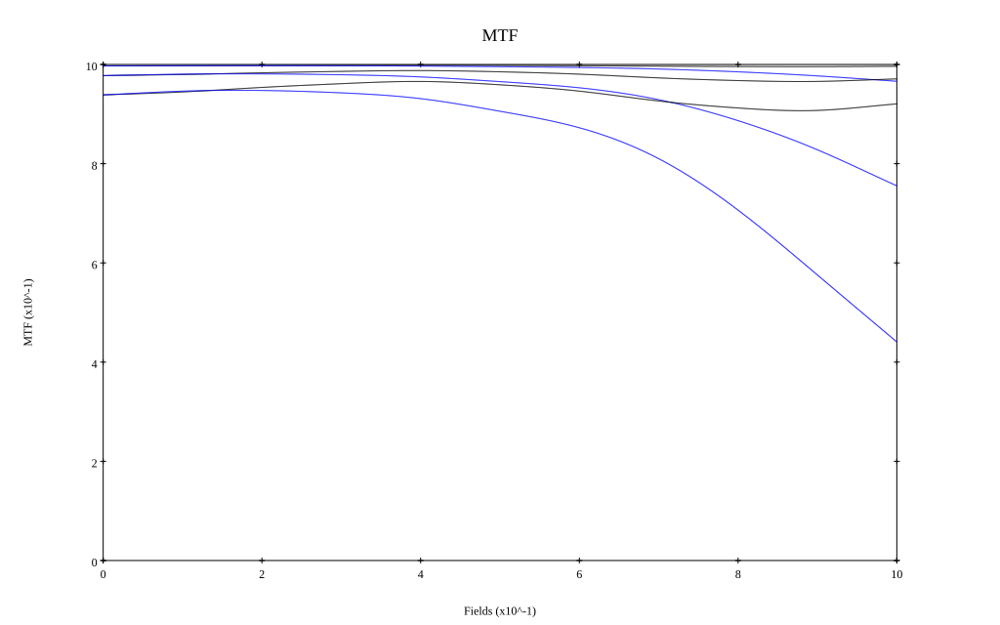
* 10,30,50 cycles/mm
* Black lines represent sagittal, blue tangential
* To generate above, MTFs for wavelengths 587.5618(d), 486.1327(F), 656.2725(C) were calculated across 10 fields, and then averaged
## Polychromatic Geometric MTF (Weighted)
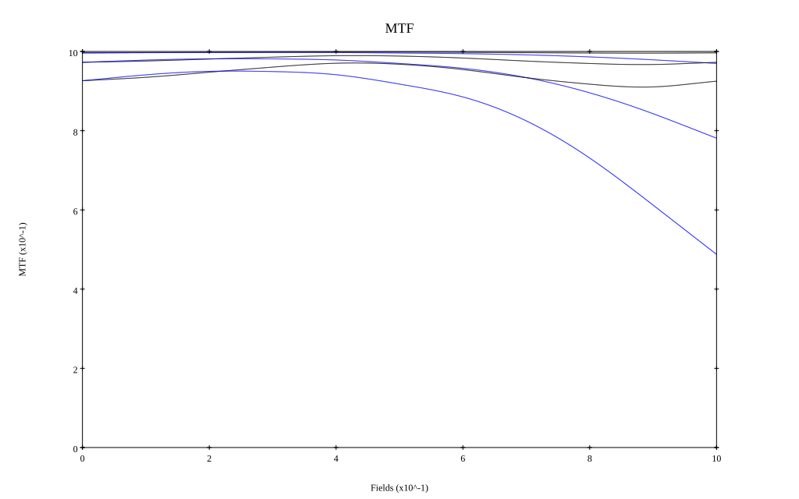
* 10,30,50 cycles/mm
* Black lines represent sagittal, blue tangential
* To generate above, MTFs for wavelengths 587.5618(d) wt(1.0), 656.2725(C) wt(0.475), 546.074(e) wt(0.98), 486.1327(F) wt(0.49), 435.8343(g) wt(0.15) were calculated across 10 fields, and then combined using weighted average
## Resources
* [OpticalBench Compatible Data File, tab delimited](./prescription.txt)
* [Zemax file](./JP2020-177057_Example01P.zmx)

Report / Zemax file generated using [Beam42](https://github.com/BeamFour/Beam42) on 2026-04-11
