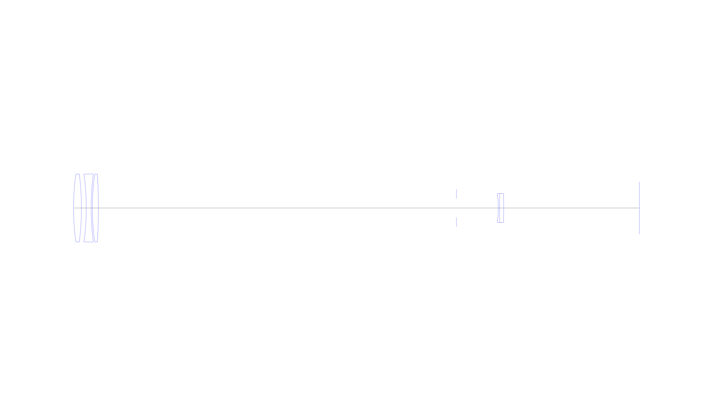
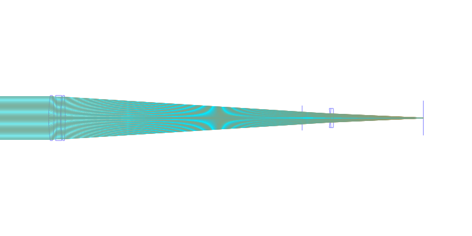
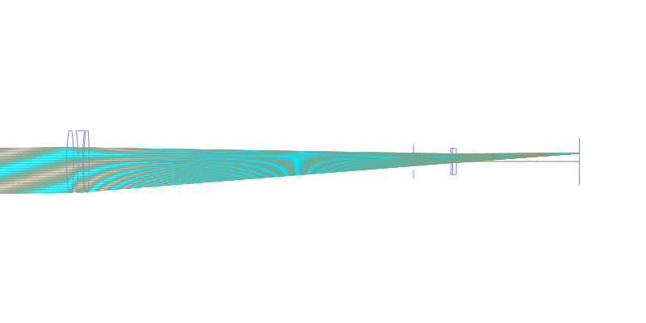
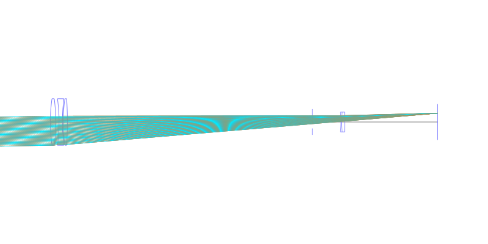
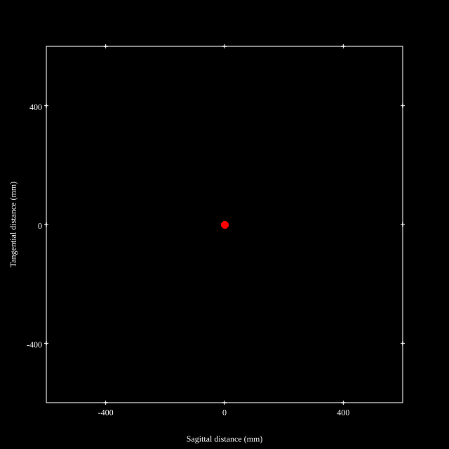
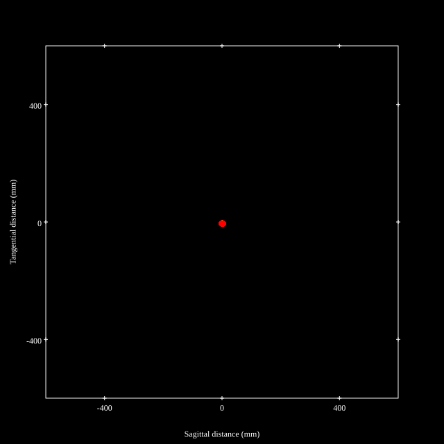
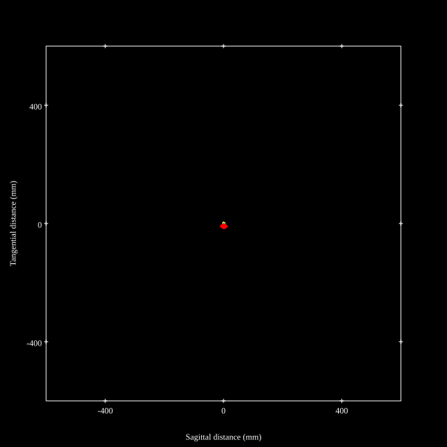
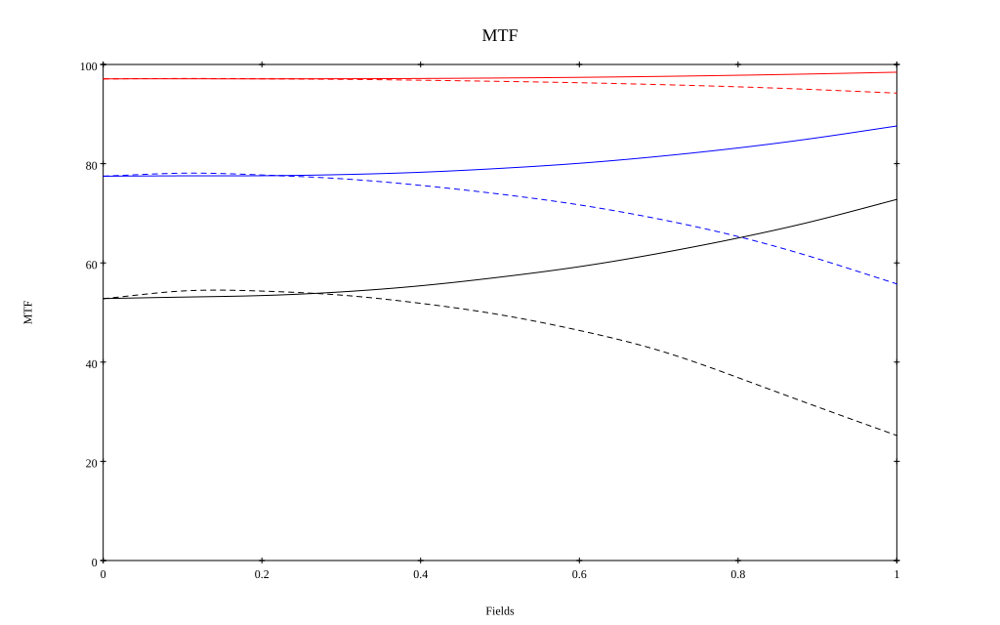
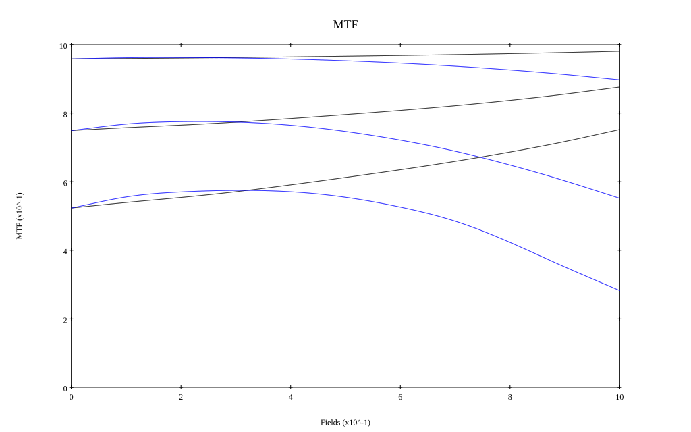

# Nikkor 1200mm f11 ED
## Patent Information
| Country | Patent Number | Example | Year of Application | Inventors | Organisation | Link |
| ---     | ---           | ---     | ---                 | ---       | ---          | ---  |
|JP | JP1976-043920 | EX 1 | 1974 | SHIMIZU YOSHUKI | Nikon Corp | [link](https://www.j-platpat.inpit.go.jp/c1801/PU/JP-S51-043920/11/en) |
## Surface Data
Note that where glass types are shown the refractive index and abbe number is as per assigned glass type

| ID  | Radius | Thickness | Diameter | nd  | vd  | Glass Make | Glass |
| --- | ---    | ---       | ---      | --- | --- | ---        | ---   |
| 1 | 408.18 | 13.0 | 112.06 | 1.50032 | 81.9 | Hikari | PC102 |
| 2 | -435.3 | 8.0 | 112.06 |  |  |  |
| 3 | -403.2 | 8.0 | 112.06 | 1.744 | 44.8 | Hikari | J-LAF2 |
| 4 | 445.2 | 2.0 | 112.06 |  |  |  |
| 5 | 396.7 | 10.0 | 112.06 | 1.62374 | 47.01 | Hikari | J-BAF8 |
| 6 | -873.9 | 590.0 | 112.06 |  |  |  |
| 7 | AS | 69.0 | 30.988 |  |  |  |
| 8 | -195.0 | 2.0 | 47.7 | 1.51633 | 64.15 | Ohara | BSL7 |
| 9 | 439.2 | 7.0 | 47.7 | 1.66998 | 39.2 | Schott | BASF12 |
| 10 | -927.5 | 223.65 | 47.7 |  |  |  |
## Layouts

## Spot Diagrams

## Paraxial Parameters
| parameter | value |
| ---       | ---   |
| effective_focal_length |1165.468
| back_focal_length | 223.912
| optical_invariant | 1.025
| object_distance | 1.0E10
| image_distance | 223.912
| power | 0.001
| pp1_H | -1246.755
| ppk_H' | -941.557
| ffl_F | -2412.223
| fno | 10.416
| enp_dist_P | 2235.57
| enp_radius | 55.946
| exp_dist_P' | -68.076
| exp_radius | 14.029
| m | -0
| red | -8580240.41251534
| n_obj | 1
| n_img | 1
| img_ht | 21.361
| obj_ang | 1.05
| obj_na | 0
| img_na | -0.048|
## Spot Analysis
| Field | Spot Mean Radius | Spot Max Radius |
| ---   | ---              | ---             |
 | Field(x=0.0, y=0.0) | 5.418 | 10.551|
 | Field(x=0.0, y=0.1) | 5.41 | 10.924|
 | Field(x=0.0, y=0.2) | 5.464 | 11.431|
 | Field(x=0.0, y=0.3) | 5.561 | 11.876|
 | Field(x=0.0, y=0.4) | 5.684 | 12.208|
 | Field(x=0.0, y=0.5) | 5.837 | 12.54|
 | Field(x=0.0, y=0.6) | 6.016 | 12.881|
 | Field(x=0.0, y=0.7) | 6.224 | 13.243|
 | Field(x=0.0, y=0.8) | 6.463 | 13.635|
 | Field(x=0.0, y=0.9) | 6.746 | 14.104|
 | Field(x=0.0, y=1.0) | 7.076 | 14.666|
## Polychromatic Geometric MTF

* 10=red,30=blue,50=black cycles/mm
* Solid lines represent sagittal, dashed lines tangential
* To generate above, MTFs for wavelengths 587.5618(d), 486.1327(F), 656.2725(C) were calculated across 10 fields, and then averaged
## Polychromatic Geometric MTF (Weighted)

* 10=red,30=blue,50=black cycles/mm
* Solid lines represent sagittal, dashed lines tangential
* To generate above, MTFs for wavelengths 587.5618(d) wt(1.0), 656.2725(C) wt(0.475), 546.074(e) wt(0.98), 486.1327(F) wt(0.49), 435.8343(g) wt(0.15) were calculated across 10 fields, and then combined using weighted average
## Resources
* [OpticalBench Compatible Data File, tab delimited](./prescription.txt)
* [Zemax file](./JP1976-043920_Example01P.zmx)

Report / Zemax file generated using [Beam42](https://github.com/BeamFour/Beam42) on 2026-07-08
