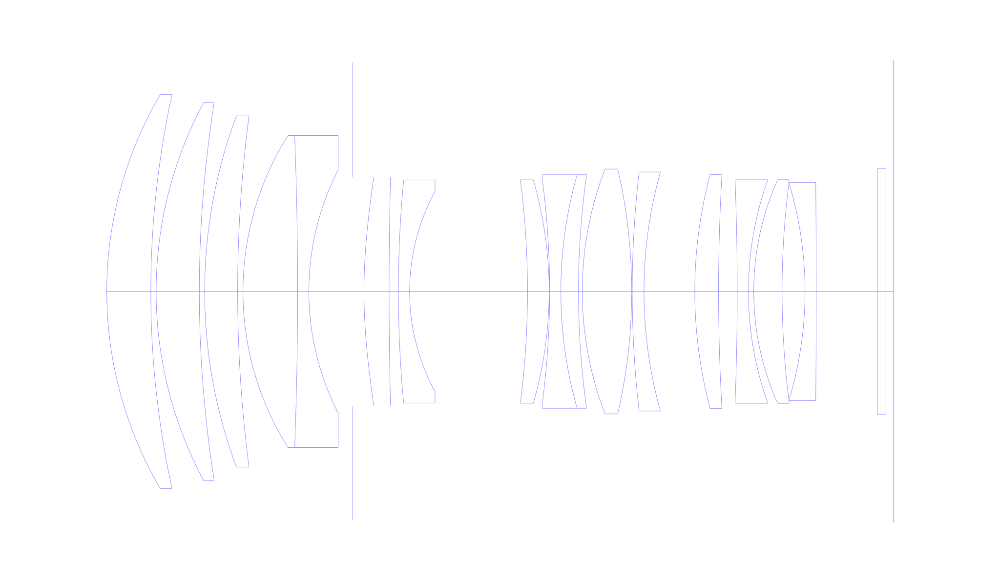
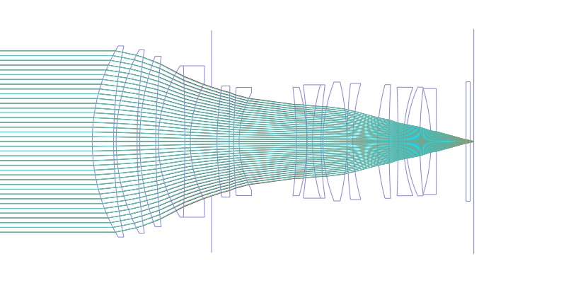
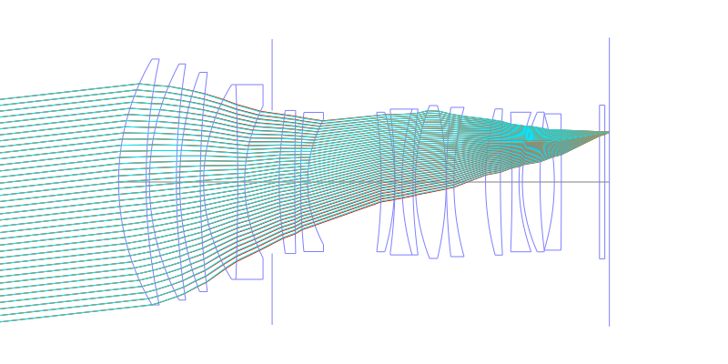
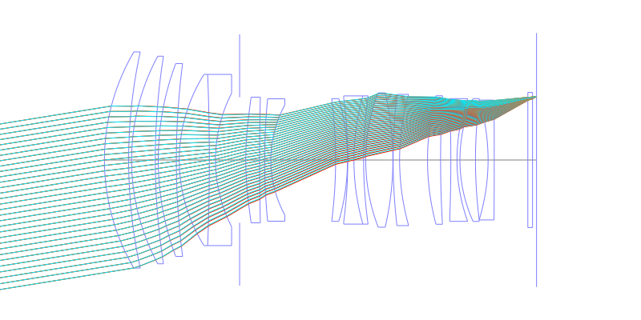
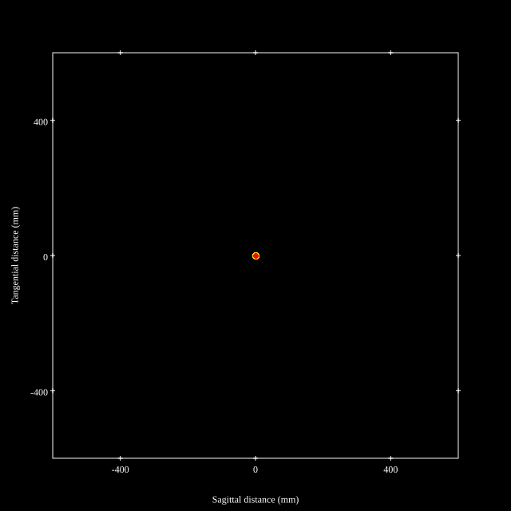
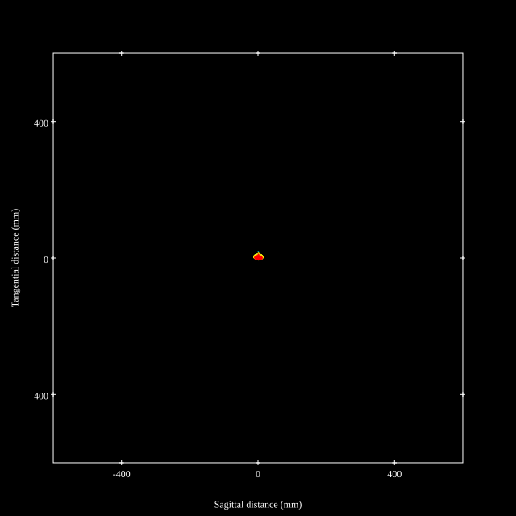
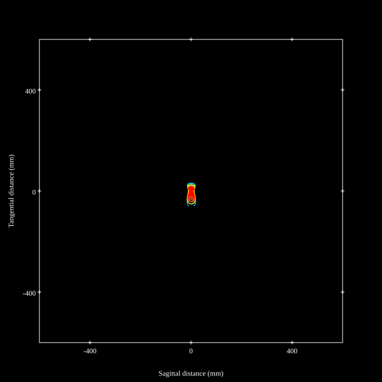
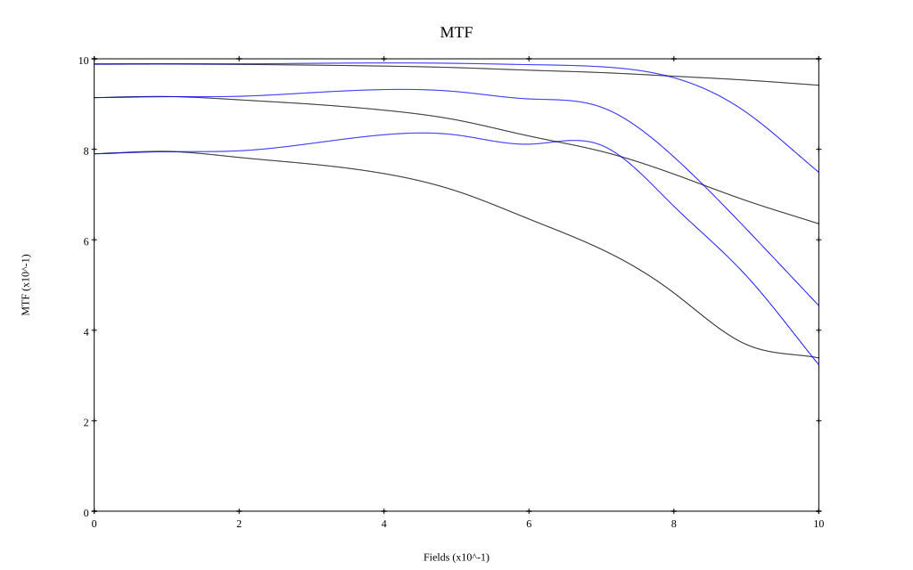
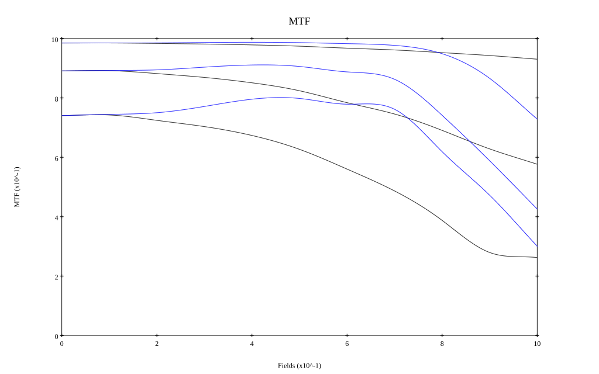

## Surface Data
Note that where glass types are shown the refractive index and abbe number is as per assigned glass type

| ID  | Radius | Thickness | Diameter | nd  | vd  | Glass Make | Glass |
| --- | ---    | ---       | ---      | --- | --- | ---        | ---   |
| 1 | 73.0739 | 8.258 | 73.87 | 1.66382 | 27.35 | Hikari | J-SFH4 |
| 2 | 173.9425 | 1.0 | 73.87 |  |  |  |
| 3 | 75.0 | 8.0959 | 70.95 | 1.49782 | 82.57 | Hikari | J-FKH1 |
| 4 | 226.5221 | 1.0 | 70.95 |  |  |  |
| 5 | 94.0 | 6.1837 | 65.9 | 1.49782 | 82.57 | Hikari | J-FKH1 |
| 6 | 255.73 | 1.0 | 65.9 |  |  |  |
| 7 | 55.0 | 10.248 | 58.51 | 1.49782 | 82.57 | Hikari | J-FKH1 |
| 8 | -766.4853 | 2.1 | 58.51 | 1.85451 | 25.15 | Hoya | NBFD25 |
| 9 | 50.025 | 8.2444 | 45.64 |  |  |  |
| 10 | AS | 2.1 | 42.915 |  |  |  |
| 11 | 105.9598 | 4.7 | 42.96 | 1.5168 | 64.13 | Hikari | J-BK7A |
| 12 | 853.548 | 1.749 | 42.96 |  |  |  |
| 13 | 221.6993 | 2.1 | 41.84 | 1.6968 | 55.52 | Hikari | J-LAK14 |
| 14 | 39.4223 | 22.105 | 37.6 |  |  |  |
| 15 | -164.438 | 4.0545 | 41.92 | 1.80809 | 22.74 | Hikari | J-SFH1 |
| 16 | -75.4132 | 0.1 | 41.92 |  |  |  |
| 17 | -160.7346 | 2.1 | 42.37 | 1.85451 | 25.15 | Hoya | NBFD25 |
| 18 | 80.412 | 3.2958 | 43.81 | 1.59319 | 67.9 | Hikari | J-PSKH1 |
| 19 | 157.8647 | 0.7213 | 43.81 |  |  |  |
| 20 | 64.0655 | 9.2661 | 45.94 | 1.8044 | 39.61 | Hikari | J-LASF013 |
| 21 | -101.7863 | 0.1 | 45.94 |  |  |  |
| 22 | 195.9905 | 2.2 | 44.85 | 1.83481 | 42.73 | Hikari | J-LASF05 |
| 23 | 83.1844 | 9.528 | 44.85 |  |  |  |
| 24 | 85.105 | 4.4549 | 43.91 | 1.85883 | 30.0 | Hoya | NBFD30 |
| 25 | 380.6074 | 3.5 | 43.91 |  |  |  |
| 26 | -542.5119 | 2.1 | 41.94 | 1.7859 | 44.17 | Hikari | J-LASF01 |
| 27 | 62.2755 | 1.0 | 41.94 |  |  |  |
| 28 | 51.4253 | 5.3074 | 41.97 | 1.84666 | 23.8 | Hikari | J-SF03 |
| 29 | 162.7875 | 4.3017 | 40.67 |  |  |  |
| 30 | -70.4474 | 2.1 | 40.67 | 1.816 | 46.59 | Hikari | J-LASF09A |
| 31 | -2372.9554 | 11.4681 | 40.96 |  |  |  |
| 32 | 0.0 | 1.6 | 46.18 | 1.5168 | 64.13 | Hikari | J-BK7A |
| 33 | 0.0 | 1.3712 | 46.18 |  |  |  |
## Aspherical Data
| ID  | k   | P1  | P2  | P3  | P3 | P5 | P6 | P7 | P8 | P9 | P10 |
| --- | --- | --- | --- | --- | --- | --- | --- | --- | --- | --- | --- |
| 11 | 0.0 | 0.0 | -1.741E-6 | -1.13E-10 | -2.868E-14 | 9.211E-17 | 0.0 | 0.0 | 0.0 | 0.0 | 0.0 |
## Layouts

## Spot Diagrams

## Paraxial Parameters
| parameter | value |
| ---       | ---   |
| effective_focal_length |132.299
| back_focal_length | 1.37
| optical_invariant | 5.778
| object_distance | 1.0E10
| image_distance | 1.37
| power | 0.008
| pp1_H | -73.279
| ppk_H' | -130.928
| ffl_F | -205.577
| fno | 1.85
| enp_dist_P | 59.16
| enp_radius | 35.756
| exp_dist_P' | -64.745
| exp_radius | 17.869
| m | -0
| red | -7.558664289987256E7
| n_obj | 1
| n_img | 1
| img_ht | 21.38
| obj_ang | 9.18
| obj_na | 0
| img_na | -0.261|
## Spot Analysis
| Field | Spot Mean Radius | Spot Max Radius |
| ---   | ---              | ---             |
 | Field(x=0.0, y=0.0) | 3.246 | 8.777|
 | Field(x=0.0, y=0.1) | 3.035 | 9.683|
 | Field(x=0.0, y=0.2) | 3.217 | 10.706|
 | Field(x=0.0, y=0.3) | 3.283 | 11.401|
 | Field(x=0.0, y=0.4) | 3.297 | 12.505|
 | Field(x=0.0, y=0.5) | 3.456 | 13.039|
 | Field(x=0.0, y=0.6) | 3.909 | 13.351|
 | Field(x=0.0, y=0.7) | 4.473 | 19.575|
 | Field(x=0.0, y=0.8) | 6.048 | 25.71|
 | Field(x=0.0, y=0.9) | 9.378 | 39.543|
 | Field(x=0.0, y=1.0) | 14.006 | 58.612|
## Geometric MTF

* 10,30,50 cycles/mm
* Black lines represent sagittal, blue tangential
* Wavelengths 587.5618(d), 486.1327(F), 656.2725(C) equal weight
## Geometric MTF (Weighted)

* 10,30,50 cycles/mm
* Black lines represent sagittal, blue tangential
* Wavelengths 587.5618(d), 656.2725(C), 546.074(e), 486.1327(F), 435.8343(g) weighted 1.0,0.475,0.98,0.49,0.15
## Resources
* [OpticalBench Compatible Data File, tab delimited](./WO2024-147268_Example01P.txt)
* [Zemax file](./WO2024-147268_Example01P.zmx)
