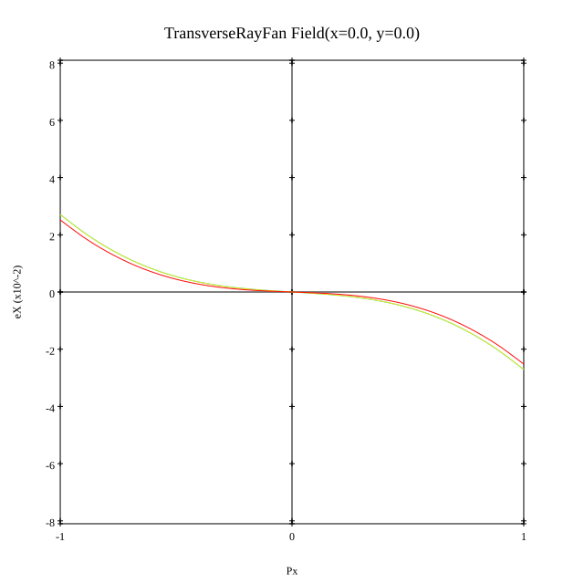
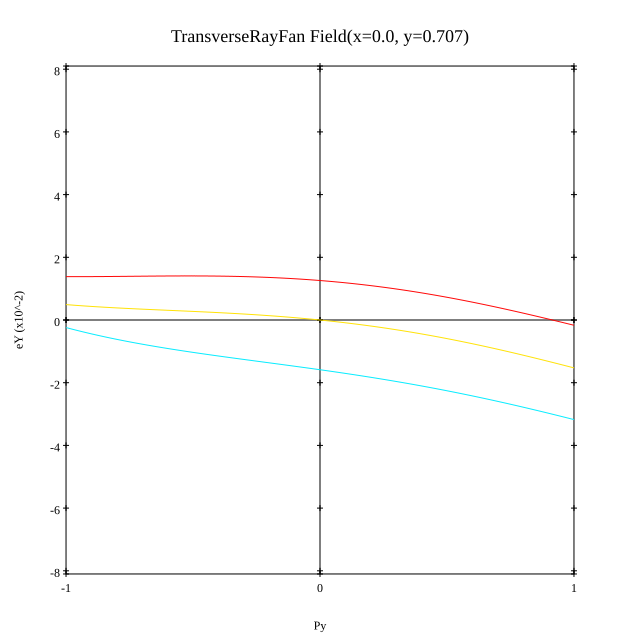
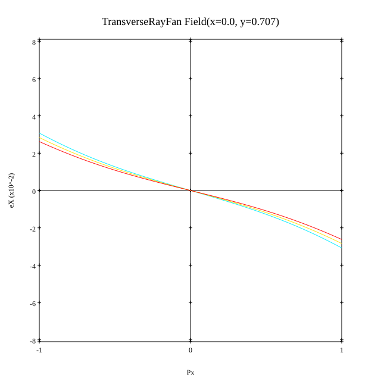
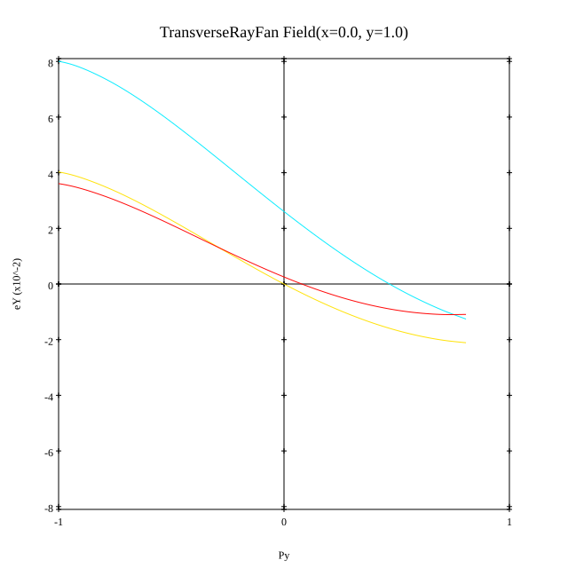
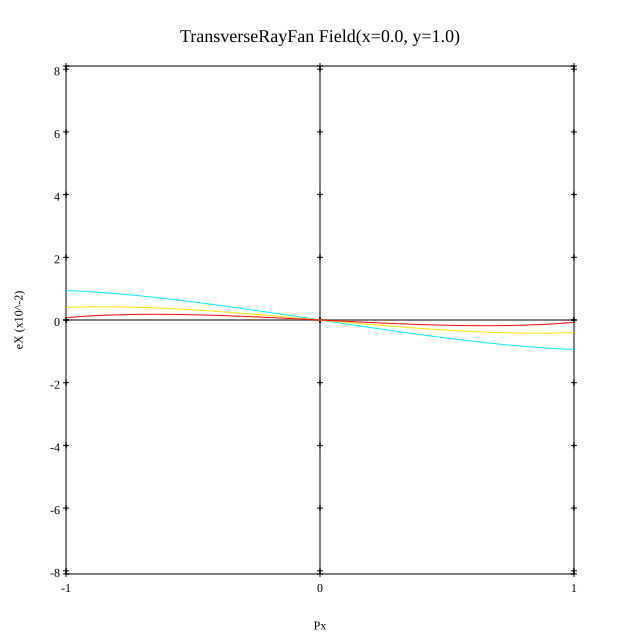

# Nikkor 13mm f8 Prototype
## Patent Information
| Country | Patent Number | Example | Year of Application | Inventors | Organisation | Link |
| ---     | ---           | ---     | ---                 | ---       | ---          | ---  |
|US | US3728011 | EX 1 | 1971 | Ikuo Mori | Nikon Corp | [link](https://patents.google.com/patent/US3728011A/en) |
## Surface Data
Note that where glass types are shown the refractive index and abbe number is as per assigned glass type

| ID  | Radius | Thickness | Diameter | nd  | vd  | Glass Make | Glass |
| --- | ---    | ---       | ---      | --- | --- | ---        | ---   |
| 1 | 57.2 | 3.9 | 106.62 | 1.77279 | 49.5 |  |
| 2 | 43.0 | 11.9 | 84.04 |  |  |  |
| 3 | 51.0 | 3.0 | 84.04 | 1.7335 | 51.0 |  |
| 4 | 37.5 | 9.3 | 70.38 |  |  |  |
| 5 | 48.2 | 13.5 | 70.38 | 1.732 | 53.7 |  |
| 6 | 190.0 | 0.1 | 70.38 |  |  |  |
| 7 | 28.5 | 1.2 | 39.4 | 1.7335 | 51.0 |  |
| 8 | 17.6 | 3.3 | 31.38 |  |  |  |
| 9 | 22.5 | 1.0 | 31.38 | 1.732 | 53.7 |  |
| 10 | 13.2 | 3.0 | 23.99 |  |  |  |
| 11 | 17.6 | 1.0 | 23.99 | 1.732 | 53.7 |  |
| 12 | 12.0 | 6.5 | 20.0 |  |  |  |
| 13 | 0.0 | 1.2 | 24.46 | 1.51743 | 52.3 |  |
| 14 | 0.0 | 0.5 | 24.46 |  |  |  |
| 15 | 350.0 | 3.0 | 18.04 | 1.83739 | 43.5 |  |
| 16 | 12.08 | 12.3 | 14.5 | 1.54072 | 47.2 |  |
| 17 | -15.8 | 0.1 | 14.5 |  |  |  |
| 18 | 17.0 | 0.8 | 9.92 | 1.6968 | 55.6 |  |
| 19 | 7.45 | 1.7 | 8.2 |  |  |  |
| 20 | 11.9 | 2.8 | 7.3 | 1.59507 | 35.6 |  |
| 21 | -9.0 | 0.9 | 5.32 | 1.60311 | 60.7 |  |
| 22 | 0.0 | 0.8 | 5.32 |  |  |  |
| 23 | AS | 0.8 | 4.317 |  |  |  |
| 24 | 0.0 | 4.1 | 5.25 | 1.59507 | 35.6 |  |
| 25 | -10.5 | 0.6 | 7.49 |  |  |  |
| 26 | -13.1 | 1.5 | 10.2 | 1.86074 | 23.1 |  |
| 27 | 35.4 | 0.7 | 10.2 |  |  |  |
| 28 | -41.0 | 2.2 | 10.2 | 1.44628 | 67.2 |  |
| 29 | -9.6 | 0.1 | 10.68 |  |  |  |
| 30 | 900.0 | 0.8 | 10.68 | 1.8663 | 37.9 |  |
| 31 | 30.7 | 5.7 | 17.26 | 1.48749 | 70.0 |  |
| 32 | -14.901 | 37.52 | 17.26 |  |  |  |
## Layouts

## Spot Diagrams

## Paraxial Parameters
| parameter | value |
| ---       | ---   |
| effective_focal_length |13.157
| back_focal_length | 37.444
| optical_invariant | 1.369
| object_distance | 1.0E10
| image_distance | 37.444
| power | 0.076
| pp1_H | 57.28
| ppk_H' | 24.287
| ffl_F | 44.123
| fno | 8
| enp_dist_P | 47.169
| enp_radius | 0.822
| exp_dist_P' | -19.454
| exp_radius | 3.551
| m | -0
| red | -7.600567756934285E8
| n_obj | 1
| n_img | 1
| img_ht | 21.897
| obj_ang | 59
| obj_na | 0
| img_na | -0.062|
## Spot Analysis
| Field | Spot Mean Radius | Spot Max Radius |
| ---   | ---              | ---             |
 | Field(x=0.0, y=0.0) | 14.614 | 27.246|
 | Field(x=0.0, y=0.707) | 22.891 | 44.135|
 | Field(x=0.0, y=1.0) | 29.073 | 80.413|
## Ray Aberrations
### Field 0.0

### Field 0.7

### Field 1.0

## Resources
* [OpticalBench Compatible Data File, tab delimited](./US003728011_Example01.txt)
* [Zemax file](./US003728011_Example01.zmx)
