# AF-S Nikkor 14-24mm f/2.8G ED
## Patent Information
| Country | Patent Number | Example | Year of Application | Inventors | Organisation | Link |
| ---     | ---           | ---     | ---                 | ---       | ---          | ---  |
|US | US7359125 | 1 | 2005 | Yoko Kimura,Haruo Sato | Nikon Corp | [link](https://patents.google.com/patent/US7359125B2/en) |
## Surface Data
Note that where glass types are shown the refractive index and abbe number is as per assigned glass type

| ID  | Radius | Thickness | Diameter | nd  | vd  | Glass Make | Glass |
| --- | ---    | ---       | ---      | --- | --- | ---        | ---   |
| 1 | 60.3937 | 3.5 | 82.82 | 1.804 | 46.6 | Hikari | J-LASF015 |
| 2 | 32.2703 | 7.0835 | 62.02 |  |  |  |
| 3 | 35.5 | 4.0 | 59.46 | 1.67798 | 54.89 | Hikari | Q-LAK52S |
| 4 | 19.5117 | 12.8951 | 51.78 |  |  |  |
| 5 | 87.0449 | 2.5 | 50.18 | 1.741 | 52.77 | Hikari | J-LAK011 |
| 6 | 26.3306 | 0.3 | 39.62 | 1.55389 | 38.09 |  |
| 7 | 30.2448 | 12.6887 | 39.55 |  |  |  |
| 8 | -67.993 | 2.5896 | 39.55 | 1.49782 | 82.57 | Hikari | J-FKH1 |
| 9 | 48.0626 | 2.0 | 39.3 |  |  |  |
| 10 | 48.488 | 5.9634 | 39.3 | 1.8044 | 39.61 | Hikari | J-LASF013 |
| 11 | -181.2948 | d11 | 39.3 |  |  |  |
| 12 | 34.6184 | 1.0 | 24.14 | 1.83481 | 42.73 | Hikari | J-LASF05 |
| 13 | 19.4637 | 5.2931 | 23.12 | 1.62374 | 47.01 | Hikari | J-BAF8 |
| 14 | 611.599 | d14 | 23.12 |  |  |  |
| 15 | AS | 1.6689 | a15 |  |  |  |
| 16 | -265.5383 | 2.6545 | 23.72 | 1.5168 | 63.88 | Hikari | J-BK7 |
| 17 | -47.2569 | 9.0744 | 23.72 |  |  |  |
| 18 | -27.9322 | 1.6819 | 23.52 | 1.83481 | 42.73 | Hikari | J-LASF05 |
| 19 | 138.6775 | 0.1 | 23.52 |  |  |  |
| 20 | 35.6745 | 4.4701 | 24.54 | 1.57099 | 50.86 | Hoya | BAFL2 |
| 21 | -71.8719 | 0.1 | 24.54 |  |  |  |
| 22 | 27.2079 | 1.3817 | 25.16 | 1.7725 | 49.62 | Hikari | J-LASF016 |
| 23 | 16.4317 | 8.491 | 24.34 | 1.49782 | 82.57 | Hikari | J-FKH1 |
| 24 | -53.0 | 1.721 | 24.34 |  |  |  |
| 25 | 1336.7107 | 1.0 | 24.96 | 1.8061 | 40.73 | Hoya | NBFD13 |
| 26 | 20.3824 | 6.3537 | 24.96 | 1.58913 | 61.25 | Hoya | M-BACD5N |
| 27 | -60.1135 | d27 | 24.96 |  |  |  |
## Aspherical Data
| ID  | k   | P1  | P2  | P3  | P3 | P5 | P6 | P7 | P8 | P9 | P10 |
| --- | --- | --- | --- | --- | --- | --- | --- | --- | --- | --- | --- |
| 4 | -0.9087 | 0.0 | -5.1181E-7 | 7.1056E-10 | -1.9817E-11 | 1.9226E-14 | -6.0945E-18 | 0.0 | 0.0 | 0.0 | 0.0 |
| 7 | -7.3795 | 0.0 | 4.2239E-5 | -7.8972E-8 | 2.9788E-10 | -5.9331E-13 | 6.0285E-16 | -7.4037E-20 | 0.0 | 0.0 | 0.0 |
| 27 | 5.0164 | 0.0 | 1.9855E-5 | 6.9569E-9 | 1.5384E-10 | -5.8393E-13 | 0.0 | 0.0 | 0.0 | 0.0 | 0.0 |
## Variables
| Variable | 14mm f2.8 | 24mm f2.8 |
| --- | --- | --- |
| Focal length |14.4 |23.8 |
| F-Number |2.88 |2.88 |
| Angle of View |114.7 |83.8 |
| d11 | 31.93 | 1.2 |
| d14 | 5.86 | 5.86 |
| a15 | 18.329 | 22.29 |
| d27 | 38.59 | 53.93 |
# 14mm f2.8
## Layouts
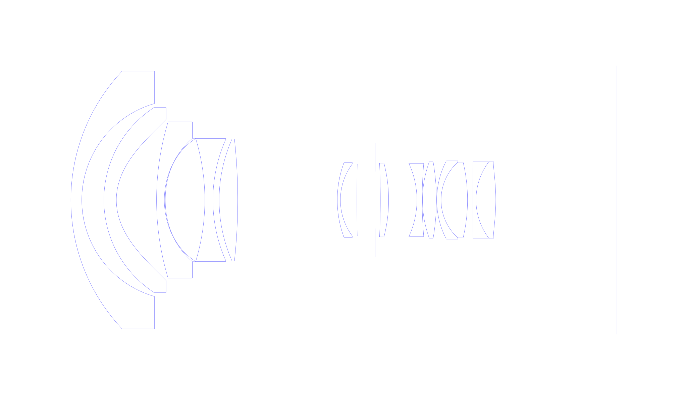
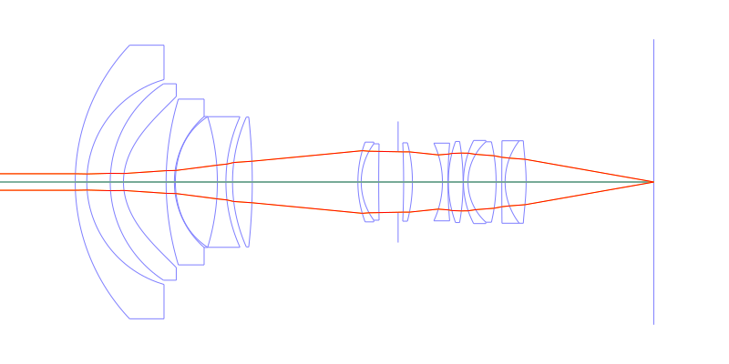
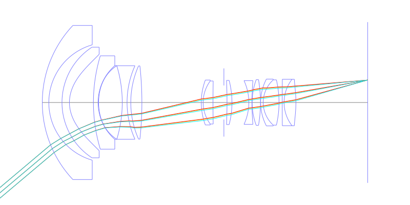
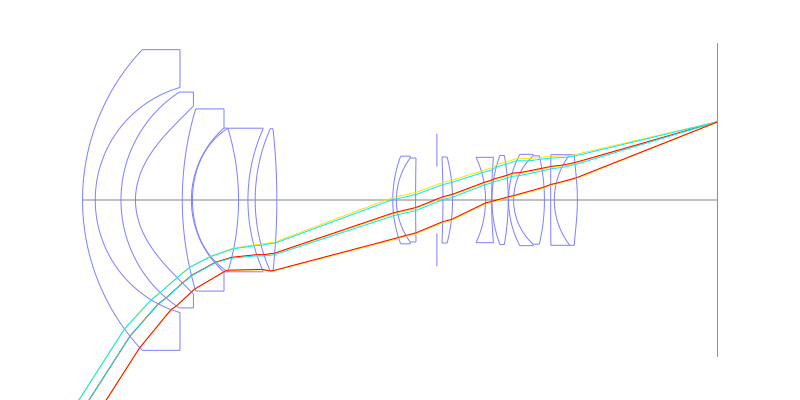
## Spot Diagrams
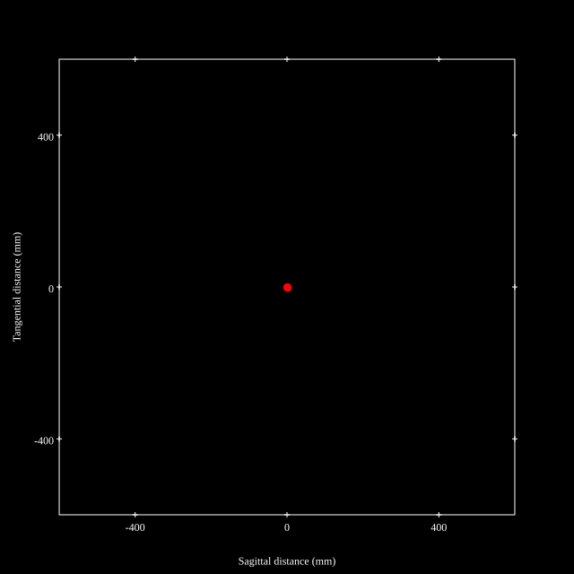
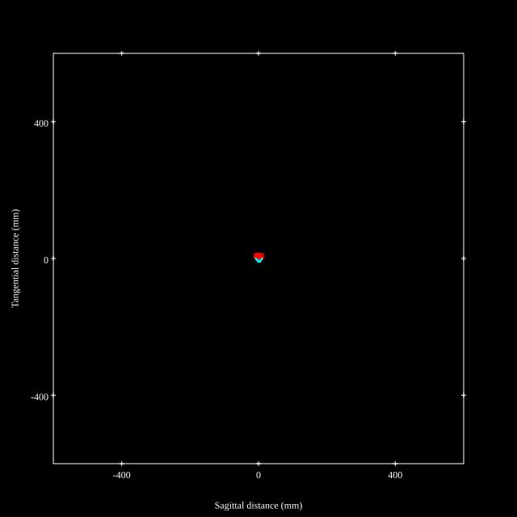
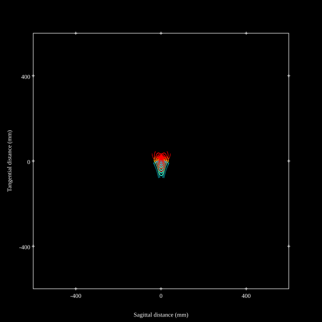
## Paraxial Parameters
| parameter | value |
| ---       | ---   |
| effective_focal_length |14.396
| back_focal_length | 38.687
| optical_invariant | 3.901
| object_distance | 1.0E10
| image_distance | 38.687
| power | 0.069
| pp1_H | 42.934
| ppk_H' | 24.291
| ffl_F | 28.538
| fno | 2.879
| enp_dist_P | 31.051
| enp_radius | 2.5
| exp_dist_P' | -43.688
| exp_radius | 14.322
| m | -0
| red | -6.946600701225064E8
| n_obj | 1
| n_img | 1
| img_ht | 22.466
| obj_ang | 57.35
| obj_na | 0
| img_na | -0.171|
## Spot Analysis
| Field | Spot Mean Radius | Spot Max Radius |
| ---   | ---              | ---             |
 | Field(x=0.0, y=0.0) | 3.673 | 8.922|
 | Field(x=0.0, y=0.1) | 3.62 | 9.244|
 | Field(x=0.0, y=0.2) | 3.924 | 10.102|
 | Field(x=0.0, y=0.3) | 4.3 | 10.751|
 | Field(x=0.0, y=0.4) | 4.599 | 13.057|
 | Field(x=0.0, y=0.5) | 4.735 | 16.198|
 | Field(x=0.0, y=0.6) | 5.192 | 17.354|
 | Field(x=0.0, y=0.7) | 6.765 | 18.75|
 | Field(x=0.0, y=0.8) | 7.963 | 29.189|
 | Field(x=0.0, y=0.9) | 12.577 | 58.102|
 | Field(x=0.0, y=1.0) | 19.845 | 78.001|
## Polychromatic Geometric MTF
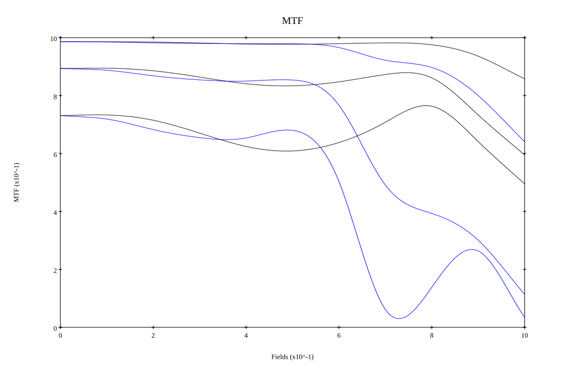
* 10,30,50 cycles/mm
* Black lines represent sagittal, blue tangential
* To generate above, MTFs for wavelengths 587.5618(d), 486.1327(F), 656.2725(C) were calculated across 10 fields, and then averaged
## Polychromatic Geometric MTF (Weighted)
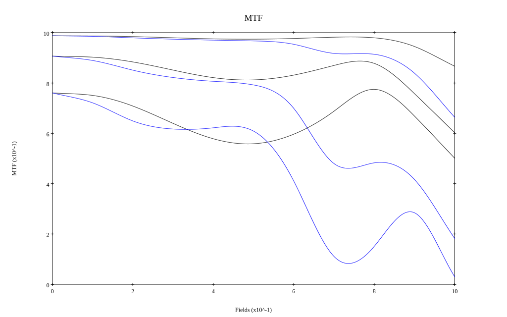
* 10,30,50 cycles/mm
* Black lines represent sagittal, blue tangential
* To generate above, MTFs for wavelengths 587.5618(d) wt(1.0), 656.2725(C) wt(0.475), 546.074(e) wt(0.98), 486.1327(F) wt(0.49), 435.8343(g) wt(0.15) were calculated across 10 fields, and then combined using weighted average
# 24mm f2.8
## Layouts
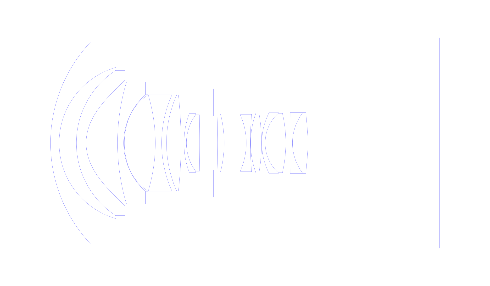
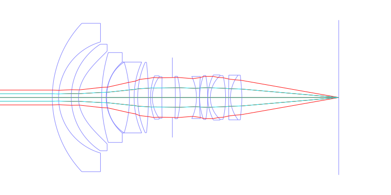
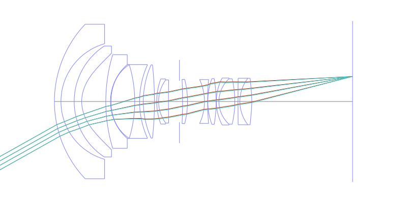
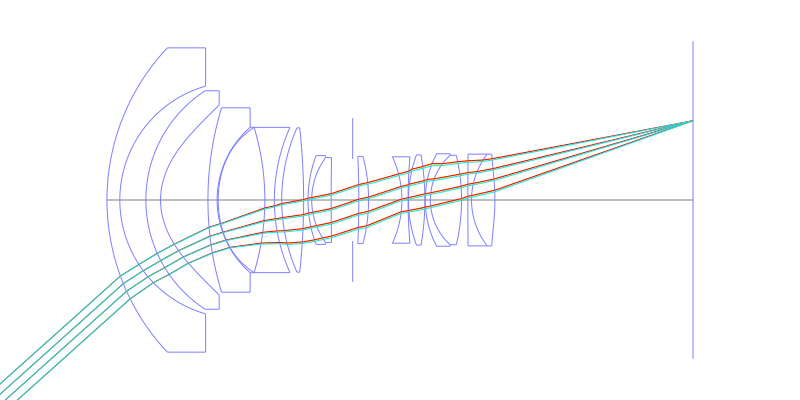
## Spot Diagrams
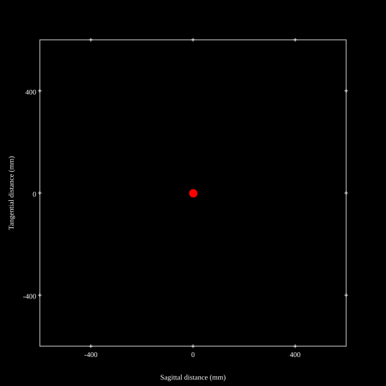
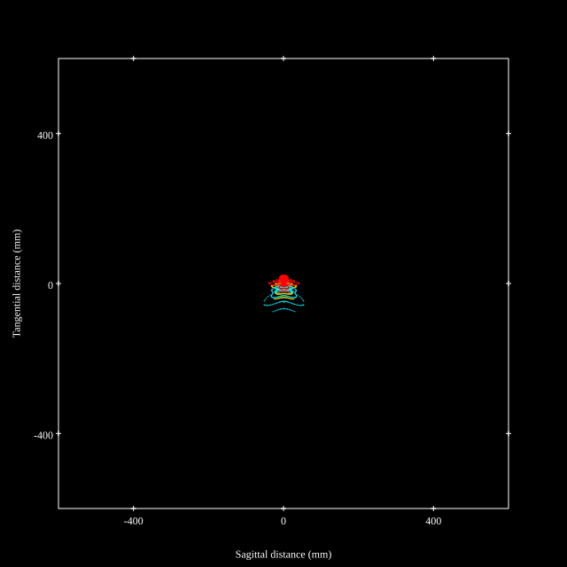
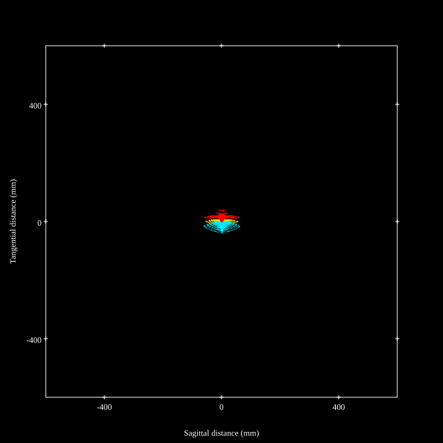
## Paraxial Parameters
| parameter | value |
| ---       | ---   |
| effective_focal_length |23.791
| back_focal_length | 53.942
| optical_invariant | 3.706
| object_distance | 1.0E10
| image_distance | 53.942
| power | 0.042
| pp1_H | 46.543
| ppk_H' | 30.151
| ffl_F | 22.752
| fno | 2.88
| enp_dist_P | 28.544
| enp_radius | 4.13
| exp_dist_P' | -43.773
| exp_radius | 16.964
| m | -0
| red | -4.203283965644198E8
| n_obj | 1
| n_img | 1
| img_ht | 21.346
| obj_ang | 41.9
| obj_na | 0
| img_na | -0.171|
## Spot Analysis
| Field | Spot Mean Radius | Spot Max Radius |
| ---   | ---              | ---             |
 | Field(x=0.0, y=0.0) | 5.077 | 14.35|
 | Field(x=0.0, y=0.1) | 6.143 | 29.556|
 | Field(x=0.0, y=0.2) | 10.192 | 66.336|
 | Field(x=0.0, y=0.3) | 11.459 | 77.983|
 | Field(x=0.0, y=0.4) | 13.075 | 86.736|
 | Field(x=0.0, y=0.5) | 14.18 | 87.931|
 | Field(x=0.0, y=0.6) | 15.182 | 87.757|
 | Field(x=0.0, y=0.7) | 15.301 | 79.353|
 | Field(x=0.0, y=0.8) | 15.168 | 69|
 | Field(x=0.0, y=0.9) | 15.809 | 56.445|
 | Field(x=0.0, y=1.0) | 18.262 | 61.798|
## Polychromatic Geometric MTF
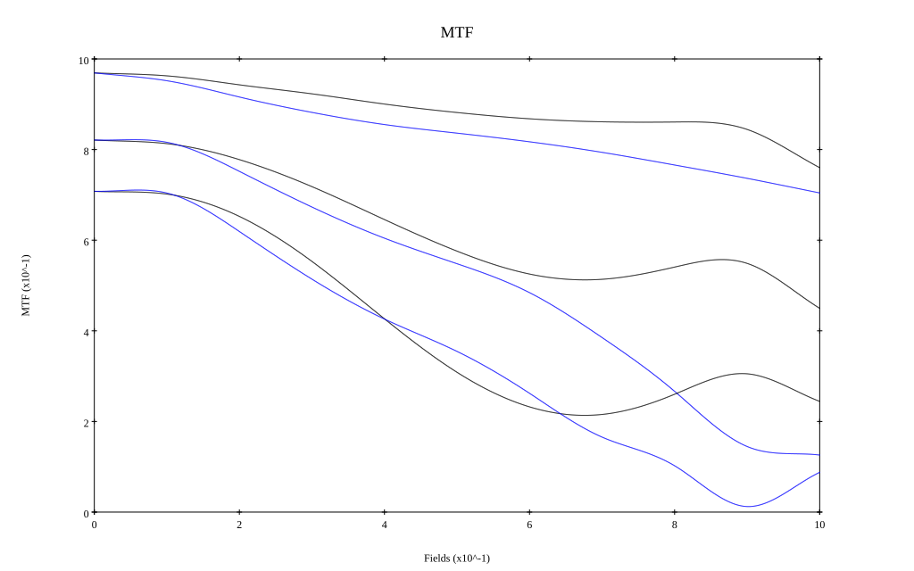
* 10,30,50 cycles/mm
* Black lines represent sagittal, blue tangential
* To generate above, MTFs for wavelengths 587.5618(d), 486.1327(F), 656.2725(C) were calculated across 10 fields, and then averaged
## Polychromatic Geometric MTF (Weighted)
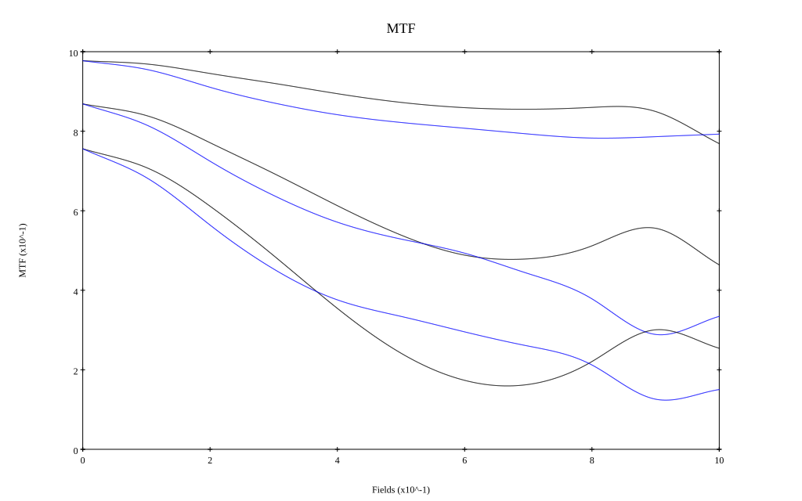
* 10,30,50 cycles/mm
* Black lines represent sagittal, blue tangential
* To generate above, MTFs for wavelengths 587.5618(d) wt(1.0), 656.2725(C) wt(0.475), 546.074(e) wt(0.98), 486.1327(F) wt(0.49), 435.8343(g) wt(0.15) were calculated across 10 fields, and then combined using weighted average
## Resources
* [OpticalBench Compatible Data File, tab delimited](./prescription.txt)
* [Zemax file](./US007359125_Example01P.zmx)

Report / Zemax file generated using [Beam42](https://github.com/BeamFour/Beam42) on 2026-01-25
