# Z Nikkor 14-24mm f/2.8S
## Patent Information
| Country | Patent Number | Example | Year of Application | Inventors | Organisation | Link |
| ---     | ---           | ---     | ---                 | ---       | ---          | ---  |
|US | US20240255740 | 8 | 2019 | Fumiaki OHTAKE, Azuna NONAKA | Nikon Corp | [link](https://patents.google.com/patent/US20250060572A1/en) |
## Surface Data
Note that where glass types are shown the refractive index and abbe number is as per assigned glass type

| ID  | Radius | Thickness | Diameter | nd  | vd  | Glass Make | Glass |
| --- | ---    | ---       | ---      | --- | --- | ---        | ---   |
| 1 | 342.7914 | 3.0 | 66.44 | 1.58887 | 61.13 | Hikari | Q-SK55S |
| 2 | 16.1106 | 11.6048 | 43.16 |  |  |  |
| 3 | 49.2913 | 2.0 | 40.98 | 1.82098 | 42.5 | Hikari | Q-LASFH59S |
| 4 | 25.8983 | 11.3832 | 33.62 |  |  |  |
| 5 | -45.4837 | 1.5 | 33.62 | 1.49782 | 82.57 | Hikari | J-FKH1 |
| 6 | 54.3748 | 0.5376 | 33.62 |  |  |  |
| 7 | 38.8825 | 6.6444 | 33.62 | 1.635257 | 33.41 |  |
| 8 | -91.9824 | d8 | 33.62 |  |  |  |
| 9 | FS | 0.0 | 22.28 |  |  |  |
| 10 | 33.1746 | 1.1 | 22.28 | 1.963 | 24.11 | Ohara | S-TIH57 |
| 11 | 19.3866 | 4.3 | 23.25 | 1.654152 | 32.42 |  |
| 12 | 119.3997 | d12 | 23.74 |  |  |  |
| 13 | 24.1338 | 1.1 | 23.74 | 1.84666 | 23.8 | Hikari | J-SF03 |
| 14 | 17.5 | 6.2 | 23.74 | 1.511153 | 65.39 |  |
| 15 | -363.4978 | 1.5 | 23.74 |  |  |  |
| 16 | AS | 2.8214 | a16 |  |  |  |
| 17 | -41.4313 | 1.1 | 21.4 | 1.95375 | 32.33 | Hikari | J-LASFH21 |
| 18 | 27.1802 | 5.4 | 23.69 | 1.84666 | 23.8 | Hikari | J-SF03 |
| 19 | -54.0998 | 0.3995 | 23.69 |  |  |  |
| 20 | FS | -0.3 | 24.69 |  |  |  |
| 21 | 24.5452 | 6.0 | 24.71 | 1.49782 | 82.57 | Hikari | J-FKH1 |
| 22 | -55.5602 | 0.2 | 24.71 |  |  |  |
| 23 | 51.0776 | 1.1 | 22.36 | 1.83481 | 42.73 | Hikari | J-LASF05 |
| 24 | 17.5706 | 5.0 | 20.78 | 1.49782 | 82.57 | Hikari | J-FKH1 |
| 25 | 163.6668 | 0.2 | 20.78 |  |  |  |
| 26 | 37.0379 | 7.0 | 19.73 | 1.49782 | 82.57 | Hikari | J-FKH1 |
| 27 | -18.4013 | 1.1 | 19.73 | 1.83481 | 42.73 | Hikari | J-LASF05 |
| 28 | 86.5739 | 3.9979 | 21.62 |  |  |  |
| 29 | -60.3503 | 2.0 | 22.24 | 1.861 | 37.1 | Ohara | L-LAH94 |
| 30 | -50.2613 | d30 | 23.64 |  |  |  |
| 31 | 0.0 | 1.6 | 44.5 | 1.5168 | 64.13 | Hikari | J-BK7A |
| 32 | 0.0 | d32 | 44.5 |  |  |  |
## Aspherical Data
| ID  | k   | P1  | P2  | P3  | P3 | P5 | P6 | P7 | P8 | P9 | P10 |
| --- | --- | --- | --- | --- | --- | --- | --- | --- | --- | --- | --- |
| 1 | 0.0 | 0.0 | 1.19707E-5 | -1.76977E-8 | 1.6943E-11 | -8.85755E-15 | 1.9766E-18 | 0.0 | 0.0 | 0.0 | 0.0 |
| 2 | -1.0 | 0.0 | 7.01276E-6 | 2.77908E-8 | 3.97015E-11 | -5.16043E-13 | 6.2126E-16 | 0.0 | 0.0 | 0.0 | 0.0 |
| 4 | 0.3632 | 0.0 | 1.3478E-5 | -1.71246E-9 | 5.11129E-11 | 3.88045E-13 | 1.1914E-18 | 0.0 | 0.0 | 0.0 | 0.0 |
| 29 | 0.0 | 0.0 | -2.04742E-5 | -5.87424E-8 | 2.99693E-10 | -3.41851E-12 | 7.3793E-15 | 0.0 | 0.0 | 0.0 | 0.0 |
## Variables
| Variable | 14mm f2.8 | 24mm f2.8 |
| --- | --- | --- |
| Focal length |14.4 |23.3 |
| F-Number |2.91 |2.91 |
| Angle of View |115.176 |84.861 |
| d8 | 19.3279 | 1.5 |
| d12 | 8.5296 | 5.941 |
| a16 | 15.956 | 18.01 |
| d30 | 20.4803 | 33.4872 |
| d32 | 0.945 | 0.945 |
# 14mm f2.8
## Layouts
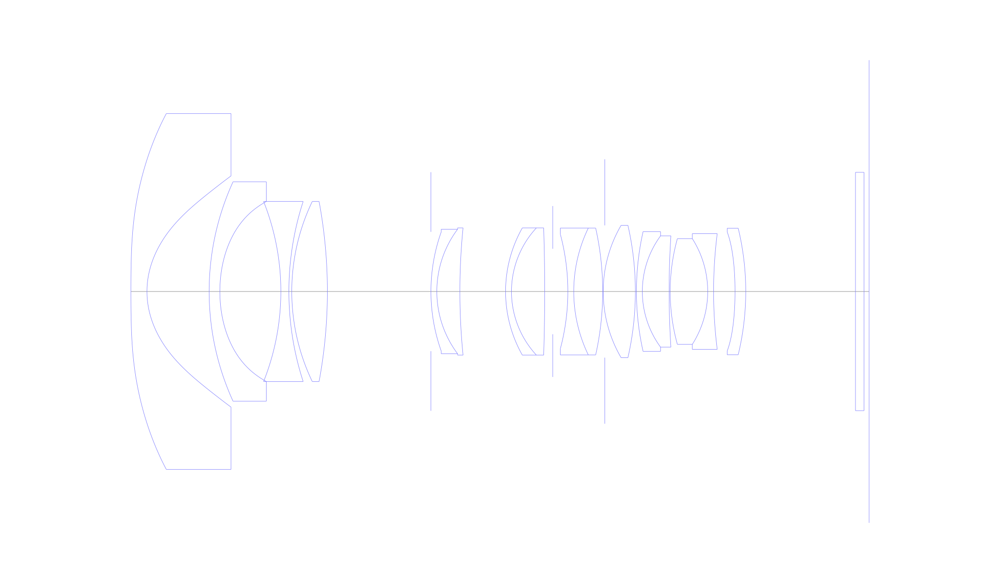
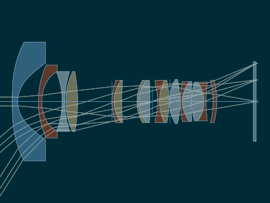
## Spot Diagrams
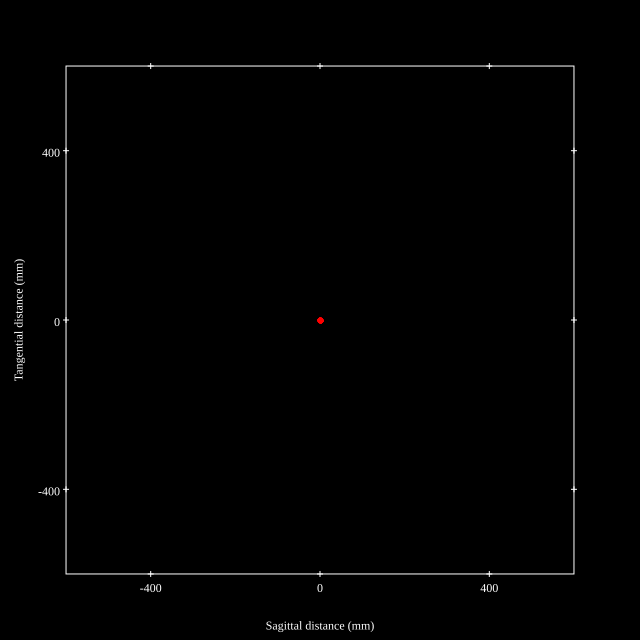

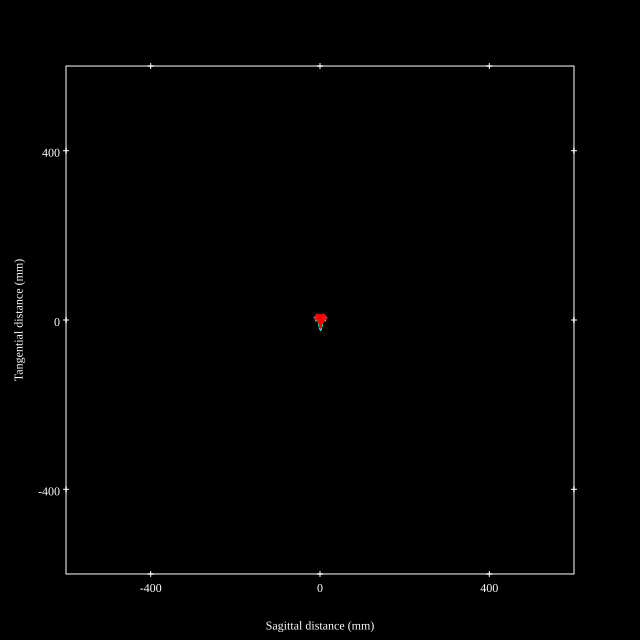
## Paraxial Parameters
| parameter | value |
| ---       | ---   |
| effective_focal_length |14.4
| back_focal_length | 1.05
| optical_invariant | 3.822
| object_distance | 1.0E10
| image_distance | 1.05
| power | 0.069
| pp1_H | 29.588
| ppk_H' | -13.35
| ffl_F | 15.188
| fno | 2.967
| enp_dist_P | 19.8
| enp_radius | 2.427
| exp_dist_P' | -43.805
| exp_radius | 7.577
| m | -0
| red | -6.944439136443012E8
| n_obj | 1
| n_img | 1
| img_ht | 22.68
| obj_ang | 57.588
| obj_na | 0
| img_na | -0.166|
## Spot Analysis
| Field | Spot Mean Radius | Spot Max Radius |
| ---   | ---              | ---             |
 | Field(x=0.0, y=0.0) | 2.992 | 5.371|
 | Field(x=0.0, y=0.1) | 3.147 | 6.863|
 | Field(x=0.0, y=0.2) | 3.389 | 8.548|
 | Field(x=0.0, y=0.3) | 3.72 | 9.733|
 | Field(x=0.0, y=0.4) | 4.142 | 9.714|
 | Field(x=0.0, y=0.5) | 4.402 | 9.715|
 | Field(x=0.0, y=0.6) | 4.308 | 9.109|
 | Field(x=0.0, y=0.7) | 3.958 | 8.627|
 | Field(x=0.0, y=0.8) | 5.394 | 20.291|
 | Field(x=0.0, y=0.9) | 7.772 | 23.621|
 | Field(x=0.0, y=1.0) | 7.146 | 22.505|
## Polychromatic Geometric MTF
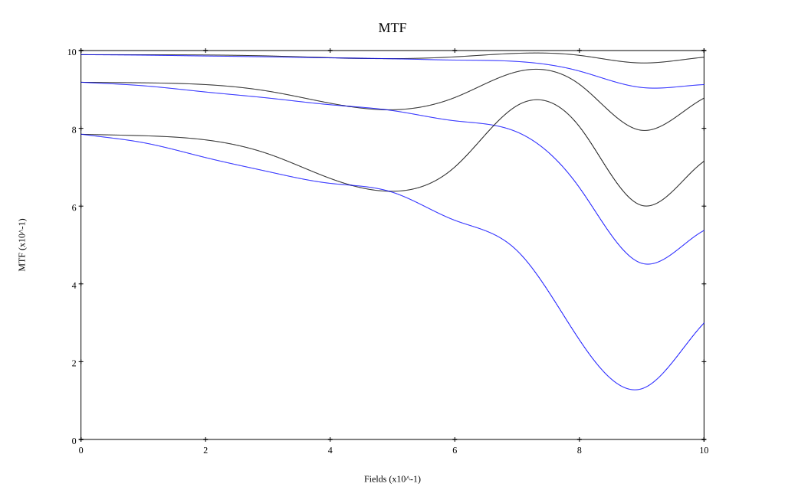
* 10,30,50 cycles/mm
* Black lines represent sagittal, blue tangential
* To generate above, MTFs for wavelengths 587.5618(d), 486.1327(F), 656.2725(C) were calculated across 10 fields, and then averaged
## Polychromatic Geometric MTF (Weighted)
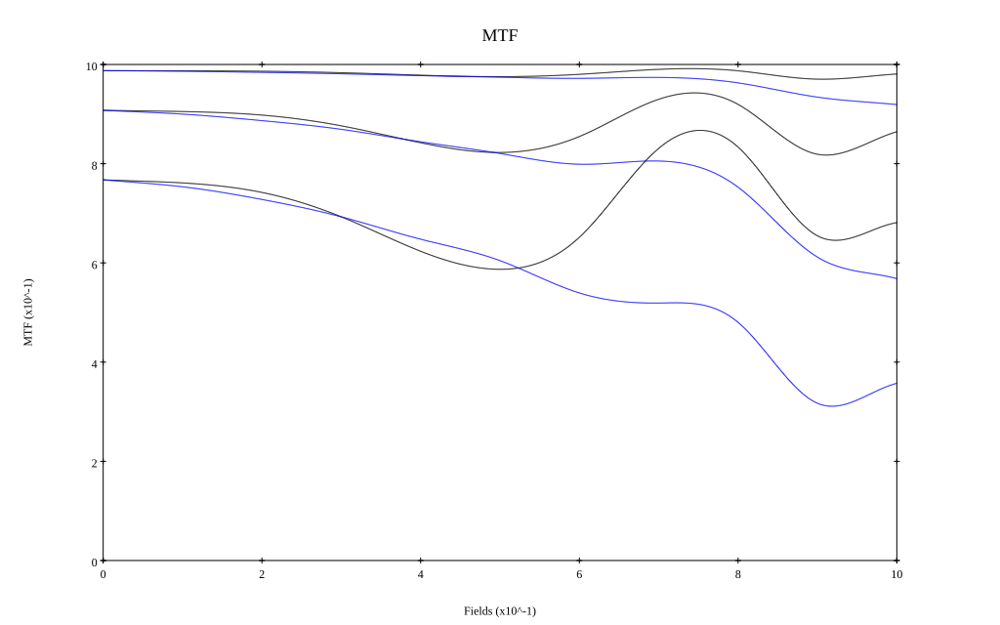
* 10,30,50 cycles/mm
* Black lines represent sagittal, blue tangential
* To generate above, MTFs for wavelengths 587.5618(d) wt(1.0), 656.2725(C) wt(0.475), 546.074(e) wt(0.98), 486.1327(F) wt(0.49), 435.8343(g) wt(0.15) were calculated across 10 fields, and then combined using weighted average
# 24mm f2.8
## Layouts
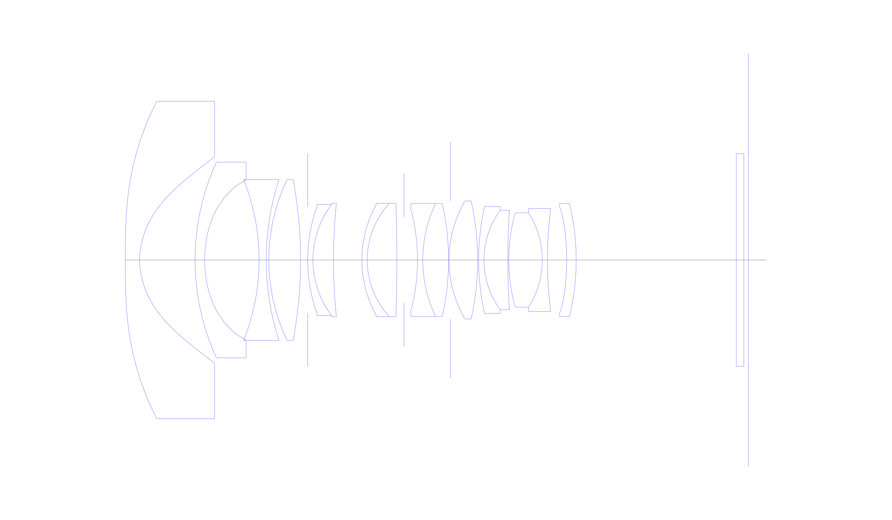
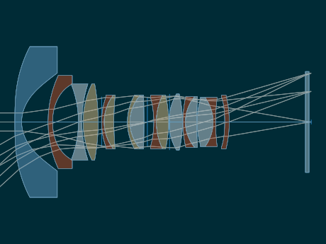
## Spot Diagrams

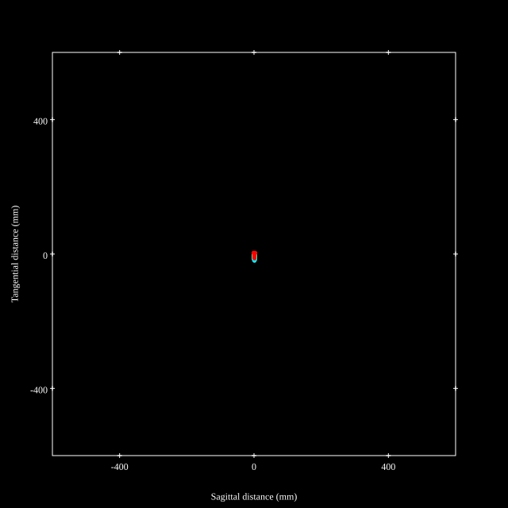
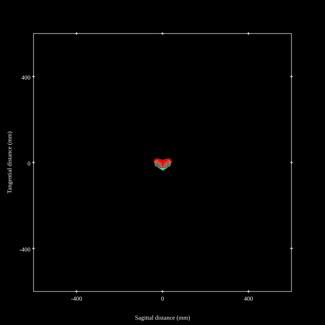
## Paraxial Parameters
| parameter | value |
| ---       | ---   |
| effective_focal_length |23.3
| back_focal_length | 0.951
| optical_invariant | 3.098
| object_distance | 1.0E10
| image_distance | 0.951
| power | 0.043
| pp1_H | 32.272
| ppk_H' | -22.349
| ffl_F | 8.972
| fno | 3.437
| enp_dist_P | 18.353
| enp_radius | 3.389
| exp_dist_P' | -56.911
| exp_radius | 8.417
| m | -0
| red | -4.291851784209853E8
| n_obj | 1
| n_img | 1
| img_ht | 21.299
| obj_ang | 42.431
| obj_na | 0
| img_na | -0.144|
## Spot Analysis
| Field | Spot Mean Radius | Spot Max Radius |
| ---   | ---              | ---             |
 | Field(x=0.0, y=0.0) | 1.554 | 3.747|
 | Field(x=0.0, y=0.1) | 1.736 | 4.934|
 | Field(x=0.0, y=0.2) | 2.321 | 7.443|
 | Field(x=0.0, y=0.3) | 3.085 | 9.653|
 | Field(x=0.0, y=0.4) | 3.911 | 10.288|
 | Field(x=0.0, y=0.5) | 4.702 | 12.135|
 | Field(x=0.0, y=0.6) | 5.578 | 16.716|
 | Field(x=0.0, y=0.7) | 6.757 | 22.74|
 | Field(x=0.0, y=0.8) | 8.362 | 32.513|
 | Field(x=0.0, y=0.9) | 10.058 | 37.219|
 | Field(x=0.0, y=1.0) | 14.751 | 42.185|
## Polychromatic Geometric MTF
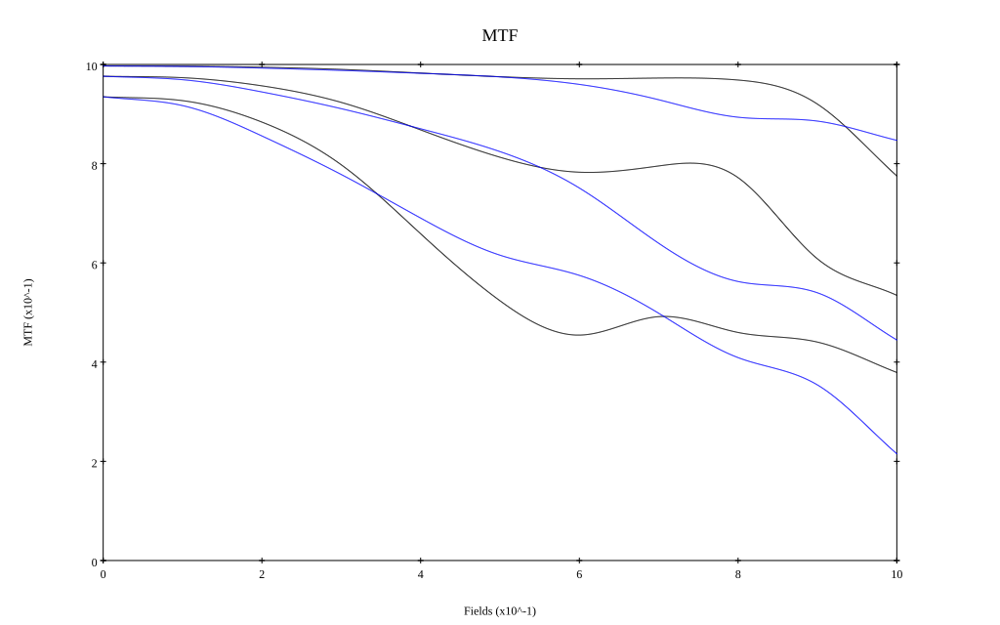
* 10,30,50 cycles/mm
* Black lines represent sagittal, blue tangential
* To generate above, MTFs for wavelengths 587.5618(d), 486.1327(F), 656.2725(C) were calculated across 10 fields, and then averaged
## Polychromatic Geometric MTF (Weighted)
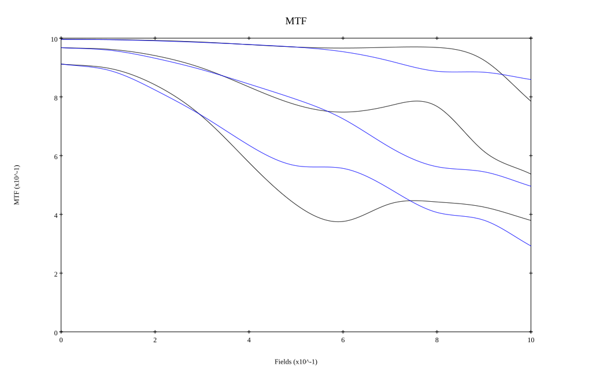
* 10,30,50 cycles/mm
* Black lines represent sagittal, blue tangential
* To generate above, MTFs for wavelengths 587.5618(d) wt(1.0), 656.2725(C) wt(0.475), 546.074(e) wt(0.98), 486.1327(F) wt(0.49), 435.8343(g) wt(0.15) were calculated across 10 fields, and then combined using weighted average
## Resources
* [OpticalBench Compatible Data File, tab delimited](./prescription.txt)
* [Zemax file](./US20240255740_Example08.zmx)

Report / Zemax file generated using [Beam42](https://github.com/BeamFour/Beam42) on 2026-01-28
