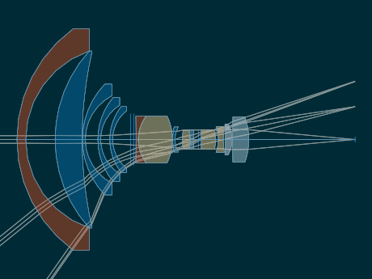
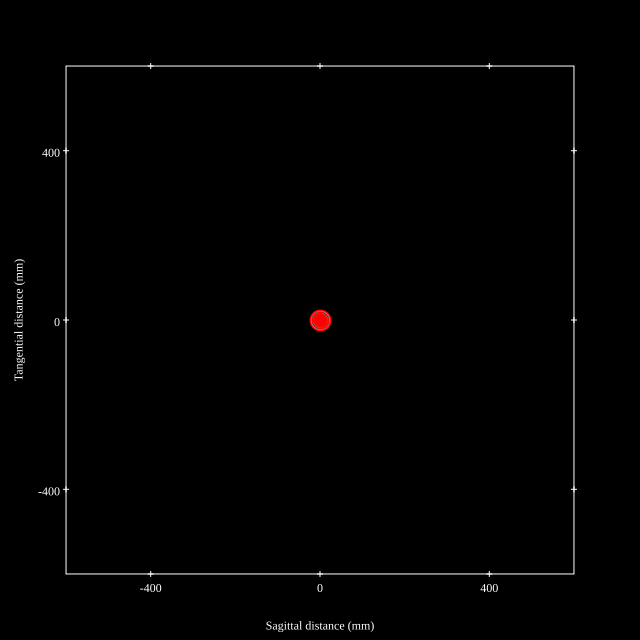
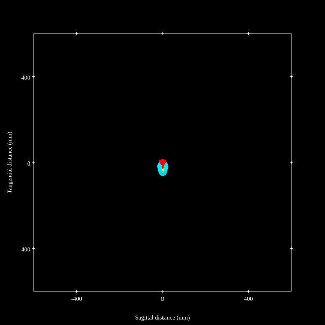
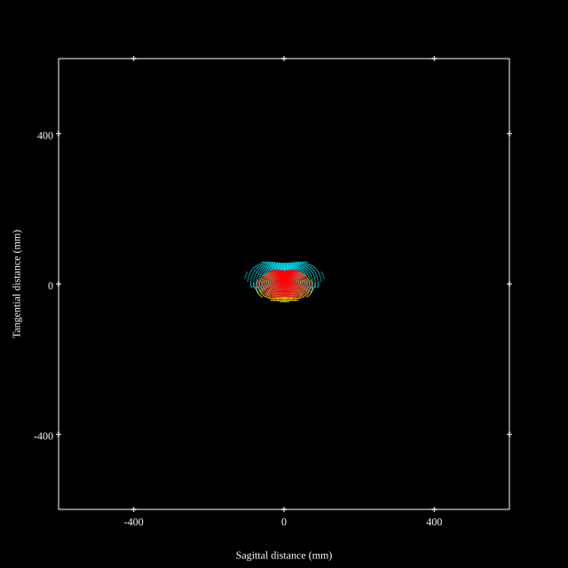
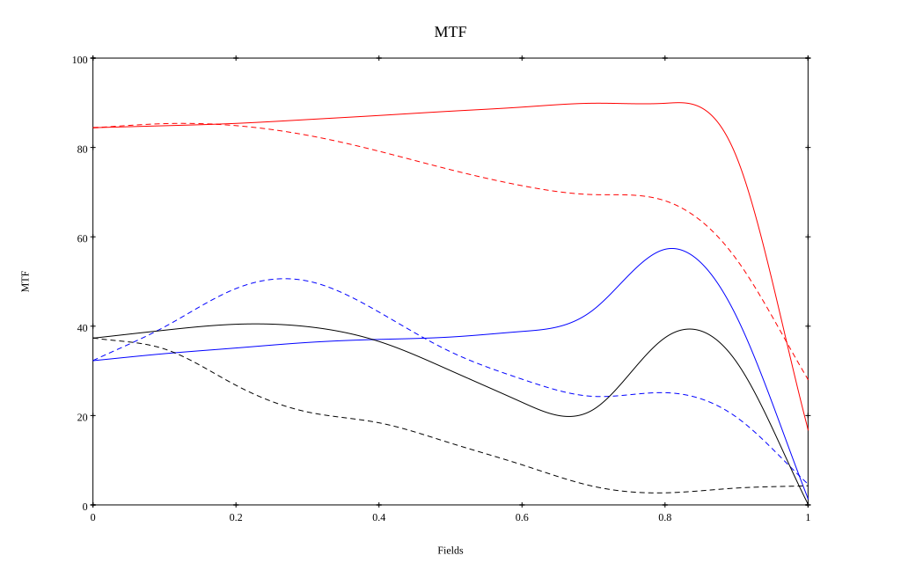

# Nikkor 15mm f5.6
## Patent Information
| Country | Patent Number | Example | Year of Application | Inventors | Organisation | Link |
| ---     | ---           | ---     | ---                 | ---       | ---          | ---  |
|JP | JP1973-071634 | EX 2 | 1971 | Ikuo Mori | Nikon Corp | [link](https://www.j-platpat.inpit.go.jp/c1801/PU/JP-S48-071634/11/en) |
## Surface Data
Note that where glass types are shown the refractive index and abbe number is as per assigned glass type

| ID  | Radius | Thickness | Diameter | nd  | vd  | Glass Make | Glass |
| --- | ---    | ---       | ---      | --- | --- | ---        | ---   |
| 1 | 48.15 | 3.1 | 77.74 | 1.788 | 47.35 | Hikari | J-LASF014 |
| 2 | 32.8 | 10.3 | 62.12 |  |  |  |
| 3 | 46.24 | 9.5 | 62.12 | 1.713 | 53.96 | Hikari | J-LAK8 |
| 4 | 138.86 | 0.1 | 60.56 |  |  |  |
| 5 | 28.0 | 1.0 | 38.91 | 1.6935 | 53.2 | Hikari | J-LAK13 |
| 6 | 17.3 | 4.4 | 30.75 |  |  |  |
| 7 | 22.9 | 1.0 | 29.42 | 1.6935 | 53.2 | Hikari | J-LAK13 |
| 8 | 14.29 | 3.2 | 24.19 |  |  |  |
| 9 | 18.7 | 1.0 | 23.13 | 1.6968 | 55.52 | Hikari | J-LAK14 |
| 10 | 12.87 | 6.3 | 20.18 |  |  |  |
| 11 | 0.0 | 1.2 | 18.14 | 1.51742 | 52.2 | Schott | KF6 |
| 12 | 0.0 | 0.7 | 18.14 |  |  |  |
| 13 | -449.32 | 0.8 | 16.41 | 1.8485 | 43.79 | Hikari | J-LASFH22 |
| 14 | 13.67 | 12.0 | 14.72 | 1.54814 | 45.51 | Hikari | J-LLF1 |
| 15 | -19.1 | 0.1 | 14.72 |  |  |  |
| 16 | 20.31 | 0.8 | 8.81 | 1.6968 | 55.52 | Hikari | J-LAK14 |
| 17 | 8.88 | 2.5 | 8.81 |  |  |  |
| 18 | 13.4 | 2.8 | 6.66 | 1.59551 | 39.21 | Hikari | J-F8 |
| 19 | -12.5 | 1.3 | 6.66 | 1.58313 | 59.42 | Hikari | J-SK12 |
| 20 | 0.0 | 1.6 | 6.66 |  |  |  |
| 21 | AS | 1.0 | 6.67 |  |  |  |
| 22 | 0.0 | 5.1 | 6.82 | 1.59551 | 39.21 | Hikari | J-F8 |
| 23 | -11.96 | 0.9 | 6.82 |  |  |  |
| 24 | -13.4 | 1.8 | 9.18 | 1.86074 | 23.08 | Hikari | J-SFH2 |
| 25 | 34.5 | 0.6 | 9.18 |  |  |  |
| 26 | -190.05 | 2.5 | 10.94 | 1.44772 | 67.2 |  |
| 27 | -10.86 | 0.1 | 10.94 |  |  |  |
| 28 | 315.5 | 5.7 | 15.9 | 1.5168 | 64.13 | Hikari | J-BK7A |
| 29 | -23.86 | 37.3 | 15.9 |  |  |  |
## Layouts

## Spot Diagrams

## Paraxial Parameters
| parameter | value |
| ---       | ---   |
| effective_focal_length |14.831
| back_focal_length | 37.446
| optical_invariant | 1.891
| object_distance | 1.0E10
| image_distance | 37.446
| power | 0.067
| pp1_H | 46.277
| ppk_H' | 22.615
| ffl_F | 31.446
| fno | 5.6
| enp_dist_P | 35.282
| enp_radius | 1.324
| exp_dist_P' | -19.755
| exp_radius | 5.12
| m | -0
| red | -6.742567491952435E8
| n_obj | 1
| n_img | 1
| img_ht | 21.181
| obj_ang | 55
| obj_na | 0
| img_na | -0.089|
## Spot Analysis
| Field | Spot Mean Radius | Spot Max Radius |
| ---   | ---              | ---             |
 | Field(x=0.0, y=0.0) | 13.163 | 24.063|
 | Field(x=0.0, y=0.1) | 12.846 | 25.504|
 | Field(x=0.0, y=0.2) | 13.004 | 29.605|
 | Field(x=0.0, y=0.3) | 13.37 | 35.38|
 | Field(x=0.0, y=0.4) | 14.081 | 41.591|
 | Field(x=0.0, y=0.5) | 15.135 | 47.627|
 | Field(x=0.0, y=0.6) | 15.841 | 52.462|
 | Field(x=0.0, y=0.7) | 15.974 | 51.662|
 | Field(x=0.0, y=0.8) | 16.639 | 52.095|
 | Field(x=0.0, y=0.9) | 22.549 | 55.587|
 | Field(x=0.0, y=1.0) | 41.162 | 106.375|
## Geometric MTF

* 10,30,50 cycles/mm
* Black lines represent sagittal, blue tangential
## Resources
* [OpticalBench Compatible Data File, tab delimited](./JP1973-071634_Example02.txt)
* [Zemax file](./JP1973-071634_Example02.zmx)
