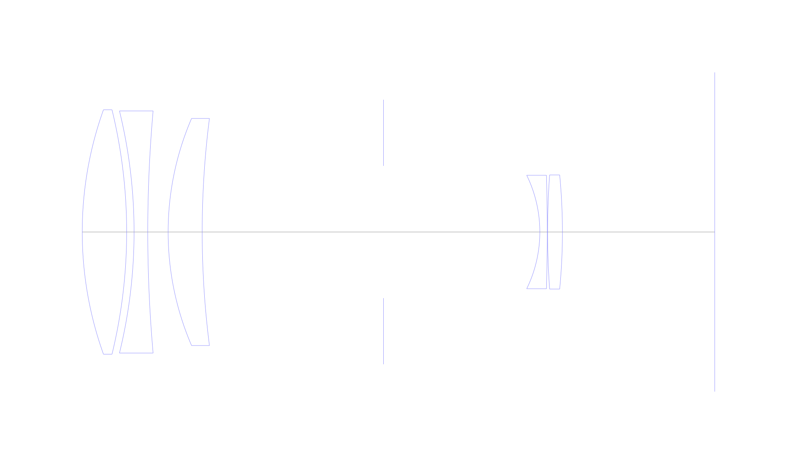
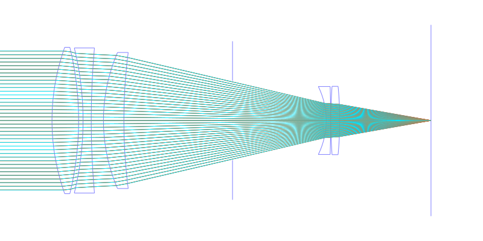
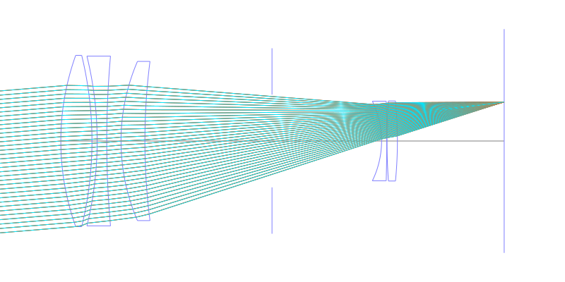
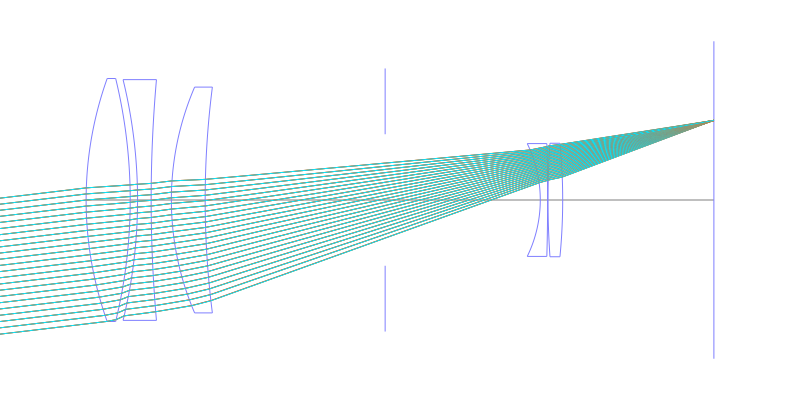
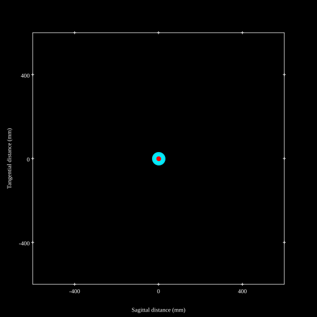
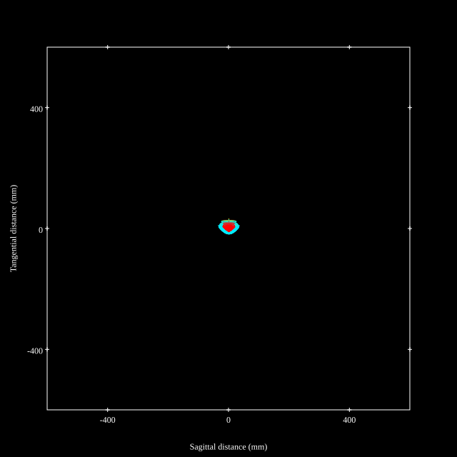
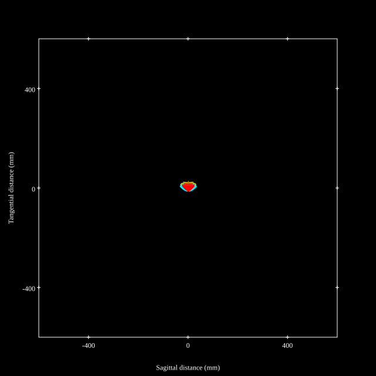
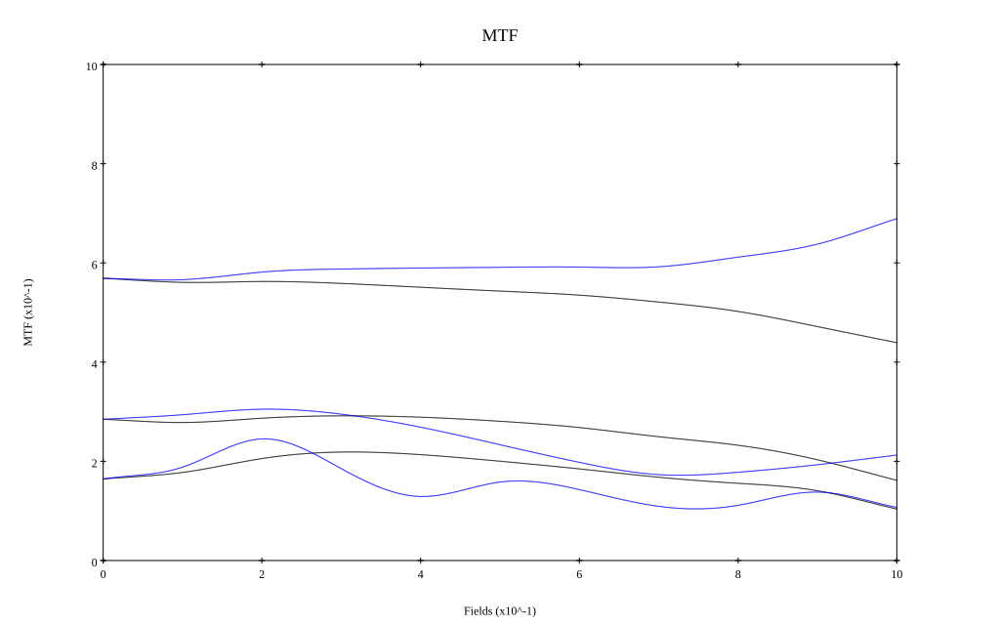
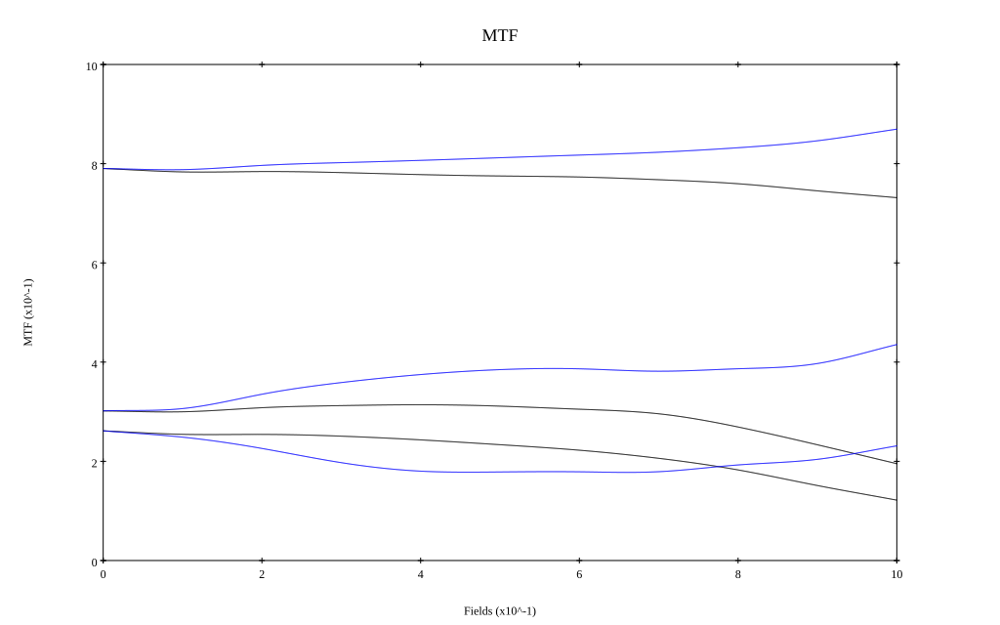

## Surface Data
Note that where glass types are shown the refractive index and abbe number is as per assigned glass type

| ID  | Radius | Thickness | Diameter | nd  | vd  | Glass Make | Glass |
| --- | ---    | ---       | ---      | --- | --- | ---        | ---   |
| 1 | 54.585 | 6.667 | 36.74 | 1.497 | 81.61 | Hoya | FCD1 |
| 2 | -77.813 | 1.111 | 36.74 |  |  |  |
| 3 | -76.698 | 2.056 | 36.4 | 1.7495 | 34.95 | Schott | LAFN7 |
| 4 | 207.222 | 3.056 | 36.4 |  |  |  |
| 5 | 43.208 | 5.111 | 34.14 | 1.65844 | 50.85 | Hoya | BACED5 |
| 6 | 134.444 | 27.212 | 34.14 |  |  |  |
| 7 | AS | 23.455 | 19.889 |  |  |  |
| 8 | -19.462 | 1.111 | 17.06 | 1.51823 | 58.98 | Schott | K3 |
| 9 | -305.556 | 0.056 | 17.06 |  |  |  |
| 10 | 122.887 | 2.222 | 17.16 | 1.7945 | 45.39 | Hoya | TAF2 |
| 11 | -89.277 | 22.862 | 17.16 |  |  |  |
## Layouts

## Spot Diagrams

## Paraxial Parameters
| parameter | value |
| ---       | ---   |
| effective_focal_length |100.123
| back_focal_length | 22.891
| optical_invariant | 2.131
| object_distance | 1.0E10
| image_distance | 22.891
| power | 0.01
| pp1_H | -49.119
| ppk_H' | -77.233
| ffl_F | -149.243
| fno | 2.801
| enp_dist_P | 72.495
| enp_radius | 17.87
| exp_dist_P' | -22.29
| exp_radius | 8.069
| m | -0
| red | -9.9876660500365E7
| n_obj | 1
| n_img | 1
| img_ht | 11.939
| obj_ang | 6.8
| obj_na | 0
| img_na | -0.176|
## Spot Analysis
| Field | Spot Mean Radius | Spot Max Radius |
| ---   | ---              | ---             |
 | Field(x=0.0, y=0.0) | 13.499 | 30.227|
 | Field(x=0.0, y=0.1) | 13.857 | 35.36|
 | Field(x=0.0, y=0.2) | 13.51 | 37.367|
 | Field(x=0.0, y=0.3) | 13.486 | 37.193|
 | Field(x=0.0, y=0.4) | 13.593 | 36.233|
 | Field(x=0.0, y=0.5) | 13.796 | 36.531|
 | Field(x=0.0, y=0.6) | 13.52 | 36.119|
 | Field(x=0.0, y=0.7) | 13.489 | 35.785|
 | Field(x=0.0, y=0.8) | 13.422 | 35.197|
 | Field(x=0.0, y=0.9) | 13.502 | 35.06|
 | Field(x=0.0, y=1.0) | 13.391 | 33.716|
## Polychromatic Geometric MTF

* 10,30,50 cycles/mm
* Black lines represent sagittal, blue tangential
* To generate above, MTFs for wavelengths 587.5618(d), 486.1327(F), 656.2725(C) were calculated across 10 fields, and then averaged
## Polychromatic Geometric MTF (Weighted)

* 10,30,50 cycles/mm
* Black lines represent sagittal, blue tangential
* To generate above, MTFs for wavelengths 587.5618(d) wt(1.0), 656.2725(C) wt(0.475), 546.074(e) wt(0.98), 486.1327(F) wt(0.49), 435.8343(g) wt(0.15) were calculated across 10 fields, and then combined using weighted average
## Resources
* [OpticalBench Compatible Data File, tab delimited](./prescription.txt)
* [Zemax file](./US004338001_Example01.zmx)

Report / Zemax file generated using [Beam42](https://github.com/BeamFour/Beam42) on 2026-05-03
