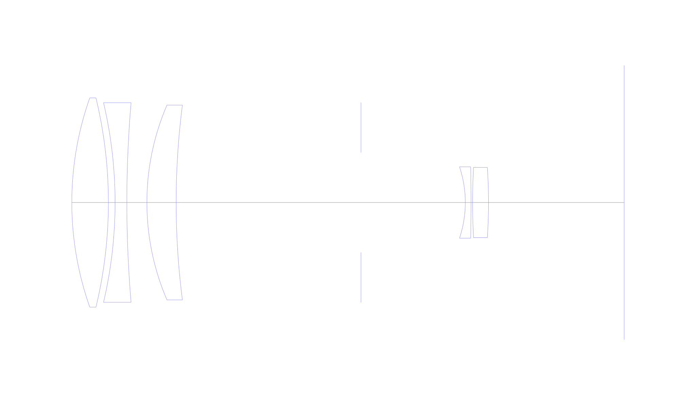
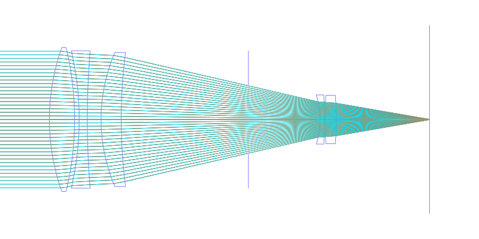
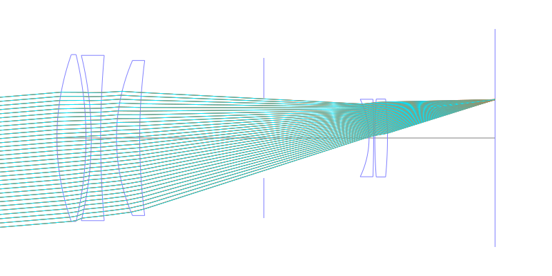
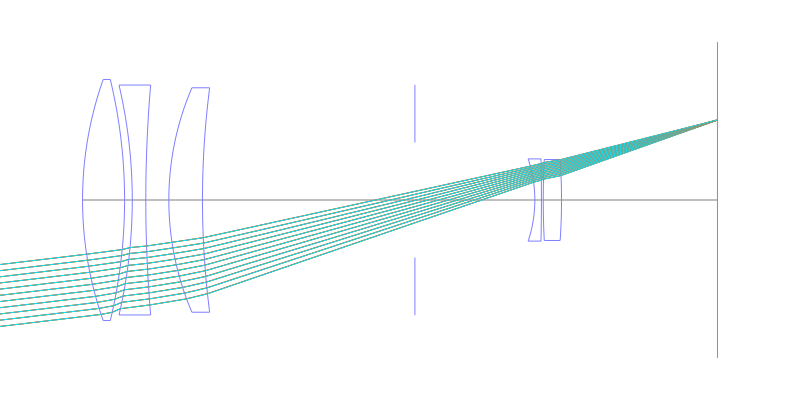
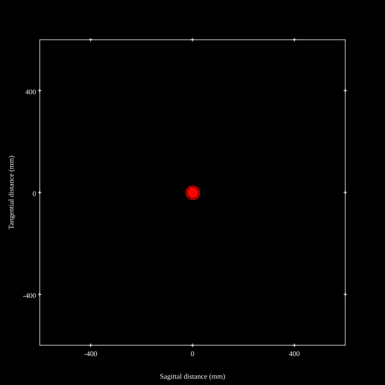
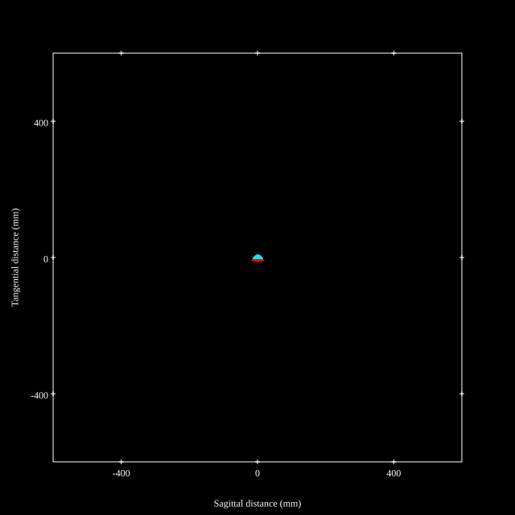
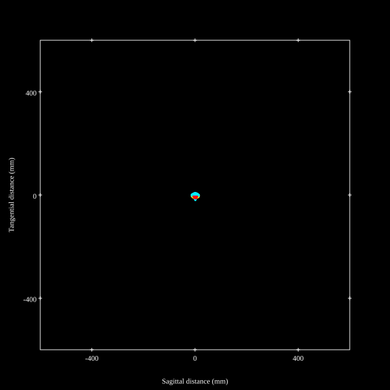
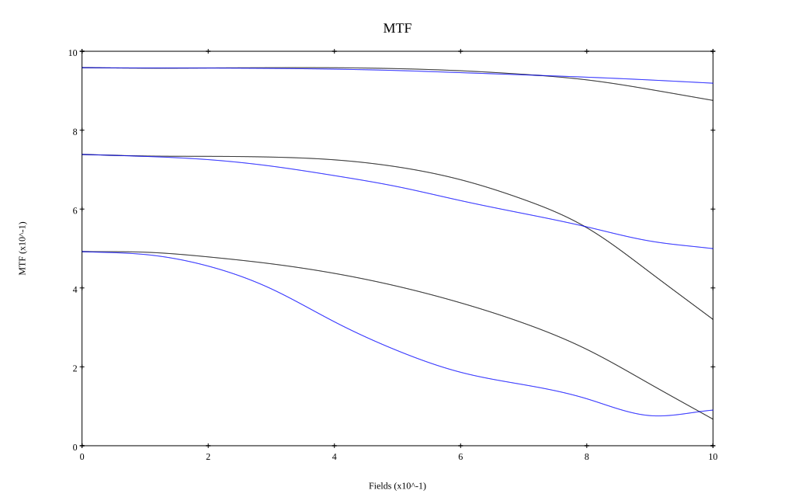
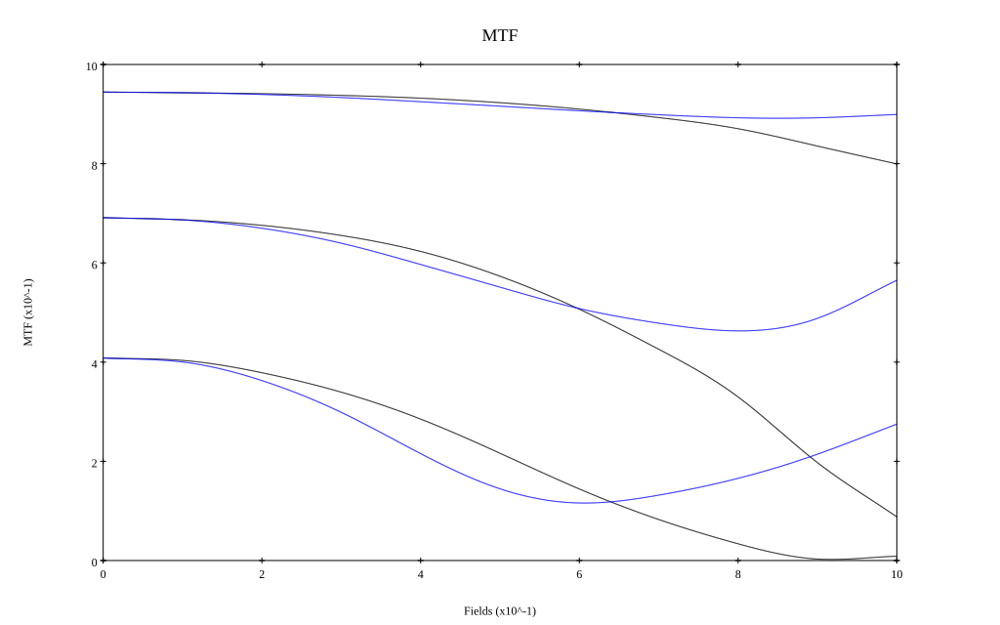

# AI Nikkor 180mm f/2.8 ED
## Patent Information
| Country | Patent Number | Example | Year of Application | Inventors | Organisation | Link |
| ---     | ---           | ---     | ---                 | ---       | ---          | ---  |
|US | US4338001 | 2 | 1979 | Sei Matsui | Nippon Kogaku KK | [link](https://patents.google.com/patent/US4338001A/en) |
## Surface Data
Note that where glass types are shown the refractive index and abbe number is as per assigned glass type

| ID  | Radius | Thickness | Diameter | nd  | vd  | Glass Make | Glass |
| --- | ---    | ---       | ---      | --- | --- | ---        | ---   |
| 1 | 99.021 | 11.5 | 66.132 | 1.49782 | 82.57 | Hikari | J-FKH1 |
| 2 | -140.839 | 2.1 | 66.132 |  |  |  |
| 3 | -138.056 | 3.7 | 65.52 | 1.7495 | 35.04 | Hoya | E-LAF7 |
| 4 | 373.0 | 6.3 | 65.52 |  |  |  |
| 5 | 77.774 | 9.2 | 61.452 | 1.65844 | 50.84 | Hikari | J-SSK5 |
| 6 | 240.0 | 49.21 | 61.452 |  |  |  |
| 7 | AS | 41.69 | 31.7372 |  |  |  |
| 8 | -35.5 | 1.8 | 30.708 | 1.51454 | 54.63 | Hoya | CF3 |
| 9 | -550.0 | 0.5 | 30.708 |  |  |  |
| 10 | 220.0 | 5.0 | 30.888 | 1.795 | 45.31 | Hikari | J-LASF017 |
| 11 | -162.193 | 42.65 | 30.888 |  |  |  |
## Layouts

## Spot Diagrams

## Paraxial Parameters
| parameter | value |
| ---       | ---   |
| effective_focal_length |182.135
| back_focal_length | 42.646
| optical_invariant | 3.414
| object_distance | 1.0E10
| image_distance | 42.646
| power | 0.005
| pp1_H | -81.482
| ppk_H' | -139.489
| ffl_F | -263.618
| fno | 3.181
| enp_dist_P | 131.098
| enp_radius | 28.629
| exp_dist_P' | -41.401
| exp_radius | 13.21
| m | -0
| red | -5.490418598128545E7
| n_obj | 1
| n_img | 1
| img_ht | 21.718
| obj_ang | 6.8
| obj_na | 0
| img_na | -0.155|
## Spot Analysis
| Field | Spot Mean Radius | Spot Max Radius |
| ---   | ---              | ---             |
 | Field(x=0.0, y=0.0) | 5.844 | 15.641|
 | Field(x=0.0, y=0.1) | 6.208 | 19.608|
 | Field(x=0.0, y=0.2) | 6.224 | 19.205|
 | Field(x=0.0, y=0.3) | 6.259 | 18.577|
 | Field(x=0.0, y=0.4) | 6.418 | 17.833|
 | Field(x=0.0, y=0.5) | 6.622 | 16.923|
 | Field(x=0.0, y=0.6) | 6.993 | 15.861|
 | Field(x=0.0, y=0.7) | 7.513 | 14.709|
 | Field(x=0.0, y=0.8) | 8.152 | 13.96|
 | Field(x=0.0, y=0.9) | 9.139 | 15.111|
 | Field(x=0.0, y=1.0) | 10.212 | 20.498|
## Polychromatic Geometric MTF

* 10,30,50 cycles/mm
* Black lines represent sagittal, blue tangential
* To generate above, MTFs for wavelengths 587.5618(d), 486.1327(F), 656.2725(C) were calculated across 10 fields, and then averaged
## Polychromatic Geometric MTF (Weighted)

* 10,30,50 cycles/mm
* Black lines represent sagittal, blue tangential
* To generate above, MTFs for wavelengths 587.5618(d) wt(1.0), 656.2725(C) wt(0.475), 546.074(e) wt(0.98), 486.1327(F) wt(0.49), 435.8343(g) wt(0.15) were calculated across 10 fields, and then combined using weighted average
## Resources
* [OpticalBench Compatible Data File, tab delimited](./prescription.txt)
* [Zemax file](./US004338001_Example02.zmx)

Report / Zemax file generated using [Beam42](https://github.com/BeamFour/Beam42) on 2026-05-10
