# Nikkor 18mm f4
## Patent Information
| Country | Patent Number | Example | Year of Application | Inventors | Organisation | Link |
| ---     | ---           | ---     | ---                 | ---       | ---          | ---  |
|US | US3549241 | EX 5 | 1968 | Ikuo Mori | Nikon Corp  | [link](https://patents.google.com/patent/US3549241A/en) |
## Surface Data
Note that where glass types are shown the refractive index and abbe number is as per assigned glass type

| ID  | Radius | Thickness | Diameter | nd  | vd  | Glass Make | Glass |
| --- | ---    | ---       | ---      | --- | --- | ---        | ---   |
| 1 | 44.14 | 1.76 | 55.56 | 1.7552 | 27.57 | Hikari | J-SF4 |
| 2 | 32.869 | 9.392 | 47.8 | 1.6968 | 55.52 | Hikari | J-LAK14 |
| 3 | 98.608 | 0.117 | 47.8 |  |  |  |
| 4 | 32.283 | 0.94 | 33.62 | 1.6516 | 58.57 | Hikari | J-LAK7 |
| 5 | 13.852 | 5.869 | 22.37 |  |  |  |
| 6 | 26.06 | 0.94 | 24.84 | 1.6968 | 55.52 | Hikari | J-LAK14 |
| 7 | 9.86 | 4.696 | 15.62 |  |  |  |
| 8 | 193.696 | 1.173 | 15.85 | 1.74429 | 50.77 | Schott | N-LAK28 |
| 9 | 12.679 | 12.56 | 12.7 | 1.58144 | 40.98 | Hikari | J-LF5 |
| 10 | -44.842 | 0.117 | 9.88 |  |  |  |
| 11 | 28.644 | 2.7 | 11.12 | 1.62004 | 36.4 | Hikari | J-F2 |
| 12 | -14.083 | 0.94 | 11.12 | 1.62041 | 60.25 | Hikari | J-SK16 |
| 13 | 0.0 | 0.467 | 11.12 |  |  |  |
| 14 | AS | 1.646 | 10.203 |  |  |  |
| 15 | 0.0 | 1.76 | 11.8 | 1.62004 | 36.4 | Hikari | J-F2 |
| 16 | -18.606 | 0.469 | 11.8 |  |  |  |
| 17 | -15.144 | 0.821 | 11.91 | 1.80518 | 25.45 | Hikari | J-SF6 |
| 18 | 21.224 | 1.173 | 10.78 | 1.62041 | 60.25 | Hikari | J-SK16 |
| 19 | 53.765 | 0.821 | 10.78 |  |  |  |
| 20 | -62.217 | 1.76 | 12.47 | 1.5168 | 64.13 | Hikari | J-BK7A |
| 21 | -15.612 | 0.117 | 12.47 |  |  |  |
| 22 | -211.304 | 2.376 | 14.39 | 1.56384 | 60.71 | Hikari | J-SK11 |
| 23 | -15.075 | 44.97 | 14.39 |  |  |  |
## Layouts
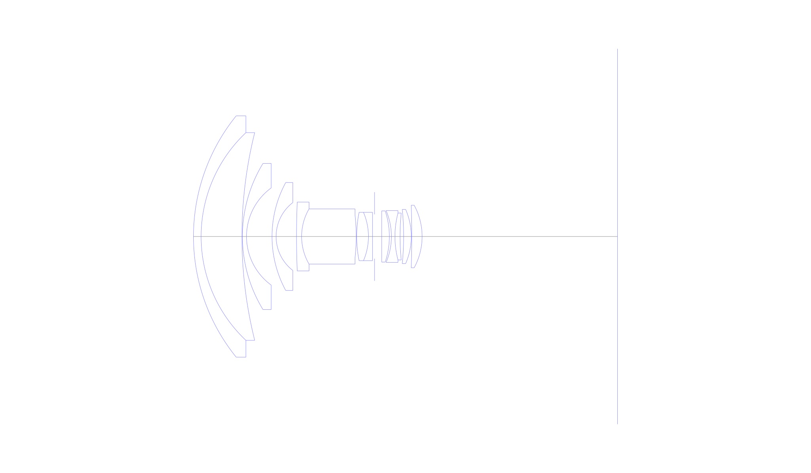
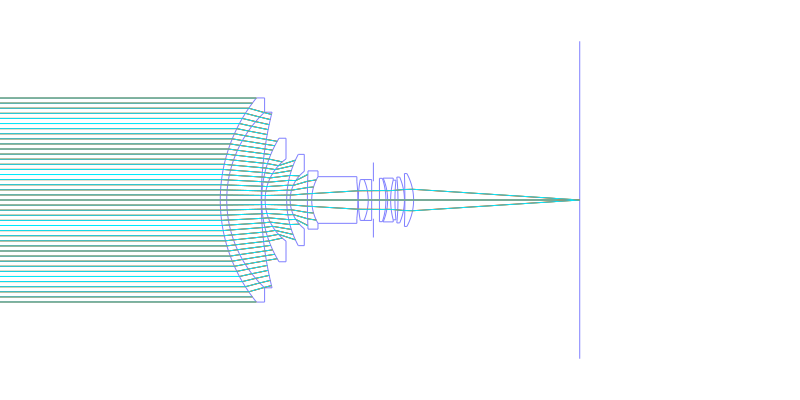
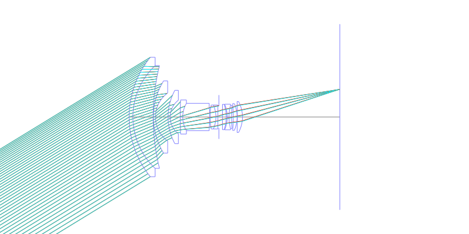
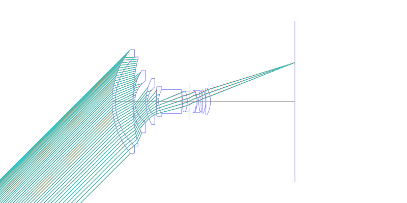
## Spot Diagrams
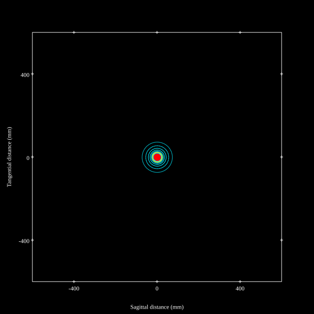
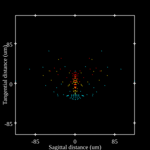
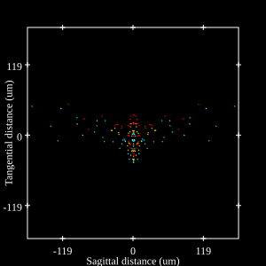
## Paraxial Parameters
| parameter | value |
| ---       | ---   |
| effective_focal_length |21.622
| back_focal_length | 45.172
| optical_invariant | 2.703
| object_distance | 1.0E10
| image_distance | 45.172
| power | 0.046
| pp1_H | 37.967
| ppk_H' | 23.55
| ffl_F | 16.345
| fno | 4
| enp_dist_P | 24.472
| enp_radius | 2.703
| exp_dist_P' | -12.148
| exp_radius | 7.19
| m | -0
| red | -4.6249340229590607E8
| n_obj | 1
| n_img | 1
| img_ht | 21.622
| obj_ang | 45
| obj_na | 0
| img_na | -0.124|
## Spot Analysis
| Field | Spot Mean Radius | Spot Max Radius |
| ---   | ---              | ---             |
 | Field(x=0.0, y=0.0) | 21.425 | 72.771|
 | Field(x=0.0, y=0.707) | 37.388 | 167.952|
 | Field(x=0.0, y=1.0) | 58.566 | 270.338|
## Ray Aberrations
### Field 0.0
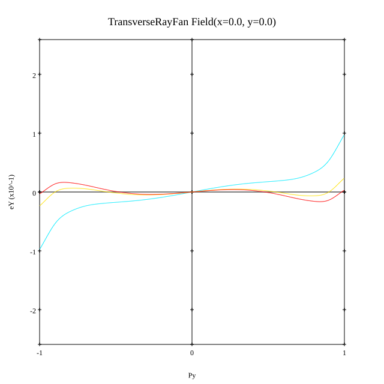
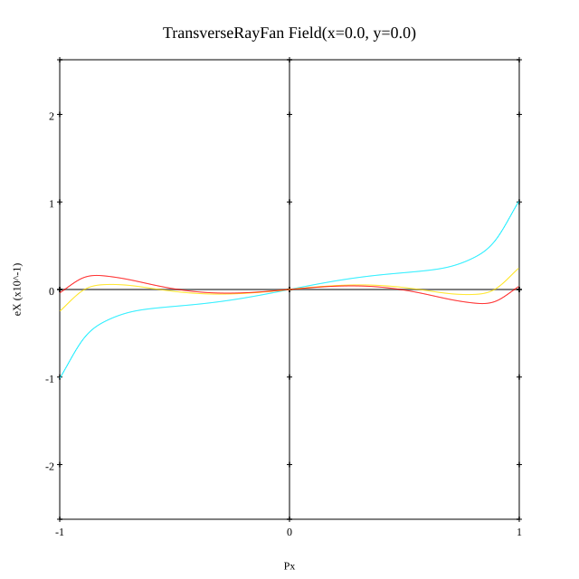
### Field 0.7
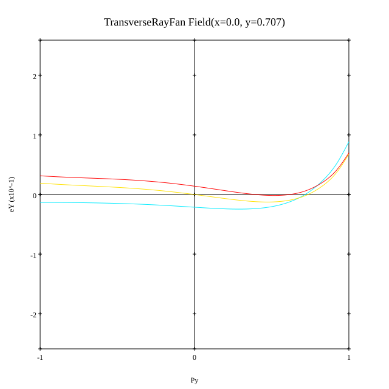
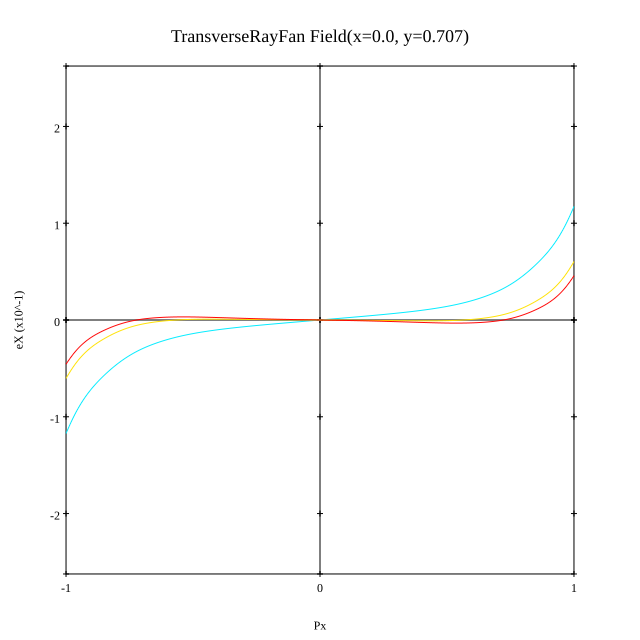
### Field 1.0
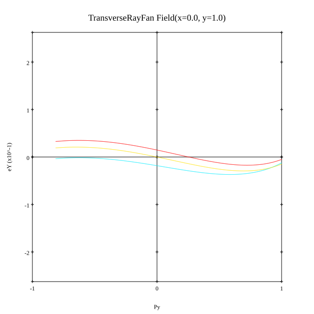
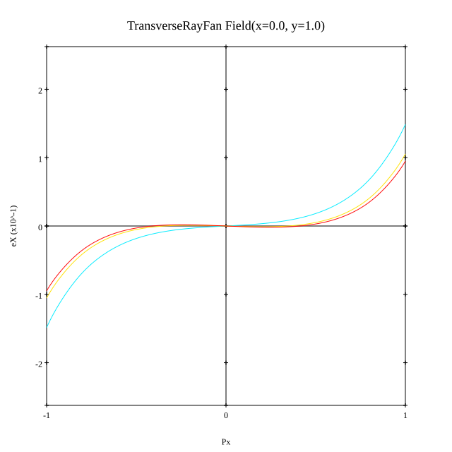
## Resources
* [OpticalBench Compatible Data File, tab delimited](./US003549241_Example05.txt)
* [Zemax file](./US003549241_Example05.zmx)
