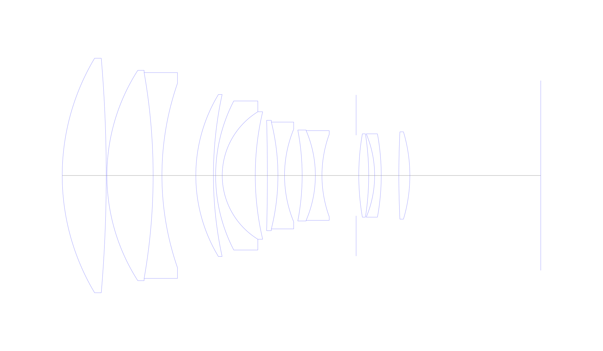
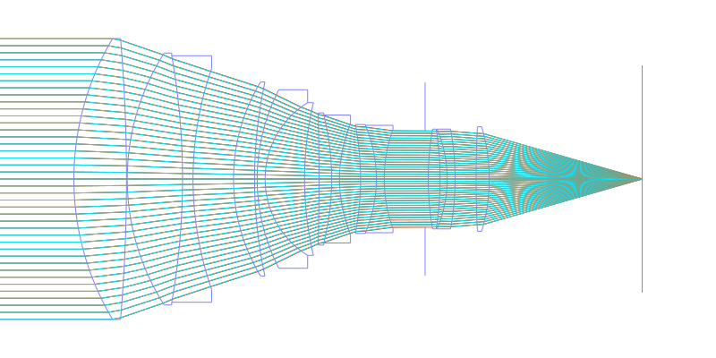
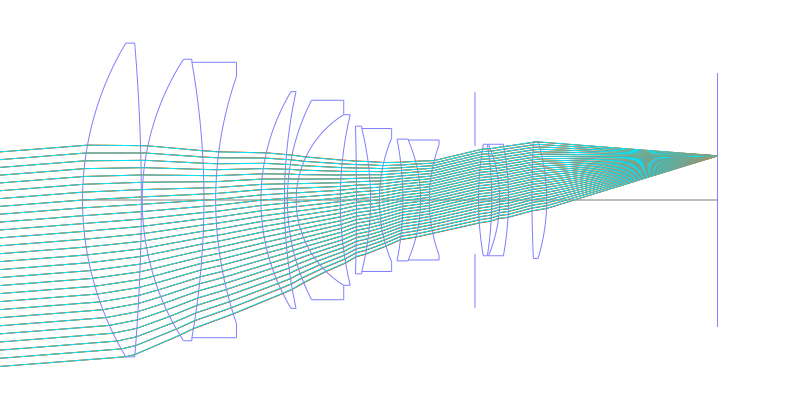
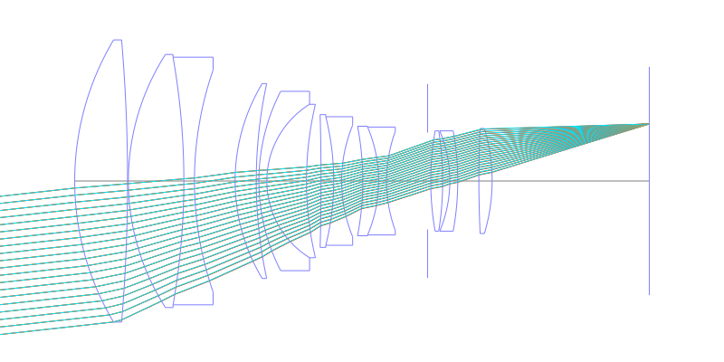
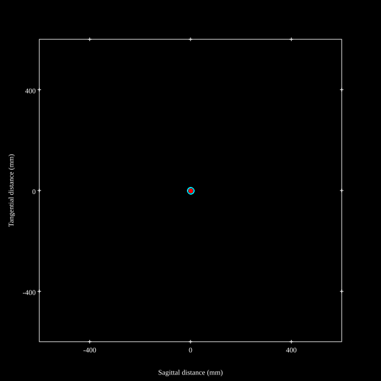
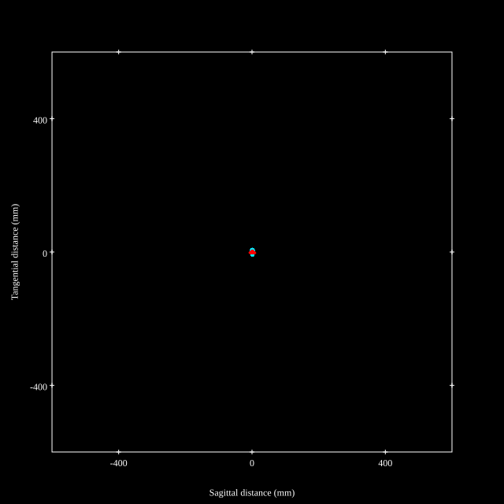
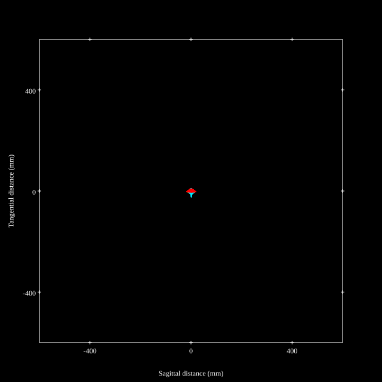
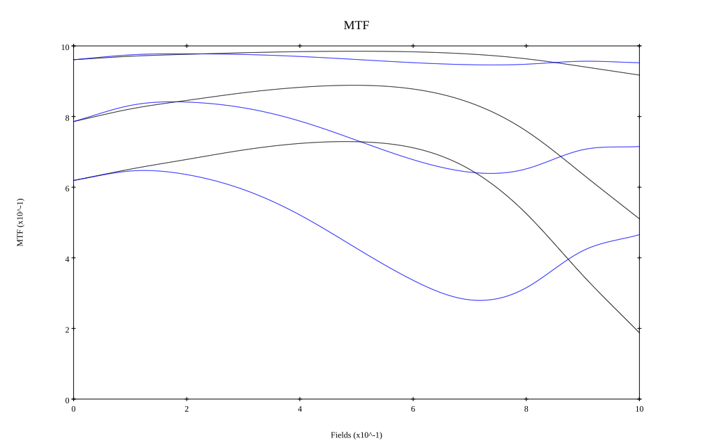
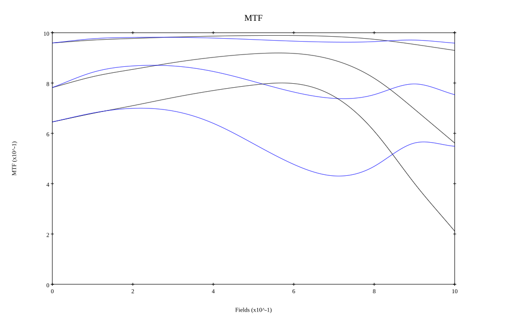

## Surface Data
Note that where glass types are shown the refractive index and abbe number is as per assigned glass type

| ID  | Radius | Thickness | Diameter | nd  | vd  | Glass Make | Glass |
| --- | ---    | ---       | ---      | --- | --- | ---        | ---   |
| 1 | 104.204 | 20.0 | 106.76 | 1.49782 | 82.57 | Hikari | J-FKH1 |
| 2 | -630.89 | 0.3 | 106.76 |  |  |  |
| 3 | 88.701 | 21.0 | 95.76 | 1.49782 | 82.57 | Hikari | J-FKH1 |
| 4 | -270.095 | 4.0 | 93.7 | 1.7481 | 52.3 | Hikari | E-LAKH1 |
| 5 | 128.345 | 15.39 | 83.98 |  |  |  |
| 6 | 71.441 | 8.0 | 73.74 | 1.44679 | 91.0 | Hikari | FKH2-Proto |
| 7 | 174.32 | 1.0 | 73.74 |  |  |  |
| 8 | 74.005 | 3.0 | 67.86 | 1.7481 | 52.3 | Hikari | E-LAKH1 |
| 9 | 34.121 | 15.0 | 58.04 | 1.49782 | 82.57 | Hikari | J-FKH1 |
| 10 | 126.546 | 5.5 | 58.04 |  |  |  |
| 11 | -957.711 | 4.8 | 50.24 | 1.8045 | 39.64 | Hoya | NBFD3 |
| 12 | -100.138 | 3.0 | 48.64 | 1.51454 | 54.63 | Hoya | CF3 |
| 13 | 55.554 | 8.0 | 42.24 |  |  |  |
| 14 | -109.151 | 6.0 | 41.42 | 1.80384 | 33.89 | Hikari | E-LAFH2 |
| 15 | -51.923 | 3.0 | 40.82 | 1.6228 | 57.04 | Hikari | E-SK10 |
| 16 | 54.98 | 15.5239 | 37.54 |  |  |  |
| 17 | AS | 1.2 | 36.68 |  |  |  |
| 18 | 111.154 | 4.5 | 37.94 | 1.7481 | 52.3 | Hikari | E-LAKH1 |
| 19 | -121.699 | 2.7 | 37.94 |  |  |  |
| 20 | -49.128 | 3.0 | 37.94 | 1.72825 | 28.38 | Hikari | J-SF10 |
| 21 | -104.898 | 8.0 | 37.94 |  |  |  |
| 22 | 413.276 | 5.0 | 39.74 | 1.64 | 60.09 | Hikari | E-LAK01 |
| 23 | -69.215 | 59.475 | 39.74 |  |  |  |
## Layouts

## Spot Diagrams

## Paraxial Parameters
| parameter | value |
| ---       | ---   |
| effective_focal_length |195.005
| back_focal_length | 59.463
| optical_invariant | 5.859
| object_distance | 1.0E10
| image_distance | 59.463
| power | 0.005
| pp1_H | 142.814
| ppk_H' | -135.541
| ffl_F | -52.19
| fno | 1.84
| enp_dist_P | 403.53
| enp_radius | 52.988
| exp_dist_P' | -23.992
| exp_radius | 22.674
| m | -0
| red | -5.12808383600198E7
| n_obj | 1
| n_img | 1
| img_ht | 21.563
| obj_ang | 6.31
| obj_na | 0
| img_na | -0.262|
## Spot Analysis
| Field | Spot Mean Radius | Spot Max Radius |
| ---   | ---              | ---             |
 | Field(x=0.0, y=0.0) | 3.904 | 12.784|
 | Field(x=0.0, y=0.1) | 3.256 | 13.296|
 | Field(x=0.0, y=0.2) | 3.19 | 12.63|
 | Field(x=0.0, y=0.3) | 3.183 | 11.316|
 | Field(x=0.0, y=0.4) | 3.237 | 11.451|
 | Field(x=0.0, y=0.5) | 3.407 | 11.84|
 | Field(x=0.0, y=0.6) | 3.599 | 12.274|
 | Field(x=0.0, y=0.7) | 3.862 | 12.95|
 | Field(x=0.0, y=0.8) | 4.418 | 16.198|
 | Field(x=0.0, y=0.9) | 5.859 | 23.596|
 | Field(x=0.0, y=1.0) | 8.866 | 34.622|
## Polychromatic Geometric MTF

* 10,30,50 cycles/mm
* Black lines represent sagittal, blue tangential
* To generate above, MTFs for wavelengths 587.5618(d), 486.1327(F), 656.2725(C) were calculated across 10 fields, and then averaged
## Polychromatic Geometric MTF (Weighted)

* 10,30,50 cycles/mm
* Black lines represent sagittal, blue tangential
* To generate above, MTFs for wavelengths 587.5618(d) wt(1.0), 656.2725(C) wt(0.475), 546.074(e) wt(0.98), 486.1327(F) wt(0.49), 435.8343(g) wt(0.15) were calculated across 10 fields, and then combined using weighted average
## Resources
* [OpticalBench Compatible Data File, tab delimited](./prescription.txt)
* [Zemax file](./US007411745_Example03.zmx)

Report / Zemax file generated using [Beam42](https://github.com/BeamFour/Beam42) on 2026-05-16
