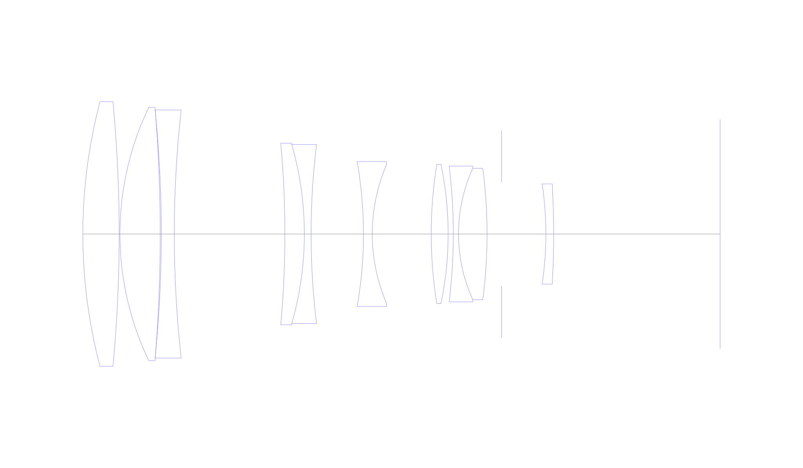
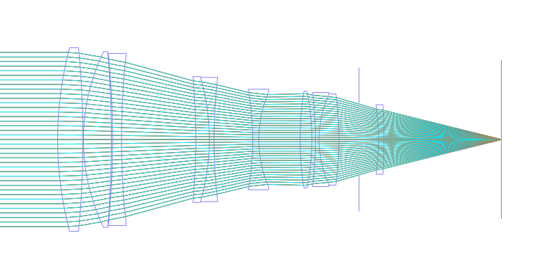
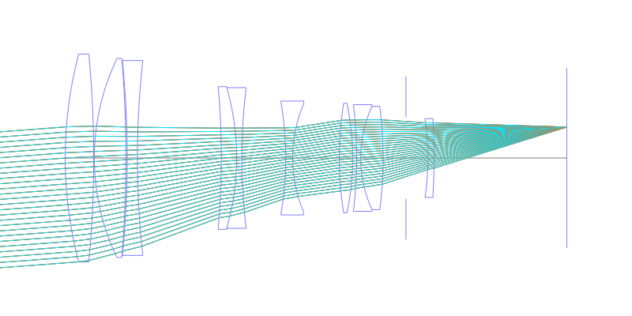
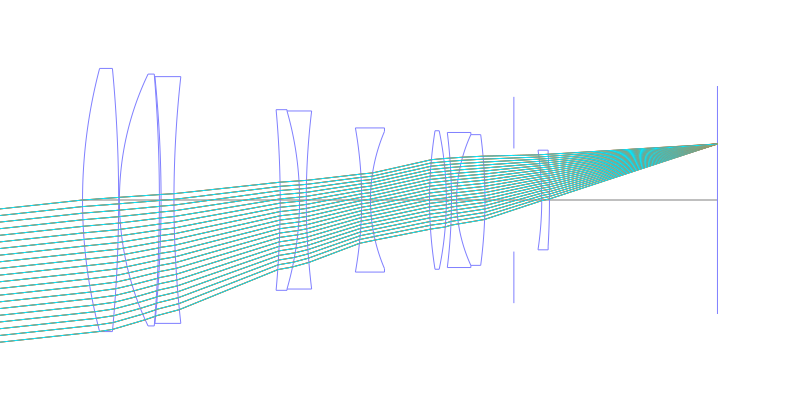
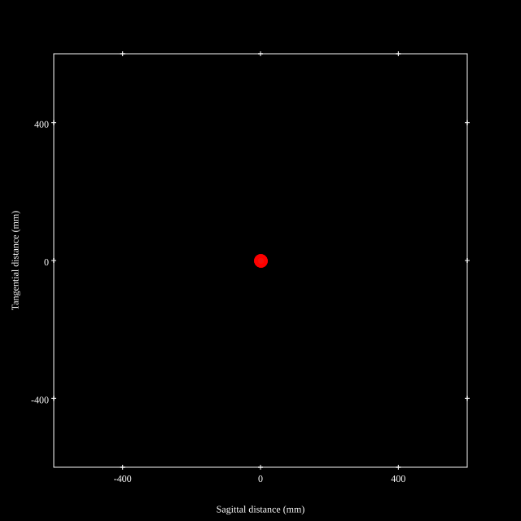
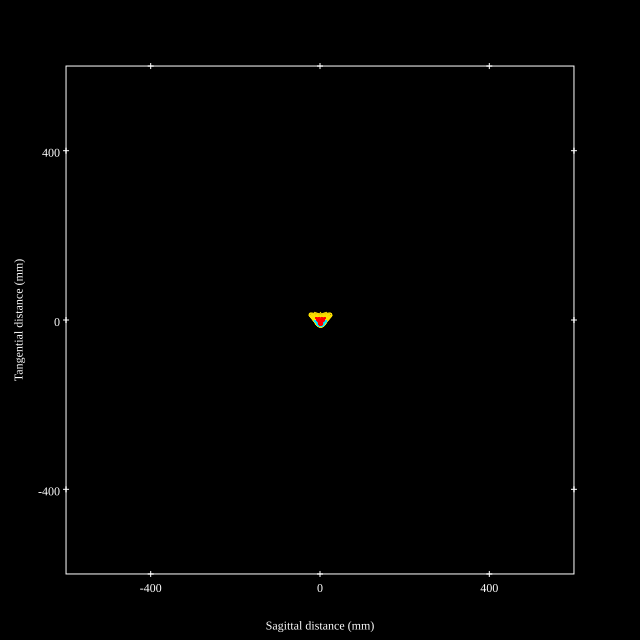
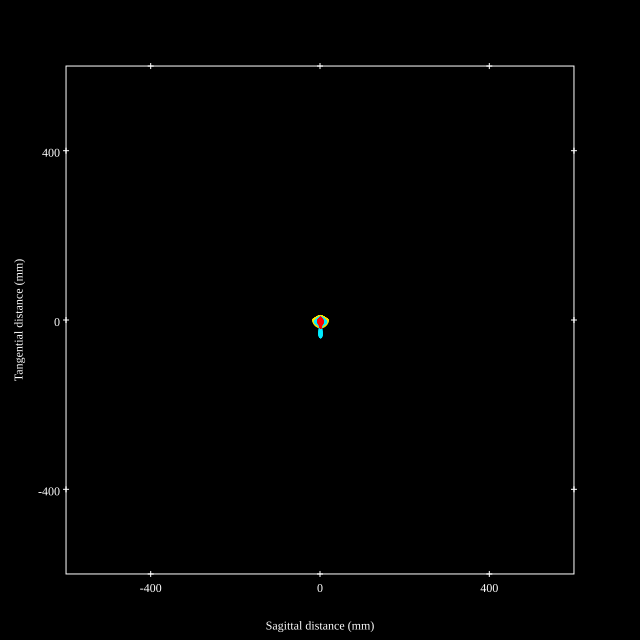
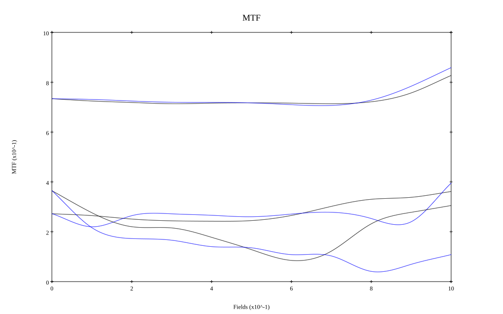
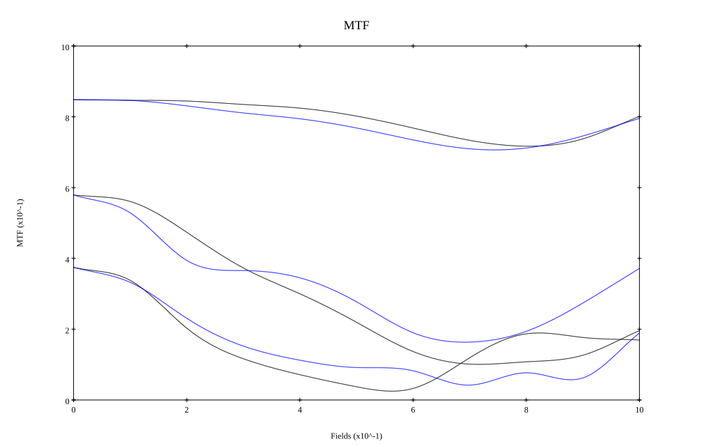

# Ai Nikkor ED-IF 200mm F2S
## Patent Information
| Country | Patent Number | Example | Year of Application | Inventors | Organisation | Link |
| ---     | ---           | ---     | ---                 | ---       | ---          | ---  |
|US | US4176913 | 2 | 1977 | Soichi Nakamura,Kiyoshi Hayashi | Nippon Kogaku KK | [link](https://patents.google.com/patent/US4176913A/en) |
## Surface Data
Note that where glass types are shown the refractive index and abbe number is as per assigned glass type

| ID  | Radius | Thickness | Diameter | nd  | vd  | Glass Make | Glass |
| --- | ---    | ---       | ---      | --- | --- | ---        | ---   |
| 1 | 200.0 | 14.0 | 102.05 | 1.49782 | 82.57 | Hikari | J-FKH1 |
| 2 | -540.0 | 0.3 | 102.05 |  |  |  |
| 3 | 112.869 | 15.5 | 97.66 | 1.49782 | 82.57 | Hikari | J-FKH1 |
| 4 | -600.0 | 0.4365 | 97.66 |  |  |  |
| 5 | -480.0 | 5.0 | 95.69 | 1.7552 | 27.51 | Hikari | E-SF4 |
| 6 | 431.735 | 42.609 | 95.69 |  |  |  |
| 7 | -386.0 | 7.5 | 70.05 | 1.79504 | 28.54 | Hikari | E-LAF9 |
| 8 | -125.0 | 2.6 | 69.05 | 1.4645 | 65.77 | Hoya | FC3 |
| 9 | 286.185 | 20.1732 | 69.05 |  |  |  |
| 10 | -161.181 | 3.4 | 55.9 | 1.4645 | 65.77 | Hoya | FC3 |
| 11 | 67.815 | 22.727 | 53.21 |  |  |  |
| 12 | 171.0 | 6.5 | 53.71 | 1.6935 | 53.2 | Hikari | J-LAK13 |
| 13 | -131.975 | 2.0 | 53.71 |  |  |  |
| 14 | -213.0 | 2.0 | 52.37 | 1.59355 | 35.51 | Schott | TIFN5 |
| 15 | 61.0 | 11.0 | 50.69 | 1.6968 | 55.52 | Hikari | J-LAK14 |
| 16 | -193.237 | 5.637 | 50.69 |  |  |  |
| 17 | AS | 17.0252 | 39.998 |  |  |  |
| 18 | -130.0 | 3.0 | 38.64 | 1.4645 | 65.77 | Hoya | FC3 |
| 19 | -311.705 | 64.142 | 35.74 |  |  |  |
## Layouts

## Spot Diagrams

## Paraxial Parameters
| parameter | value |
| ---       | ---   |
| effective_focal_length |200.018
| back_focal_length | 64.19
| optical_invariant | 4.917
| object_distance | 1.0E10
| image_distance | 64.19
| power | 0.005
| pp1_H | 83.535
| ppk_H' | -135.827
| ffl_F | -116.483
| fno | 2.195
| enp_dist_P | 366.757
| enp_radius | 45.559
| exp_dist_P' | -18.551
| exp_radius | 18.857
| m | -0
| red | -4.99955810094428E7
| n_obj | 1
| n_img | 1
| img_ht | 21.588
| obj_ang | 6.16
| obj_na | 0
| img_na | -0.222|
## Spot Analysis
| Field | Spot Mean Radius | Spot Max Radius |
| ---   | ---              | ---             |
 | Field(x=0.0, y=0.0) | 16.748 | 43.187|
 | Field(x=0.0, y=0.1) | 17.104 | 50.651|
 | Field(x=0.0, y=0.2) | 16.285 | 48.923|
 | Field(x=0.0, y=0.3) | 14.838 | 46.51|
 | Field(x=0.0, y=0.4) | 13.338 | 43.497|
 | Field(x=0.0, y=0.5) | 12.041 | 39.945|
 | Field(x=0.0, y=0.6) | 11.103 | 35.954|
 | Field(x=0.0, y=0.7) | 10.69 | 27.37|
 | Field(x=0.0, y=0.8) | 11.297 | 24.591|
 | Field(x=0.0, y=0.9) | 12.879 | 25.254|
 | Field(x=0.0, y=1.0) | 15.539 | 35.641|
## Polychromatic Geometric MTF

* 10,30,50 cycles/mm
* Black lines represent sagittal, blue tangential
* To generate above, MTFs for wavelengths 587.5618(d), 486.1327(F), 656.2725(C) were calculated across 10 fields, and then averaged
## Polychromatic Geometric MTF (Weighted)

* 10,30,50 cycles/mm
* Black lines represent sagittal, blue tangential
* To generate above, MTFs for wavelengths 587.5618(d) wt(1.0), 656.2725(C) wt(0.475), 546.074(e) wt(0.98), 486.1327(F) wt(0.49), 435.8343(g) wt(0.15) were calculated across 10 fields, and then combined using weighted average
## Resources
* [OpticalBench Compatible Data File, tab delimited](./prescription.txt)
* [Zemax file](./US004176913_Example02h.zmx)

Report / Zemax file generated using [Beam42](https://github.com/BeamFour/Beam42) on 2026-04-04
