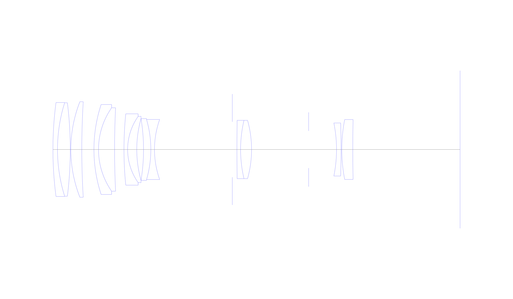
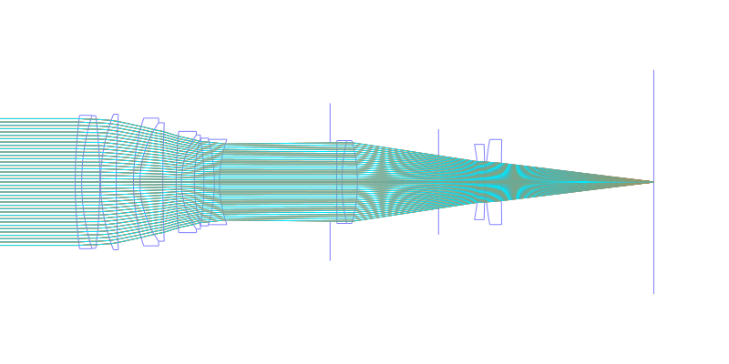
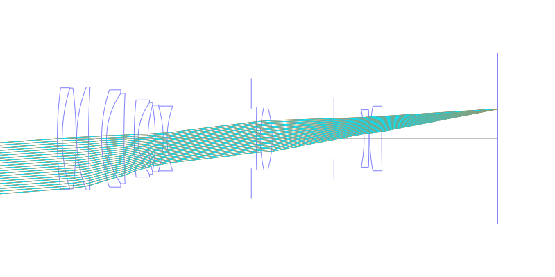
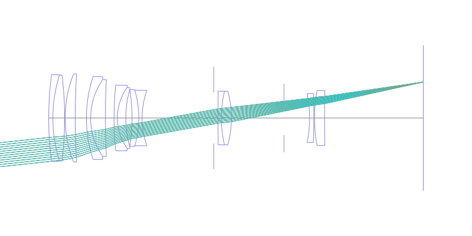
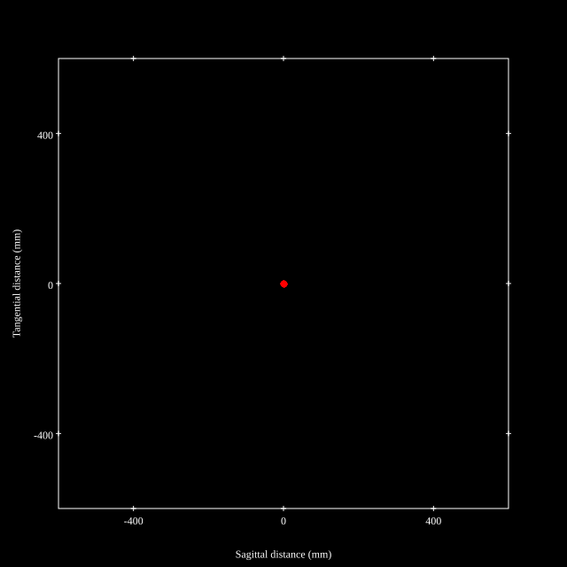
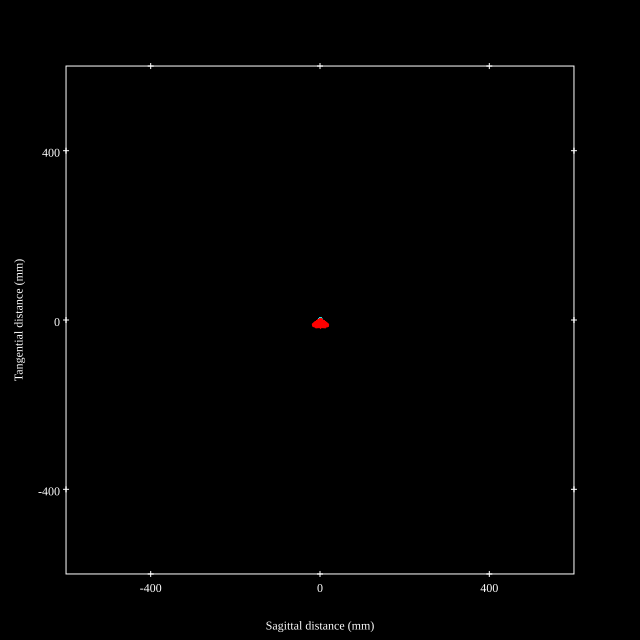
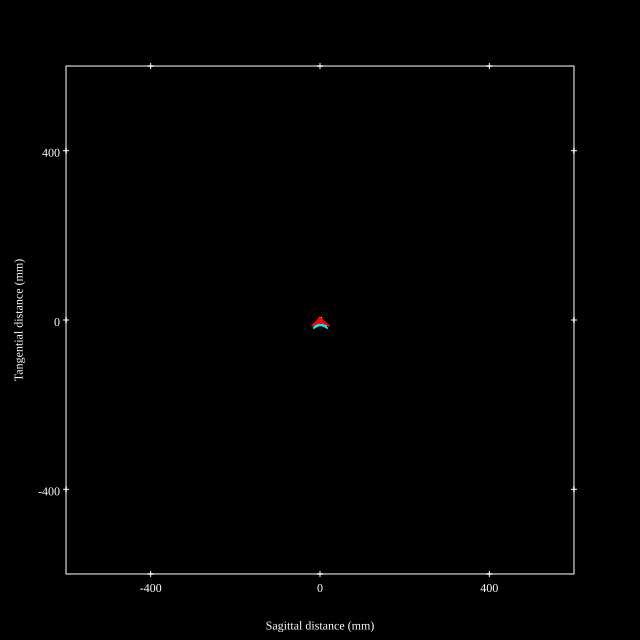
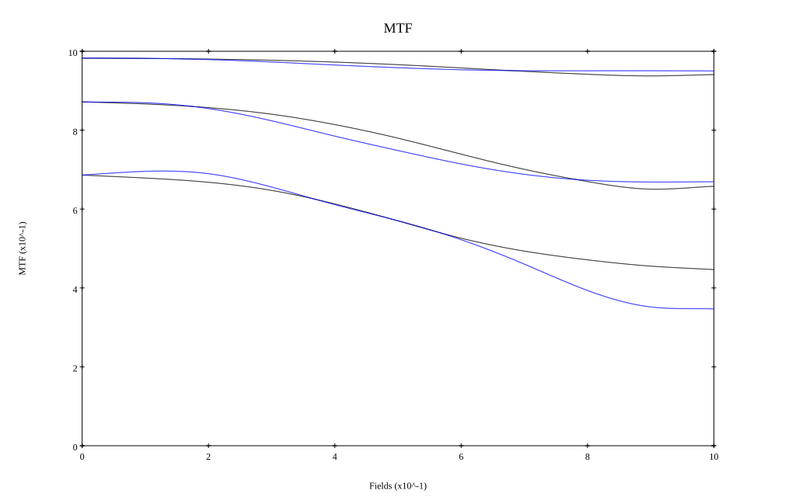
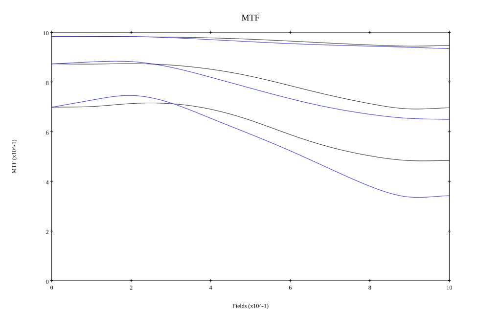

## Surface Data
Note that where glass types are shown the refractive index and abbe number is as per assigned glass type

| ID  | Radius | Thickness | Diameter | nd  | vd  | Glass Make | Glass |
| --- | ---    | ---       | ---      | --- | --- | ---        | ---   |
| 1 | 197.7383 | 2.5 | 51.46 | 1.80384 | 33.89 | Hikari | E-LAFH2 |
| 2 | 85.6098 | 7.0 | 51.15 | 1.49782 | 82.52 | Hikari | E-FKH1 |
| 3 | -206.2828 | 0.3 | 51.15 |  |  |  |
| 4 | 71.6067 | 6.0 | 52.3 | 1.49782 | 82.52 | Hikari | E-FKH1 |
| 5 | 431.0537 | 6.6433 | 52.3 |  |  |  |
| 6 | 79.0168 | 2.5 | 49.26 | 1.79631 | 40.9 |  |
| 7 | 39.9554 | 8.8 | 45.69 | 1.60311 | 60.67 | Hikari | E-SK14 |
| 8 | 478.742 | 5.14048 | 45.69 |  |  |  |
| 9 | 196.4322 | 2.0 | 39.05 | 1.6228 | 57.04 | Hikari | E-SK10 |
| 10 | 31.4573 | 5.0 | 36.3 | 1.80384 | 33.89 | Hikari | E-LAFH2 |
| 11 | 62.3432 | 3.7 | 33.81 |  |  |  |
| 12 | -105.6139 | 4.0 | 33.81 | 1.80518 | 25.43 | Hikari | E-SF6 |
| 13 | -58.945 | 2.0 | 32.89 | 1.62041 | 60.29 | Hikari | E-SK16 |
| 14 | 49.1628 | 42.57496 | 32.89 |  |  |  |
| 15 | AS | 2.55 | 30.378 |  |  |  |
| 16 | 1206.1834 | 2.0 | 31.93 | 1.68893 | 31.07 | Hikari | E-SF8 |
| 17 | 69.6055 | 6.0 | 31.93 | 1.62041 | 60.29 | Hikari | E-SK16 |
| 18 | -59.1728 | 31.24 | 31.93 |  |  |  |
| 19 | FS | 15.26 | 20.35 |  |  |  |
| 20 | -72.7684 | 2.5 | 29.05 | 1.7725 | 49.61 | Hikari | E-LASF016 |
| 21 | -436.142 | 0.4 | 29.05 |  |  |  |
| 22 | 86.7935 | 6.0 | 32.81 | 1.54814 | 45.79 | Hikari | E-LLF1 |
| 23 | 799.3797 | 58.72 | 32.81 |  |  |  |
## Layouts

## Spot Diagrams

## Paraxial Parameters
| parameter | value |
| ---       | ---   |
| effective_focal_length |199.875
| back_focal_length | 58.723
| optical_invariant | 2.632
| object_distance | 1.0E10
| image_distance | 58.723
| power | 0.005
| pp1_H | 24.952
| ppk_H' | -141.152
| ffl_F | -174.923
| fno | 4.067
| enp_dist_P | 181.842
| enp_radius | 24.57
| exp_dist_P' | -53.253
| exp_radius | 13.765
| m | -0
| red | -5.003125104459117E7
| n_obj | 1
| n_img | 1
| img_ht | 21.413
| obj_ang | 6.115
| obj_na | 0
| img_na | -0.122|
## Spot Analysis
| Field | Spot Mean Radius | Spot Max Radius |
| ---   | ---              | ---             |
 | Field(x=0.0, y=0.0) | 3.839 | 7.076|
 | Field(x=0.0, y=0.1) | 3.997 | 9.527|
 | Field(x=0.0, y=0.2) | 4.207 | 13.366|
 | Field(x=0.0, y=0.3) | 4.662 | 16.936|
 | Field(x=0.0, y=0.4) | 5.284 | 19.524|
 | Field(x=0.0, y=0.5) | 5.826 | 20.823|
 | Field(x=0.0, y=0.6) | 6.336 | 21.024|
 | Field(x=0.0, y=0.7) | 6.877 | 21.821|
 | Field(x=0.0, y=0.8) | 7.104 | 22.941|
 | Field(x=0.0, y=0.9) | 7.307 | 24.271|
 | Field(x=0.0, y=1.0) | 7.408 | 24.056|
## Polychromatic Geometric MTF

* 10,30,50 cycles/mm
* Black lines represent sagittal, blue tangential
* To generate above, MTFs for wavelengths 587.5618(d), 486.1327(F), 656.2725(C) were calculated across 10 fields, and then averaged
## Polychromatic Geometric MTF (Weighted)

* 10,30,50 cycles/mm
* Black lines represent sagittal, blue tangential
* To generate above, MTFs for wavelengths 587.5618(d) wt(1.0), 656.2725(C) wt(0.475), 546.074(e) wt(0.98), 486.1327(F) wt(0.49), 435.8343(g) wt(0.15) were calculated across 10 fields, and then combined using weighted average
## Resources
* [OpticalBench Compatible Data File, tab delimited](./prescription.txt)
* [Zemax file](./nikkor-200mm-micro.zmx)

Report / Zemax file generated using [Beam42](https://github.com/BeamFour/Beam42) on 2026-05-02
