# AF Zoom-Nikkor 24-85mm f/2.8-4D IF
## Patent Information
| Country | Patent Number | Example | Year of Application | Inventors | Organisation | Link |
| ---     | ---           | ---     | ---                 | ---       | ---          | ---  |
|JP | JP 2000-321497 | 1 | 1999 | Haruo Sato | Nikon Corp | [link](https://patents.google.com/patent/JP2000321497A/en) |
## Surface Data
Note that where glass types are shown the refractive index and abbe number is as per assigned glass type

| ID  | Radius | Thickness | Diameter | nd  | vd  | Glass Make | Glass |
| --- | ---    | ---       | ---      | --- | --- | ---        | ---   |
| 1 | 843.3093 | 1.8 | 62.62 | 1.84666 | 23.78 | Hoya | FDS90 |
| 2 | 87.9723 | 7.6 | 60.06 | 1.755 | 52.32 | Hoya | TAC6 |
| 3 | -380.3274 | 0.1 | 60.06 |  |  |  |
| 4 | 49.2952 | 5.6 | 50.88 | 1.755 | 52.32 | Hoya | TAC6 |
| 5 | 129.2156 | d5 | 50.88 |  |  |  |
| 6 | -218.052 | 0.06 | 32.96 | 1.49521 | 56.34 |  |
| 7 | 250.0 | 1.8 | 32.96 | 1.83481 | 42.72 | Hoya | TAFD5F |
| 8 | 16.0593 | 6.1 | 23.03 |  |  |  |
| 9 | -55.2385 | 1.3 | 23.03 | 1.741 | 52.6 | Hoya | TAC2 |
| 10 | 44.7541 | 0.1 | 23.78 |  |  |  |
| 11 | 30.8107 | 7.3 | 21.86 | 1.74077 | 27.76 | Hoya | E-FD13 |
| 12 | -17.0142 | 1.3 | 21.86 | 1.804 | 46.58 | Ohara | LAH65 |
| 13 | -49.1793 | 2.6 | 21.86 |  |  |  |
| 14 | -21.979 | 1.0 | 19.52 | 1.7432 | 49.31 | Ohara | LAM60 |
| 15 | -53.5472 | d15 | 19.52 |  |  |  |
| 16 | AS | 1.0 | 19.281 |  |  |  |
| 17 | 63.2297 | 3.0 | 21.86 | 1.603 | 65.48 | Ohara | PHM53 |
| 18 | -108.6045 | 0.1 | 21.86 |  |  |  |
| 19 | 25.4589 | 7.5 | 22.94 | 1.603 | 65.48 | Ohara | PHM53 |
| 20 | -21.8926 | 1.6 | 22.94 | 1.834 | 37.17 | Ohara | LAH60 |
| 21 | 272.4567 | d21 | 22.94 |  |  |  |
| 22 | 36.6954 | 6.4 | 22.72 | 1.7432 | 49.31 | Ohara | LAM60 |
| 23 | -36.6954 | 0.2 | 22.72 |  |  |  |
| 24 | 125.3016 | 1.8 | 19.1 | 1.744429 | 49.52 |  |
| 25 | 34.5095 | 2.0 | 19.1 |  |  |  |
| 26 | -77.7006 | 1.5 | 21.86 | 1.834 | 37.17 | Ohara | LAH60 |
| 27 | 17.2707 | 6.4 | 21.86 | 1.6172 | 53.95 | Hoya | BACED1 |
| 28 | -46.0881 | d28 | 21.86 |  |  |  |
## Aspherical Data
| ID  | Type | k   | P1 | P2 | P3 | P4 | P5 | P6 | P7 | P8 | P9 | P10 | P11 | P12 | P13 | P14 |
| --- | --- | --- | --- | --- | --- | --- | --- | --- | --- | --- | --- | --- | --- | --- | --- | --- |
| 6| RADIAL | 100.0 | 0.0 | 0.0 | -1.3978E-5 | 2.5777E-5 | 0.0 | -5.9863E-8 | 0.0 | 1.7443E-10 | 0.0 | -3.1895E-14 | 0.0 | -1.6029E-15 | 0.0 | 3.4996E-18 |
| 24| RADIAL | -16.7909 | 0.0 | 0.0 | -5.9892E-6 | -3.0023E-5 | 2.2049E-8 | -5.712E-8 | 0.0 | -3.8454E-10 | 0.0 | 7.1889E-12 | 0.0 | -3.6321E-14 | 0  | 0  |
## Variables
| Variable | 24mm f2.8 | 85mm f4.0 |
| --- | --- | --- |
| Focal length |24.7 |82.5 |
| F-Number |2.79 |4.12 |
| Angle of View |84.7 |28.4 |
| d5 | 2.47033 | 29.30687 |
| d15 | 12.21507 | 0.86585 |
| d21 | 5.32672 | 0.79966 |
| d28 | 37.8484 | 66.6403 |
# 24mm f2.8
## Layouts
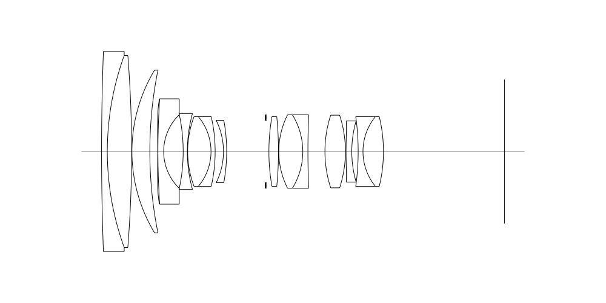
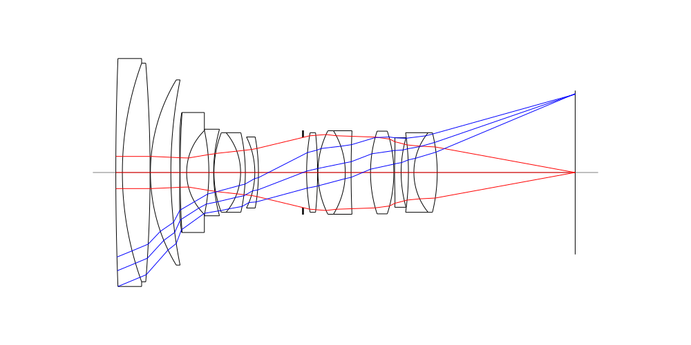
## Spot Diagrams
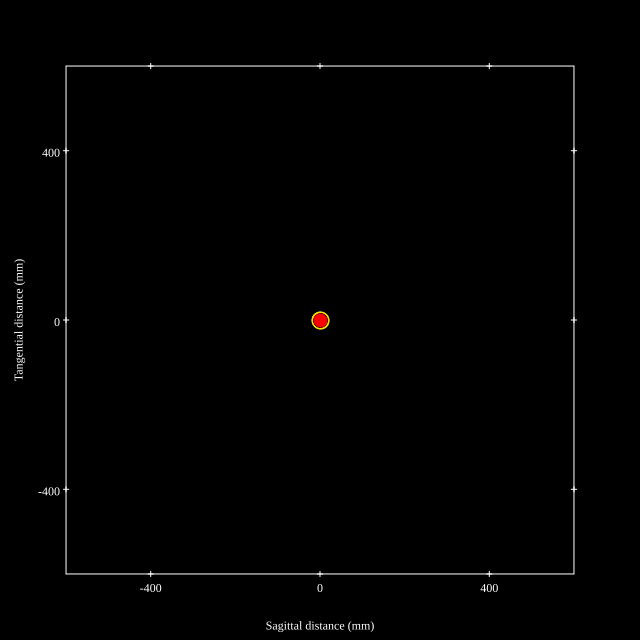
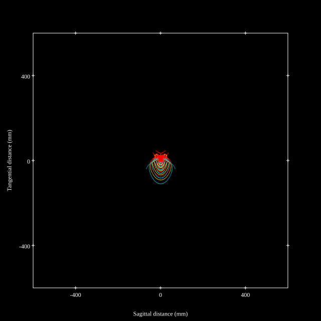
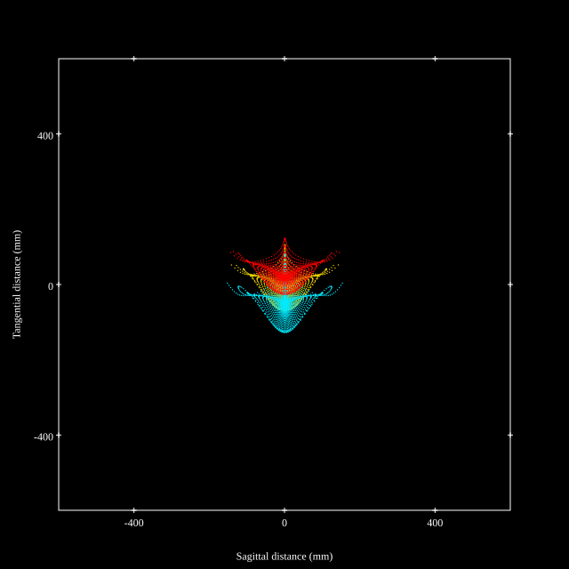
## Paraxial Parameters
| parameter | value |
| ---       | ---   |
| effective_focal_length |24.692
| back_focal_length | 37.989
| optical_invariant | 4.034
| object_distance | 1.0E10
| image_distance | 37.989
| power | 0.04
| pp1_H | 43.612
| ppk_H' | 13.297
| ffl_F | 18.92
| fno | 2.79
| enp_dist_P | 28.011
| enp_radius | 4.425
| exp_dist_P' | -28.943
| exp_radius | 12.02
| m | -0
| red | -4.049856970499956E8
| n_obj | 1
| n_img | 1
| img_ht | 22.508
| obj_ang | 42.35
| obj_na | 0
| img_na | -0.179|
## Spot Analysis
| Field | Spot Mean Radius (µm) | Spot Max Radius (µm) |
| ---   | ---              | ---             |
 | Field(x=0.0, y=0.0) | 5.538 | 19.518|
 | Field(x=0.0, y=0.1) | 6.872 | 36.612|
 | Field(x=0.0, y=0.2) | 9.995 | 41.973|
 | Field(x=0.0, y=0.3) | 12.162 | 52.263|
 | Field(x=0.0, y=0.4) | 14.173 | 68.305|
 | Field(x=0.0, y=0.5) | 16.969 | 83.945|
 | Field(x=0.0, y=0.6) | 20.205 | 99.853|
 | Field(x=0.0, y=0.7) | 24.556 | 119.938|
 | Field(x=0.0, y=0.8) | 28.187 | 114.665|
 | Field(x=0.0, y=0.9) | 36.024 | 118.566|
 | Field(x=0.0, y=1.0) | 62.043 | 176.161|
## Polychromatic Geometric MTF
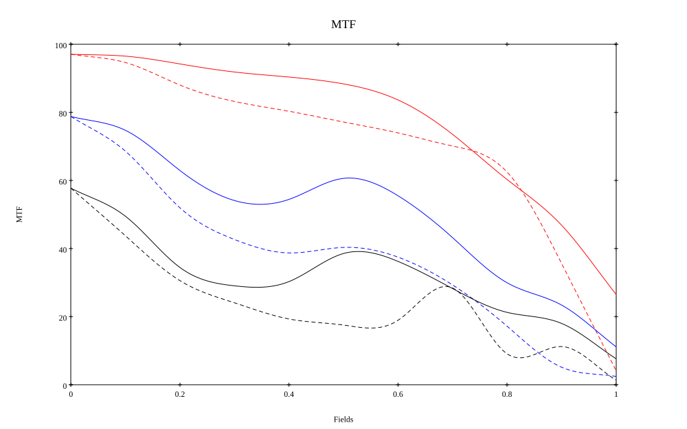
* 10=red,30=blue,50=black cycles/mm
* Solid lines represent sagittal, dashed lines tangential
* To generate above, MTFs for wavelengths 587.5618(d), 486.1327(F), 656.2725(C) were calculated across 10 fields, and then averaged
## Polychromatic Geometric MTF (Weighted)
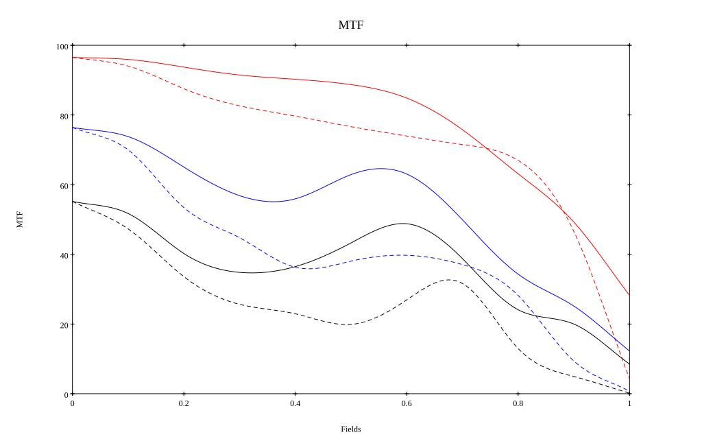
* 10=red,30=blue,50=black cycles/mm
* Solid lines represent sagittal, dashed lines tangential
* To generate above, MTFs for wavelengths 587.5618(d) wt(1.0), 656.2725(C) wt(0.475), 546.074(e) wt(0.98), 486.1327(F) wt(0.49), 435.8343(g) wt(0.15) were calculated across 10 fields, and then combined using weighted average
# 85mm f4.0
## Layouts
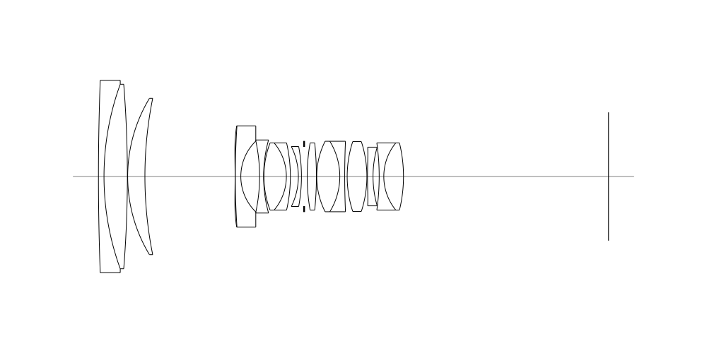
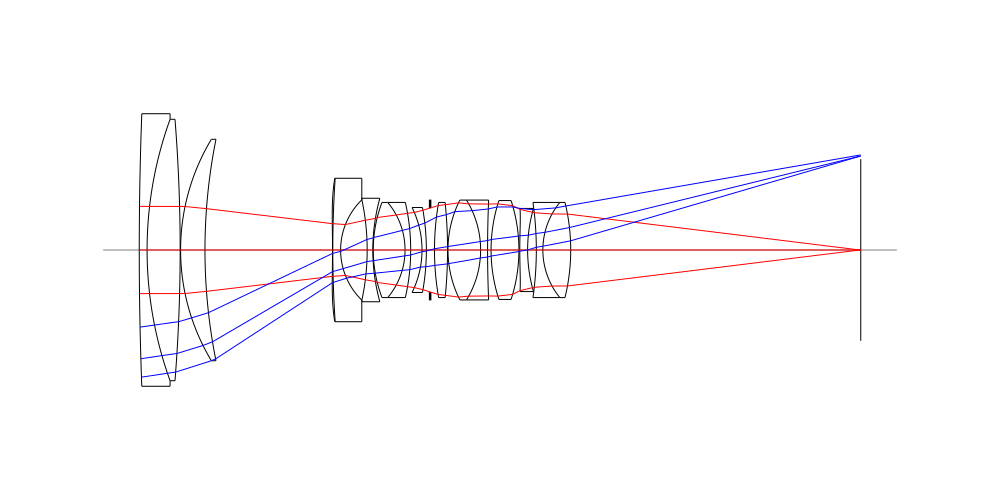
## Spot Diagrams
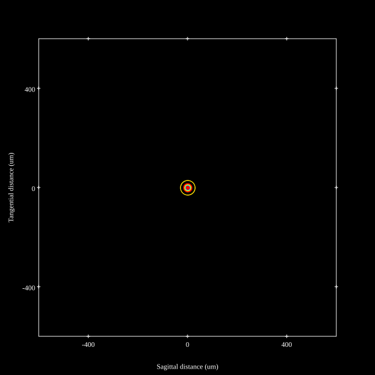
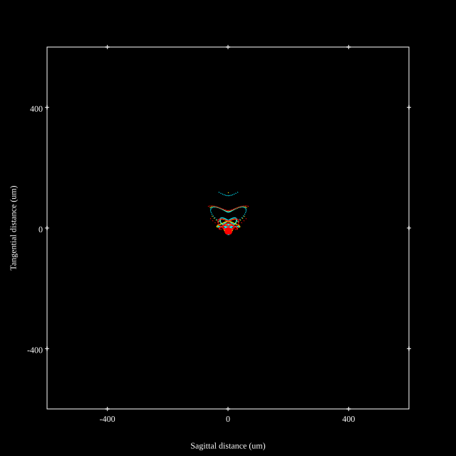
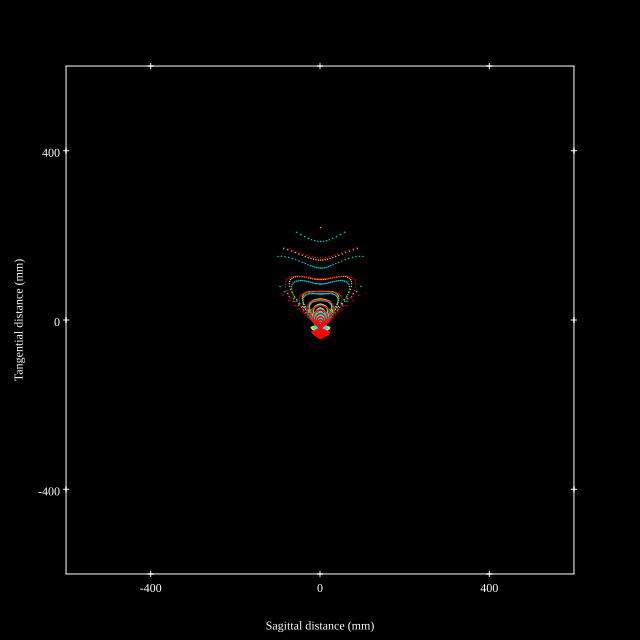
## Paraxial Parameters
| parameter | value |
| ---       | ---   |
| effective_focal_length |82.501
| back_focal_length | 66.74
| optical_invariant | 2.537
| object_distance | 1.0E10
| image_distance | 66.74
| power | 0.012
| pp1_H | 98.917
| ppk_H' | -15.76
| ffl_F | 16.416
| fno | 4.114
| enp_dist_P | 92.82
| enp_radius | 10.026
| exp_dist_P' | -22.243
| exp_radius | 10.826
| m | -0
| red | -1.2121093874714519E8
| n_obj | 1
| n_img | 1
| img_ht | 20.876
| obj_ang | 14.2
| obj_na | 0
| img_na | -0.122|
## Spot Analysis
| Field | Spot Mean Radius (µm) | Spot Max Radius (µm) |
| ---   | ---              | ---             |
 | Field(x=0.0, y=0.0) | 6.876 | 29.352|
 | Field(x=0.0, y=0.1) | 6.682 | 39.383|
 | Field(x=0.0, y=0.2) | 7.419 | 38.64|
 | Field(x=0.0, y=0.3) | 9.014 | 50.828|
 | Field(x=0.0, y=0.4) | 10.824 | 69.857|
 | Field(x=0.0, y=0.5) | 13.089 | 87.266|
 | Field(x=0.0, y=0.6) | 15.521 | 104.682|
 | Field(x=0.0, y=0.7) | 19.032 | 123.018|
 | Field(x=0.0, y=0.8) | 23.973 | 146.751|
 | Field(x=0.0, y=0.9) | 32.136 | 176.818|
 | Field(x=0.0, y=1.0) | 43.881 | 218.683|
## Polychromatic Geometric MTF
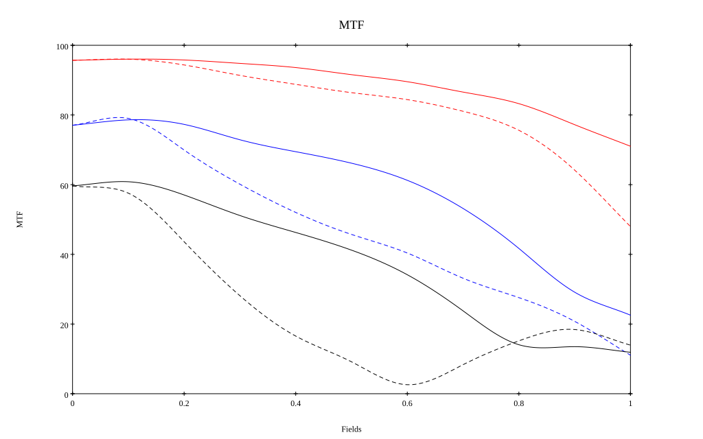
* 10=red,30=blue,50=black cycles/mm
* Solid lines represent sagittal, dashed lines tangential
* To generate above, MTFs for wavelengths 587.5618(d), 486.1327(F), 656.2725(C) were calculated across 10 fields, and then averaged
## Polychromatic Geometric MTF (Weighted)
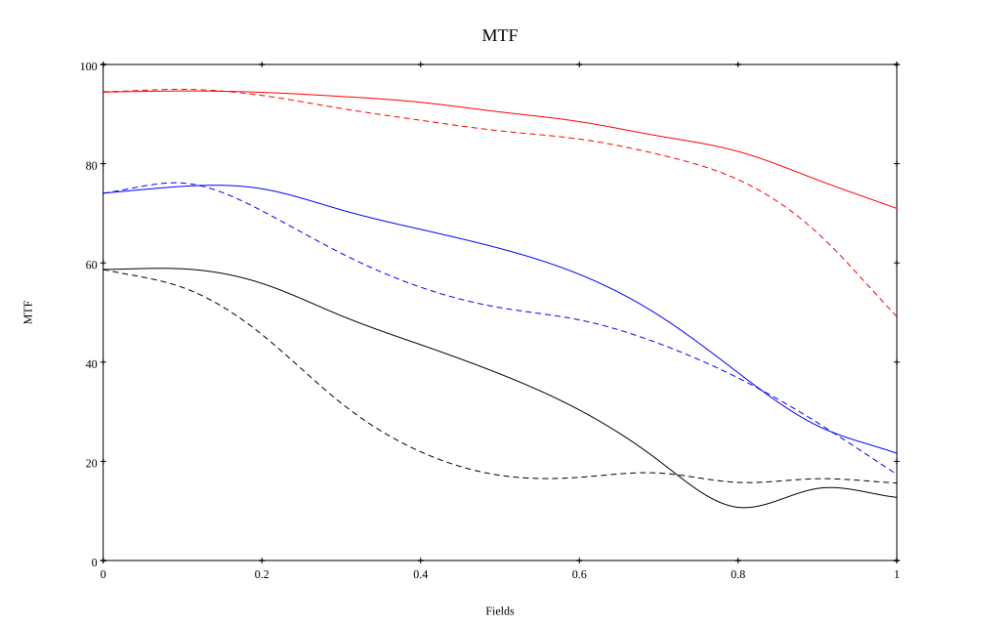
* 10=red,30=blue,50=black cycles/mm
* Solid lines represent sagittal, dashed lines tangential
* To generate above, MTFs for wavelengths 587.5618(d) wt(1.0), 656.2725(C) wt(0.475), 546.074(e) wt(0.98), 486.1327(F) wt(0.49), 435.8343(g) wt(0.15) were calculated across 10 fields, and then combined using weighted average
## Resources
* [OpticalBench Compatible Data File, tab delimited](./prescription.txt)
* [Zemax file](./JP2000-321497_Example01P.zmx)

Generated from `JP2000-321497_Example01P.txt`, status **Accepted**

Report / Zemax file generated using [Beam42](https://github.com/BeamFour/Beam42) on 2026-10-01
