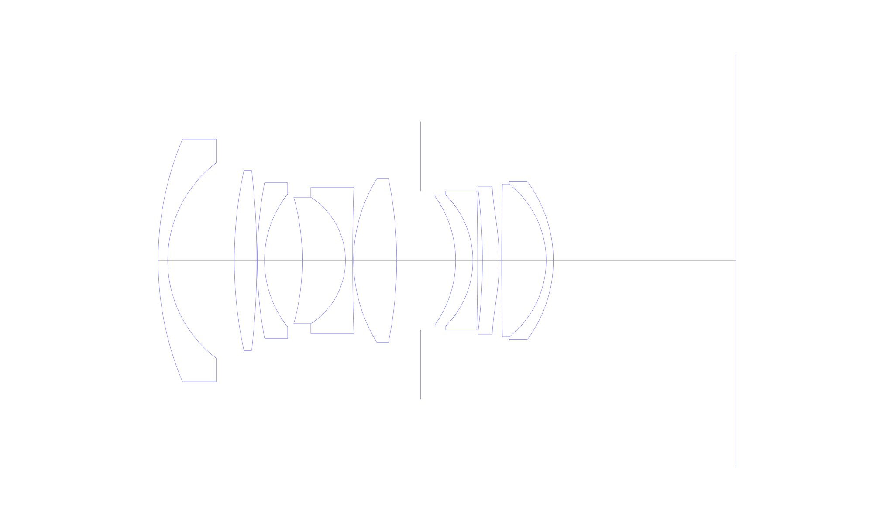
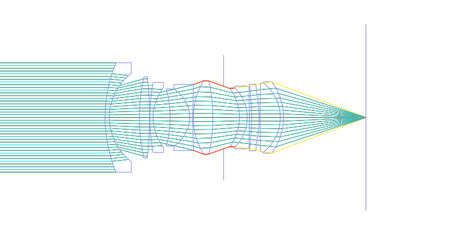
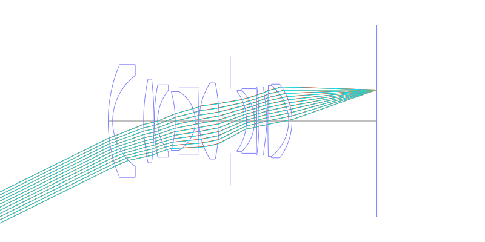
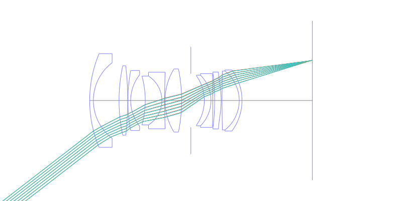
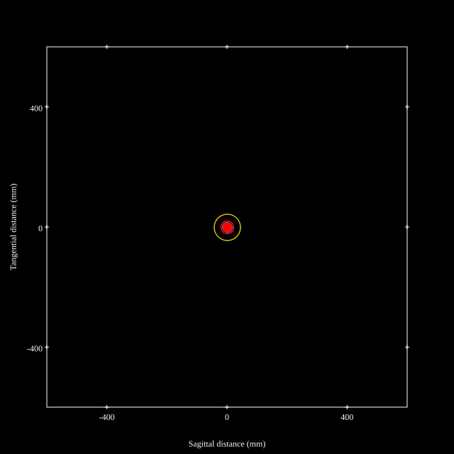
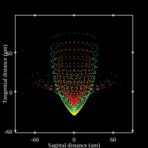
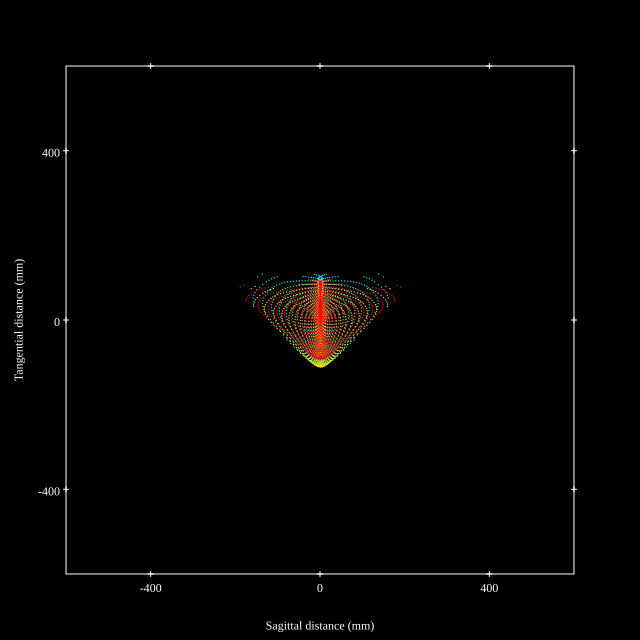
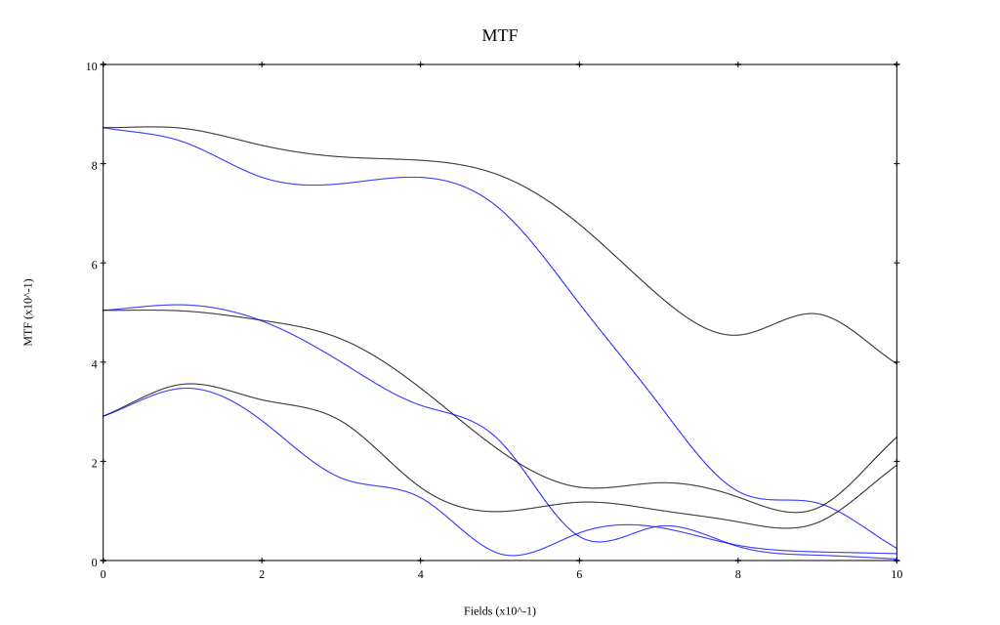

# AI Nikkor 28mm f/1.4D (reoptimized)
## Patent Information
| Country | Patent Number | Example | Year of Application | Inventors | Organisation | Link |
| ---     | ---           | ---     | ---                 | ---       | ---          | ---  |
|US | US 5315441 | EX 1 | 1992 |     Kenji Hori, Wataru Tatsuno | Nikon Corp | [link](https://patents.google.com/patent/US5315441A/en) |
## Surface Data
Note that where glass types are shown the refractive index and abbe number is as per assigned glass type

| ID  | Radius | Thickness | Diameter | nd  | vd  | Glass Make | Glass |
| --- | ---    | ---       | ---      | --- | --- | ---        | ---   |
| 1 | 65.71 | 2.0 | 50.72 | 1.5168 | 64.13 | Hikari | J-BK7A |
| 2 | 25.638 | 13.9 | 40.88 |  |  |  |
| 3 | 89.028 | 4.7 | 37.62 | 1.7725 | 49.6 | Ohara | S-LAH66 |
| 4 | -164.4 | 0.1 | 37.62 |  |  |  |
| 5 | 87.68 | 1.5 | 32.5 | 1.48749 | 70.32 | Hikari | J-FK5 |
| 6 | 22.342 | 7.9 | 27.77 |  |  |  |
| 7 | -49.754 | 9.0 | 26.43 | 1.5186 | 69.89 | Hikari | J-PKH1 |
| 8 | -15.69 | 1.5 | 26.43 | 1.51454 | 54.63 | Hoya | CF3 |
| 9 | 462.516 | 0.2 | 30.61 |  |  |  |
| 10 | 32.54 | 9.0 | 34.24 | 1.804 | 46.6 | Hikari | J-LASF015 |
| 11 | -85.906 | 5.0 | 34.24 |  |  |  |
| 12 | AS | 7.3 | 29.0 |  |  |  |
| 13 | -23.034 | 3.6 | 26.8 | 1.7481 | 52.3 | Hikari | E-LAKH1 |
| 14 | -19.368 | 1.0 | 27.39 | 1.7552 | 27.51 | Hikari | E-SF4 |
| 15 | -568.338 | 1.0 | 29.07 |  |  |  |
| 16 | -122.101 | 3.5 | 30.8 | 1.7725 | 49.6 | Ohara | S-LAH66 |
| 17 | -47.4685 | 0.5 | 30.8 |  |  |  |
| 18 | 722.996 | 9.3 | 31.91 | 1.804 | 46.6 | Hikari | J-LASF015 |
| 19 | -20.3296 | 1.5 | 31.91 | 1.86074 | 23.08 | Hikari | J-SFH2 |
| 20 | -27.783 | 38.1031 | 33.08 |  |  |  |
## Aspherical Data
| ID  | k   | P1  | P2  | P3  | P3 | P5 | P6 | P7 | P8 | P9 | P10 |
| --- | --- | --- | --- | --- | --- | --- | --- | --- | --- | --- | --- |
| 17 | 0.2118473 | 0.0 | 1.6604838E-5 | 1.467171E-8 | 1.566542E-11 | -6.2829582E-14 | 0.0 | 0.0 | 0.0 | 0.0 | 0.0 |
## Layouts

## Spot Diagrams

## Paraxial Parameters
| parameter | value |
| ---       | ---   |
| effective_focal_length |28.599
| back_focal_length | 38.09
| optical_invariant | 7.834
| object_distance | 1.0E10
| image_distance | 38.09
| power | 0.035
| pp1_H | 49.341
| ppk_H' | 9.491
| ffl_F | 20.742
| fno | 1.41
| enp_dist_P | 30.356
| enp_radius | 10.142
| exp_dist_P' | -47
| exp_radius | 30.169
| m | -0
| red | -3.496596159765343E8
| n_obj | 1
| n_img | 1
| img_ht | 22.092
| obj_ang | 37.685
| obj_na | 0
| img_na | -0.334|
## Spot Analysis
| Field | Spot Mean Radius | Spot Max Radius |
| ---   | ---              | ---             |
 | Field(x=0.0, y=0.0) | 11.782 | 43.73|
 | Field(x=0.0, y=0.1) | 11.99 | 73.431|
 | Field(x=0.0, y=0.2) | 14.825 | 71.796|
 | Field(x=0.0, y=0.3) | 16.104 | 73.183|
 | Field(x=0.0, y=0.4) | 15.345 | 57.154|
 | Field(x=0.0, y=0.5) | 17.143 | 66.898|
 | Field(x=0.0, y=0.6) | 23.338 | 75.698|
 | Field(x=0.0, y=0.7) | 31.741 | 91.594|
 | Field(x=0.0, y=0.8) | 41.347 | 107.935|
 | Field(x=0.0, y=0.9) | 54.322 | 147.423|
 | Field(x=0.0, y=1.0) | 72.989 | 205.441|
## Geometric MTF

* 10,30,50 cycles/mm
* Black lines represent sagittal, blue tangential
## Resources
* [OpticalBench Compatible Data File, tab delimited](./US005315441_Example01_a.txt)
* [Zemax file](./US005315441_Example01_a.zmx)
