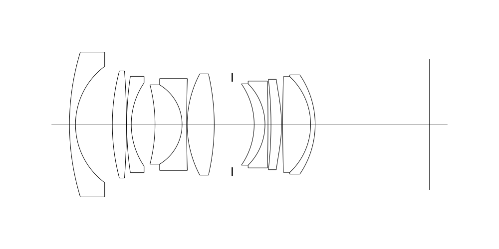
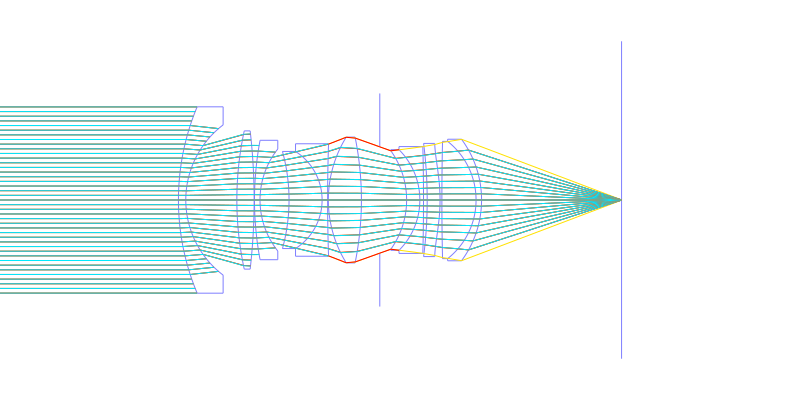
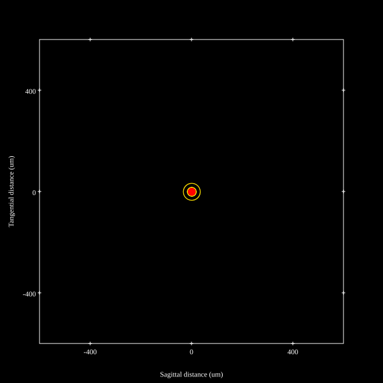
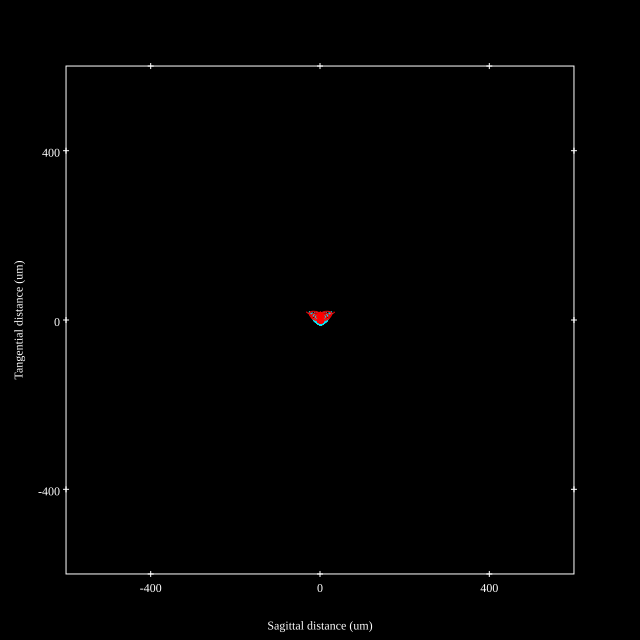
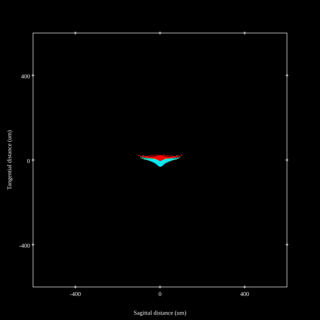
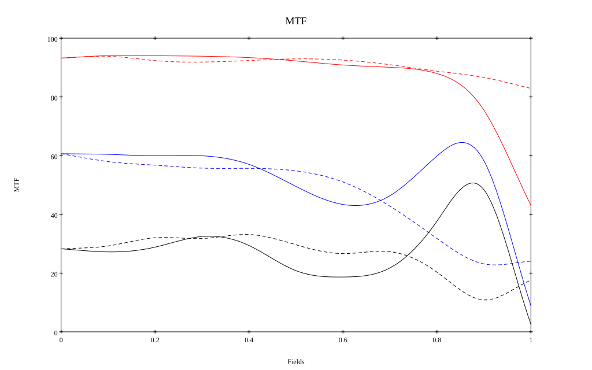
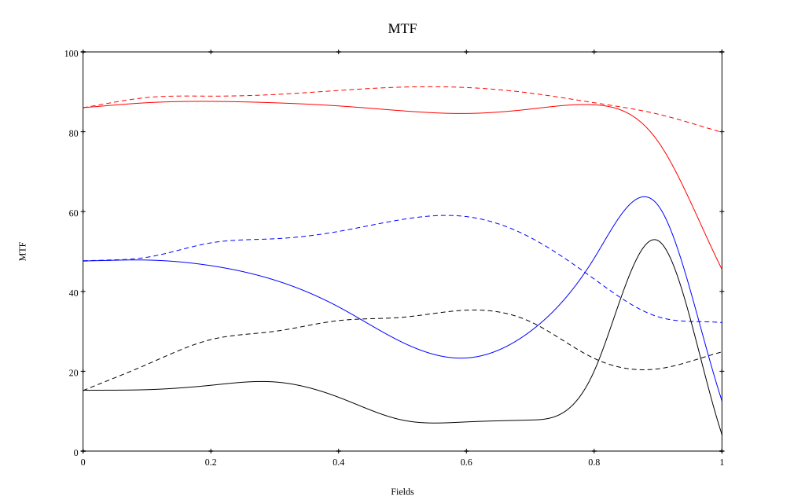

# AF Nikkor 28mm f/1.4D (reoptimized)
## Patent Information
| Country | Patent Number | Example | Year of Application | Inventors | Organisation | Link |
| ---     | ---           | ---     | ---                 | ---       | ---          | ---  |
|US | US 5315441 | EX 1 | 1992 |     Kenji Hori, Wataru Tatsuno | Nikon Corp | [link](https://patents.google.com/patent/US5315441A/en) |
## Surface Data
Note that where glass types are shown the refractive index and abbe number is as per assigned glass type

| ID  | Radius | Thickness | Diameter | nd  | vd  | Glass Make | Glass |
| --- | ---    | ---       | ---      | --- | --- | ---        | ---   |
| 1 | 82.63517531960835 | 2.0 | 48.2742 | 1.5168 | 64.13 | Hikari | J-BK7A |
| 2 | 24.204797992319328 | 12.254903809251145 | 38.7527 |  |  |  |
| 3 | 69.21476192280981 | 4.7 | 35.6984 | 1.7725 | 49.6 | Ohara | S-LAH66 |
| 4 | -243.23660814323205 | 0.1 | 34.6818 |  |  |  |
| 5 | 108.07104440006708 | 1.5 | 32.0946 | 1.48749 | 70.32 | Hikari | J-FK5 |
| 6 | 24.74364680054297 | 7.9 | 27.77 |  |  |  |
| 7 | -52.93680083863421 | 9.0 | 26.43 | 1.5186 | 69.89 | Hikari | J-PKH1 |
| 8 | -15.422299773729979 | 1.5 | 26.43 | 1.51454 | 54.63 | Hoya | CF3 |
| 9 | 470.5636176670116 | 0.2 | 30.61 |  |  |  |
| 10 | 36.15211681639556 | 9.0 | 33.7507 | 1.804 | 46.6 | Hikari | J-LASF015 |
| 11 | -75.07305471862566 | 5.979309545745875 | 33.4182 |  |  |  |
| 12 | AS | 7.3 | 28.5627 |  |  |  |
| 13 | -23.72808199233523 | 3.6 | 26.5657 | 1.7481 | 52.3 | Hikari | E-LAKH1 |
| 14 | -19.18570142380522 | 1.0 | 27.1122 | 1.7552 | 27.51 | Hikari | E-SF4 |
| 15 | -582.1848717190395 | 1.0 | 28.9355 |  |  |  |
| 16 | -131.2571547762817 | 3.5 | 29.1275 | 1.7725 | 49.6 | Ohara | S-LAH66 |
| 17 | -45.555120137163506 | 0.3880903832686511 | 30.1308 |  |  |  |
| 18 | 518.9455596014849 | 9.3 | 31.3676 | 1.804 | 46.6 | Hikari | J-LASF015 |
| 19 | -21.790788571921425 | 1.5 | 31.91 | 1.86074 | 23.08 | Hikari | J-SFH2 |
| 20 | -29.37507453400208 | 38.04795663143935 | 33.08 |  |  |  |
## Aspherical Data
| ID  | Type | k   | P1 | P2 | P3 | P4 | P5 |
| --- | --- | --- | --- | --- | --- | --- | --- |
| 17| EVEN | 1.1830916900355857 | 0.0 | 1.4371946108098548E-5 | 1.6484135054869875E-8 | 9.882403068591018E-12 | -3.98142849844217E-14 |
## Layouts

## Spot Diagrams

## Paraxial Parameters
| parameter | value |
| ---       | ---   |
| effective_focal_length |28.271
| back_focal_length | 38.199
| optical_invariant | 7.744
| object_distance | 1.0E10
| image_distance | 38.199
| power | 0.035
| pp1_H | 47.266
| ppk_H' | 9.928
| ffl_F | 18.995
| fno | 1.41
| enp_dist_P | 28.618
| enp_radius | 10.025
| exp_dist_P' | -44.702
| exp_radius | 29.451
| m | -0
| red | -3.5371923408024806E8
| n_obj | 1
| n_img | 1
| img_ht | 21.838
| obj_ang | 37.685
| obj_na | 0
| img_na | -0.355|
## Spot Analysis
| Field | Spot Mean Radius (µm) | Spot Max Radius (µm) |
| ---   | ---              | ---             |
 | Field(x=0.0, y=0.0) | 8.648 | 33.367|
 | Field(x=0.0, y=0.1) | 8.01 | 33.705|
 | Field(x=0.0, y=0.2) | 8.631 | 33.708|
 | Field(x=0.0, y=0.3) | 8.924 | 32.758|
 | Field(x=0.0, y=0.4) | 8.929 | 31.834|
 | Field(x=0.0, y=0.5) | 9.114 | 30.798|
 | Field(x=0.0, y=0.6) | 9.677 | 34.157|
 | Field(x=0.0, y=0.7) | 10.436 | 39.78|
 | Field(x=0.0, y=0.8) | 12.023 | 55.669|
 | Field(x=0.0, y=0.9) | 17.22 | 76.332|
 | Field(x=0.0, y=1.0) | 29.775 | 105.61|
## Polychromatic Geometric MTF

* 10=red,30=blue,50=black cycles/mm
* Solid lines represent sagittal, dashed lines tangential
* To generate above, MTFs for wavelengths 587.5618(d), 486.1327(F), 656.2725(C) were calculated across 10 fields, and then averaged
## Polychromatic Geometric MTF (Weighted)

* 10=red,30=blue,50=black cycles/mm
* Solid lines represent sagittal, dashed lines tangential
* To generate above, MTFs for wavelengths 587.5618(d) wt(1.0), 656.2725(C) wt(0.475), 546.074(e) wt(0.98), 486.1327(F) wt(0.49), 435.8343(g) wt(0.15) were calculated across 10 fields, and then combined using weighted average
## Resources
* [OpticalBench Compatible Data File, tab delimited](./prescription.txt)
* [Zemax file](./US005315441_Example01_optimized.zmx)

Generated from `US005315441_Example01_optimized.txt`, status **Candidate**

Report / Zemax file generated using [Beam42](https://github.com/BeamFour/Beam42) on 2026-10-09
