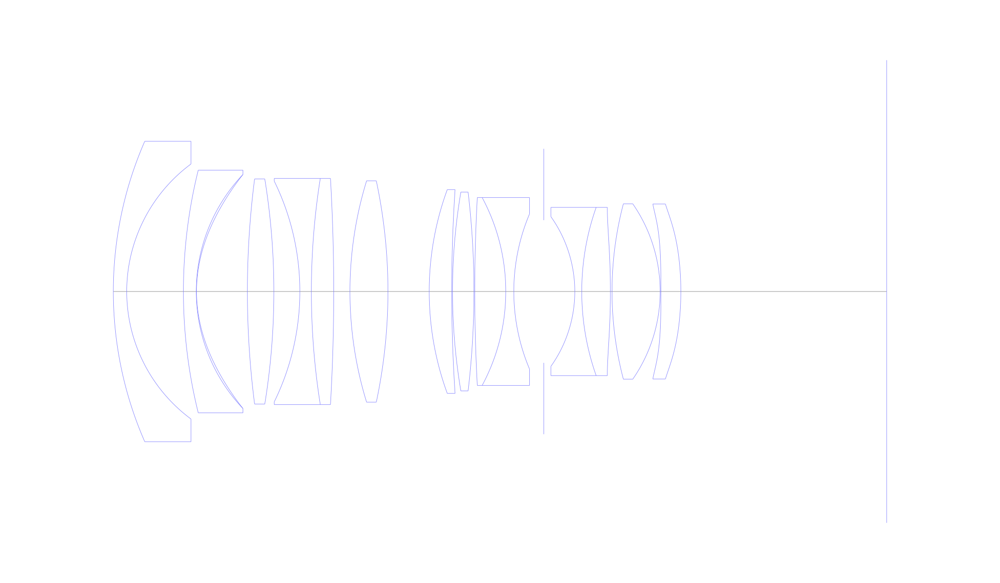
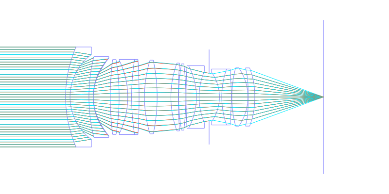
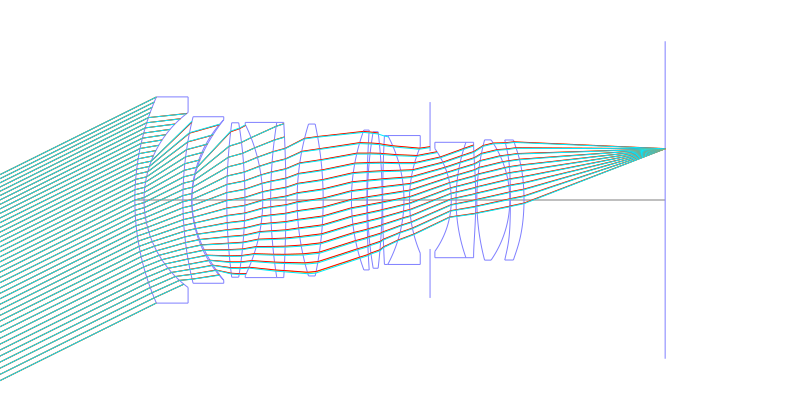
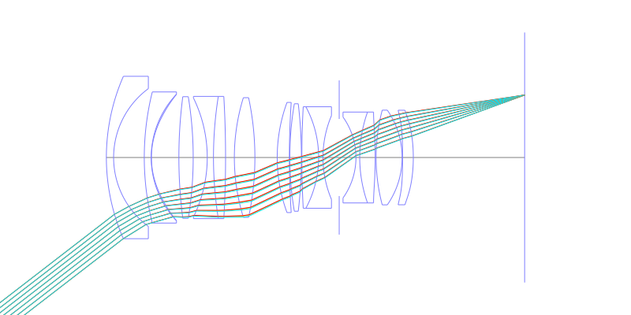
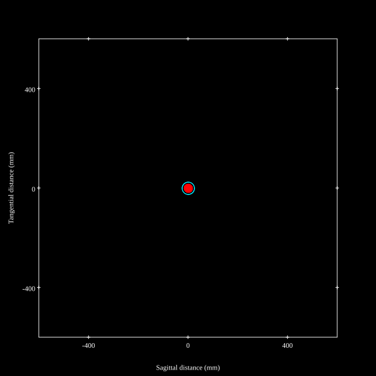
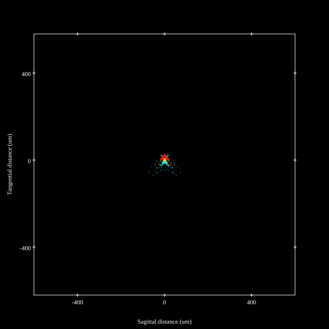
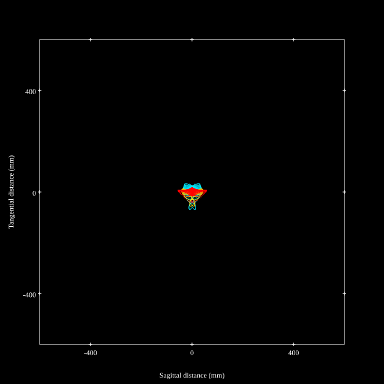
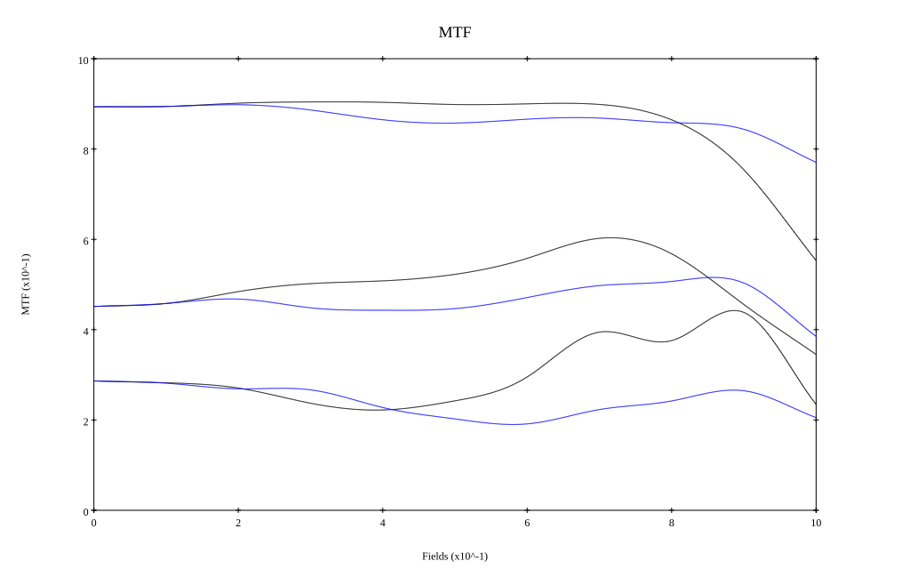

# AF-S Nikkor 28mm f/1.4E ED
## Patent Information
| Country | Patent Number | Example | Year of Application | Inventors | Organisation | Link |
| ---     | ---           | ---     | ---                 | ---       | ---          | ---  |
|JP | JP2017-227799 | EX 1 | 2016 |     FUKUDA YASUNARI, FURUTA AKIKO, TAKE TOSHINORI, SENSUI TAKAYUKI  | Nikon Corp / Konica Minolta | [link](https://patents.google.com/patent/JP2017227799A/en) |
## Surface Data
Note that where glass types are shown the refractive index and abbe number is as per assigned glass type

| ID  | Radius | Thickness | Diameter | nd  | vd  | Glass Make | Glass |
| --- | ---    | ---       | ---      | --- | --- | ---        | ---   |
| 1 | 70.017 | 2.5 | 56.12 | 1.68893 | 31.16 | Hikari | J-SF8 |
| 2 | 29.64 | 10.58 | 47.62 |  |  |  |
| 3 | 94.105 | 2.4 | 45.32 | 1.713 | 53.96 | Hikari | J-LAK8 |
| 4 | 31.773 | 0.05 | 43.72 | 1.5138 | 53.0 |  |
| 5 | 27.197 | 9.49 | 43.72 |  |  |  |
| 6 | 164.736 | 4.94 | 42.03 | 1.84666 | 23.8 | Hikari | J-SF03 |
| 7 | -131.025 | 4.85 | 42.03 |  |  |  |
| 8 | -46.832 | 2.15 | 41.19 | 1.56883 | 56.0 | Hikari | J-BAK4 |
| 9 | 134.737 | 4.17 | 42.24 | 1.883 | 40.66 | Hikari | J-LASF08 |
| 10 | -366.912 | 3.03 | 42.24 |  |  |  |
| 11 | 70.316 | 7.09 | 41.34 | 1.7725 | 49.62 | Hikari | J-LASF016 |
| 12 | -99.338 | 7.7 | 41.34 |  |  |  |
| 13 | 55.349 | 4.2 | 38.06 | 1.72916 | 54.61 | Hikari | J-LAK18 |
| 14 | 289.177 | 0.15 | 38.06 |  |  |  |
| 15 | 111.31 | 4.0 | 37.14 | 1.6968 | 55.52 | Hikari | J-LAK14 |
| 16 | -158.345 | 0.15 | 37.14 |  |  |  |
| 17 | 322.096 | 5.79 | 35.08 | 1.59282 | 68.62 | Hoya | FCD505 |
| 18 | -37.124 | 1.5 | 35.08 | 1.738 | 32.26 | Hikari | J-KZFH9 |
| 19 | 37.221 | 5.6 | 28.94 |  |  |  |
| 20 | AS | 5.78 | 26.647 |  |  |  |
| 21 | -24.127 | 1.3 | 27.96 | 1.8061 | 33.34 | Hikari | J-LASFH6 |
| 22 | 47.257 | 5.35 | 31.41 | 1.8322 | 40.1 | Ohara | L-LAH90 |
| 23 | -131.725 | 0.3 | 31.41 |  |  |  |
| 24 | 64.397 | 8.98 | 32.73 | 1.59282 | 68.62 | Hoya | FCD505 |
| 25 | -28.781 | 0.15 | 32.73 |  |  |  |
| 26 | -280.388 | 3.71 | 32.67 | 1.6935 | 53.2 | Hikari | J-LAK13 |
| 27 | -55.502 | 38.415 | 32.67 |  |  |  |
## Aspherical Data
| ID  | k   | P1  | P2  | P3  | P3 | P5 | P6 | P7 | P8 | P9 | P10 |
| --- | --- | --- | --- | --- | --- | --- | --- | --- | --- | --- | --- |
| 5 | -1.81201 | 0.0 | 5.0791E-6 | -6.20262E-9 | 1.15776E-11 | -2.04179E-14 | 1.909E-17 | 0.0 | 0.0 | 0.0 | 0.0 |
| 23 | 0.0 | 0.0 | 3.38686E-6 | -1.03975E-9 | 5.14761E-11 | 1.18111E-14 | -1.1141E-16 | 0.0 | 0.0 | 0.0 | 0.0 |
| 26 | 0.0 | 0.0 | -1.45264E-5 | -2.74974E-8 | 4.08509E-11 | -1.2205E-13 | 2.18038E-15 | -3.26E-18 | 0.0 | 0.0 | 0.0 |
| 27 | 1.61294 | 0.0 | -4.86948E-6 | -2.36249E-8 | 7.19463E-11 | -3.12054E-13 | 2.11838E-15 | -2.42E-18 | 0.0 | 0.0 | 0.0 |
## Layouts

## Spot Diagrams

## Paraxial Parameters
| parameter | value |
| ---       | ---   |
| effective_focal_length |28.41
| back_focal_length | 38.466
| optical_invariant | 7.574
| object_distance | 1.0E10
| image_distance | 38.466
| power | 0.035
| pp1_H | 51.478
| ppk_H' | 10.056
| ffl_F | 23.068
| fno | 1.45
| enp_dist_P | 34.026
| enp_radius | 9.797
| exp_dist_P' | -35.141
| exp_radius | 25.4
| m | -0
| red | -3.519900143742775E8
| n_obj | 1
| n_img | 1
| img_ht | 21.966
| obj_ang | 37.71
| obj_na | 0
| img_na | -0.326|
## Spot Analysis
| Field | Spot Mean Radius | Spot Max Radius |
| ---   | ---              | ---             |
 | Field(x=0.0, y=0.0) | 10.237 | 24.669|
 | Field(x=0.0, y=0.1) | 10.302 | 28.025|
 | Field(x=0.0, y=0.2) | 9.79 | 34.542|
 | Field(x=0.0, y=0.3) | 9.916 | 43.607|
 | Field(x=0.0, y=0.4) | 10.565 | 56.177|
 | Field(x=0.0, y=0.5) | 11.076 | 70.824|
 | Field(x=0.0, y=0.6) | 11.04 | 57.235|
 | Field(x=0.0, y=0.7) | 11.543 | 100.211|
 | Field(x=0.0, y=0.8) | 15.573 | 107.809|
 | Field(x=0.0, y=0.9) | 17.056 | 83.945|
 | Field(x=0.0, y=1.0) | 22.518 | 68.284|
## Geometric MTF

* 10,30,50 cycles/mm
* Black lines represent sagittal, blue tangential
## Resources
* [OpticalBench Compatible Data File, tab delimited](./nikkor-28mmf1.4-afs.txt)
* [Zemax file](./nikkor-28mmf1.4-afs.zmx)
