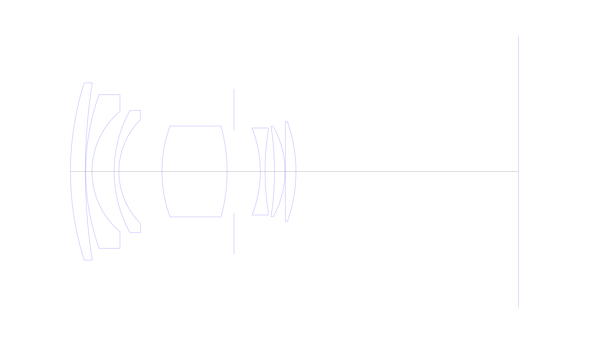
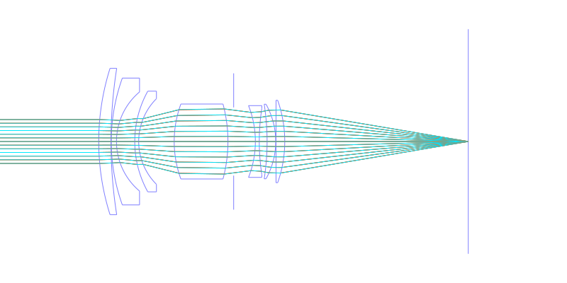
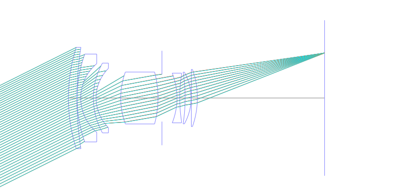
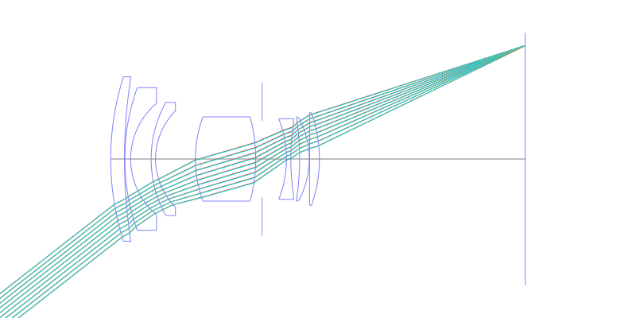
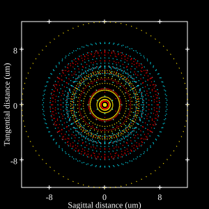
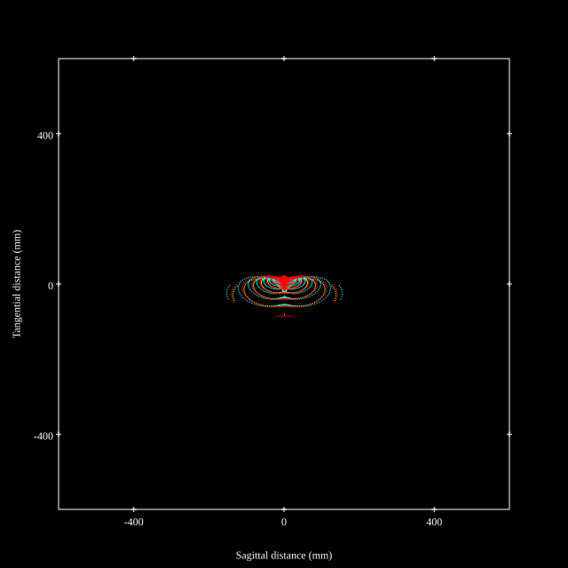
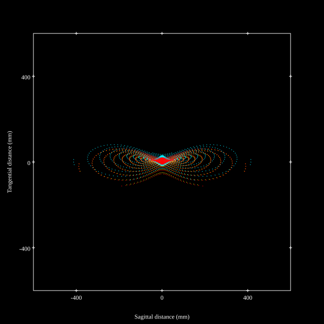
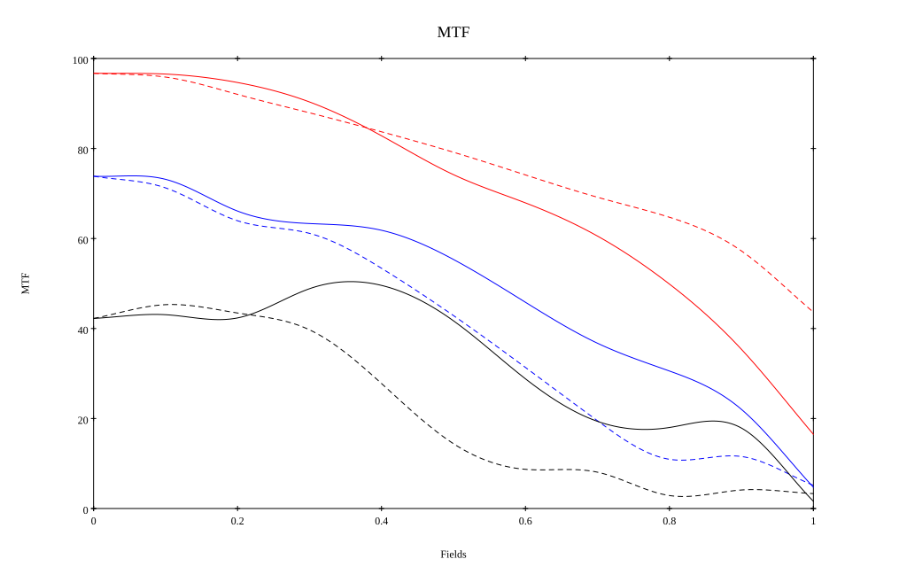
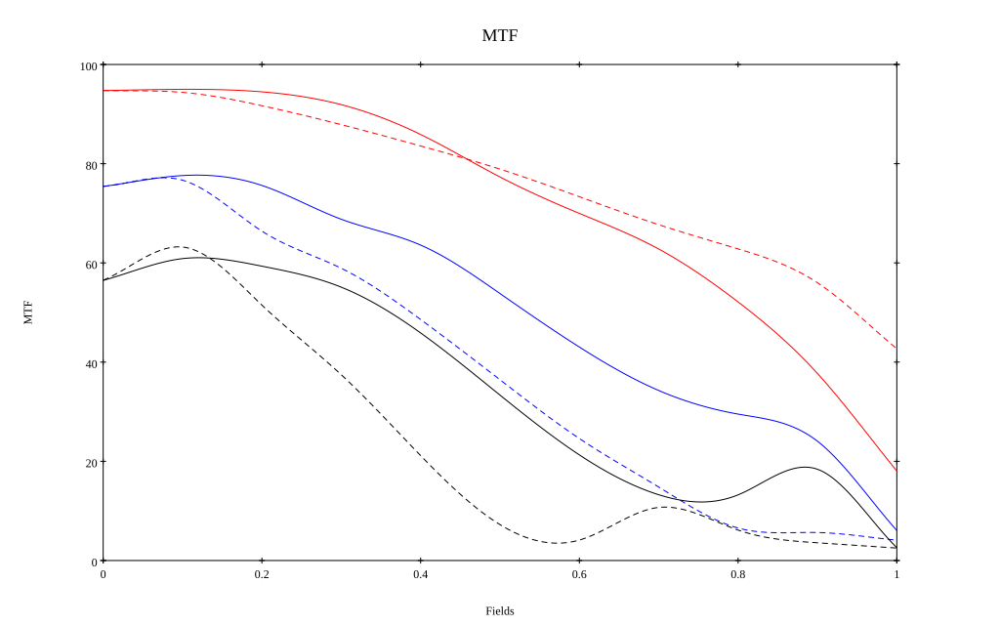

# AI Nikkor 28mm f/2.8 (v1)
## Patent Information
| Country | Patent Number | Example | Year of Application | Inventors | Organisation | Link |
| ---     | ---           | ---     | ---                 | ---       | ---          | ---  |
|US | US3635546 | 2 | 1970 | Ikuo Mori | Nippon Kogaku | [link](https://patents.google.com/patent/US3635546A) |
## Surface Data
Note that where glass types are shown the refractive index and abbe number is as per assigned glass type

| ID  | Radius | Thickness | Diameter | nd  | vd  | Glass Make | Glass |
| --- | ---    | ---       | ---      | --- | --- | ---        | ---   |
| 1 | 51.37 | 2.59 | 30.96 | 1.64831 | 33.84 | Schott | SF12 |
| 2 | 99.76 | 0.06 | 30.96 |  |  |  |
| 3 | 39.68 | 1.1 | 26.84 | 1.62041 | 60.25 | Hikari | J-SK16 |
| 4 | 13.73 | 3.86 | 20.98 |  |  |  |
| 5 | 21.99 | 0.83 | 21.3 | 1.6583 | 57.33 | Ohara | S-LAL11 |
| 6 | 12.82 | 7.5 | 18.12 |  |  |  |
| 7 | 22.99 | 11.35 | 15.86 | 1.6696 | 51.66 | Hoya | LACL4 |
| 8 | -30.59 | 1.21 | 15.86 |  |  |  |
| 9 | AS | 4.58 | 14.424 |  |  |  |
| 10 | -20.67 | 0.83 | 15.18 | 1.74077 | 27.74 | Hikari | J-SF13 |
| 11 | 45.75 | 1.65 | 13.92 |  |  |  |
| 12 | -51.26 | 1.82 | 15.78 | 1.62041 | 60.25 | Hikari | J-SK16 |
| 13 | -16.2 | 0.06 | 15.78 |  |  |  |
| 14 | 3858.4 | 1.85 | 17.44 | 1.6968 | 55.52 | Hikari | J-LAK14 |
| 15 | -26.09 | 38.785 | 17.44 |  |  |  |
## Layouts

## Spot Diagrams

## Paraxial Parameters
| parameter | value |
| ---       | ---   |
| effective_focal_length |28.023
| back_focal_length | 38.879
| optical_invariant | 3.907
| object_distance | 1.0E10
| image_distance | 38.879
| power | 0.036
| pp1_H | 28.979
| ppk_H' | 10.856
| ffl_F | 0.956
| fno | 2.802
| enp_dist_P | 15.99
| enp_radius | 5
| exp_dist_P' | -13.259
| exp_radius | 9.32
| m | -0
| red | -3.56852482310599E8
| n_obj | 1
| n_img | 1
| img_ht | 21.894
| obj_ang | 38
| obj_na | 0
| img_na | -0.176|
## Spot Analysis
| Field | Spot Mean Radius | Spot Max Radius |
| ---   | ---              | ---             |
 | Field(x=0.0, y=0.0) | 5.948 | 18.653|
 | Field(x=0.0, y=0.1) | 5.149 | 29.957|
 | Field(x=0.0, y=0.2) | 7.212 | 34.43|
 | Field(x=0.0, y=0.3) | 10.669 | 45.196|
 | Field(x=0.0, y=0.4) | 14.811 | 58.417|
 | Field(x=0.0, y=0.5) | 19.768 | 79.866|
 | Field(x=0.0, y=0.6) | 26.044 | 109.866|
 | Field(x=0.0, y=0.7) | 35.722 | 151.533|
 | Field(x=0.0, y=0.8) | 49.741 | 209.763|
 | Field(x=0.0, y=0.9) | 72.545 | 292.411|
 | Field(x=0.0, y=1.0) | 110.401 | 413.632|
## Polychromatic Geometric MTF

* 10=red,30=blue,50=black cycles/mm
* Solid lines represent sagittal, dashed lines tangential
* To generate above, MTFs for wavelengths 587.5618(d), 486.1327(F), 656.2725(C) were calculated across 10 fields, and then averaged
## Polychromatic Geometric MTF (Weighted)

* 10=red,30=blue,50=black cycles/mm
* Solid lines represent sagittal, dashed lines tangential
* To generate above, MTFs for wavelengths 587.5618(d) wt(1.0), 656.2725(C) wt(0.475), 546.074(e) wt(0.98), 486.1327(F) wt(0.49), 435.8343(g) wt(0.15) were calculated across 10 fields, and then combined using weighted average
## Resources
* [OpticalBench Compatible Data File, tab delimited](./prescription.txt)
* [Zemax file](./US003635546_Example02.zmx)

Report / Zemax file generated using [Beam42](https://github.com/BeamFour/Beam42) on 2026-07-18
