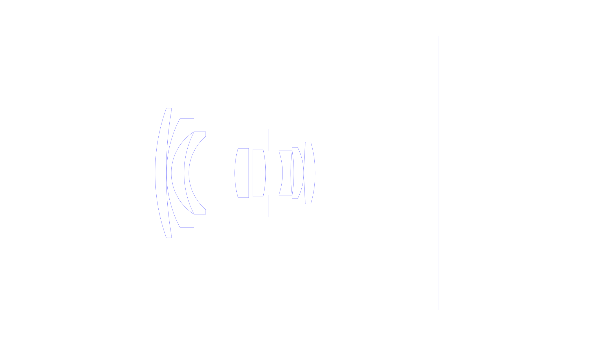
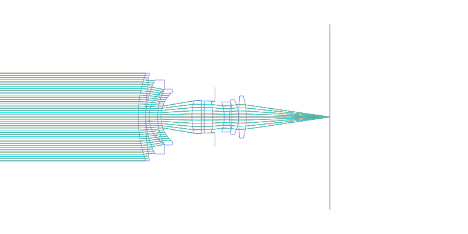
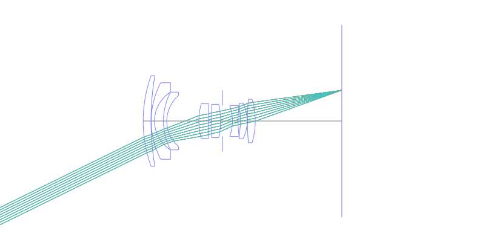
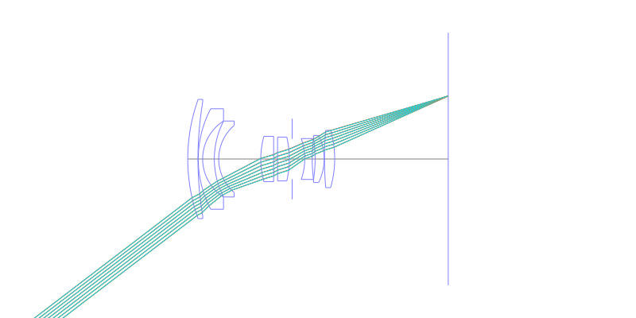
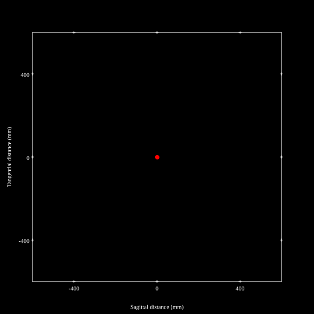
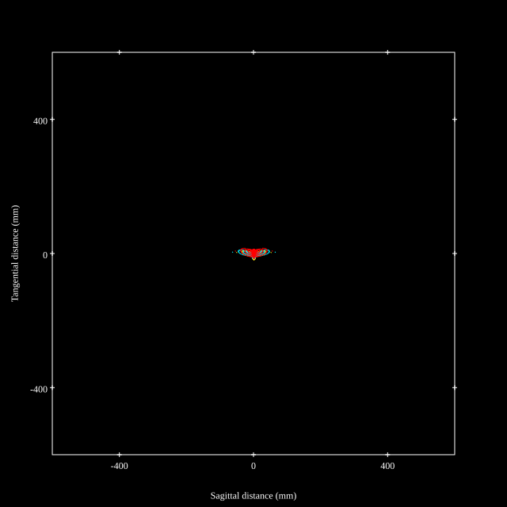
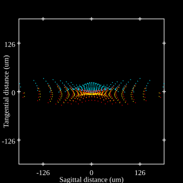
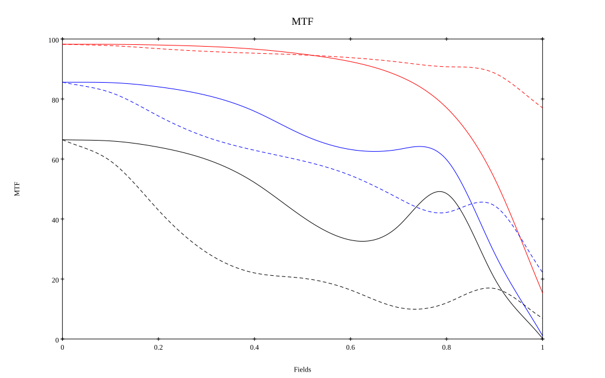
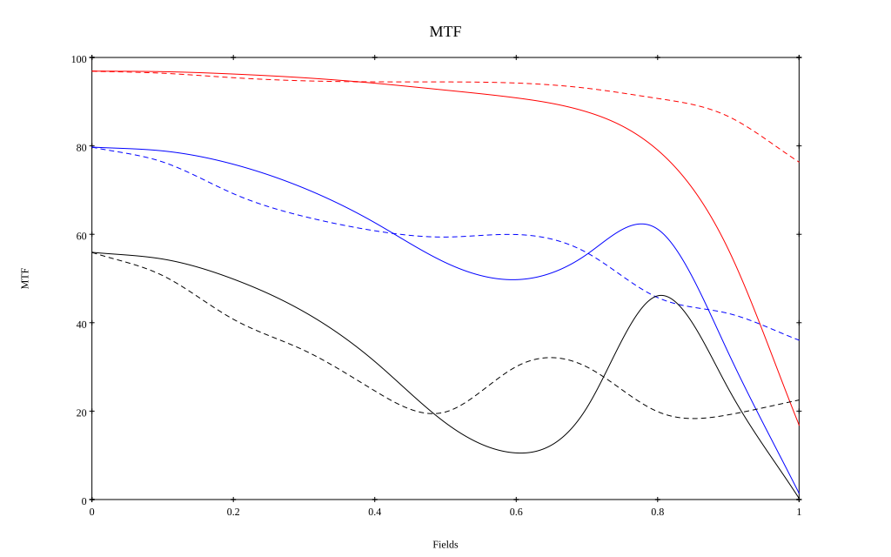

# AI Nikkor 28mm f/2.8S (v2) (secondary patent)
## Patent Information
| Country | Patent Number | Example | Year of Application | Inventors | Organisation | Link |
| ---     | ---           | ---     | ---                 | ---       | ---          | ---  |
|US | US5917663 | 2 | 1998 | Kenzaburo Suzuki | Nippon Kogaku | [link](https://patents.google.com/patent/US5917663A/en) |
## Surface Data
Note that where glass types are shown the refractive index and abbe number is as per assigned glass type

| ID  | Radius | Thickness | Diameter | nd  | vd  | Glass Make | Glass |
| --- | ---    | ---       | ---      | --- | --- | ---        | ---   |
| 1 | 60.5 | 3.5 | 40.8 | 1.67003 | 47.14 | Hikari | J-BAF10 |
| 2 | 118.3 | 0.1 | 39.2 |  |  |  |
| 3 | 36.9 | 1.5 | 34.4 | 1.5168 | 63.88 | Hikari | J-BK7 |
| 4 | 15.4 | 4.0 | 26.0 |  |  |  |
| 5 | 28.2 | 1.5 | 26.0 | 1.5168 | 63.88 | Hikari | J-BK7 |
| 6 | 15.13 | 14.4 | 23.0 |  |  |  |
| 7 | 28.6 | 4.4 | 15.5 | 1.66755 | 41.87 | Hikari | J-BASF6 |
| 8 | 0.0 | 1.35 | 15.5 |  |  |  |
| 9 | 0.0 | 4.0 | 15.0 | 1.62041 | 60.25 | Hikari | J-SK16 |
| 10 | -33.97 | 1.0 | 15.0 |  |  |  |
| 11 | AS | 4.3 | 13.83 |  |  |  |
| 12 | -20.8 | 2.55 | 14.0 | 1.7552 | 27.57 | Hikari | J-SF4 |
| 13 | 53.18 | 1.0 | 14.0 |  |  |  |
| 14 | -46.001 | 3.1 | 14.0 | 1.67 | 57.31 | Hoya | LACL7 |
| 15 | -17.9 | 0.1 | 16.1 |  |  |  |
| 16 | 109.097 | 3.5 | 19.6 | 1.67 | 57.31 | Hoya | LACL7 |
| 17 | -34.8 | 38.864 | 19.6 |  |  |  |
## Layouts

## Spot Diagrams

## Paraxial Parameters
| parameter | value |
| ---       | ---   |
| effective_focal_length |28.63
| back_focal_length | 39.008
| optical_invariant | 3.78
| object_distance | 1.0E10
| image_distance | 39.008
| power | 0.035
| pp1_H | 36.338
| ppk_H' | 10.378
| ffl_F | 7.709
| fno | 2.893
| enp_dist_P | 22.373
| enp_radius | 4.948
| exp_dist_P' | -16.742
| exp_radius | 9.661
| m | -0
| red | -3.492862873229612E8
| n_obj | 1
| n_img | 1
| img_ht | 21.869
| obj_ang | 37.375
| obj_na | 0
| img_na | -0.17|
## Spot Analysis
| Field | Spot Mean Radius | Spot Max Radius |
| ---   | ---              | ---             |
 | Field(x=0.0, y=0.0) | 4.099 | 8.933|
 | Field(x=0.0, y=0.1) | 4.401 | 17.079|
 | Field(x=0.0, y=0.2) | 5.308 | 17.8|
 | Field(x=0.0, y=0.3) | 5.96 | 20.004|
 | Field(x=0.0, y=0.4) | 6.544 | 24.51|
 | Field(x=0.0, y=0.5) | 7.385 | 32.341|
 | Field(x=0.0, y=0.6) | 8.718 | 45.676|
 | Field(x=0.0, y=0.7) | 11.341 | 65.664|
 | Field(x=0.0, y=0.8) | 17.214 | 100.578|
 | Field(x=0.0, y=0.9) | 30.207 | 146.289|
 | Field(x=0.0, y=1.0) | 57.721 | 222.123|
## Polychromatic Geometric MTF

* 10=red,30=blue,50=black cycles/mm
* Solid lines represent sagittal, dashed lines tangential
* To generate above, MTFs for wavelengths 587.5618(d), 486.1327(F), 656.2725(C) were calculated across 10 fields, and then averaged
## Polychromatic Geometric MTF (Weighted)

* 10=red,30=blue,50=black cycles/mm
* Solid lines represent sagittal, dashed lines tangential
* To generate above, MTFs for wavelengths 587.5618(d) wt(1.0), 656.2725(C) wt(0.475), 546.074(e) wt(0.98), 486.1327(F) wt(0.49), 435.8343(g) wt(0.15) were calculated across 10 fields, and then combined using weighted average
## Resources
* [OpticalBench Compatible Data File, tab delimited](./prescription.txt)
* [Zemax file](./US005917663_Example02.zmx)

Report / Zemax file generated using [Beam42](https://github.com/BeamFour/Beam42) on 2026-07-18
