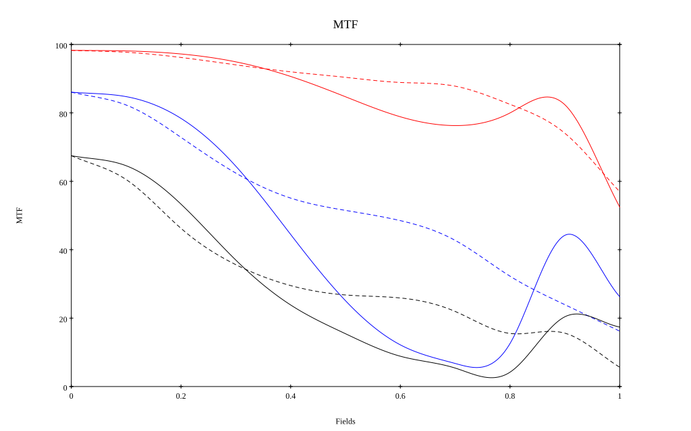

# AIS Nikkor 28mm f/3.5
## Patent Information
| Country | Patent Number | Example | Year of Application | Inventors | Organisation | Link |
| ---     | ---           | ---     | ---                 | ---       | ---          | ---  |
|US | US 4099850 | EX 5 | 1977 | Sei Matsui | Nikon Corp | [link](https://patents.google.com/patent/US4099850A/en) |
## Surface Data
Note that where glass types are shown the refractive index and abbe number is as per assigned glass type

| ID  | Radius | Thickness | Diameter | nd  | vd  | Glass Make | Glass |
| --- | ---    | ---       | ---      | --- | --- | ---        | ---   |
| 1 | 102.05 | 3.0 | 41.22 | 1.62374 | 47.01 | Hikari | J-BAF8 |
| 2 | 620.4 | 0.1 | 41.22 |  |  |  |
| 3 | 57.0 | 1.6 | 35.71 | 1.62041 | 60.25 | Hikari | J-SK16 |
| 4 | 15.8 | 27.3 | 24.96 |  |  |  |
| 5 | 24.3 | 2.8 | 16.17 | 1.70154 | 41.02 | Hikari | J-BASF7 |
| 6 | -53.54 | 0.8 | 16.17 |  |  |  |
| 7 | AS | 4.8 | 12.638 |  |  |  |
| 8 | -21.49 | 4.5 | 16.02 | 1.7552 | 27.57 | Hikari | J-SF4 |
| 9 | 34.9 | 1.1 | 14.8 |  |  |  |
| 10 | -90.0 | 2.7 | 14.8 | 1.62041 | 60.25 | Hikari | J-SK16 |
| 11 | -18.08 | 0.1 | 16.02 |  |  |  |
| 12 | 82.0 | 2.5 | 20.66 | 1.58913 | 61.22 | Hikari | J-SK5 |
| 13 | -49.8 | 39.15 | 20.66 |  |  |  |
## Layouts

## Spot Diagrams

## Paraxial Parameters
| parameter | value |
| ---       | ---   |
| effective_focal_length |28.604
| back_focal_length | 39.289
| optical_invariant | 3.09
| object_distance | 1.0E10
| image_distance | 39.289
| power | 0.035
| pp1_H | 35.889
| ppk_H' | 10.685
| ffl_F | 7.285
| fno | 3.501
| enp_dist_P | 21.764
| enp_radius | 4.085
| exp_dist_P' | -17.082
| exp_radius | 8.07
| m | -0
| red | -3.4960181397592396E8
| n_obj | 1
| n_img | 1
| img_ht | 21.633
| obj_ang | 37.1
| obj_na | 0
| img_na | -0.141|
## Spot Analysis
| Field | Spot Mean Radius | Spot Max Radius |
| ---   | ---              | ---             |
 | Field(x=0.0, y=0.0) | 4.923 | 11.031|
 | Field(x=0.0, y=0.1) | 5.212 | 17.242|
 | Field(x=0.0, y=0.2) | 6.006 | 23.331|
 | Field(x=0.0, y=0.3) | 7.595 | 24.508|
 | Field(x=0.0, y=0.4) | 9.502 | 28.558|
 | Field(x=0.0, y=0.5) | 11.497 | 30.872|
 | Field(x=0.0, y=0.6) | 13.523 | 35.317|
 | Field(x=0.0, y=0.7) | 14.471 | 35.47|
 | Field(x=0.0, y=0.8) | 15.387 | 43.636|
 | Field(x=0.0, y=0.9) | 18.053 | 64.664|
 | Field(x=0.0, y=1.0) | 33.937 | 115.285|
## Polychromatic Geometric MTF

* 10=red,30=blue,50=black cycles/mm
* Solid lines represent sagittal, dashed lines tangential
* To generate above, MTFs for wavelengths 587.5618(d), 486.1327(F), 656.2725(C) were calculated across 10 fields, and then averaged
## Polychromatic Geometric MTF (Weighted)

* 10=red,30=blue,50=black cycles/mm
* Solid lines represent sagittal, dashed lines tangential
* To generate above, MTFs for wavelengths 587.5618(d) wt(1.0), 656.2725(C) wt(0.475), 546.074(e) wt(0.98), 486.1327(F) wt(0.49), 435.8343(g) wt(0.15) were calculated across 10 fields, and then combined using weighted average
## Resources
* [OpticalBench Compatible Data File, tab delimited](./prescription.txt)
* [Zemax file](./US004099850_Example05.zmx)

Report / Zemax file generated using [Beam42](https://github.com/BeamFour/Beam42) on 2026-07-15
