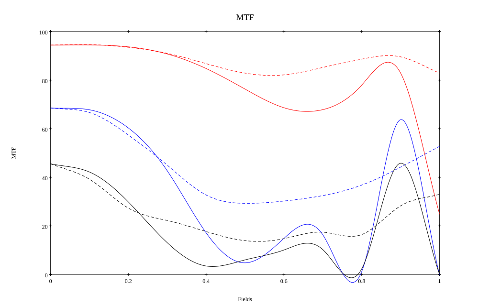

# Nikkor-H 2.8cm f/3.5
## Patent Information
| Country | Patent Number | Example | Year of Application | Inventors | Organisation | Link |
| ---     | ---           | ---     | ---                 | ---       | ---          | ---  |
|JP | JP-S38-026133(1963) | 1 | 1958 | Zenji Wakimoto | Nippon Kogaku | [link](https://www.j-platpat.inpit.go.jp/c1801/PU/JP-S38-026133/12/en) |
## Surface Data
Note that where glass types are shown the refractive index and abbe number is as per assigned glass type

| ID  | Radius | Thickness | Diameter | nd  | vd  | Glass Make | Glass |
| --- | ---    | ---       | ---      | --- | --- | ---        | ---   |
| 1 | 102.284 | 5.096 | 47.66 | 1.6727 | 32.21 | Schott | SF5 |
| 2 | 1960.0 | 0.196 | 47.66 |  |  |  |
| 3 | 67.2 | 1.652 | 38.4 | 1.62041 | 60.32 | Schott | SK16 |
| 4 | 17.36 | 25.76 | 28.17 |  |  |  |
| 5 | 17.976 | 3.332 | 13.14 | 1.63854 | 55.34 | Hikari | J-SK18 |
| 6 | -365.176 | 3.296 | 11.79 |  |  |  |
| 7 | AS | 1.8 | 10.63 |  |  |  |
| 8 | -16.94 | 0.868 | 10.49 | 1.6727 | 32.21 | Schott | SF5 |
| 9 | 29.4 | 1.484 | 11.41 |  |  |  |
| 10 | -112.588 | 2.548 | 12.15 | 1.65844 | 50.84 | Hikari | J-SSK5 |
| 11 | -14.784 | 0.196 | 12.15 |  |  |  |
| 12 | 59.64 | 1.764 | 13.03 | 1.51633 | 64.14 | Schott | BK7HT |
| 13 | -56.14 | 36.916 | 13.03 |  |  |  |
## Layouts

## Spot Diagrams

## Paraxial Parameters
| parameter | value |
| ---       | ---   |
| effective_focal_length |28.004
| back_focal_length | 37.078
| optical_invariant | 3.001
| object_distance | 1.0E10
| image_distance | 37.078
| power | 0.036
| pp1_H | 36.59
| ppk_H' | 9.073
| ffl_F | 8.586
| fno | 3.452
| enp_dist_P | 25.624
| enp_radius | 4.056
| exp_dist_P' | -8.791
| exp_radius | 6.667
| m | -0
| red | -3.570857430164152E8
| n_obj | 1
| n_img | 1
| img_ht | 20.722
| obj_ang | 36.5
| obj_na | 0
| img_na | -0.143|
## Spot Analysis
| Field | Spot Mean Radius | Spot Max Radius |
| ---   | ---              | ---             |
 | Field(x=0.0, y=0.0) | 9.607 | 28.69|
 | Field(x=0.0, y=0.1) | 8.503 | 37.09|
 | Field(x=0.0, y=0.2) | 8.109 | 33.706|
 | Field(x=0.0, y=0.3) | 9.023 | 34.18|
 | Field(x=0.0, y=0.4) | 10.867 | 34.877|
 | Field(x=0.0, y=0.5) | 13.355 | 35.78|
 | Field(x=0.0, y=0.6) | 15.171 | 38.032|
 | Field(x=0.0, y=0.7) | 15.501 | 45.328|
 | Field(x=0.0, y=0.8) | 14.699 | 61.963|
 | Field(x=0.0, y=0.9) | 18.611 | 97.222|
 | Field(x=0.0, y=1.0) | 42.344 | 164.809|
## Polychromatic Geometric MTF

* 10=red,30=blue,50=black cycles/mm
* Solid lines represent sagittal, dashed lines tangential
* To generate above, MTFs for wavelengths 587.5618(d), 486.1327(F), 656.2725(C) were calculated across 10 fields, and then averaged
## Polychromatic Geometric MTF (Weighted)

* 10=red,30=blue,50=black cycles/mm
* Solid lines represent sagittal, dashed lines tangential
* To generate above, MTFs for wavelengths 587.5618(d) wt(1.0), 656.2725(C) wt(0.475), 546.074(e) wt(0.98), 486.1327(F) wt(0.49), 435.8343(g) wt(0.15) were calculated across 10 fields, and then combined using weighted average
## Resources
* [OpticalBench Compatible Data File, tab delimited](./prescription.txt)
* [Zemax file](./JP1963-026133_Example01.zmx)

Report / Zemax file generated using [Beam42](https://github.com/BeamFour/Beam42) on 2026-07-17
