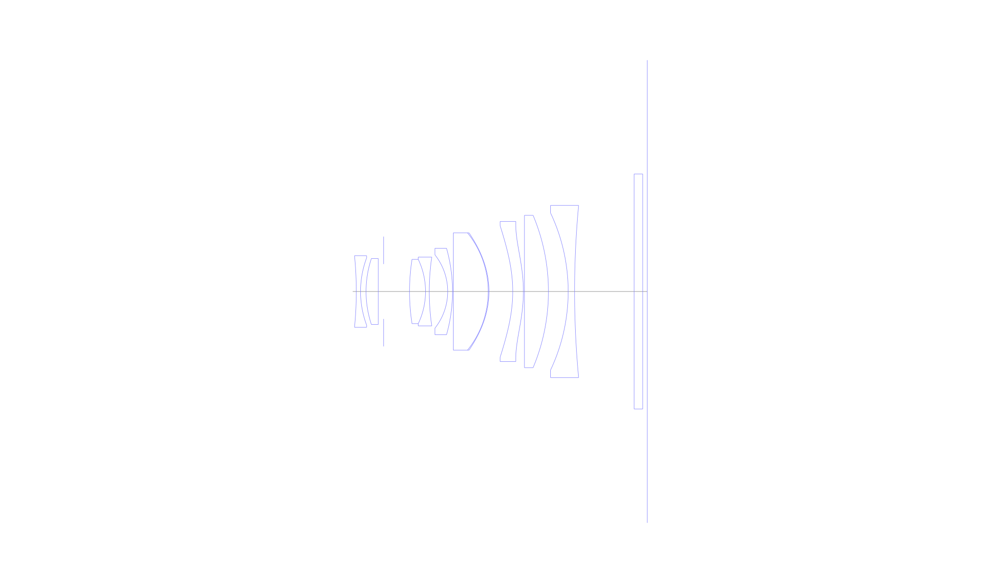
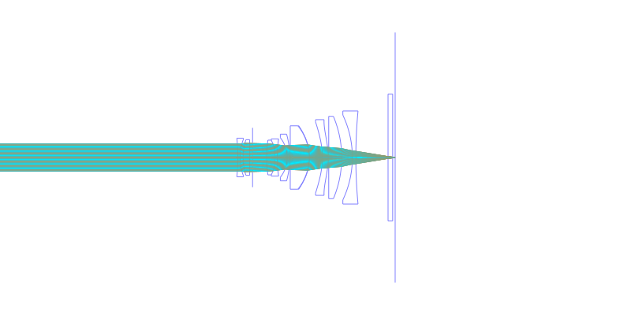
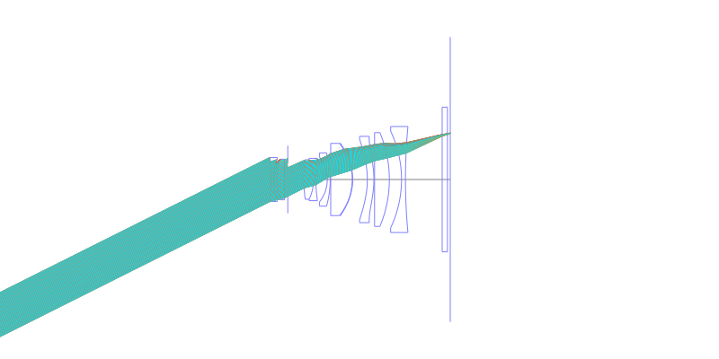
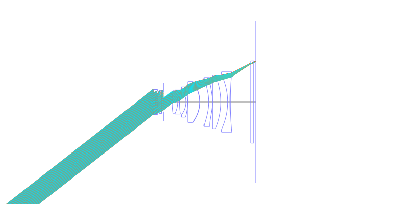
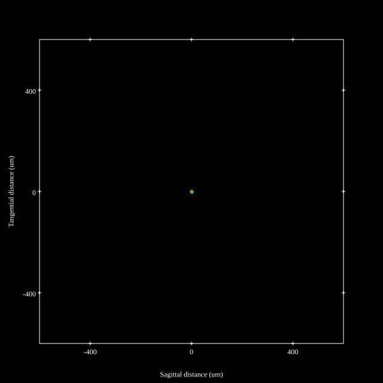
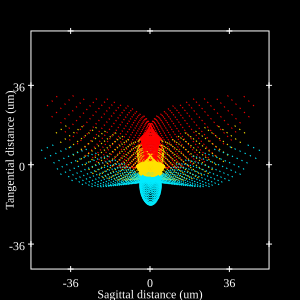
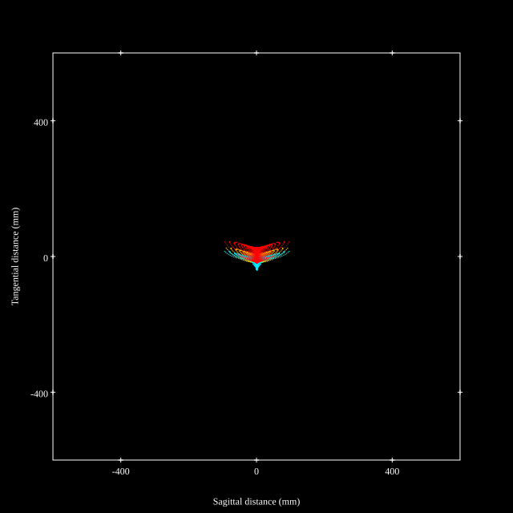

# Nikkor Z 28mm f/2.8
## Patent Information
| Country | Patent Number | Example | Year of Application | Inventors | Organisation | Link |
| ---     | ---           | ---     | ---                 | ---       | ---          | ---  |
|EU | WO 2022/071249 | EX 2 | 2021 | SHIMADA, Toshiyuki | Nikon Corp | [link](https://patentscope.wipo.int/search/en/detail.jsf?docId=WO2022071249) |
## Surface Data
Note that where glass types are shown the refractive index and abbe number is as per assigned glass type

| ID  | Radius | Thickness | Diameter | nd  | vd  | Glass Make | Glass |
| --- | ---    | ---       | ---      | --- | --- | ---        | ---   |
| 1 | -67.65263 | 0.8 | 13.42 | 1.53172 | 48.78 | Hikari | J-LLF6 |
| 2 | 18.07229 | 1.03 | 12.62 |  |  |  |
| 3 | 19.61204 | 2.3 | 12.38 | 1.804 | 46.6 | Hikari | J-LASF015HS |
| 4 | 0.0 | 1.0 | 12.38 |  |  |  |
| 5 | AS | 4.85 | 10.301 |  |  |  |
| 6 | 39.03942 | 3.0 | 12.06 | 2.001 | 29.12 | Hikari | J-LASFH16 |
| 7 | -14.018 | 0.7 | 12.06 | 1.80518 | 25.45 | Hikari | J-SF6 |
| 8 | 44.52125 | 3.457 | 12.9 |  |  |  |
| 9 | -11.08066 | 0.9 | 13.74 | 1.80809 | 22.74 | Hikari | J-SFH1 |
| 10 | -29.93301 | 0.15 | 16.22 |  |  |  |
| 11 | 0.0 | 6.55 | 22.0 | 1.804 | 46.6 | Hikari | J-LASF015HS |
| 12 | -17.50329 | 0.14 | 22.0 | 1.56093 | 36.64 |  |
| 13 | -16.27553 | 4.45 | 22.0 |  |  |  |
| 14 | -26.85154 | 2.0 | 24.72 | 1.53113 | 55.73 |  |
| 15 | -28.96313 | 0.2 | 26.28 |  |  |  |
| 16 | 0.0 | 4.5 | 28.58 | 1.804 | 46.6 | Hikari | J-LASF015HS |
| 17 | -36.85132 | 3.7 | 28.58 |  |  |  |
| 18 | -34.46648 | 1.2 | 29.44 | 1.64769 | 33.72 | Hikari | J-SF2 |
| 19 | 173.14403 | 11.17 | 32.3 |  |  |  |
| 20 | 0.0 | 1.6 | 44.1 | 1.5168 | 63.88 |  |
| 21 | 0.0 | 0.86 | 44.1 |  |  |  |
## Aspherical Data
| ID  | k   | A4  | A6  | A8  | A10 | A12 | A14 | A16 | A18 |
| --- | --- | --- | --- | --- | --- | --- | --- | --- | --- |
| 13 | 0.0 | 2.85655E-5 | -1.38279E-8 | 5.79289E-10 | 9.06875E-13 | -2.2576E-15 | 1.3307E-17 | 0.0 | 0.0 |
| 14 | 0.0 | 2.41081E-5 | 9.24872E-8 | -6.64821E-10 | 1.30136E-12 | 8.8976E-16 | 0.0 | 0.0 | 0.0 |
| 15 | 0.0 | 3.97489E-5 | 2.41498E-7 | -1.14609E-9 | 2.49848E-12 | -2.3864E-15 | 0.0 | 0.0 | 0.0 |
## Layouts

## Spot Diagrams

## Paraxial Parameters
| parameter | value |
| ---       | ---   |
| effective_focal_length |28.824
| back_focal_length | 0.913
| optical_invariant | 3.875
| object_distance | 1.0E10
| image_distance | 0.86
| power | 0.035
| pp1_H | 15.447
| ppk_H' | 27.911
| ffl_F | -13.377
| fno | 2.909
| enp_dist_P | 3.621
| enp_radius | 4.954
| exp_dist_P' | -47.964
| exp_radius | 8.401
| m | 0.002
| red | -3.4693528096068496E8
| n_obj | 1
| n_img | 1
| img_ht | 22.543
| obj_ang | 38.029
| obj_na | 0
| img_na | -0.169|
## Spot Analysis
| Field | Spot Mean Radius | Spot Max Radius |
| ---   | ---              | ---             |
 | 0.0 | 2.323 | 4.357|
 | 0.7 | 10.802 | 53.366|
 | 1.0 | 31.414 | 124.016|
## Resources
* [OpticalBench Compatible Data File, tab delimited](./WO2022-071249_Example02P.txt)
* [Zemax file](./WO2022-071249_Example02P.zmx)
