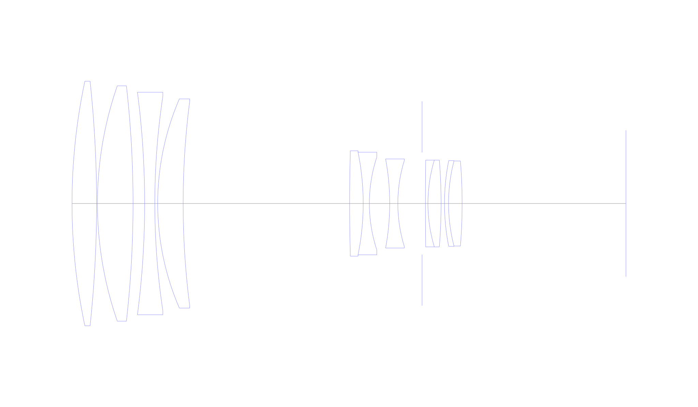
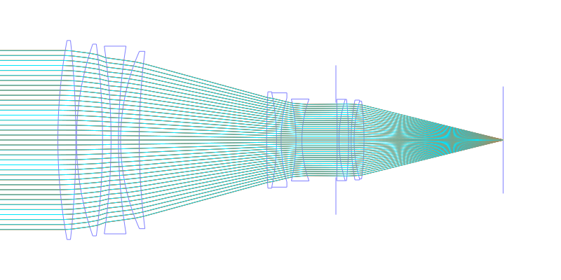
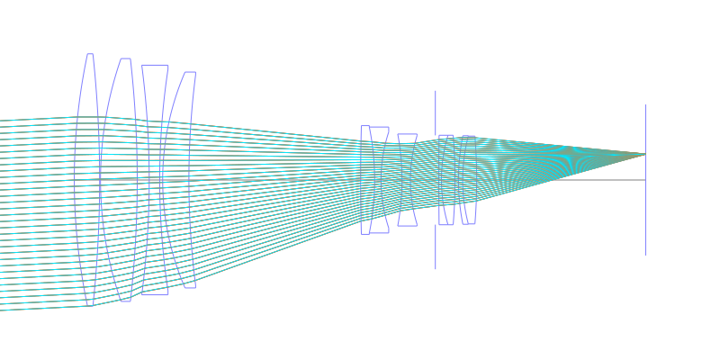
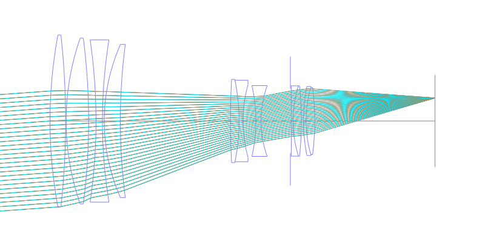
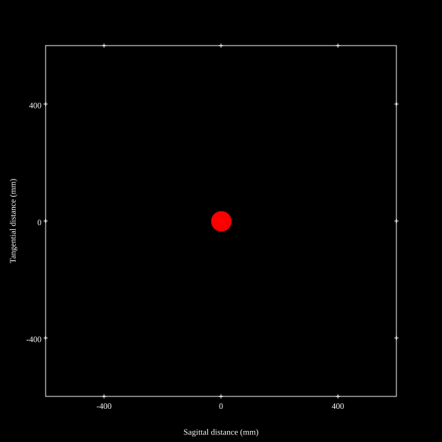
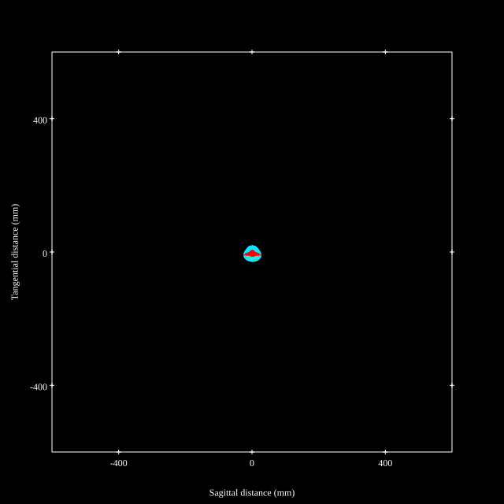
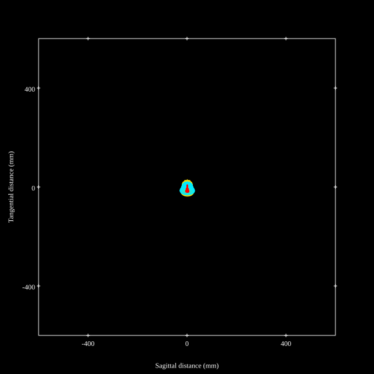
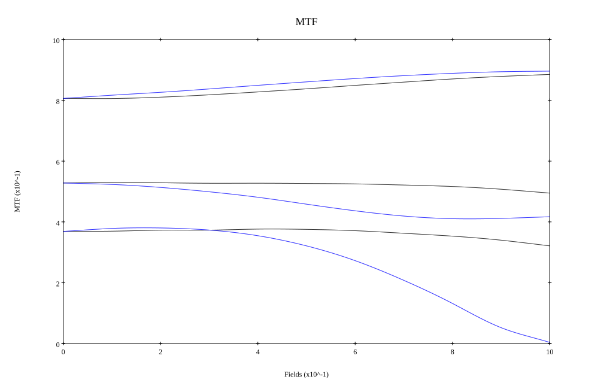
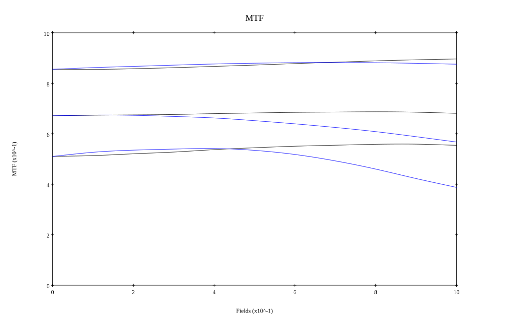

# Ai Nikkor ED-IF 300mm F2 (re-optimized HBO vol 1)
## Patent Information
| Country | Patent Number | Example | Year of Application | Inventors | Organisation | Link |
| ---     | ---           | ---     | ---                 | ---       | ---          | ---  |
|US | US4732459 | 4 | 1983 | Kiyoshi Hayashi | Nikon Corp | [link](https://patents.google.com/patent/US4732459A/en) |
## Surface Data
Note that where glass types are shown the refractive index and abbe number is as per assigned glass type

| ID  | Radius | Thickness | Diameter | nd  | vd  | Glass Make | Glass |
| --- | ---    | ---       | ---      | --- | --- | ---        | ---   |
| 1 | 347.3147 | 14.5 | 144.36 | 1.48656 | 84.47 | Schott | FK51 |
| 2 | -676.9427 | 0.5 | 143.96 |  |  |  |
| 3 | 211.6868 | 21.0 | 138.88 | 1.48656 | 84.47 | Schott | FK51 |
| 4 | -617.2755 | 6.85 | 138.48 |  |  |  |
| 5 | -507.9452 | 6.0 | 131.3 | 1.7495 | 35.04 | Hoya | LAF7 |
| 6 | 424.9446 | 1.7 | 126.6 |  |  |  |
| 7 | 155.4412 | 15.0 | 123.47 | 1.48656 | 84.47 | Schott | FK51 |
| 8 | 471.3897 | 98.22286 | 120.47 |  |  |  |
| 9 | 1138.076 | 8.0 | 62.21 | 1.79504 | 28.39 | Schott | LAF9 |
| 10 | -152.3715 | 3.65 | 60.59 | 1.51454 | 54.63 | Hoya | CF3 |
| 11 | 87.7789 | 12.0 | 54.89 |  |  |  |
| 12 | -143.0608 | 4.8 | 52.6 | 1.4645 | 65.77 | Schott | FK3 |
| 13 | 86.2639 | 14.26022 | 50.71 |  |  |  |
| 14 | AS | 2.0 | 51.06 |  |  |  |
| 15 | 2181.6631 | 1.5 | 51.13 | 1.68893 | 31.16 | Hoya | FD8 |
| 16 | 89.0852 | 7.75 | 51.18 | 1.6935 | 53.34 | Hoya | LAC13 |
| 17 | -313.2137 | 2.0 | 51.2 |  |  |  |
| 18 | 129.3435 | 2.4 | 50.65 | 1.69894 | 30.05 | Hoya | FD15 |
| 19 | 100.0 | 8.0 | 50.22 | 1.6968 | 55.46 | Hoya | LAC14 |
| 20 | -312.7342 | 96.67715 | 50.01 |  |  |  |
## Layouts

## Spot Diagrams

## Paraxial Parameters
| parameter | value |
| ---       | ---   |
| effective_focal_length |296.016
| back_focal_length | 96.717
| optical_invariant | 5.154
| object_distance | 1.0E10
| image_distance | 96.717
| power | 0.003
| pp1_H | 147.018
| ppk_H' | -199.299
| ffl_F | -148.998
| fno | 2.051
| enp_dist_P | 622.574
| enp_radius | 72.166
| exp_dist_P' | -16.81
| exp_radius | 27.687
| m | -0
| red | -3.378197323496399E7
| n_obj | 1
| n_img | 1
| img_ht | 21.141
| obj_ang | 4.085
| obj_na | 0
| img_na | -0.237|
## Spot Analysis
| Field | Spot Mean Radius | Spot Max Radius |
| ---   | ---              | ---             |
 | Field(x=0.0, y=0.0) | 13.83 | 33.298|
 | Field(x=0.0, y=0.1) | 14.04 | 35.191|
 | Field(x=0.0, y=0.2) | 13.936 | 35.173|
 | Field(x=0.0, y=0.3) | 13.591 | 34.904|
 | Field(x=0.0, y=0.4) | 13.134 | 34.461|
 | Field(x=0.0, y=0.5) | 12.613 | 33.889|
 | Field(x=0.0, y=0.6) | 12.126 | 33.199|
 | Field(x=0.0, y=0.7) | 11.666 | 32.368|
 | Field(x=0.0, y=0.8) | 11.291 | 31.378|
 | Field(x=0.0, y=0.9) | 11.06 | 30.158|
 | Field(x=0.0, y=1.0) | 10.916 | 28.636|
## Polychromatic Geometric MTF

* 10,30,50 cycles/mm
* Black lines represent sagittal, blue tangential
* To generate above, MTFs for wavelengths 587.5618(d), 486.1327(F), 656.2725(C) were calculated across 10 fields, and then averaged
## Polychromatic Geometric MTF (Weighted)

* 10,30,50 cycles/mm
* Black lines represent sagittal, blue tangential
* To generate above, MTFs for wavelengths 587.5618(d) wt(1.0), 656.2725(C) wt(0.475), 546.074(e) wt(0.98), 486.1327(F) wt(0.49), 435.8343(g) wt(0.15) were calculated across 10 fields, and then combined using weighted average
## Resources
* [OpticalBench Compatible Data File, tab delimited](./prescription.txt)
* [Zemax file](./US004732459_Example04A.zmx)

Report / Zemax file generated using [Beam42](https://github.com/BeamFour/Beam42) on 2026-04-01
