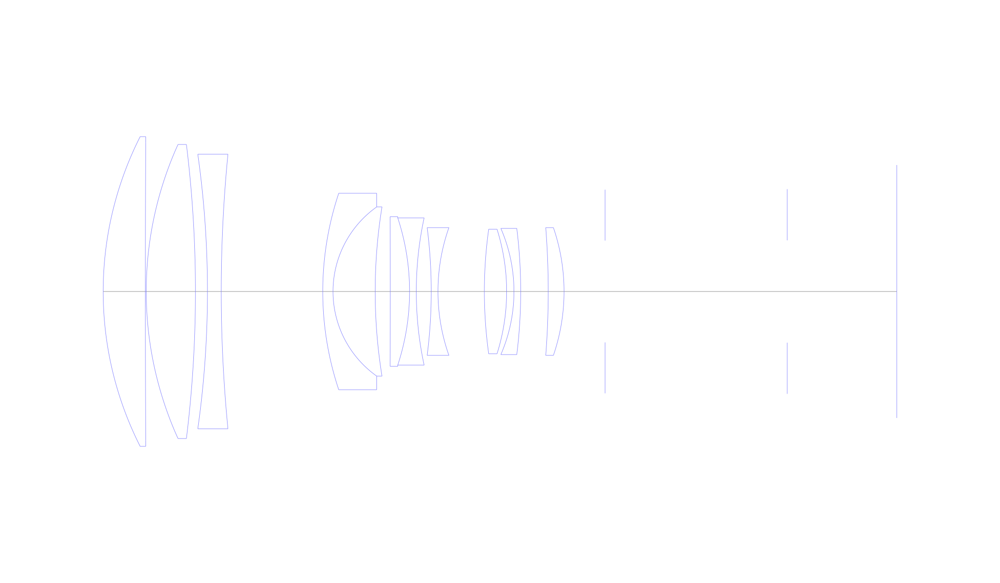
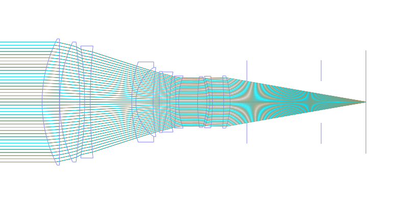
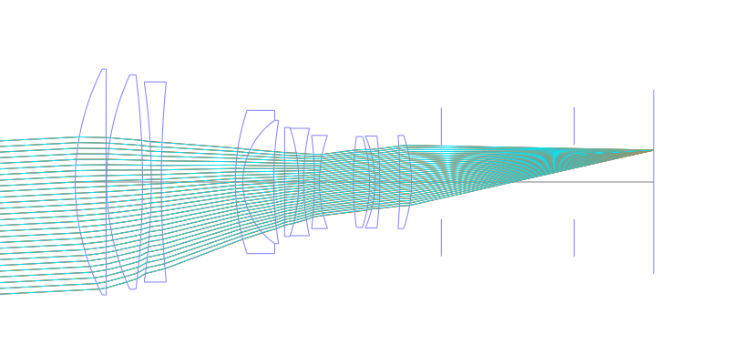
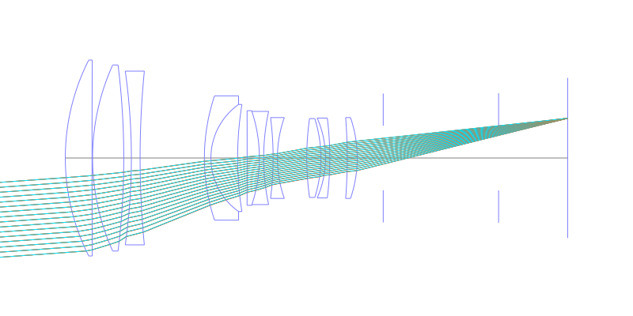
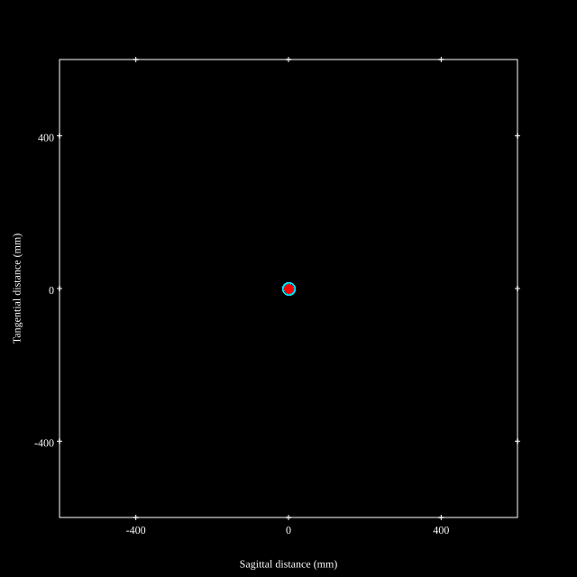
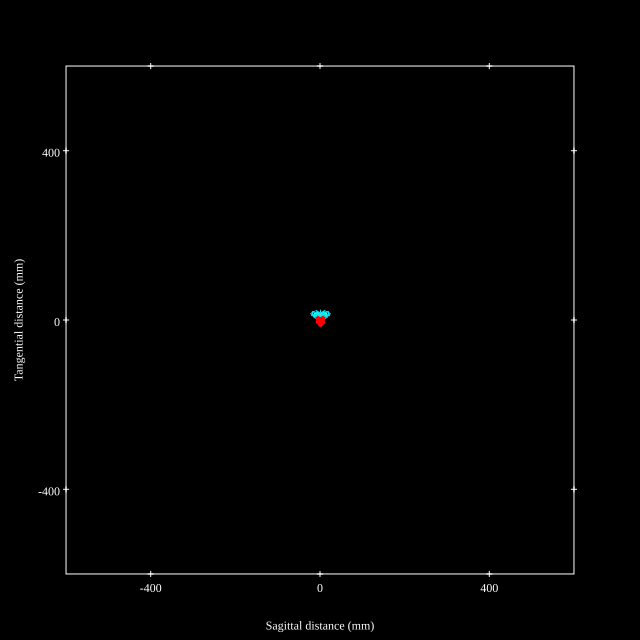
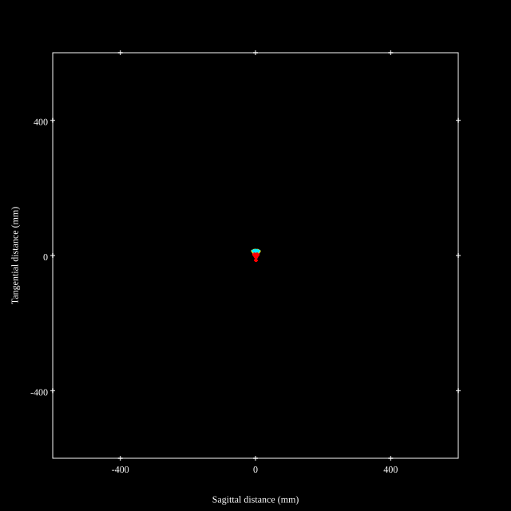
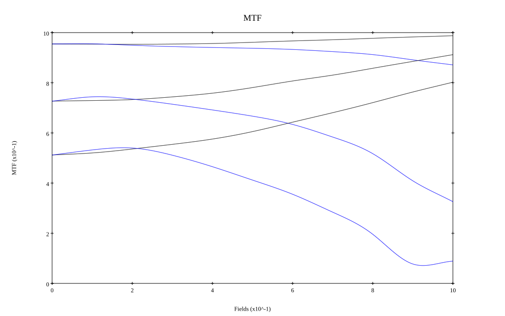
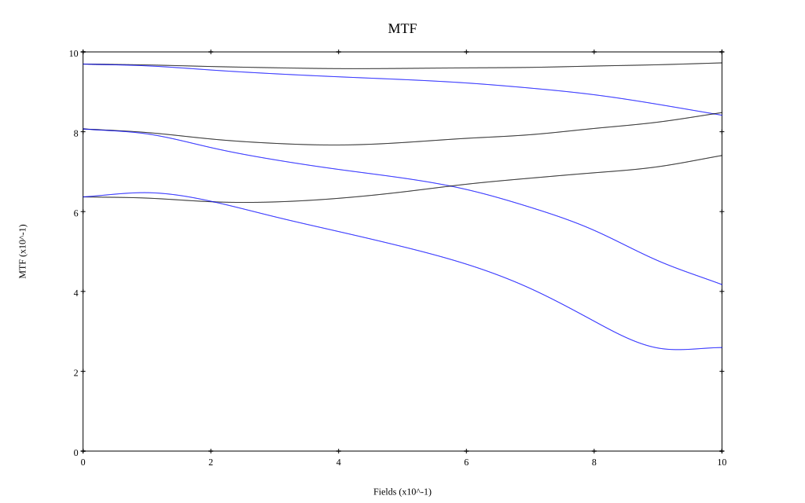

# AF-I Nikkor 300mm f/2.8D ED-IF
## Patent Information
| Country | Patent Number | Example | Year of Application | Inventors | Organisation | Link |
| ---     | ---           | ---     | ---                 | ---       | ---          | ---  |
|US | US 5323270 | 8 | 1991 | Susumu Sato | Nippon Kogaku KK | [link](https://patents.google.com/patent/US5323270A/en) |
## Surface Data
Note that where glass types are shown the refractive index and abbe number is as per assigned glass type

| ID  | Radius | Thickness | Diameter | nd  | vd  | Glass Make | Glass |
| --- | ---    | ---       | ---      | --- | --- | ---        | ---   |
| 1 | 117.124 | 14.4 | 105.78 | 1.49782 | 82.57 | Hikari | J-FKH1 |
| 2 | 9945.0 | 0.3 | 101.5 |  |  |  |
| 3 | 121.736 | 16.8 | 100.44 | 1.49782 | 82.57 | Hikari | J-FKH1 |
| 4 | -410.068 | 4.1 | 100.44 |  |  |  |
| 5 | -335.183 | 4.7 | 93.78 | 1.7495 | 35.25 | Hikari | J-LAF7 |
| 6 | 480.374 | 34.6628 | 93.78 |  |  |  |
| 7 | 105.825 | 3.5 | 67.1 | 1.6968 | 55.52 | Hikari | J-LAK14 |
| 8 | 35.452 | 14.4 | 57.78 | 1.59319 | 67.9 | Hikari | J-PSKH1 |
| 9 | 180.758 | 5.134 | 57.78 |  |  |  |
| 10 | -9945.0 | 6.6 | 51.1 | 1.80384 | 33.89 | Hikari | E-LAFH2 |
| 11 | -80.453 | 2.3 | 50.3 | 1.58913 | 61.22 | Hikari | J-SK5 |
| 12 | 119.561 | 5.1 | 50.3 |  |  |  |
| 13 | -172.119 | 2.3 | 43.64 | 1.67 | 57.31 | Hoya | LACL7 |
| 14 | 65.626 | 15.8406 | 43.64 |  |  |  |
| 15 | 153.713 | 7.6 | 42.58 | 1.49782 | 82.57 | Hikari | J-FKH1 |
| 16 | -70.534 | 2.5 | 42.58 |  |  |  |
| 17 | -54.182 | 2.3 | 43.1 | 1.80518 | 25.45 | Hikari | J-SF6 |
| 18 | -174.411 | 9.4 | 43.1 |  |  |  |
| 19 | -280.977 | 5.4 | 43.64 | 1.74 | 28.2 | Schott | SF3 |
| 20 | -67.273 | 14.0 | 43.64 |  |  |  |
| 21 | AS | 62.18 | 34.781 |  |  |  |
| 22 | FS | 37.2337 | 34.96 |  |  |  |
## Layouts

## Spot Diagrams

## Paraxial Parameters
| parameter | value |
| ---       | ---   |
| effective_focal_length |294.047
| back_focal_length | 37.272
| optical_invariant | 3.669
| object_distance | 1.0E10
| image_distance | 37.272
| power | 0.003
| pp1_H | -0.52
| ppk_H' | -256.775
| ffl_F | -294.566
| fno | 2.901
| enp_dist_P | 574.831
| enp_radius | 50.687
| exp_dist_P' | -62.142
| exp_radius | 17.143
| m | -0
| red | -3.400821123267761E7
| n_obj | 1
| n_img | 1
| img_ht | 21.284
| obj_ang | 4.14
| obj_na | 0
| img_na | -0.17|
## Spot Analysis
| Field | Spot Mean Radius | Spot Max Radius |
| ---   | ---              | ---             |
 | Field(x=0.0, y=0.0) | 5.509 | 16.065|
 | Field(x=0.0, y=0.1) | 5.402 | 23.73|
 | Field(x=0.0, y=0.2) | 6.009 | 26.938|
 | Field(x=0.0, y=0.3) | 6.383 | 27.904|
 | Field(x=0.0, y=0.4) | 6.399 | 27.632|
 | Field(x=0.0, y=0.5) | 6.47 | 26.648|
 | Field(x=0.0, y=0.6) | 6.583 | 24.318|
 | Field(x=0.0, y=0.7) | 6.953 | 25.066|
 | Field(x=0.0, y=0.8) | 7.092 | 24.107|
 | Field(x=0.0, y=0.9) | 7.742 | 22.563|
 | Field(x=0.0, y=1.0) | 8.409 | 20.314|
## Polychromatic Geometric MTF

* 10,30,50 cycles/mm
* Black lines represent sagittal, blue tangential
* To generate above, MTFs for wavelengths 587.5618(d), 486.1327(F), 656.2725(C) were calculated across 10 fields, and then averaged
## Polychromatic Geometric MTF (Weighted)

* 10,30,50 cycles/mm
* Black lines represent sagittal, blue tangential
* To generate above, MTFs for wavelengths 587.5618(d) wt(1.0), 656.2725(C) wt(0.475), 546.074(e) wt(0.98), 486.1327(F) wt(0.49), 435.8343(g) wt(0.15) were calculated across 10 fields, and then combined using weighted average
## Resources
* [OpticalBench Compatible Data File, tab delimited](./prescription.txt)
* [Zemax file](./US005323270_Example08P.zmx)

Report / Zemax file generated using [Beam42](https://github.com/BeamFour/Beam42) on 2026-04-04
