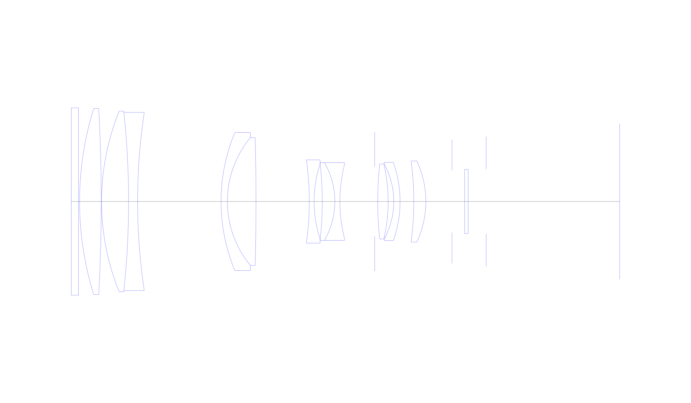
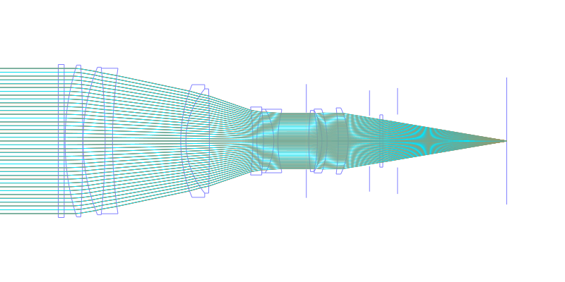
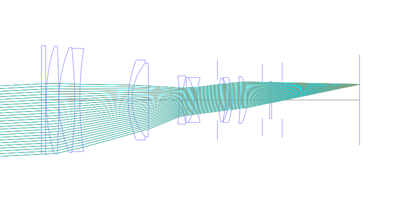
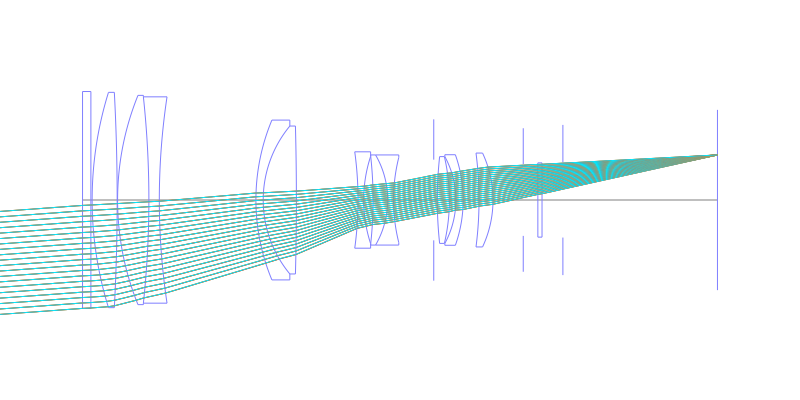
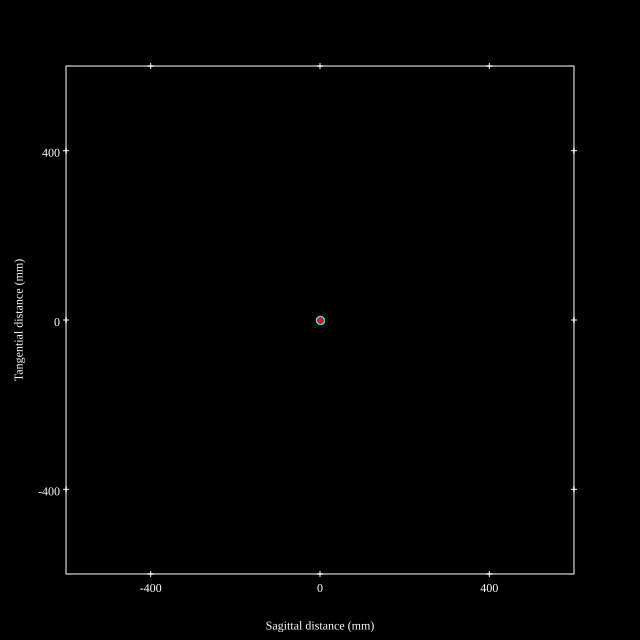
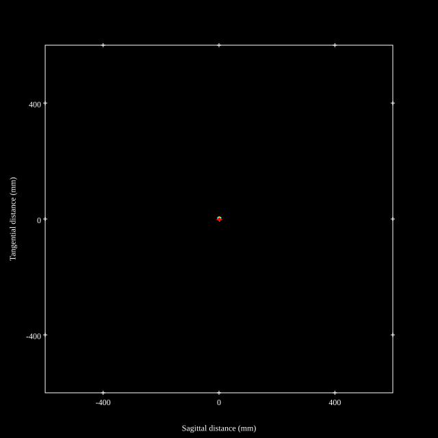
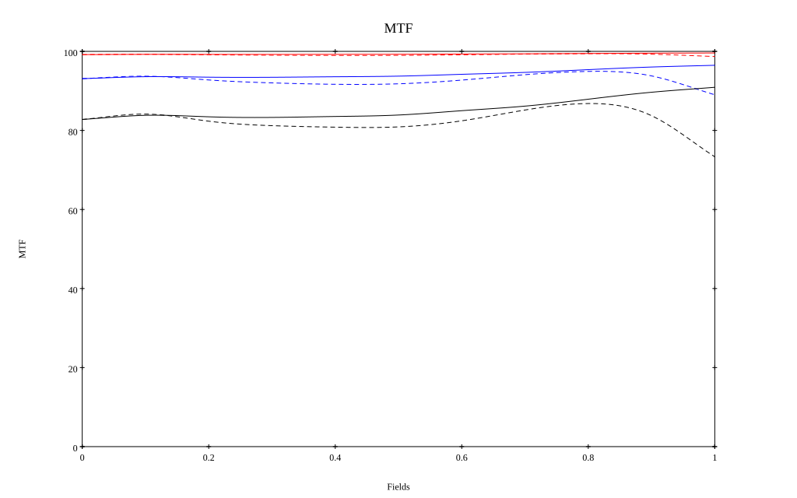
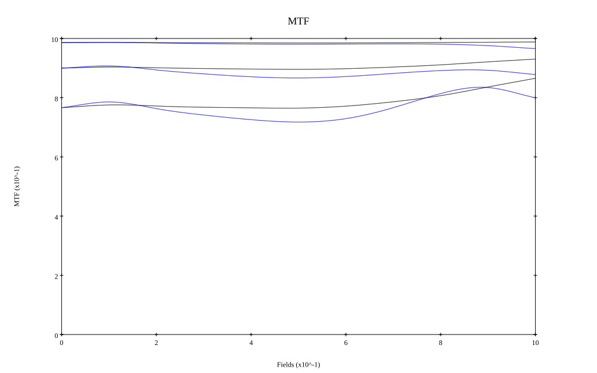

# AF-S Nikkor 300mm f/2.8D IF-ED
## Patent Information
| Country | Patent Number | Example | Year of Application | Inventors | Organisation | Link |
| ---     | ---           | ---     | ---                 | ---       | ---          | ---  |
|US | US5745306 | 1 | 1995 | Susumu Sato | Nikon Corp | [link](https://patents.google.com/patent/US5745306A/en) |
## Surface Data
Note that where glass types are shown the refractive index and abbe number is as per assigned glass type

| ID  | Radius | Thickness | Diameter | nd  | vd  | Glass Make | Glass |
| --- | ---    | ---       | ---      | --- | --- | ---        | ---   |
| 1 | 0.0 | 4.0 | 104.0 | 1.5168 | 64.13 | Hikari | J-BK7A |
| 2 | 0.0 | 0.6 | 104.0 |  |  |  |
| 3 | 173.8655 | 12.0 | 103.2 | 1.49782 | 82.57 | Hikari | J-FKH1 |
| 4 | -978.0647 | 0.2 | 103.2 |  |  |  |
| 5 | 133.6355 | 15.0 | 100.3 | 1.49782 | 82.57 | Hikari | J-FKH1 |
| 6 | -464.694 | 5.0 | 98.9 | 1.804 | 46.6 | Hikari | J-LASF015 |
| 7 | 332.9179 | 46.3 | 98.9 |  |  |  |
| 8 | 99.5535 | 3.5 | 76.6 | 1.744 | 44.8 | Hikari | J-LAF2 |
| 9 | 55.631 | 15.9 | 70.9 | 1.49782 | 82.57 | Hikari | J-FKH1 |
| 10 | -1371.0602 | 29.5505 | 70.9 |  |  |  |
| 11 | -169.9686 | 2.7 | 46.2 | 1.5168 | 64.13 | Hikari | J-BK7A |
| 12 | 67.2847 | 4.5 | 41.8 |  |  |  |
| 13 | -192.9273 | 7.0 | 41.8 | 1.80384 | 33.89 | Hikari | E-LAFH2 |
| 14 | -43.081 | 2.8 | 43.2 | 1.58913 | 61.22 | Hikari | J-SK5 |
| 15 | 83.8867 | 19.2807 | 40.8 |  |  |  |
| 16 | AS | 1.7 | 38.669 |  |  |  |
| 17 | 194.0386 | 5.8 | 41.6 | 1.5186 | 69.89 | Hikari | J-PKH1 |
| 18 | -90.9579 | 3.1 | 41.6 |  |  |  |
| 19 | -43.5951 | 3.5 | 41.6 | 1.79504 | 28.54 | Hikari | E-LAF9 |
| 20 | -64.7897 | 7.6 | 43.4 |  |  |  |
| 21 | -175.8037 | 6.7 | 45.0 | 1.48749 | 70.32 | Hikari | J-FK5 |
| 22 | -53.035 | 14.5 | 45.0 |  |  |  |
| 23 | FS | 7.0 | 34.4 |  |  |  |
| 24 | 0.0 | 2.0 | 35.6 | 1.5168 | 64.13 | Hikari | J-BK7A |
| 25 | 0.0 | 10.0 | 35.6 |  |  |  |
| 26 | FS | 74.09 | 36.0 |  |  |  |
## Layouts

## Spot Diagrams

## Paraxial Parameters
| parameter | value |
| ---       | ---   |
| effective_focal_length |293.965
| back_focal_length | 74.099
| optical_invariant | 3.722
| object_distance | 1.0E10
| image_distance | 74.099
| power | 0.003
| pp1_H | 116.423
| ppk_H' | -219.865
| ffl_F | -177.541
| fno | 2.879
| enp_dist_P | 464.88
| enp_radius | 51.052
| exp_dist_P' | -60.406
| exp_radius | 23.361
| m | -0
| red | -3.401769243259197E7
| n_obj | 1
| n_img | 1
| img_ht | 21.433
| obj_ang | 4.17
| obj_na | 0
| img_na | -0.171|
## Spot Analysis
| Field | Spot Mean Radius | Spot Max Radius |
| ---   | ---              | ---             |
 | Field(x=0.0, y=0.0) | 3.091 | 8.964|
 | Field(x=0.0, y=0.1) | 2.64 | 9.879|
 | Field(x=0.0, y=0.2) | 2.76 | 9.342|
 | Field(x=0.0, y=0.3) | 2.91 | 10.451|
 | Field(x=0.0, y=0.4) | 2.918 | 11.165|
 | Field(x=0.0, y=0.5) | 2.87 | 11.128|
 | Field(x=0.0, y=0.6) | 2.765 | 10.163|
 | Field(x=0.0, y=0.7) | 2.632 | 8.515|
 | Field(x=0.0, y=0.8) | 2.604 | 7.607|
 | Field(x=0.0, y=0.9) | 2.855 | 7.519|
 | Field(x=0.0, y=1.0) | 3.518 | 8.649|
## Polychromatic Geometric MTF

* 10,30,50 cycles/mm
* Black lines represent sagittal, blue tangential
* To generate above, MTFs for wavelengths 587.5618(d), 486.1327(F), 656.2725(C) were calculated across 10 fields, and then averaged
## Polychromatic Geometric MTF (Weighted)

* 10,30,50 cycles/mm
* Black lines represent sagittal, blue tangential
* To generate above, MTFs for wavelengths 587.5618(d) wt(1.0), 656.2725(C) wt(0.475), 546.074(e) wt(0.98), 486.1327(F) wt(0.49), 435.8343(g) wt(0.15) were calculated across 10 fields, and then combined using weighted average
## Resources
* [OpticalBench Compatible Data File, tab delimited](./prescription.txt)
* [Zemax file](./US005745306_Example01P.zmx)

Report / Zemax file generated using [Beam42](https://github.com/BeamFour/Beam42) on 2026-04-04
