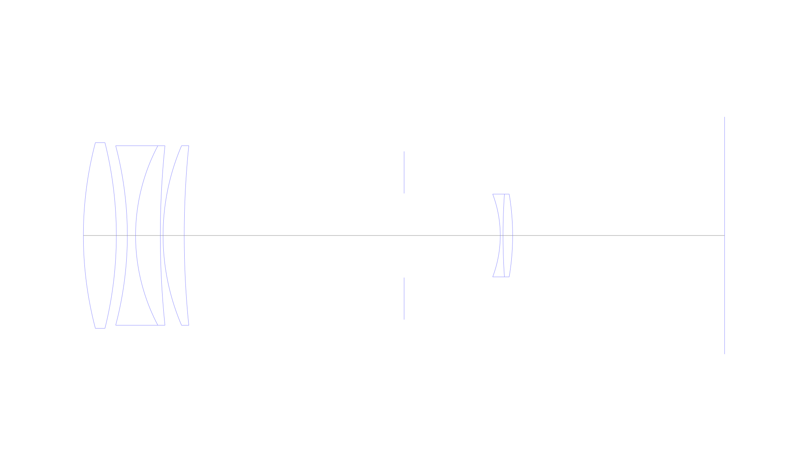
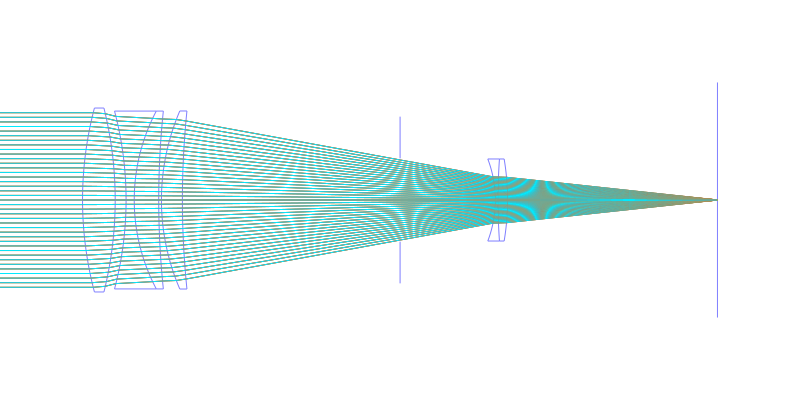
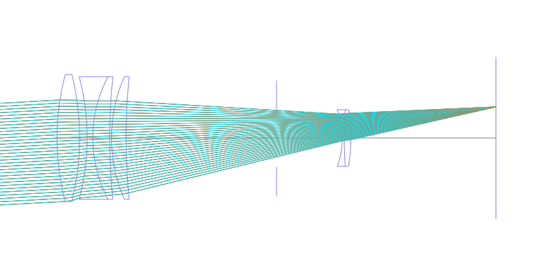
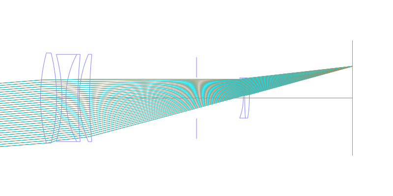
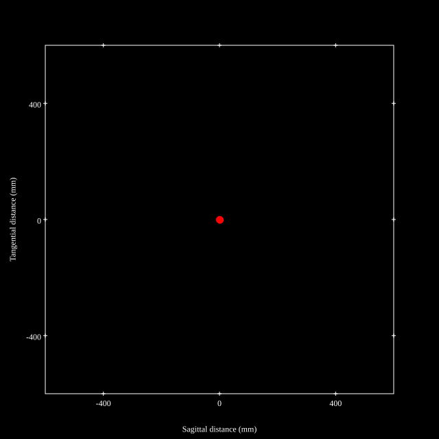
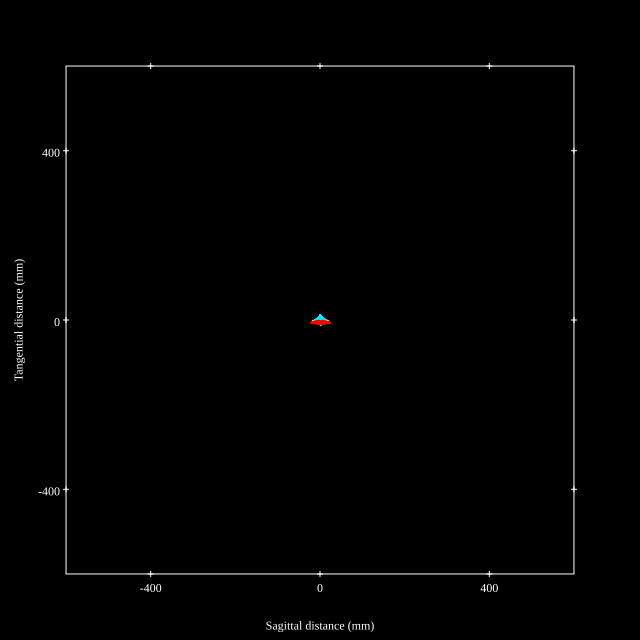
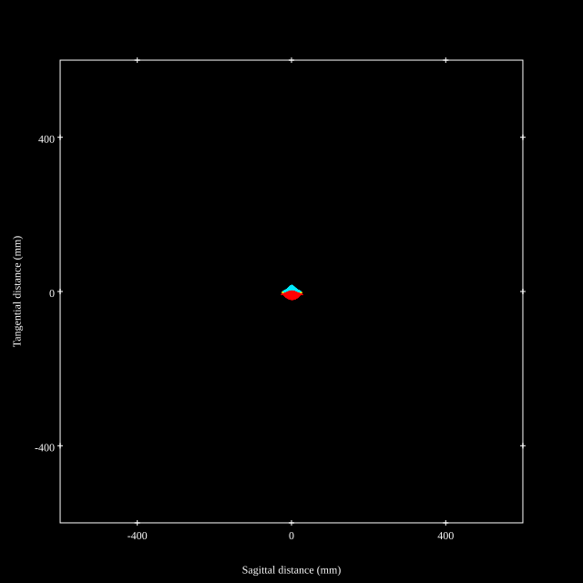
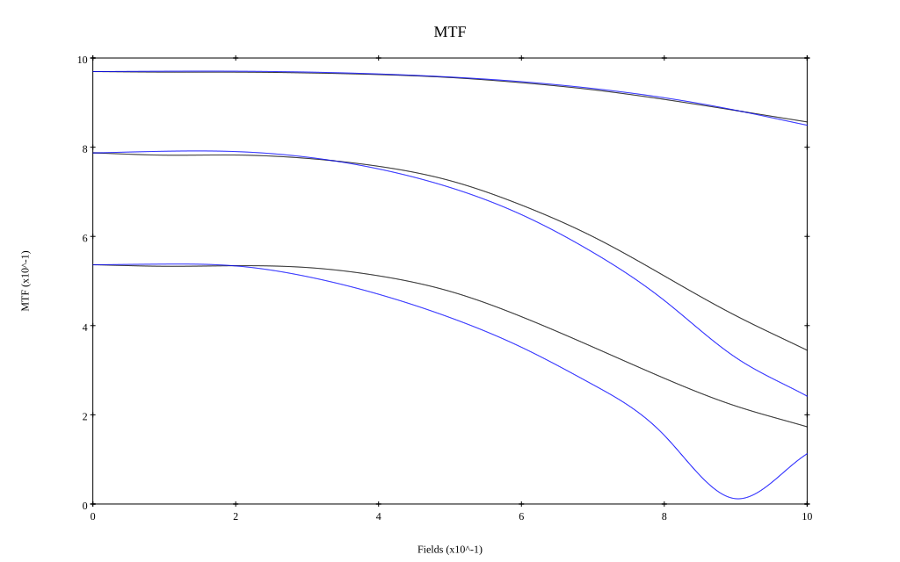
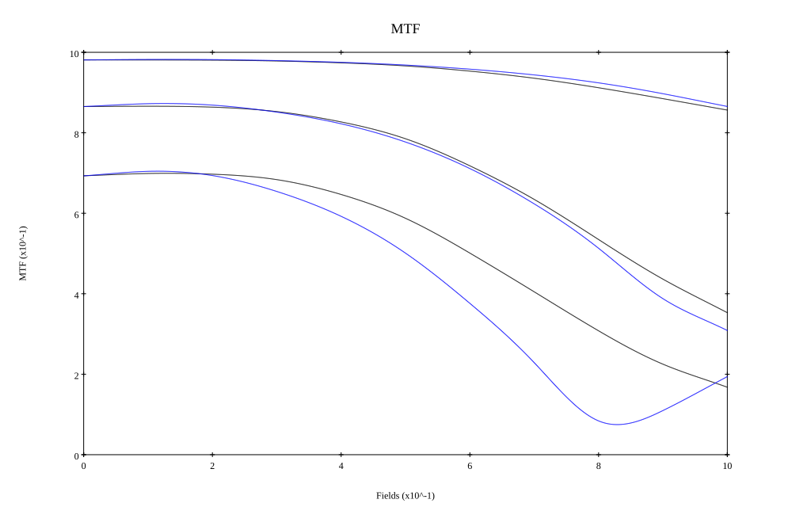

## Surface Data
Note that where glass types are shown the refractive index and abbe number is as per assigned glass type

| ID  | Radius | Thickness | Diameter | nd  | vd  | Glass Make | Glass |
| --- | ---    | ---       | ---      | --- | --- | ---        | ---   |
| 1 | 133.0 | 12.0 | 67.6 | 1.50032 | 81.9 | Hikari | PC102 |
| 2 | -140.0 | 4.0 | 67.6 |  |  |  |
| 3 | -128.0 | 3.0 | 65.36 | 1.61266 | 44.4 | Hikari | KZFH1 |
| 4 | 70.0 | 9.0 | 65.36 | 1.6393 | 45.0 | Schott | BAF12-Old |
| 5 | 316.3 | 1.0 | 65.36 |  |  |  |
| 6 | 82.75 | 7.7 | 65.43 | 1.50032 | 81.9 | Hikari | PC102 |
| 7 | 322.4 | 80.0 | 65.43 |  |  |  |
| 8 | AS | 35.0 | 30.635 |  |  |  |
| 9 | -42.56 | 1.0 | 30.15 | 1.62041 | 60.29 | Hikari | E-SK16 |
| 10 | 220.0 | 3.5 | 30.15 | 1.62004 | 36.3 | Hoya | E-F2 |
| 11 | -91.1 | 77.14 | 30.15 |  |  |  |
## Layouts

## Spot Diagrams

## Paraxial Parameters
| parameter | value |
| ---       | ---   |
| effective_focal_length |299.76
| back_focal_length | 77.181
| optical_invariant | 2.623
| object_distance | 1.0E10
| image_distance | 77.181
| power | 0.003
| pp1_H | -297.321
| ppk_H' | -222.578
| ffl_F | -597.08
| fno | 4.496
| enp_dist_P | 229.552
| enp_radius | 33.335
| exp_dist_P' | -31.478
| exp_radius | 12.088
| m | -0
| red | -3.3360053554103117E7
| n_obj | 1
| n_img | 1
| img_ht | 23.592
| obj_ang | 4.5
| obj_na | 0
| img_na | -0.111|
## Spot Analysis
| Field | Spot Mean Radius | Spot Max Radius |
| ---   | ---              | ---             |
 | Field(x=0.0, y=0.0) | 4.99 | 10.984|
 | Field(x=0.0, y=0.1) | 5.115 | 15.285|
 | Field(x=0.0, y=0.2) | 5.125 | 15.606|
 | Field(x=0.0, y=0.3) | 5.355 | 17.166|
 | Field(x=0.0, y=0.4) | 5.748 | 18.674|
 | Field(x=0.0, y=0.5) | 6.236 | 20.273|
 | Field(x=0.0, y=0.6) | 7.018 | 22.035|
 | Field(x=0.0, y=0.7) | 8.018 | 23.862|
 | Field(x=0.0, y=0.8) | 9.207 | 25.636|
 | Field(x=0.0, y=0.9) | 10.566 | 27.229|
 | Field(x=0.0, y=1.0) | 11.938 | 28.572|
## Polychromatic Geometric MTF

* 10,30,50 cycles/mm
* Black lines represent sagittal, blue tangential
* To generate above, MTFs for wavelengths 587.5618(d), 486.1327(F), 656.2725(C) were calculated across 10 fields, and then averaged
## Polychromatic Geometric MTF (Weighted)

* 10,30,50 cycles/mm
* Black lines represent sagittal, blue tangential
* To generate above, MTFs for wavelengths 587.5618(d) wt(1.0), 656.2725(C) wt(0.475), 546.074(e) wt(0.98), 486.1327(F) wt(0.49), 435.8343(g) wt(0.15) were calculated across 10 fields, and then combined using weighted average
## Resources
* [OpticalBench Compatible Data File, tab delimited](./prescription.txt)
* [Zemax file](./JP1976-043917_Example01P.zmx)

Report / Zemax file generated using [Beam42](https://github.com/BeamFour/Beam42) on 2026-05-04
