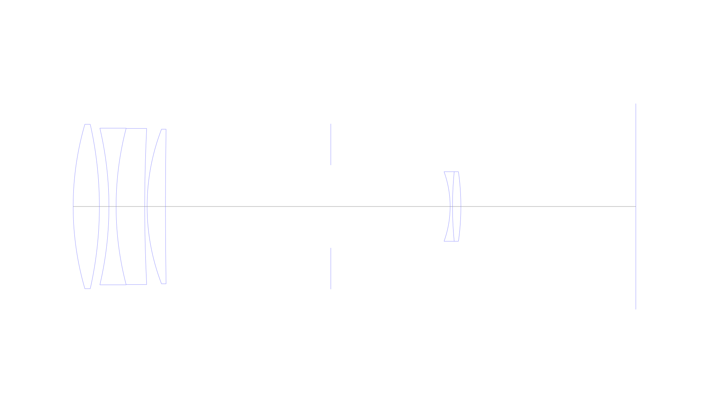
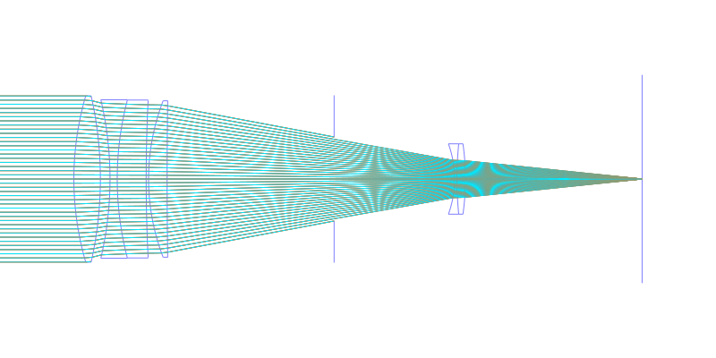
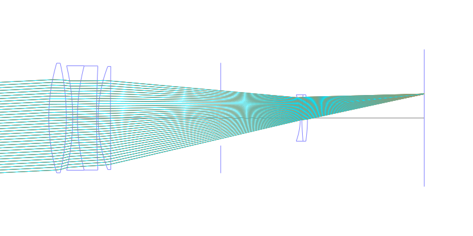
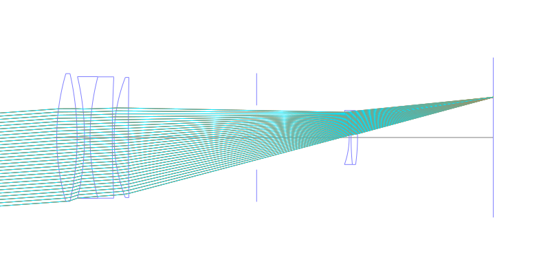
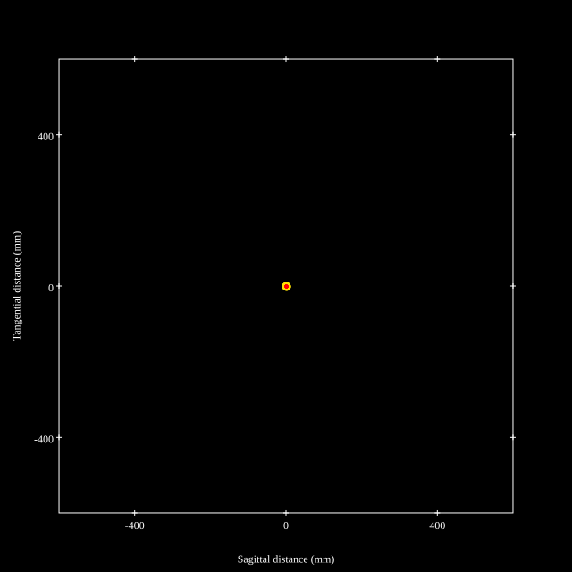
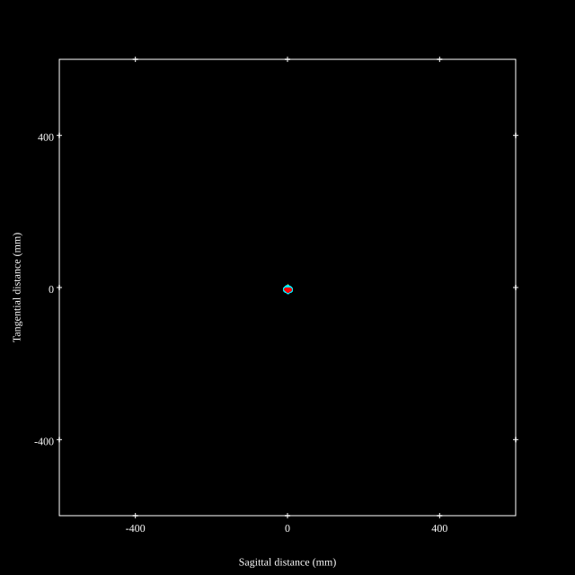
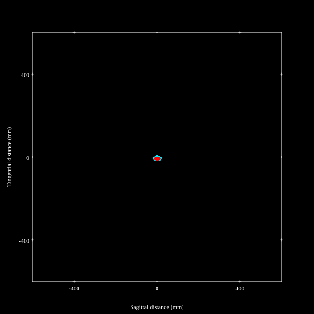
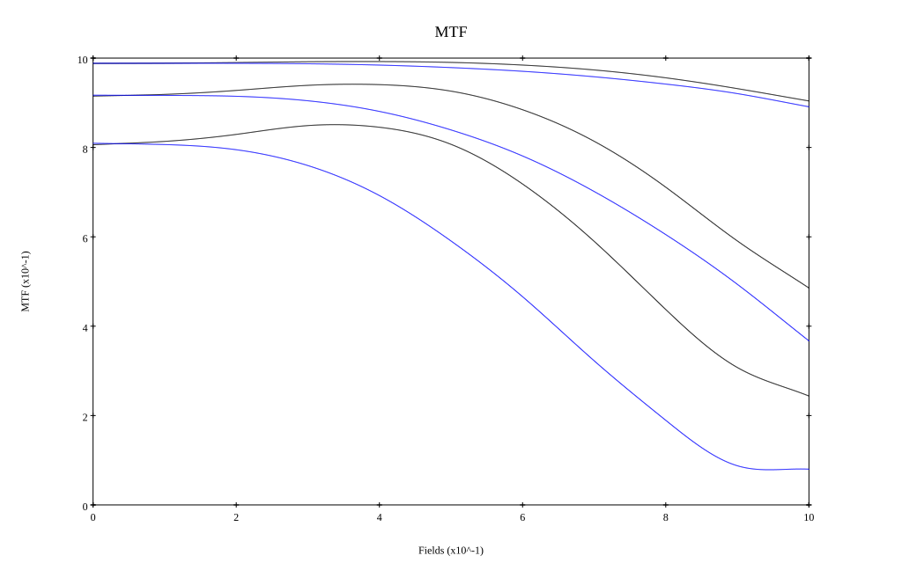
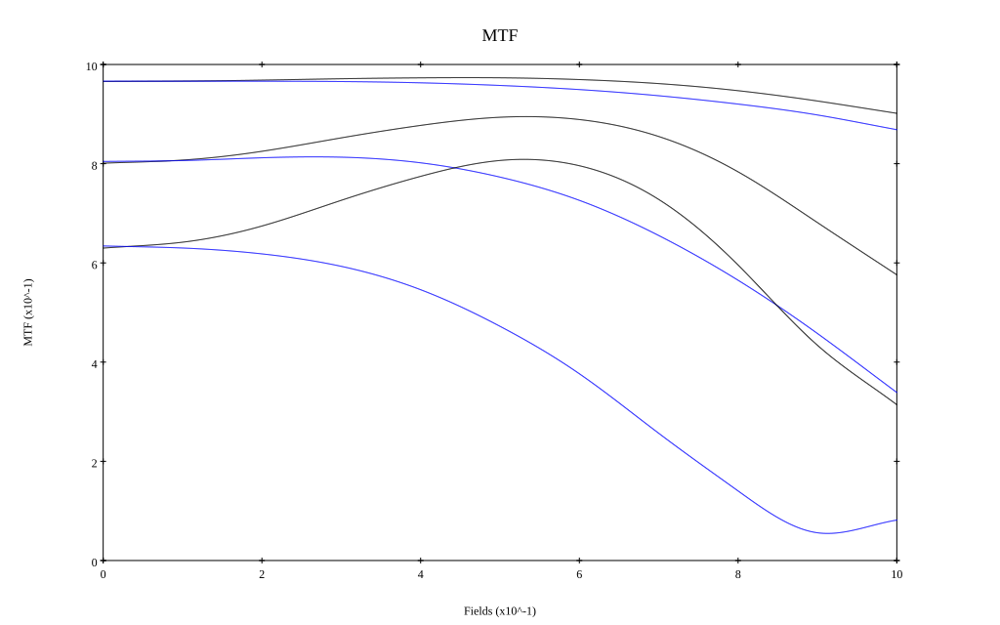

# Nikkor 300mm f4.5 ED
## Patent Information
| Country | Patent Number | Example | Year of Application | Inventors | Organisation | Link |
| ---     | ---           | ---     | ---                 | ---       | ---          | ---  |
|US | US3774991 | EX 1 | 1971 | Y Shimizu | Nikon Corp  | [link](https://patents.google.com/patent/US3774991A/en) |
## Surface Data
Note that where glass types are shown the refractive index and abbe number is as per assigned glass type

| ID  | Radius | Thickness | Diameter | nd  | vd  | Glass Make | Glass |
| --- | ---    | ---       | ---      | --- | --- | ---        | ---   |
| 1 | 123.575 | 11.0 | 69.02 | 1.497 | 81.64 | Hikari | J-FK01A |
| 2 | -156.939 | 4.0 | 69.02 |  |  |  |
| 3 | -144.0 | 3.0 | 65.74 | 1.744 | 44.8 | Hikari | J-LAF2 |
| 4 | 130.0 | 12.0 | 65.54 | 1.6393 | 44.83 | Hikari | J-BAF12 |
| 5 | 650.0 | 1.0 | 64.92 |  |  |  |
| 6 | 90.235 | 7.7 | 64.92 | 1.497 | 81.64 | Hikari | J-FK01A |
| 7 | 2060.303 | 69.3 | 64.92 |  |  |  |
| 8 | AS | 50.0 | 34.722 |  |  |  |
| 9 | -43.0 | 1.0 | 29.2 | 1.62041 | 60.25 | Hikari | J-SK16 |
| 10 | 150.0 | 3.5 | 29.2 | 1.62004 | 36.4 | Hikari | J-F2 |
| 11 | -104.82 | 73.334 | 29.2 |  |  |  |
## Layouts

## Spot Diagrams

## Paraxial Parameters
| parameter | value |
| ---       | ---   |
| effective_focal_length |302.284
| back_focal_length | 73.316
| optical_invariant | 2.399
| object_distance | 1.0E10
| image_distance | 73.316
| power | 0.003
| pp1_H | -331.776
| ppk_H' | -228.967
| ffl_F | -634.059
| fno | 4.5
| enp_dist_P | 178.047
| enp_radius | 33.587
| exp_dist_P' | -39.218
| exp_radius | 12.502
| m | -0
| red | -3.308152496166719E7
| n_obj | 1
| n_img | 1
| img_ht | 21.588
| obj_ang | 4.085
| obj_na | 0
| img_na | -0.11|
## Spot Analysis
| Field | Spot Mean Radius | Spot Max Radius |
| ---   | ---              | ---             |
 | Field(x=0.0, y=0.0) | 3.185 | 9.985|
 | Field(x=0.0, y=0.1) | 3.161 | 9.983|
 | Field(x=0.0, y=0.2) | 3.044 | 9.444|
 | Field(x=0.0, y=0.3) | 3.046 | 8.594|
 | Field(x=0.0, y=0.4) | 3.277 | 7.382|
 | Field(x=0.0, y=0.5) | 3.82 | 8.872|
 | Field(x=0.0, y=0.6) | 4.66 | 11.814|
 | Field(x=0.0, y=0.7) | 5.712 | 14.616|
 | Field(x=0.0, y=0.8) | 6.99 | 17.244|
 | Field(x=0.0, y=0.9) | 8.424 | 19.606|
 | Field(x=0.0, y=1.0) | 10.012 | 22.231|
## Polychromatic Geometric MTF

* 10,30,50 cycles/mm
* Black lines represent sagittal, blue tangential
* To generate above, MTFs for wavelengths 587.5618(d), 486.1327(F), 656.2725(C) were calculated across 10 fields, and then averaged
## Polychromatic Geometric MTF (Weighted)

* 10,30,50 cycles/mm
* Black lines represent sagittal, blue tangential
* To generate above, MTFs for wavelengths 587.5618(d) wt(1.0), 656.2725(C) wt(0.475), 546.074(e) wt(0.98), 486.1327(F) wt(0.49), 435.8343(g) wt(0.15) were calculated across 10 fields, and then combined using weighted average
## Resources
* [OpticalBench Compatible Data File, tab delimited](./prescription.txt)
* [Zemax file](./US3774991_Example01a.zmx)

Report / Zemax file generated using [Beam42](https://github.com/BeamFour/Beam42) on 2026-02-25
