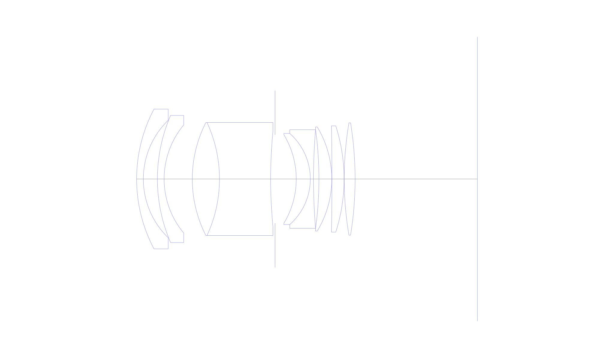
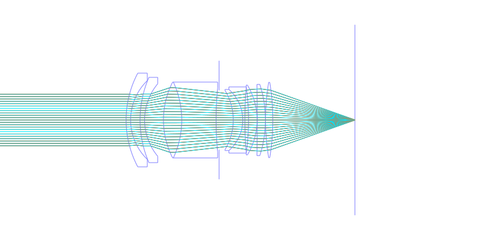
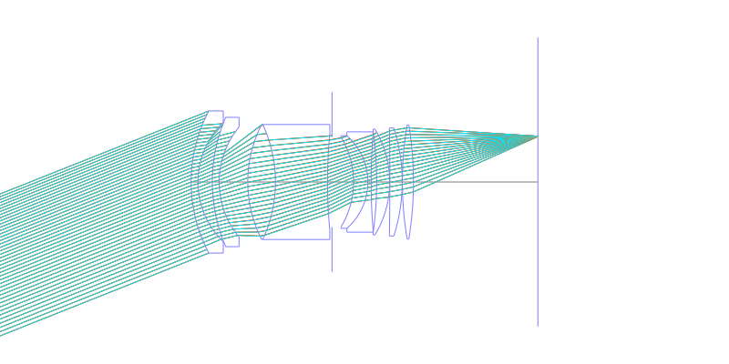
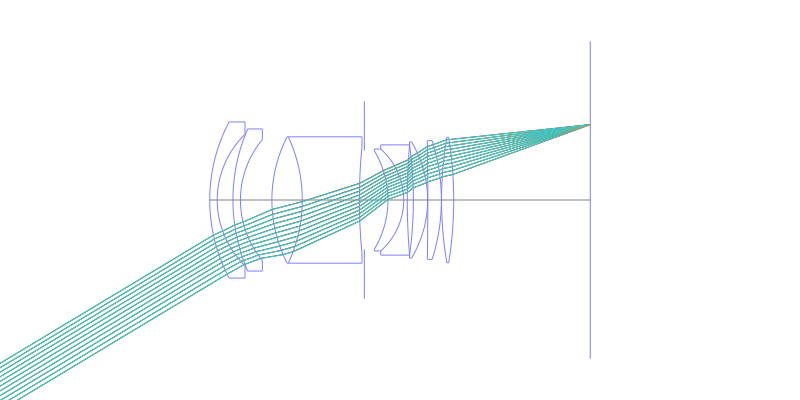
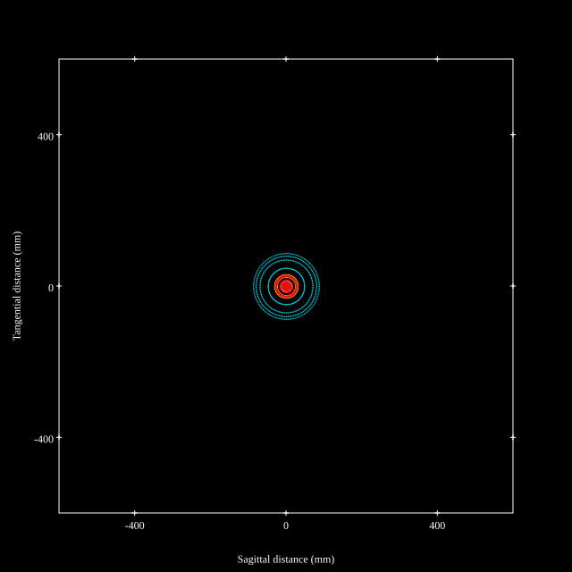
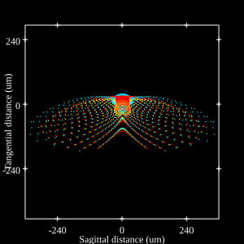
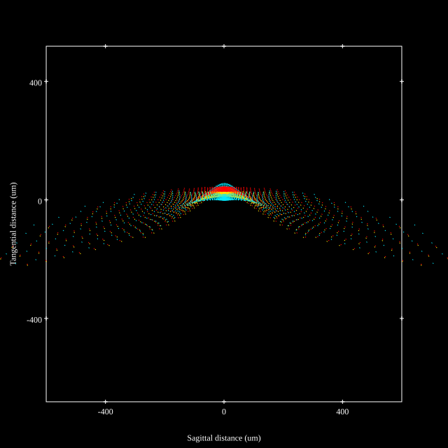
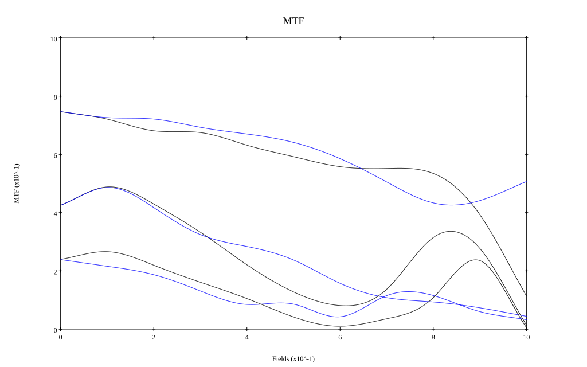
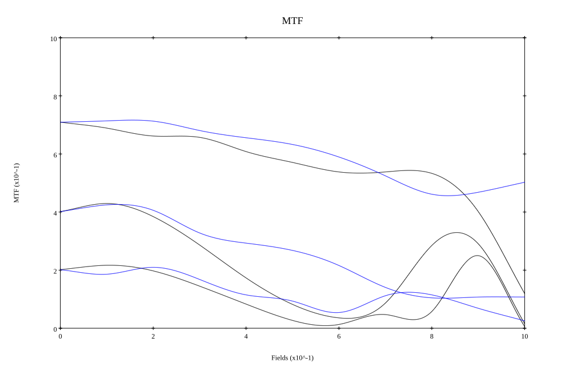

# AI Nikkor 35mm F1.4S
## Patent Information
| Country | Patent Number | Example | Year of Application | Inventors | Organisation | Link |
| ---     | ---           | ---     | ---                 | ---       | ---          | ---  |
|US | US3576360 | EX 1 | 1968 | Yoshiyuki Shimizu | Nikon Corp  | [link](https://patents.google.com/patent/US3576360A/en) |
## Surface Data
Note that where glass types are shown the refractive index and abbe number is as per assigned glass type

| ID  | Radius | Thickness | Diameter | nd  | vd  | Glass Make | Glass |
| --- | ---    | ---       | ---      | --- | --- | ---        | ---   |
| 1 | 45.403 | 2.0416 | 42.5 | 1.56883 | 56.0 | Hikari | J-BAK4 |
| 2 | 24.889 | 4.2777 | 35.72 |  |  |  |
| 3 | 48.611 | 2.0416 | 38.68 | 1.54814 | 45.51 | Hikari | J-LLF1 |
| 4 | 25.667 | 8.5554 | 32.88 |  |  |  |
| 5 | 37.722 | 8.2639 | 34.39 | 1.804 | 46.6 | Hikari | J-LASF015 |
| 6 | -40.833 | 15.5554 | 34.39 | 1.50137 | 56.41 | Schott | K10 |
| 7 | 151.211 | 1.3436 | 29.18 |  |  |  |
| 8 | AS | 6.4341 | 26.889 |  |  |  |
| 9 | -25.968 | 4.2777 | 26.94 | 1.804 | 46.6 | Hikari | J-LASF015 |
| 10 | -18.472 | 0.9723 | 27.71 | 1.7847 | 26.27 | Hikari | J-SFS3 |
| 11 | 180.27 | 1.6527 | 30.0 |  |  |  |
| 12 | -110.133 | 3.8889 | 30.0 | 1.7725 | 49.62 | Hikari | J-LASF016 |
| 13 | -30.625 | 0.0487 | 31.66 |  |  |  |
| 14 | -972.222 | 3.6946 | 32.31 | 1.7725 | 49.62 | Hikari | J-LASF016 |
| 15 | -52.938 | 0.0487 | 32.31 |  |  |  |
| 16 | 102.084 | 3.3054 | 34.15 | 1.713 | 53.96 | Hikari | J-LAK8 |
| 17 | -106.434 | 37.165 | 34.15 |  |  |  |
## Layouts

## Spot Diagrams

## Paraxial Parameters
| parameter | value |
| ---       | ---   |
| effective_focal_length |35.004
| back_focal_length | 37.265
| optical_invariant | 7.51
| object_distance | 1.0E10
| image_distance | 37.265
| power | 0.029
| pp1_H | 45.77
| ppk_H' | 2.262
| ffl_F | 10.766
| fno | 1.4
| enp_dist_P | 26.925
| enp_radius | 12.499
| exp_dist_P' | -38.46
| exp_radius | 27.075
| m | -0
| red | -2.856836426071775E8
| n_obj | 1
| n_img | 1
| img_ht | 21.032
| obj_ang | 31
| obj_na | 0
| img_na | -0.336|
## Spot Analysis
| Field | Spot Mean Radius | Spot Max Radius |
| ---   | ---              | ---             |
 | Field(x=0.0, y=0.0) | 27.892 | 86.849|
 | Field(x=0.0, y=0.1) | 31.15 | 126.729|
 | Field(x=0.0, y=0.2) | 38.599 | 173.376|
 | Field(x=0.0, y=0.3) | 46.028 | 204.653|
 | Field(x=0.0, y=0.4) | 53.356 | 234.324|
 | Field(x=0.0, y=0.5) | 57.929 | 275.95|
 | Field(x=0.0, y=0.6) | 69.494 | 320.082|
 | Field(x=0.0, y=0.7) | 88.41 | 400.795|
 | Field(x=0.0, y=0.8) | 115.601 | 514.272|
 | Field(x=0.0, y=0.9) | 145.316 | 613.071|
 | Field(x=0.0, y=1.0) | 180.335 | 716.007|
## Polychromatic Geometric MTF

* 10=red,30=blue,50=black cycles/mm
* Solid lines represent sagittal, dashed lines tangential
* To generate above, MTFs for wavelengths 587.5618(d), 486.1327(F), 656.2725(C) were calculated across 10 fields, and then averaged
## Polychromatic Geometric MTF (Weighted)

* 10=red,30=blue,50=black cycles/mm
* Solid lines represent sagittal, dashed lines tangential
* To generate above, MTFs for wavelengths 587.5618(d) wt(1.0), 656.2725(C) wt(0.475), 546.074(e) wt(0.98), 486.1327(F) wt(0.49), 435.8343(g) wt(0.15) were calculated across 10 fields, and then combined using weighted average
## Resources
* [OpticalBench Compatible Data File, tab delimited](./prescription.txt)
* [Zemax file](./US003576360_Example01a.zmx)

Report / Zemax file generated using [Beam42](https://github.com/BeamFour/Beam42) on 2026-07-07
