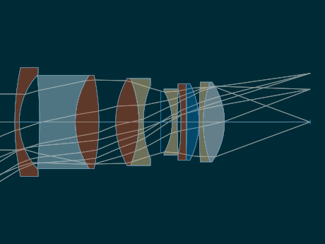
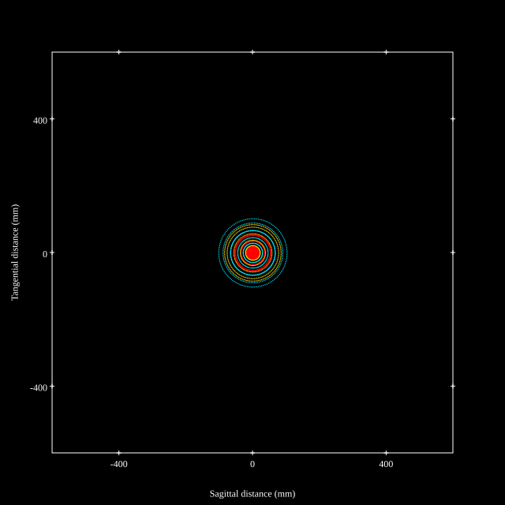
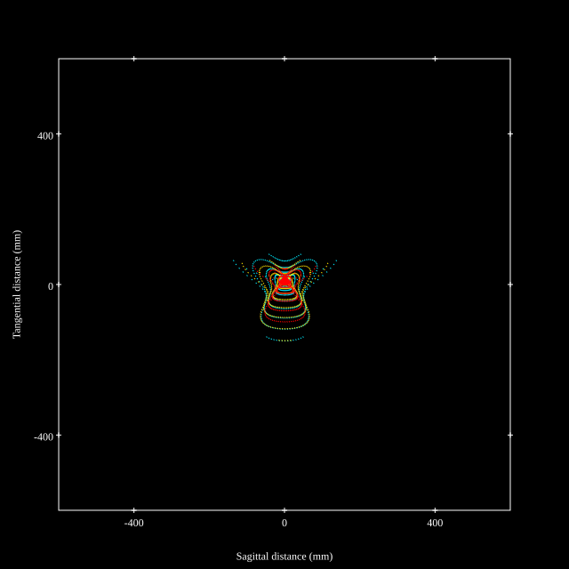
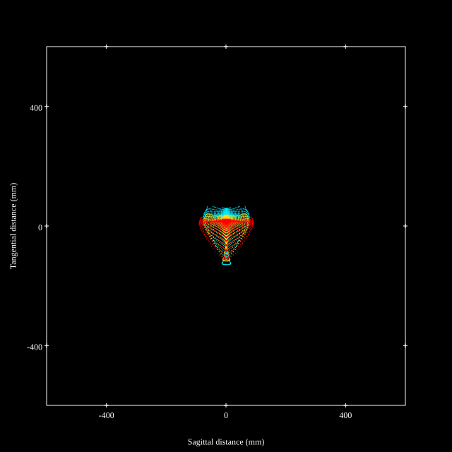
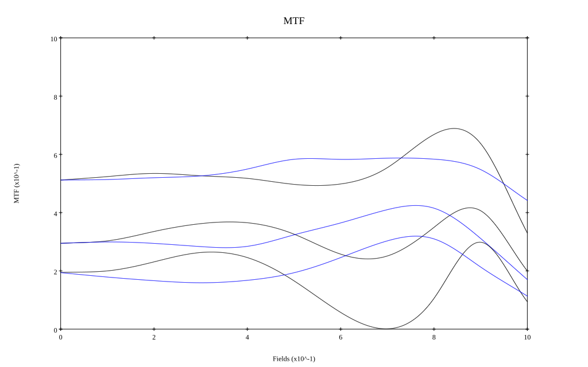

# AFS Nikkor 35mm F1.4G
## Patent Information
| Country | Patent Number | Example | Year of Application | Inventors | Organisation | Link |
| ---     | ---           | ---     | ---                 | ---       | ---          | ---  |
|US | US7663816 | EX 1 | 2007 | Haruo Sato | Nikon Corp | [link](https://patents.google.com/patent/US7663816B2/en) |
## Surface Data
Note that where glass types are shown the refractive index and abbe number is as per assigned glass type

| ID  | Radius | Thickness | Diameter | nd  | vd  | Glass Make | Glass |
| --- | ---    | ---       | ---      | --- | --- | ---        | ---   |
| 1 | 115.1525 | 2.0 | 48.32 | 1.816 | 46.62 | Ohara | S-LAH59 |
| 2 | 31.1674 | 9.0 | 42.52 |  |  |  |
| 3 | -215.844 | 15.85 | 41.5 | 1.5168 | 64.13 | Hikari | J-BK7A |
| 4 | 38.1486 | 10.5 | 40.64 | 1.816 | 46.62 | Ohara | S-LAH59 |
| 5 | -101.0097 | 7.40434 | 40.64 |  |  |  |
| 6 | 39.4576 | 10.3 | 38.6 | 1.883 | 40.77 | Ohara | S-LAH58 |
| 7 | -52.1142 | 2.0 | 38.6 | 1.71736 | 29.57 | Hikari | J-SF1 |
| 8 | 42.9666 | 7.75179 | 32.44 |  |  |  |
| 9 | AS | 5.0 | 27.462 |  |  |  |
| 10 | -28.2121 | 2.3 | 27.63 | 1.72825 | 28.38 | Hikari | J-SF10 |
| 11 | 233.7456 | 1.6 | 29.24 |  |  |  |
| 12 | -224.2964 | 2.5 | 29.46 | 1.7433 | 49.4 | Schott | N-LAF35 |
| 13 | -1000.0 | 5.5 | 33.68 | 1.6968 | 55.52 | Hikari | J-LAK14 |
| 14 | -38.4371 | 0.1 | 33.68 |  |  |  |
| 15 | 309.0744 | 1.8 | 33.68 | 1.57501 | 41.51 | Hikari | J-LF7 |
| 16 | 53.875 | 9.5 | 35.4 | 1.603 | 65.44 | Hikari | J-PSK03 |
| 17 | -30.9322 | 37.985 | 35.4 |  |  |  |
## Aspherical Data
| ID  | k   | P1  | P2  | P3  | P3 | P5 | P6 | P7 | P8 | P9 | P10 |
| --- | --- | --- | --- | --- | --- | --- | --- | --- | --- | --- | --- |
| 12 | 195.0 | 0.0 | 0.0 | -2.0873E-7 | -1.2426E-5 | 2.7998E-9 | -5.1736E-11 | 1.7973E-13 | -8.9748E-17 | 0.0 | 0.0 |
## Layouts

## Spot Diagrams

## Paraxial Parameters
| parameter | value |
| ---       | ---   |
| effective_focal_length |36
| back_focal_length | 38.029
| optical_invariant | 7.616
| object_distance | 1.0E10
| image_distance | 38.029
| power | 0.028
| pp1_H | 50.944
| ppk_H' | 2.029
| ffl_F | 14.944
| fno | 1.45
| enp_dist_P | 31.399
| enp_radius | 12.414
| exp_dist_P' | -40.689
| exp_radius | 27.159
| m | -0
| red | -2.777756945796129E8
| n_obj | 1
| n_img | 1
| img_ht | 22.087
| obj_ang | 31.53
| obj_na | 0
| img_na | -0.326|
## Spot Analysis
| Field | Spot Mean Radius | Spot Max Radius |
| ---   | ---              | ---             |
 | Field(x=0.0, y=0.0) | 41.121 | 102.305|
 | Field(x=0.0, y=0.1) | 45.798 | 163.497|
 | Field(x=0.0, y=0.2) | 52.637 | 227.964|
 | Field(x=0.0, y=0.3) | 50.659 | 224.627|
 | Field(x=0.0, y=0.4) | 43.807 | 209.267|
 | Field(x=0.0, y=0.5) | 42.197 | 166.01|
 | Field(x=0.0, y=0.6) | 41.173 | 175.742|
 | Field(x=0.0, y=0.7) | 37.666 | 150.968|
 | Field(x=0.0, y=0.8) | 34.9 | 150.491|
 | Field(x=0.0, y=0.9) | 36.38 | 145.39|
 | Field(x=0.0, y=1.0) | 50.802 | 128.277|
## Geometric MTF

* 10,30,50 cycles/mm
* Black lines represent sagittal, blue tangential
## Resources
* [OpticalBench Compatible Data File, tab delimited](./US007663816_Example01.txt)
* [Zemax file](./US007663816_Example01.zmx)
