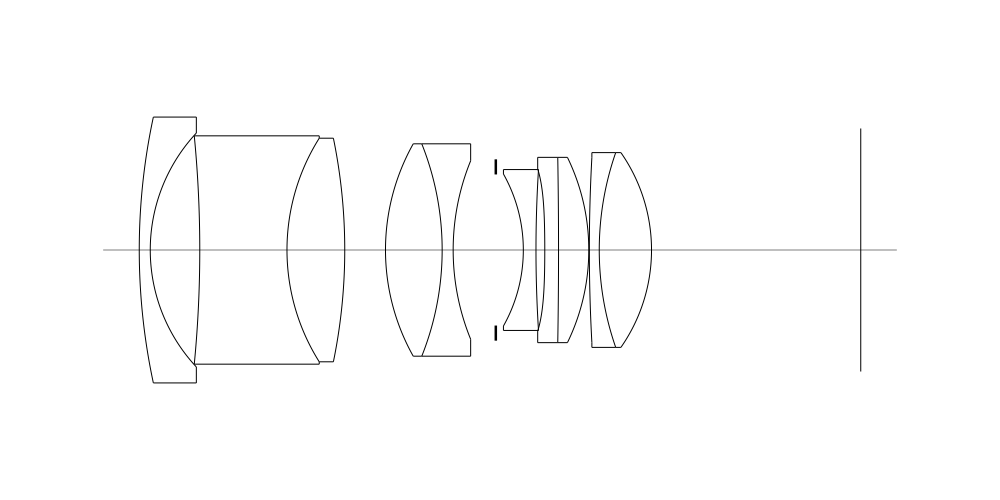
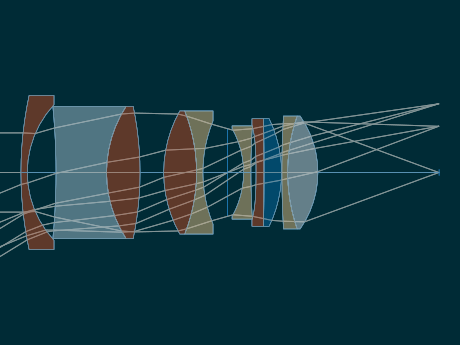
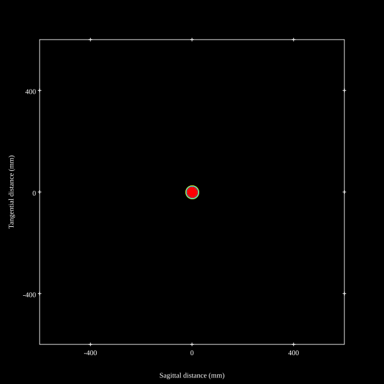
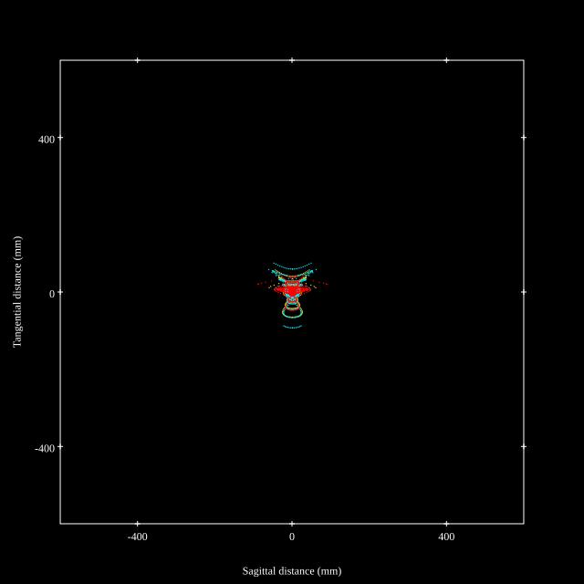
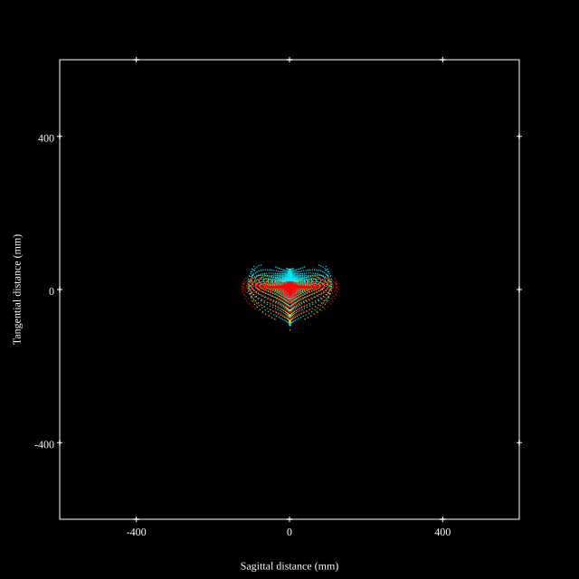
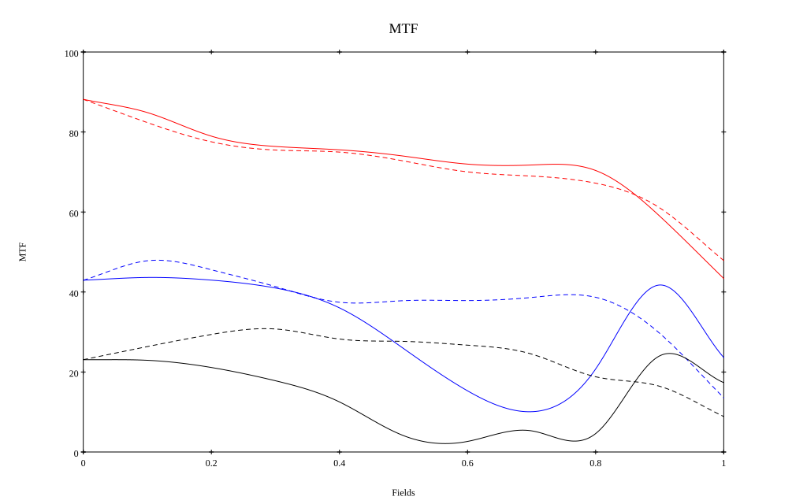
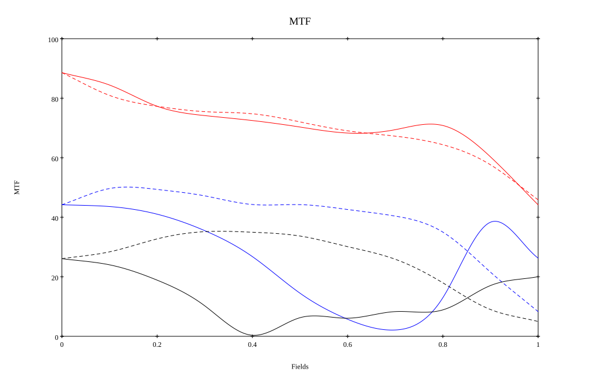

# AFS Nikkor 35mm F1.4G
## Patent Information
| Country | Patent Number | Example | Year of Application | Inventors | Organisation | Link |
| ---     | ---           | ---     | ---                 | ---       | ---          | ---  |
|US | US7663816 | EX 1 | 2007 | Haruo Sato | Nikon Corp | [link](https://patents.google.com/patent/US7663816B2/en) |
## Surface Data
Note that where glass types are shown the refractive index and abbe number is as per assigned glass type

| ID  | Radius | Thickness | Diameter | nd  | vd  | Glass Make | Glass |
| --- | ---    | ---       | ---      | --- | --- | ---        | ---   |
| 1 | 115.1525 | 2.0 | 48.32 | 1.816 | 46.57 | Hoya | TAF5 |
| 2 | 31.1674 | 9.0 | 42.52 |  |  |  |
| 3 | -215.844 | 15.85 | 41.5 | 1.5168 | 64.2 | Hoya | BSC7 |
| 4 | 38.1486 | 10.5 | 40.64 | 1.816 | 46.57 | Hoya | TAF5 |
| 5 | -101.0097 | 7.40434 | 40.64 |  |  |  |
| 6 | 39.4576 | 10.3 | 38.6 | 1.883 | 40.81 | Hoya | TAFD30 |
| 7 | -52.1142 | 2.0 | 38.6 | 1.71736 | 29.5 | Hoya | E-FD1 |
| 8 | 42.9666 | 7.75179 | 32.44 |  |  |  |
| 9 | AS | 5.0 | 27.462 |  |  |  |
| 10 | -28.2121 | 2.3 | 27.63 | 1.72825 | 28.46 | Ohara | PBH10 |
| 11 | 233.7456 | 1.6 | 29.24 |  |  |  |
| 12 | -224.2964 | 2.5 | 29.46 | 1.7433 | 49.33 | Hoya | M-NBF1 |
| 13 | -1000.0 | 5.5 | 33.68 | 1.6968 | 55.46 | Hoya | LAC14 |
| 14 | -38.4371 | 0.1 | 33.68 |  |  |  |
| 15 | 309.0744 | 1.8 | 33.68 | 1.57501 | 41.51 | Hoya | FL7 |
| 16 | 53.875 | 9.5 | 35.4 | 1.603 | 65.44 | Ohara | S-PHM53 |
| 17 | -30.9322 | 38.02909 | 35.4 |  |  |  |
## Aspherical Data
| ID  | Type | k   | P1 | P2 | P3 | P4 | P5 | P6 | P7 | P8 | P9 | P10 | P11 | P12 |
| --- | --- | --- | --- | --- | --- | --- | --- | --- | --- | --- | --- | --- | --- | --- |
| 12| RADIAL | 195.0 | 0.0 | 0.0 | -2.0873E-7 | -1.2426E-5 | 0.0 | 2.7998E-9 | 0.0 | -5.1736E-11 | 0.0 | 1.7973E-13 | 0.0 | -8.9748E-17 |
## Layouts

## Spot Diagrams

## Paraxial Parameters
| parameter | value |
| ---       | ---   |
| effective_focal_length |36
| back_focal_length | 38.029
| optical_invariant | 7.617
| object_distance | 1.0E10
| image_distance | 38.029
| power | 0.028
| pp1_H | 50.944
| ppk_H' | 2.029
| ffl_F | 14.944
| fno | 1.45
| enp_dist_P | 31.399
| enp_radius | 12.415
| exp_dist_P' | -40.733
| exp_radius | 27.162
| m | -0
| red | -2.777756945796129E8
| n_obj | 1
| n_img | 1
| img_ht | 22.087
| obj_ang | 31.53
| obj_na | 0
| img_na | -0.345|
## Spot Analysis
| Field | Spot Mean Radius | Spot Max Radius |
| ---   | ---              | ---             |
 | Field(x=0.0, y=0.0) | 11.508 | 39.158|
 | Field(x=0.0, y=0.1) | 16.014 | 85.578|
 | Field(x=0.0, y=0.2) | 24.246 | 145.598|
 | Field(x=0.0, y=0.3) | 27.393 | 145.35|
 | Field(x=0.0, y=0.4) | 26.214 | 143.098|
 | Field(x=0.0, y=0.5) | 24.893 | 132.215|
 | Field(x=0.0, y=0.6) | 23.829 | 130.532|
 | Field(x=0.0, y=0.7) | 22.961 | 95.712|
 | Field(x=0.0, y=0.8) | 24.031 | 95.926|
 | Field(x=0.0, y=0.9) | 31.505 | 97.949|
 | Field(x=0.0, y=1.0) | 49.498 | 125.731|
## Polychromatic Geometric MTF

* 10=red,30=blue,50=black cycles/mm
* Solid lines represent sagittal, dashed lines tangential
* To generate above, MTFs for wavelengths 587.5618(d), 486.1327(F), 656.2725(C) were calculated across 10 fields, and then averaged
## Polychromatic Geometric MTF (Weighted)

* 10=red,30=blue,50=black cycles/mm
* Solid lines represent sagittal, dashed lines tangential
* To generate above, MTFs for wavelengths 587.5618(d) wt(1.0), 656.2725(C) wt(0.475), 546.074(e) wt(0.98), 486.1327(F) wt(0.49), 435.8343(g) wt(0.15) were calculated across 10 fields, and then combined using weighted average
## Resources
* [OpticalBench Compatible Data File, tab delimited](./prescription.txt)
* [Zemax file](./US007663816_Example01.zmx)

Generated from `US007663816_Example01.txt`, status **TODO**

Report / Zemax file generated using [Beam42](https://github.com/BeamFour/Beam42) on 2026-10-01
