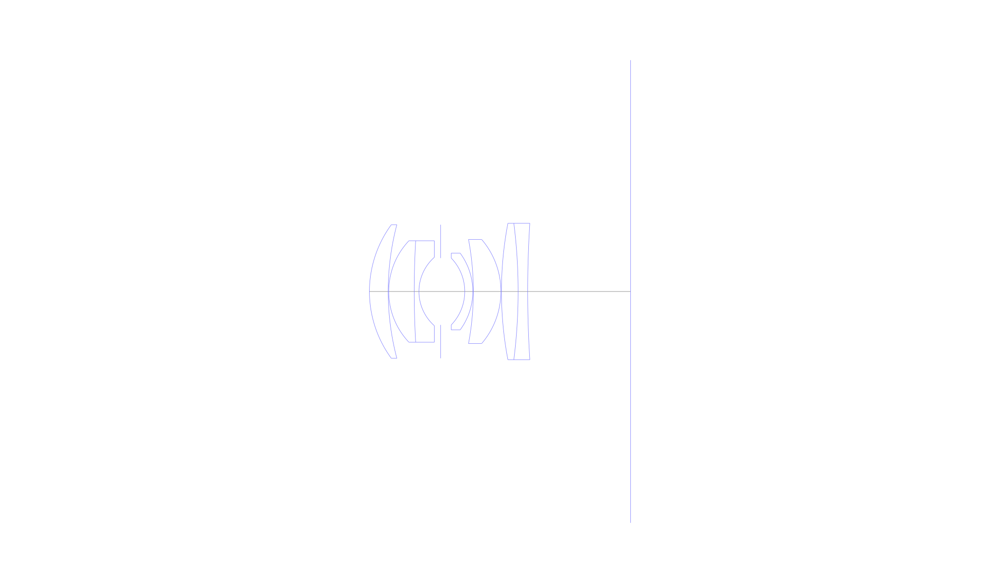
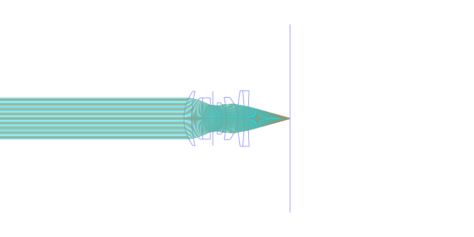
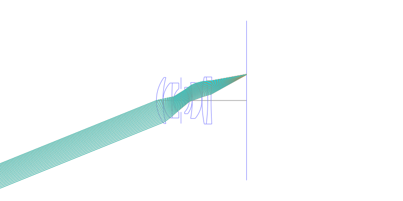
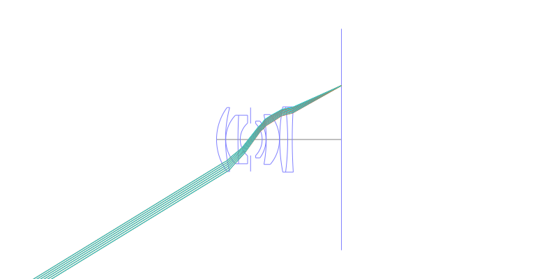
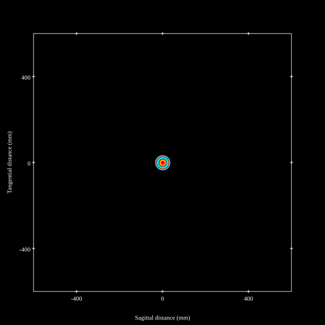
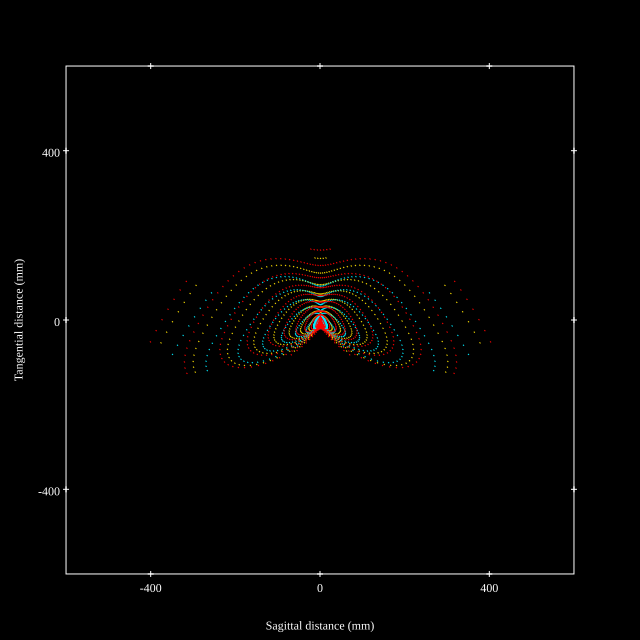
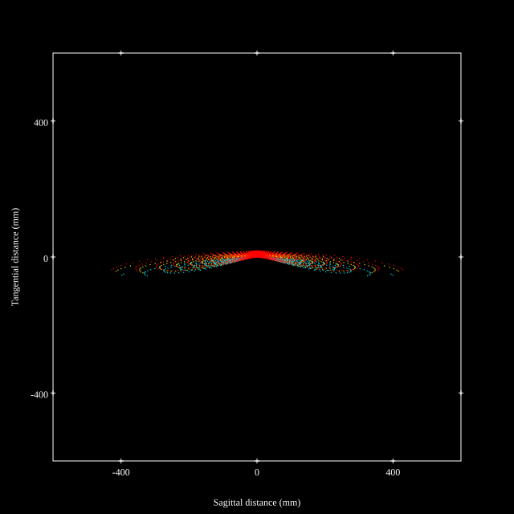
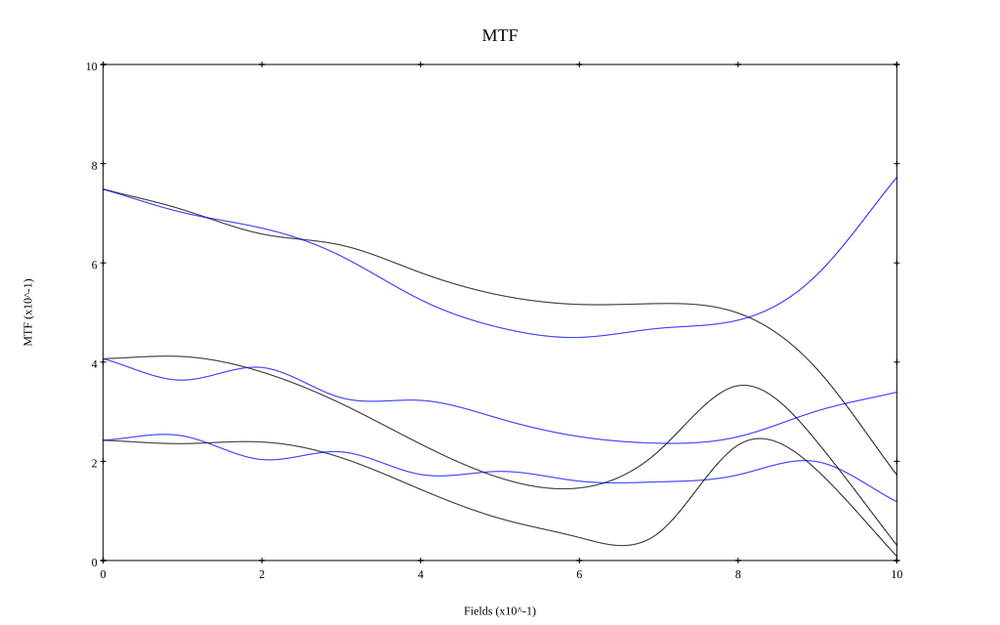

# W-Nikkor 3.5cm F1.8
## Patent Information
| Country | Patent Number | Example | Year of Application | Inventors | Organisation | Link |
| ---     | ---           | ---     | ---                 | ---       | ---          | ---  |
|US | US2896506 | EX 1 | 1956 | Azuma Hideo | Nikon Corp | [link](https://patents.google.com/patent/US2896506A) |
## Surface Data
Note that where glass types are shown the refractive index and abbe number is as per assigned glass type

| ID  | Radius | Thickness | Diameter | nd  | vd  | Glass Make | Glass |
| --- | ---    | ---       | ---      | --- | --- | ---        | ---   |
| 1 | 21.084 | 3.5 | 24.95 | 1.71999 | 50.27 | Hikari | J-LAK10 |
| 2 | 48.93 | 0.1 | 24.95 |  |  |  |
| 3 | 13.801 | 4.76 | 18.95 | 1.662 | 57.7 |  |
| 4 | 167.72 | 0.88 | 18.95 | 1.62045 | 38.08 | Schott | F9 |
| 5 | 8.537 | 4.04 | 12.78 |  |  |  |
| 6 | AS | 4.51 | 12.472 |  |  |  |
| 7 | -8.967 | 1.5 | 12.47 | 1.78472 | 25.68 | Schott | N-SF11 |
| 8 | -12.051 | 0.1 | 14.34 |  |  |  |
| 9 | -53.06 | 5.15 | 19.44 | 1.71999 | 50.27 | Hikari | J-LAK10 |
| 10 | -14.935 | 0.1 | 19.44 |  |  |  |
| 11 | 68.04 | 3.11 | 25.49 | 1.691 | 54.93 | Hikari | J-LAK9 |
| 12 | -101.605 | 1.785 | 25.49 | 1.78472 | 25.68 | Schott | N-SF11 |
| 13 | 204.925 | 19.2 | 25.49 |  |  |  |
## Layouts

## Spot Diagrams

## Paraxial Parameters
| parameter | value |
| ---       | ---   |
| effective_focal_length |34.922
| back_focal_length | 19.289
| optical_invariant | 5.945
| object_distance | 1.0E10
| image_distance | 19.289
| power | 0.029
| pp1_H | 17.853
| ppk_H' | -15.633
| ffl_F | -17.069
| fno | 1.8
| enp_dist_P | 16.243
| enp_radius | 9.701
| exp_dist_P' | -17.232
| exp_radius | 10.17
| m | -0
| red | -2.86349557184908E8
| n_obj | 1
| n_img | 1
| img_ht | 21.4
| obj_ang | 31.5
| obj_na | 0
| img_na | -0.268|
## Spot Analysis
| Field | Spot Mean Radius | Spot Max Radius |
| ---   | ---              | ---             |
 | Field(x=0.0, y=0.0) | 16.23 | 33.429|
 | Field(x=0.0, y=0.1) | 19.58 | 71.338|
 | Field(x=0.0, y=0.2) | 27.672 | 131.75|
 | Field(x=0.0, y=0.3) | 41.242 | 195.74|
 | Field(x=0.0, y=0.4) | 55.091 | 222.61|
 | Field(x=0.0, y=0.5) | 64.947 | 222.191|
 | Field(x=0.0, y=0.6) | 74.659 | 284.238|
 | Field(x=0.0, y=0.7) | 86.29 | 404.943|
 | Field(x=0.0, y=0.8) | 101.95 | 494.176|
 | Field(x=0.0, y=0.9) | 109.403 | 507.081|
 | Field(x=0.0, y=1.0) | 103.61 | 429.49|
## Geometric MTF

* 10,30,50 cycles/mm
* Black lines represent sagittal, blue tangential
## Resources
* [OpticalBench Compatible Data File, tab delimited](./US002896506_Example01.txt)
* [Zemax file](./US002896506_Example01.zmx)
