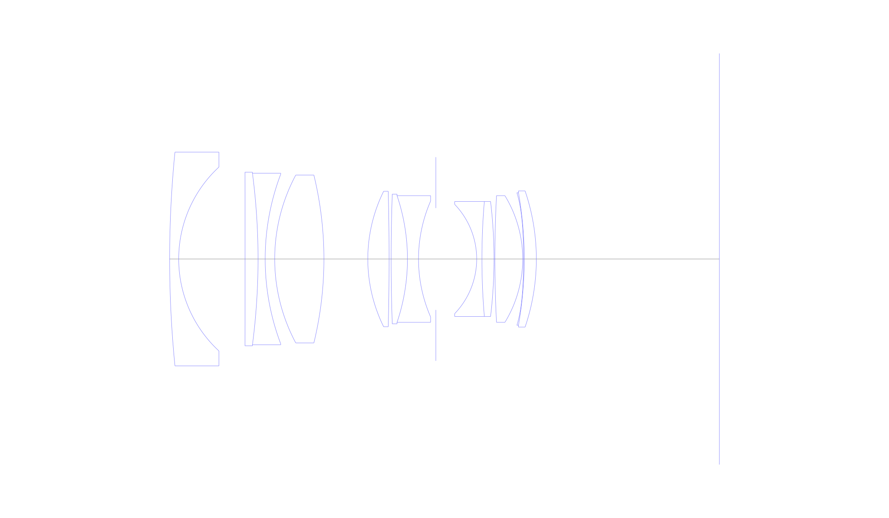
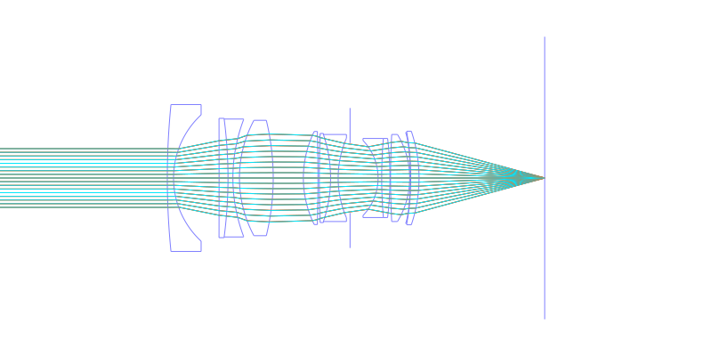
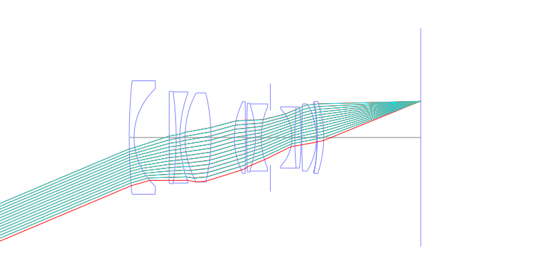
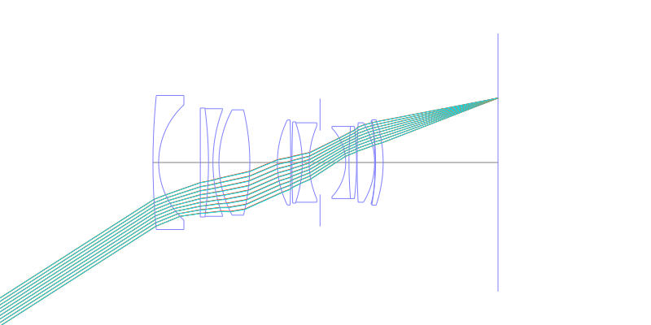
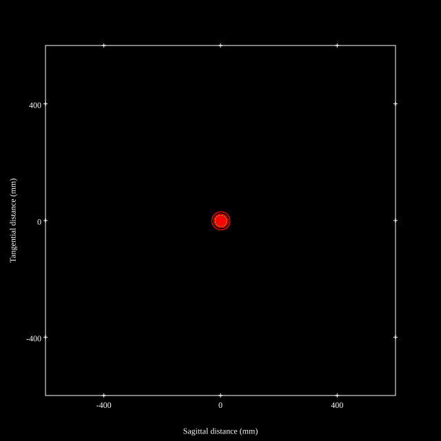
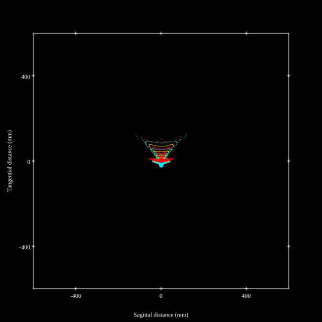
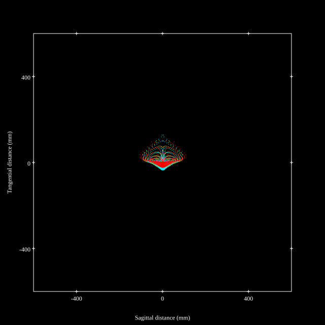
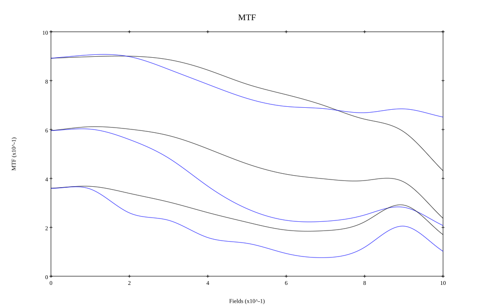
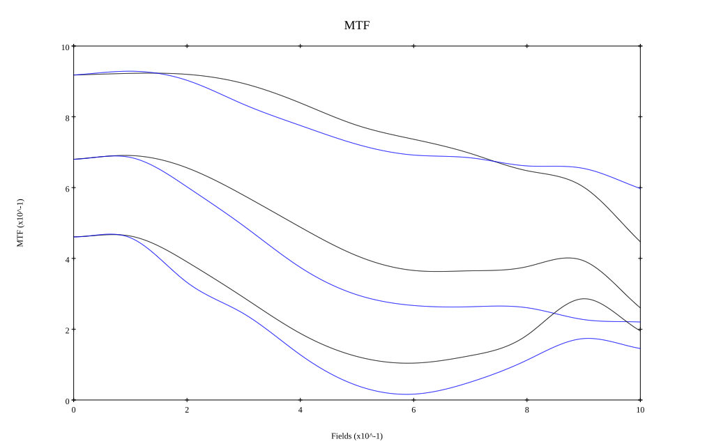

## Surface Data
Note that where glass types are shown the refractive index and abbe number is as per assigned glass type

| ID  | Radius | Thickness | Diameter | nd  | vd  | Glass Make | Glass |
| --- | ---    | ---       | ---      | --- | --- | ---        | ---   |
| 1 | 226.5998 | 1.9 | 44.92 | 1.58913 | 61.22 |  |
| 2 | 26.3342 | 13.931 | 38.64 |  |  |  |
| 3 | -8835.5536 | 2.725 | 36.48 | 1.78472 | 25.64 |  |
| 4 | -139.1833 | 1.5 | 36.06 | 1.58913 | 61.22 |  |
| 5 | 50.3375 | 2.0 | 35.7 |  |  |  |
| 6 | 37.406 | 10.33 | 35.28 | 1.62299 | 58.12 |  |
| 7 | -74.8089 | 9.215 | 35.28 |  |  |  |
| 8 | 32.1428 | 4.462 | 28.46 | 1.804 | 46.6 |  |
| 9 | -571.0364 | 0.434 | 28.46 |  |  |  |
| 10 | 391.7521 | 3.425 | 27.24 | 1.59319 | 67.9 |  |
| 11 | -41.6538 | 2.322 | 26.62 | 1.6727 | 32.18 |  |
| 12 | 30.4662 | 3.636 | 24.34 |  |  |  |
| 13 | AS | 8.575 | 21.403 |  |  |  |
| 14 | -16.5791 | 1.1 | 22.94 | 1.64769 | 33.72 |  |
| 15 | 143.1682 | 2.537 | 24.18 | 1.6968 | 55.52 |  |
| 16 | -101.1506 | 0.18 | 24.18 |  |  |  |
| 17 | 255.4058 | 5.844 | 26.62 | 1.7725 | 49.62 |  |
| 18 | -25.5855 | 0.18 | 26.62 |  |  |  |
| 19 | -124.4651 | 0.15 | 27.84 | 1.5361 | 41.21 |  |
| 20 | -80.1581 | 2.534 | 27.84 | 1.713 | 53.96 |  |
| 21 | -44.4932 | 38.42 | 28.62 |  |  |  |
## Aspherical Data
| ID  | k   | P1  | P2  | P3  | P3 | P5 | P6 | P7 | P8 | P9 | P10 |
| --- | --- | --- | --- | --- | --- | --- | --- | --- | --- | --- | --- |
| 19 | 0.0 | 0.0 | -1.39304E-5 | -6.37142E-9 | -3.21874E-11 | 0.0 | 0.0 | 0.0 | 0.0 | 0.0 | 0.0 |
## Layouts

## Spot Diagrams

## Paraxial Parameters
| parameter | value |
| ---       | ---   |
| effective_focal_length |34.517
| back_focal_length | 38.417
| optical_invariant | 5.95
| object_distance | 1.0E10
| image_distance | 38.417
| power | 0.029
| pp1_H | 45.962
| ppk_H' | 3.9
| ffl_F | 11.445
| fno | 1.861
| enp_dist_P | 28.856
| enp_radius | 9.275
| exp_dist_P' | -30.018
| exp_radius | 18.388
| m | -0
| red | -2.897121790594216E8
| n_obj | 1
| n_img | 1
| img_ht | 22.143
| obj_ang | 32.68
| obj_na | 0
| img_na | -0.259|
## Spot Analysis
| Field | Spot Mean Radius | Spot Max Radius |
| ---   | ---              | ---             |
 | Field(x=0.0, y=0.0) | 9.077 | 18.999|
 | Field(x=0.0, y=0.1) | 9.543 | 25.001|
 | Field(x=0.0, y=0.2) | 12.501 | 66.995|
 | Field(x=0.0, y=0.3) | 18.544 | 107.559|
 | Field(x=0.0, y=0.4) | 24.929 | 146.134|
 | Field(x=0.0, y=0.5) | 37.266 | 209.192|
 | Field(x=0.0, y=0.6) | 37.289 | 190.784|
 | Field(x=0.0, y=0.7) | 31.516 | 183.861|
 | Field(x=0.0, y=0.8) | 28.822 | 141.575|
 | Field(x=0.0, y=0.9) | 27.729 | 132.675|
 | Field(x=0.0, y=1.0) | 35.177 | 128.931|
## Polychromatic Geometric MTF

* 10,30,50 cycles/mm
* Black lines represent sagittal, blue tangential
* To generate above, MTFs for wavelengths 587.5618(d), 486.1327(F), 656.2725(C) were calculated across 10 fields, and then averaged
## Polychromatic Geometric MTF (Weighted)

* 10,30,50 cycles/mm
* Black lines represent sagittal, blue tangential
* To generate above, MTFs for wavelengths 587.5618(d) wt(1.0), 656.2725(C) wt(0.475), 546.074(e) wt(0.98), 486.1327(F) wt(0.49), 435.8343(g) wt(0.15) were calculated across 10 fields, and then combined using weighted average
## Resources
* [OpticalBench Compatible Data File, tab delimited](./JP2015-118186_Example01.txt)
* [Zemax file](./JP2015-118186_Example01.zmx)

This report / Zemax file generated using [Beam42](https://github.com/BeamFour/Beam42) on 2026-01-19
