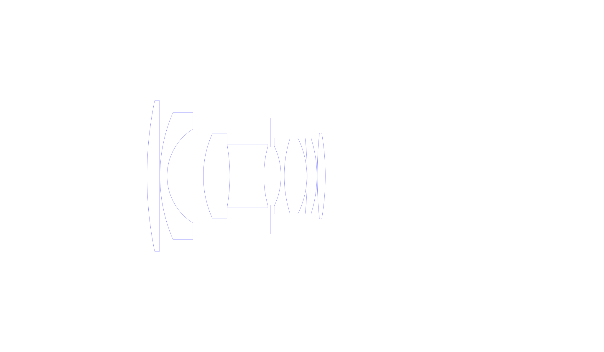
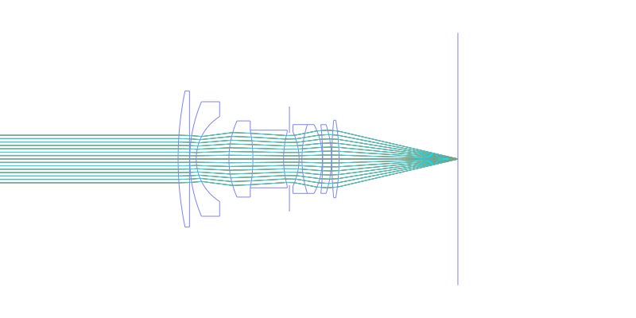
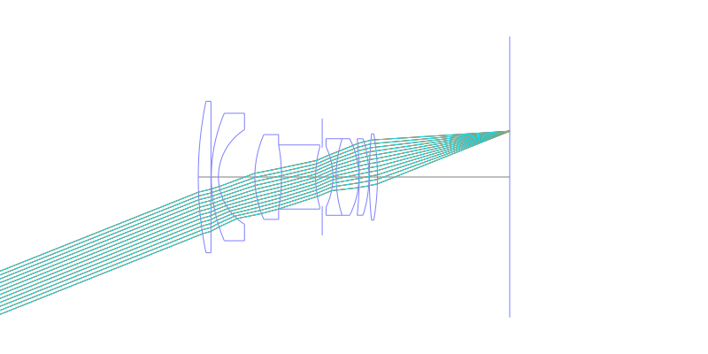
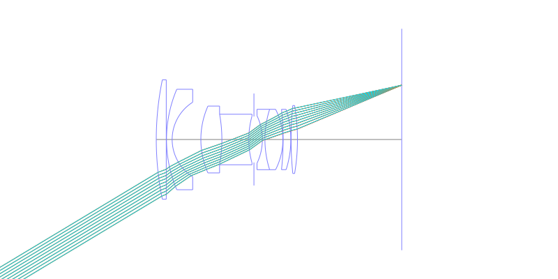
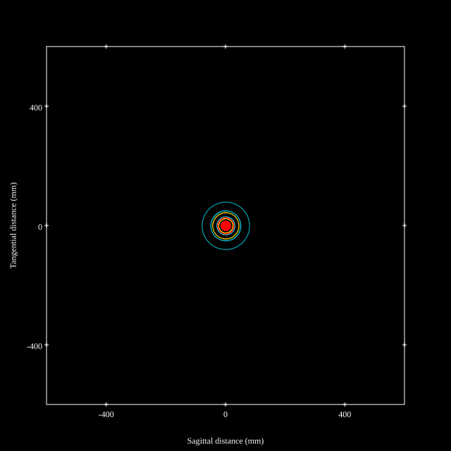
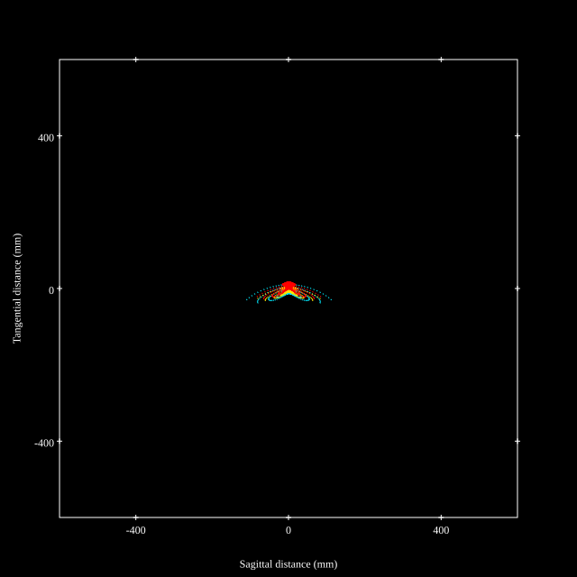
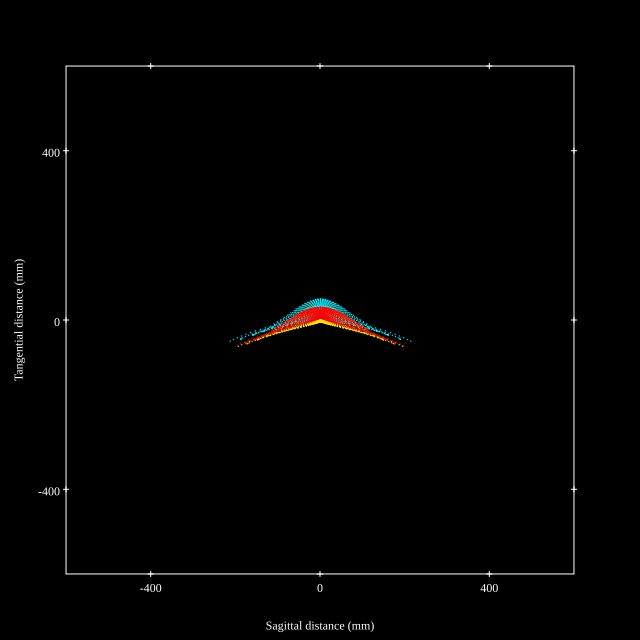
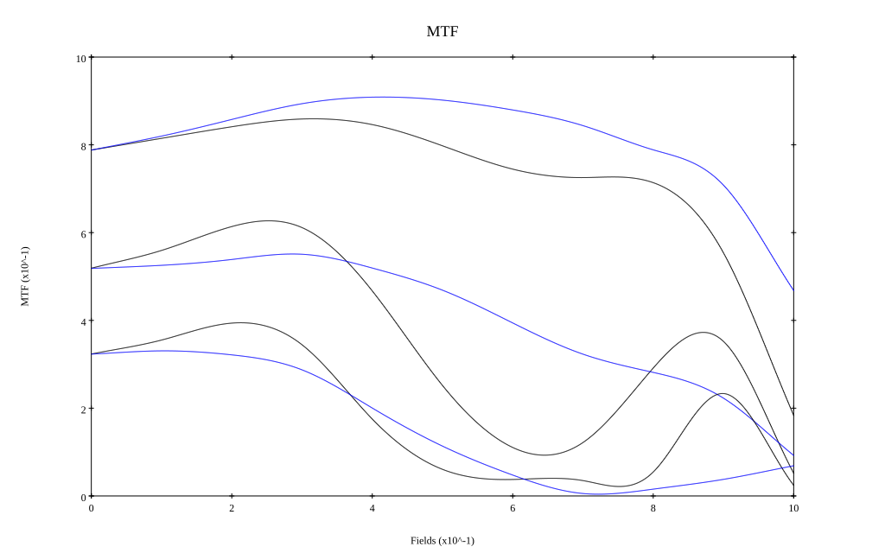

# Nikkor-S Auto 35mm f2
## Patent Information
| Country | Patent Number | Example | Year of Application | Inventors | Organisation | Link |
| ---     | ---           | ---     | ---                 | ---       | ---          | ---  |
|US | US3507558 | EX 1 | 1966 | Yoshiyuki Simizu | Nikon Corp | [link](https://patents.google.com/patent/US3507558A/en) |
## Surface Data
Note that where glass types are shown the refractive index and abbe number is as per assigned glass type

| ID  | Radius | Thickness | Diameter | nd  | vd  | Glass Make | Glass |
| --- | ---    | ---       | ---      | --- | --- | ---        | ---   |
| 1 | 115.621 | 3.8999 | 46.58 | 1.713 | 53.96 | Hikari | J-LAK8 |
| 2 | 0.0 | 0.1001 | 46.58 |  |  |  |
| 3 | 50.0 | 2.2 | 39.2 | 1.5168 | 64.13 | Hikari | J-BK7A |
| 4 | 17.201 | 11.2 | 29.08 |  |  |  |
| 5 | 32.202 | 8.2001 | 26.08 | 1.66755 | 41.87 | Hikari | J-BASF6 |
| 6 | -55.001 | 10.5001 | 19.72 | 1.51454 | 54.7 | Schott | KF3 |
| 7 | 33.998 | 2.0132 | 18.23 |  |  |  |
| 8 | AS | 3.2867 | 17.946 |  |  |  |
| 9 | -21.571 | 1.0001 | 18.57 | 1.7847 | 26.27 | Hikari | J-SFS3 |
| 10 | 38.79 | 6.9998 | 23.56 | 1.74429 | 50.77 | Schott | N-LAK28 |
| 11 | -25.819 | 0.1001 | 23.56 |  |  |  |
| 12 | -110.002 | 2.9999 | 23.52 | 1.76684 | 46.78 | Hikari | J-LASFH2 |
| 13 | -38.488 | 0.1001 | 23.52 |  |  |  |
| 14 | 130.0 | 2.4998 | 26.52 | 1.744 | 44.8 | Hikari | J-LAF2 |
| 15 | -79.049 | 40.68 | 26.52 |  |  |  |
## Layouts

## Spot Diagrams

## Paraxial Parameters
| parameter | value |
| ---       | ---   |
| effective_focal_length |36.01
| back_focal_length | 40.825
| optical_invariant | 5.409
| object_distance | 1.0E10
| image_distance | 40.825
| power | 0.028
| pp1_H | 42.28
| ppk_H' | 4.816
| ffl_F | 6.27
| fno | 2
| enp_dist_P | 27.806
| enp_radius | 9.002
| exp_dist_P' | -19.242
| exp_radius | 15.053
| m | -0
| red | -2.7770315159589213E8
| n_obj | 1
| n_img | 1
| img_ht | 21.637
| obj_ang | 31
| obj_na | 0
| img_na | -0.243|
## Spot Analysis
| Field | Spot Mean Radius | Spot Max Radius |
| ---   | ---              | ---             |
 | Field(x=0.0, y=0.0) | 21.014 | 79.351|
 | Field(x=0.0, y=0.1) | 16.421 | 82.457|
 | Field(x=0.0, y=0.2) | 14.637 | 83.279|
 | Field(x=0.0, y=0.3) | 13.176 | 84.518|
 | Field(x=0.0, y=0.4) | 13.18 | 86.892|
 | Field(x=0.0, y=0.5) | 14.149 | 90.238|
 | Field(x=0.0, y=0.6) | 15.688 | 99.928|
 | Field(x=0.0, y=0.7) | 18.12 | 114.031|
 | Field(x=0.0, y=0.8) | 23.132 | 137.122|
 | Field(x=0.0, y=0.9) | 35.646 | 171.338|
 | Field(x=0.0, y=1.0) | 60.559 | 218.786|
## Geometric MTF

* 10,30,50 cycles/mm
* Black lines represent sagittal, blue tangential
## Resources
* [OpticalBench Compatible Data File, tab delimited](./US003507558_Example01.txt)
* [Zemax file](./US003507558_Example01.zmx)
