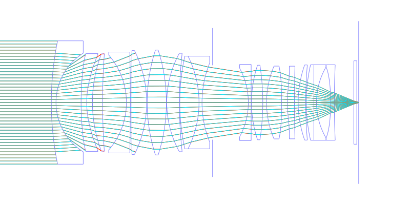
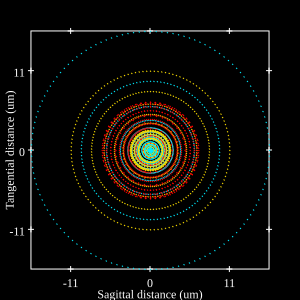
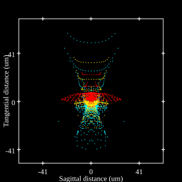
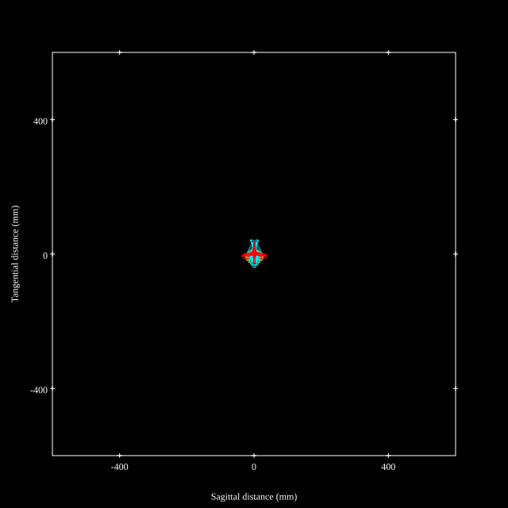
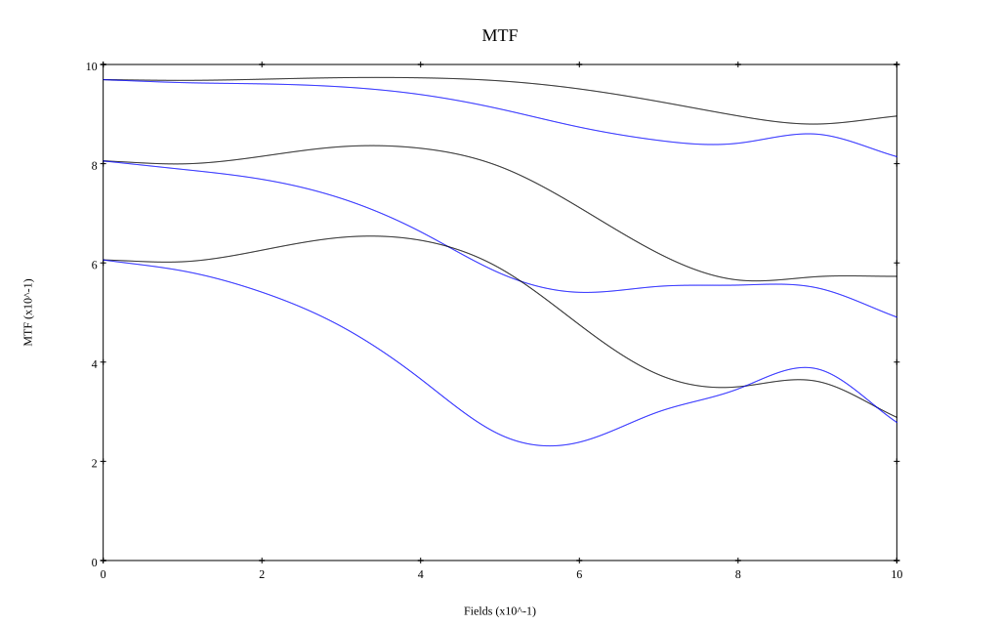

# Nikkor Z 35mm f/1.2 S
## Patent Information
| Country | Patent Number | Example | Year of Application | Inventors | Organisation | Link |
| ---     | ---           | ---     | ---                 | ---       | ---          | ---  |
|JP | JP2025-052870 | EX 1 | 2023 | Harada Masaki,Shimada Toshiyuki | Nikon Corp | [link](https://www.j-platpat.inpit.go.jp/c1801/PU/JP-2025-052870/11/en) |
## Surface Data
Note that where glass types are shown the refractive index and abbe number is as per assigned glass type

| ID  | Radius | Thickness | Diameter | nd  | vd  | Glass Make | Glass |
| --- | ---    | ---       | ---      | --- | --- | ---        | ---   |
| 1 | 163.28336 | 2.5 | 65.8 | 1.64 | 60.08 | Ohara | S-BSM81 |
| 2 | 31.10505 | 13.39 | 52.63 |  |  |  |
| 3 | 149.89871 | 3.0 | 52.15 | 1.5168 | 64.13 | Hikari | J-BK7A |
| 4 | 47.93253 | 3.06 | 52.15 |  |  |  |
| 5 | 73.4831 | 5.4 | 51.95 | 1.92119 | 23.96 | Hoya | FDS24 |
| 6 | 357.5441 | 12.73 | 51.95 |  |  |  |
| 7 | -38.63142 | 2.1 | 50.6 | 1.738 | 32.26 | Hikari | J-KZFH9 |
| 8 | -1220.6706 | 0.82 | 53.85 |  |  |  |
| 9 | 0.0 | 7.85 | 54.78 | 1.95375 | 32.33 | Hikari | J-LASFH21 |
| 10 | -62.49727 | 0.3 | 55.43 |  |  |  |
| 11 | 91.13243 | 10.25 | 55.96 | 1.59349 | 67.0 | Hikari | J-PSKH4 |
| 12 | -91.13243 | 0.2 | 55.96 |  |  |  |
| 13 | 54.79591 | 6.75 | 52.5 | 1.59349 | 67.0 | Hikari | J-PSKH4 |
| 14 | 240.05962 | 0.2 | 52.5 |  |  |  |
| 15 | 116.72066 | 10.25 | 49.48 | 1.59319 | 67.9 | Hikari | J-PSKH1 |
| 16 | -55.03 | 1.6 | 49.48 | 1.738 | 32.26 | Hikari | J-KZFH9 |
| 17 | 56.1782 | 5.63 | 42.14 |  |  |  |
| 18 | AS | 19.089 | 39.71 |  |  |  |
| 19 | -38.22319 | 1.5 | 36.5 | 1.72047 | 34.71 | Ohara | S-NBH8 |
| 20 | 0.0 | 0.2 | 40.64 |  |  |  |
| 21 | 63.64177 | 6.0 | 39.78 | 1.59319 | 67.9 | Hikari | J-PSKH1 |
| 22 | -130.91271 | 2.019 | 39.78 |  |  |  |
| 23 | 49.41555 | 8.0 | 38.83 | 1.59255 | 67.86 | Hikari | Q-PSKH1S |
| 24 | -821.27474 | 3.13 | 38.83 |  |  |  |
| 25 | 65.70231 | 3.75 | 38.75 | 1.77387 | 47.25 | Hikari | Q-LASFH11S |
| 26 | 690.07952 | 2.0 | 38.75 |  |  |  |
| 27 | 60.10155 | 4.0 | 40.07 | 1.59319 | 67.9 | Hikari | J-PSKH1 |
| 28 | 231.68418 | 0.31 | 40.07 |  |  |  |
| 29 | 90.05931 | 4.05 | 40.28 | 1.94594 | 17.98 | Hoya | FDS18 |
| 30 | 0.0 | 1.4 | 40.28 | 1.7888 | 28.43 | Ohara | S-NBH58 |
| 31 | 37.80163 | 7.53 | 37.82 |  |  |  |
| 32 | -124.60117 | 2.0 | 37.82 | 1.62299 | 58.12 | Hikari | J-SK15 |
| 33 | 448.63838 | 10.38 | 40.28 |  |  |  |
| 34 | 0.0 | 1.6 | 44.48 | 1.5168 | 64.13 | Hikari | J-BK7A |
| 35 | 0.0 | 1.0 | 44.48 |  |  |  |
## Aspherical Data
| ID  | k   | P1  | P2  | P3  | P3 | P5 | P6 | P7 | P8 | P9 | P10 |
| --- | --- | --- | --- | --- | --- | --- | --- | --- | --- | --- | --- |
| 3 | 0.0 | 0.0 | -1.9013E-6 | 5.9447E-9 | -7.3738E-12 | 6.8217E-15 | -2.333E-18 | 0.0 | 0.0 | 0.0 | 0.0 |
| 4 | 0.0 | 0.0 | -4.72665E-6 | 6.15115E-9 | -1.3635E-11 | 1.8812E-14 | -1.5668E-17 | 4.21E-21 | 0.0 | 0.0 | 0.0 |
| 24 | 0.0 | 0.0 | -1.45539E-5 | 3.33136E-8 | -7.3805E-11 | 1.2786E-13 | -1.3624E-16 | 8.2E-20 | -3.0514E-23 | 0.0 | 0.0 |
| 25 | 0.0 | 0.0 | -1.73911E-5 | 2.29349E-8 | -7.947E-11 | 2.3428E-13 | -5.4062E-16 | 8.6287E-19 | -6.3291E-22 | 0.0 | 0.0 |
| 32 | 0.0 | 0.0 | -6.15151E-6 | -3.25835E-10 | 1.0856E-11 | -5.9078E-14 | 0.0 | 0.0 | 0.0 | 0.0 | 0.0 |
## Layouts

## Spot Diagrams

## Paraxial Parameters
| parameter | value |
| ---       | ---   |
| effective_focal_length |34.437
| back_focal_length | 1.028
| optical_invariant | 8.987
| object_distance | 1.0E10
| image_distance | 1.028
| power | 0.029
| pp1_H | 52.788
| ppk_H' | -33.41
| ffl_F | 18.351
| fno | 1.23
| enp_dist_P | 35.889
| enp_radius | 13.999
| exp_dist_P' | -66.565
| exp_radius | 27.488
| m | -0
| red | -2.9038215704503983E8
| n_obj | 1
| n_img | 1
| img_ht | 22.108
| obj_ang | 32.7
| obj_na | 0
| img_na | -0.377|
## Spot Analysis
| Field | Spot Mean Radius | Spot Max Radius |
| ---   | ---              | ---             |
 | Field(x=0.0, y=0.0) | 5.686 | 19.939|
 | Field(x=0.0, y=0.1) | 6.282 | 29.308|
 | Field(x=0.0, y=0.3) | 5.813 | 29.345|
 | Field(x=0.0, y=0.5) | 7.571 | 36.506|
 | Field(x=0.0, y=0.7) | 10.884 | 51.077|
 | Field(x=0.0, y=1.0) | 12.884 | 44.008|
## Geometric MTF

* 10,30,50 cycles/mm
* Black lines represent sagittal, blue tangential
## Resources
* [OpticalBench Compatible Data File, tab delimited](./JP2025-052870_Example01P.txt)
* [Zemax file](./JP2025-052870_Example01P.zmx)
