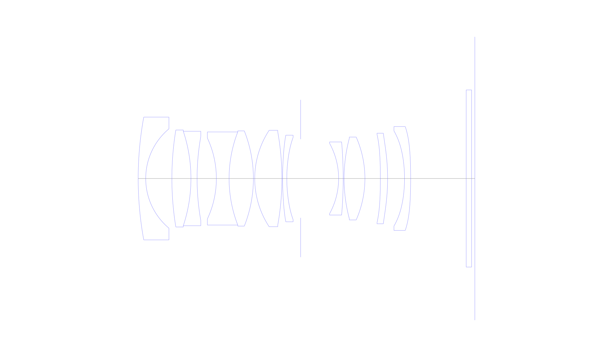
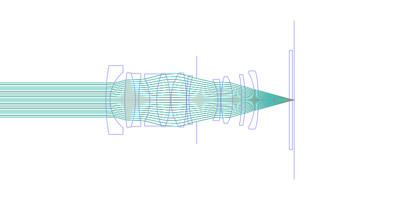
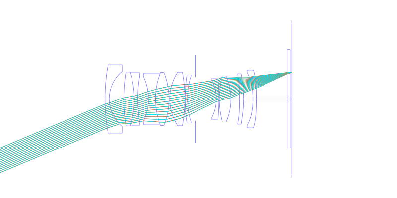
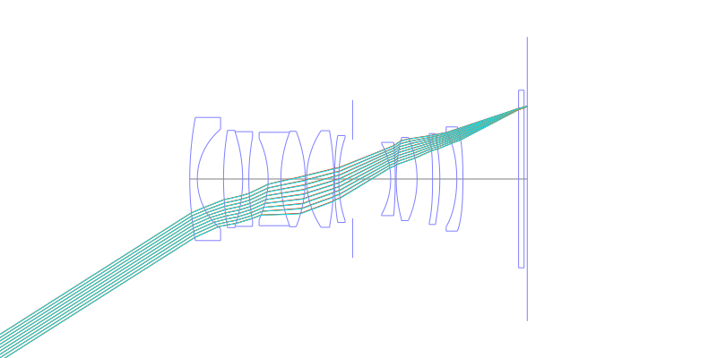
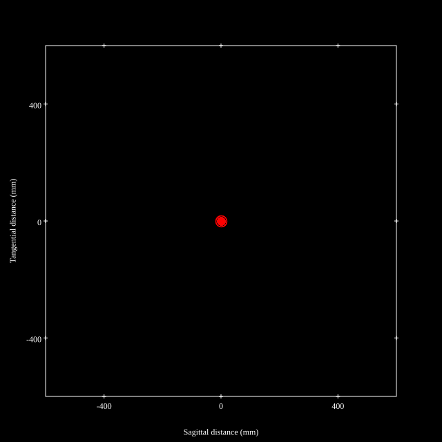
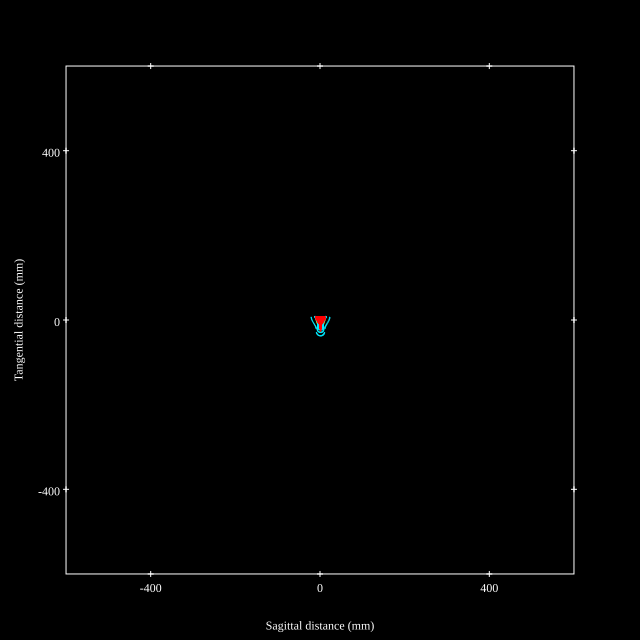
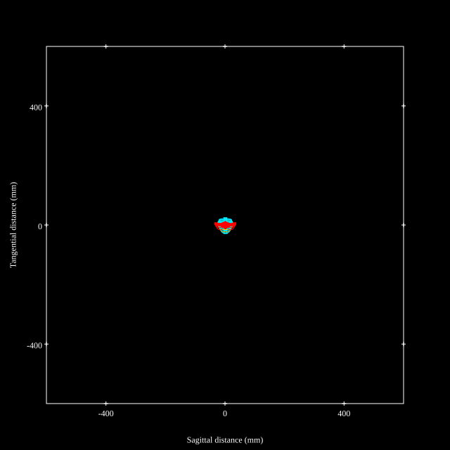
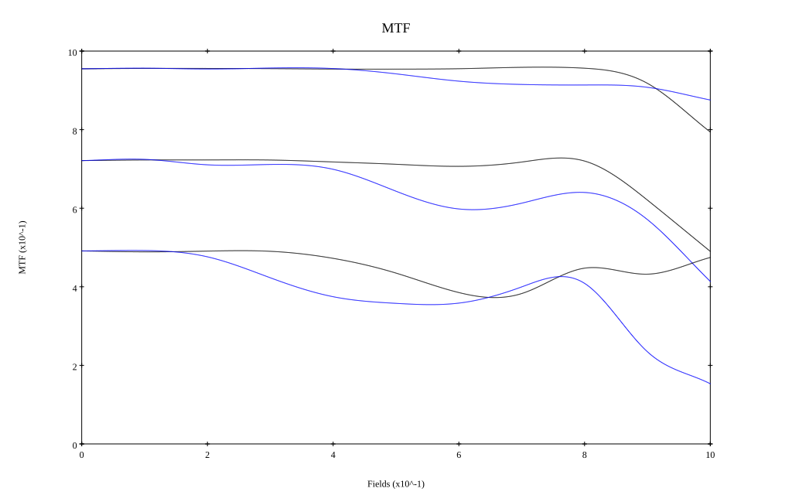
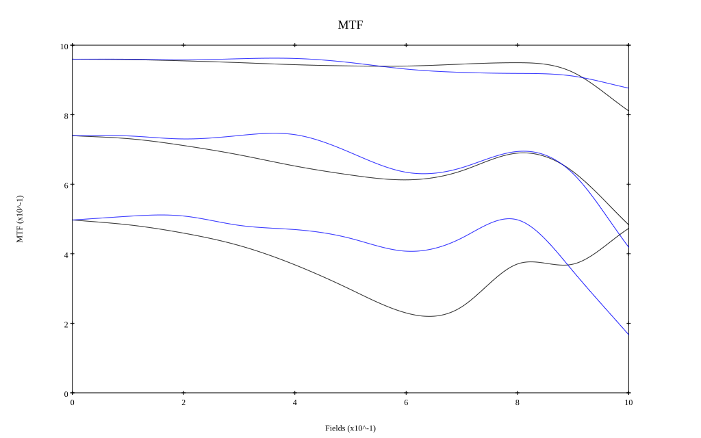

# Nikkor Z 35mm f/1.8 S
## Patent Information
| Country | Patent Number | Example | Year of Application | Inventors | Organisation | Link |
| ---     | ---           | ---     | ---                 | ---       | ---          | ---  |
|JP | JP2019-090947 | EX 4 | 2017 | Keiko Yamada,Ryosuke Imajima,Wataru Tatsuno,Haruo Sato | Nikon Corp, Konica Minolta Inc | [link](https://patents.google.com/patent/JP2019090947A/en) |
## Surface Data
Note that where glass types are shown the refractive index and abbe number is as per assigned glass type

| ID  | Radius | Thickness | Diameter | nd  | vd  | Glass Make | Glass |
| --- | ---    | ---       | ---      | --- | --- | ---        | ---   |
| 1 | 104.022 | 2.295 | 37.44 | 1.5168 | 64.13 | Hikari | J-BK7A |
| 2 | 19.764 | 7.965 | 30.285 |  |  |  |
| 3 | 91.6425 | 5.805 | 29.565 | 1.95375 | 32.33 | Hikari | J-LASFH21 |
| 4 | -45.6525 | 1.8675 | 28.8 | 1.60342 | 38.01 | Hoya | E-F5 |
| 5 | 72.8055 | 5.8725 | 25.605 |  |  |  |
| 6 | -29.12625 | 3.87 | 24.66 | 1.68893 | 31.16 | Hikari | J-SF8 |
| 7 | 39.41325 | 7.4025 | 28.395 | 1.8515 | 40.78 | Ohara | S-LAH89 |
| 8 | -39.41325 | 0.405 | 29.025 |  |  |  |
| 9 | 26.81325 | 8.28 | 29.385 | 1.497 | 81.61 | Hoya | FCD1 |
| 10 | -79.938 | 0.2025 | 28.395 |  |  |  |
| 11 | 93.501 | 1.2825 | 26.415 | 1.834 | 37.35 | Hoya | NBFD10 |
| 12 | 44.631 | 4.2075 | 25.065 |  |  |  |
| 13 | AS | 11.565 | 23.985 |  |  |  |
| 14 | -22.31325 | 1.395 | 21.51 | 1.61293 | 36.96 | Hoya | E-F3 |
| 15 | -130.0275 | 0.27 | 22.275 |  |  |  |
| 16 | 47.799 | 6.345 | 24.48 | 1.59282 | 68.62 | Hoya | FCD515 |
| 17 | -31.3155 | 4.7025 | 25.29 |  |  |  |
| 18 | -189.38475 | 2.205 | 26.955 | 1.6935 | 53.34 | Hoya | LAC13 |
| 19 | -63.396 | 5.1525 | 27.63 |  |  |  |
| 20 | -42.68925 | 1.8675 | 29.025 | 1.58313 | 59.46 | Hoya | M-BACD12 |
| 21 | -156.033 | 16.8975 | 31.68 |  |  |  |
| 22 | 0.0 | 1.665 | 54.0 | 1.5168 | 64.13 | Hikari | J-BK7A |
| 23 | 0.0 | 0.97 | 54.0 |  |  |  |
## Aspherical Data
| ID  | k   | P1  | P2  | P3  | P3 | P5 | P6 | P7 | P8 | P9 | P10 |
| --- | --- | --- | --- | --- | --- | --- | --- | --- | --- | --- | --- |
| 11 | -4.9288 | 0.0 | -8.4122E-6 | 8.7453E-8 | -1.5819E-10 | 0.0 | 0.0 | 0.0 | 0.0 | 0.0 | 0.0 |
| 12 | -0.4693 | 0.0 | -7.335E-6 | 9.8656E-8 | -9.9784E-11 | 0.0 | 0.0 | 0.0 | 0.0 | 0.0 | 0.0 |
| 18 | 15.3255 | 0.0 | -1.8111E-5 | 1.1948E-8 | 0.0 | 0.0 | 0.0 | 0.0 | 0.0 | 0.0 | 0.0 |
| 19 | -0.9347 | 0.0 | -2.121E-7 | 2.0081E-8 | 6.7927E-11 | -7.646E-14 | 0.0 | 0.0 | 0.0 | 0.0 | 0.0 |
| 20 | -0.1889 | 0.0 | -1.0035E-5 | -2.6862E-8 | 0.0 | 0.0 | 0.0 | 0.0 | 0.0 | 0.0 | 0.0 |
| 21 | 0.0 | 0.0 | -8.2164E-6 | -3.2481E-8 | 6.5393E-11 | -8.7828E-14 | 0.0 | 0.0 | 0.0 | 0.0 | 0.0 |
## Layouts

## Spot Diagrams

## Paraxial Parameters
| parameter | value |
| ---       | ---   |
| effective_focal_length |35.373
| back_focal_length | 0.972
| optical_invariant | 6.079
| object_distance | 1.0E10
| image_distance | 0.972
| power | 0.028
| pp1_H | 35.497
| ppk_H' | -34.401
| ffl_F | 0.125
| fno | 1.85
| enp_dist_P | 25.133
| enp_radius | 9.56
| exp_dist_P' | -49.058
| exp_radius | 13.522
| m | -0
| red | -2.827022209346166E8
| n_obj | 1
| n_img | 1
| img_ht | 22.492
| obj_ang | 32.45
| obj_na | 0
| img_na | -0.261|
## Spot Analysis
| Field | Spot Mean Radius | Spot Max Radius |
| ---   | ---              | ---             |
 | Field(x=0.0, y=0.0) | 6.549 | 18.787|
 | Field(x=0.0, y=0.1) | 6.311 | 18.25|
 | Field(x=0.0, y=0.2) | 6.417 | 16.654|
 | Field(x=0.0, y=0.3) | 6.389 | 18.227|
 | Field(x=0.0, y=0.4) | 6.5 | 20.907|
 | Field(x=0.0, y=0.5) | 7.065 | 23.247|
 | Field(x=0.0, y=0.6) | 7.664 | 28.431|
 | Field(x=0.0, y=0.7) | 7.833 | 36.17|
 | Field(x=0.0, y=0.8) | 8.177 | 42.01|
 | Field(x=0.0, y=0.9) | 9.502 | 37.389|
 | Field(x=0.0, y=1.0) | 13.312 | 35.79|
## Polychromatic Geometric MTF

* 10,30,50 cycles/mm
* Black lines represent sagittal, blue tangential
* To generate above, MTFs for wavelengths 587.5618(d), 486.1327(F), 656.2725(C) were calculated across 10 fields, and then averaged
## Polychromatic Geometric MTF (Weighted)

* 10,30,50 cycles/mm
* Black lines represent sagittal, blue tangential
* To generate above, MTFs for wavelengths 587.5618(d) wt(1.0), 656.2725(C) wt(0.475), 546.074(e) wt(0.98), 486.1327(F) wt(0.49), 435.8343(g) wt(0.15) were calculated across 10 fields, and then combined using weighted average
## Resources
* [OpticalBench Compatible Data File, tab delimited](./JP2019-090947_Example04P.txt)
* [Zemax file](./JP2019-090947_Example04P.zmx)

Report / Zemax file generated using [Beam42](https://github.com/BeamFour/Beam42) on 2026-01-25
