# Nikkor 360-1200mm f11 ED
## Patent Information
| Country | Patent Number | Example | Year of Application | Inventors | Organisation | Link |
| ---     | ---           | ---     | ---                 | ---       | ---          | ---  |
|US | US3743384 | EX 1 | 1970 | Soichi Nakamura | Nikon Corp | [link](https://patents.google.com/patent/US3743384A) |
## Surface Data
Note that where glass types are shown the refractive index and abbe number is as per assigned glass type

| ID  | Radius | Thickness | Diameter | nd  | vd  | Glass Make | Glass |
| --- | ---    | ---       | ---      | --- | --- | ---        | ---   |
| 1 | 441.5 | 8.0 | 109.92 | 1.48606 | 81.49 | Schott | FK50 |
| 2 | -580.0 | 0.2 | 109.92 |  |  |  |
| 3 | 274.2 | 9.5 | 106.92 | 1.48606 | 81.49 | Schott | FK50 |
| 4 | -638.1 | 1.0 | 106.92 |  |  |  |
| 5 | -638.1 | 4.0 | 109.92 | 1.744 | 44.8 | Hikari | J-LAF2 |
| 6 | 298.2 | 6.0 | 109.92 | 1.58913 | 61.22 | Hikari | J-SK5 |
| 7 | 1281.5 | d7 | 109.92 |  |  |  |
| 8 | 8939.7 | 4.7 | 49.42 | 1.7552 | 27.51 | Hikari | E-SF4 |
| 9 | -126.6 | 2.6 | 49.42 | 1.58913 | 61.22 | Hikari | J-SK5 |
| 10 | 172.9 | 6.0 | 49.42 |  |  |  |
| 11 | -166.7 | 1.3 | 49.42 | 1.48606 | 81.49 | Schott | FK50 |
| 12 | 118.3 | 3.0 | 49.42 | 1.58875 | 51.18 | Ohara | BAL7 |
| 13 | 238.7 | 6.0 | 49.42 |  |  |  |
| 14 | -149.8 | 2.6 | 49.42 | 1.5168 | 64.17 | Schott | BK7 |
| 15 | 444.7 | d15 | 49.42 |  |  |  |
| 16 | -3106.9 | 3.5 | 50.92 | 1.62041 | 60.25 | Hikari | J-SK16 |
| 17 | -134.2 | 2.6 | 50.92 | 1.61293 | 36.94 | Hikari | J-F3 |
| 18 | -203.7 | 0.2 | 50.92 |  |  |  |
| 19 | 398.1 | 4.7 | 50.92 | 1.48606 | 81.49 | Schott | FK50 |
| 20 | -143.2 | 2.6 | 50.92 | 1.7552 | 27.51 | Hikari | E-SF4 |
| 21 | -246.4 | d21 | 50.92 |  |  |  |
| 22 | AS | 2.0 | a22 |  |  |  |
| 23 | 344.6 | 4.0 | 52.42 | 1.51454 | 54.63 | Hoya | CF3 |
| 24 | -577.7 | 6.2 | 52.42 |  |  |  |
| 25 | 85.8 | 6.0 | 51.42 | 1.48606 | 81.49 | Schott | FK50 |
| 26 | -1535.0 | 13.5 | 51.42 | 1.744 | 44.8 | Hikari | J-LAF2 |
| 27 | 80.0 | 6.3 | 51.42 | 1.6393 | 45.07 | Hoya | BAF12 |
| 28 | 136.359 | 139.4 | 51.42 |  |  |  |
| 29 | 385.1 | 2.7 | 38.06 | 1.50137 | 56.42 | Ohara | S-FTL10 |
| 30 | -385.1 | 15.2 | 38.06 |  |  |  |
| 31 | -124.9 | 2.8 | 39.98 | 1.74429 | 50.77 | Schott | N-LAK28 |
| 32 | 87.5 | 4.4 | 39.98 | 1.60342 | 38.03 | Ohara | S-TIM5 |
| 33 | -200.4 | d33 | 39.98 |  |  |  |
## Variables
| Variable | 360mm f11 | 1200mm f11 |
| --- | --- | --- |
| Focal length |360.0 |1200.0 |
| F-Number |11.0 |11.0 |
| Angle of View |6.8 |2.0 |
| d7 | 11.258 | 211.258 |
| d15 | 64.853 | 4.248 |
| d21 | 143.138 | 3.744 |
| a22 | 48.927 | 48.927 |
| d33 | 235.01 | 235.35 |
# 360mm f11
## Layouts
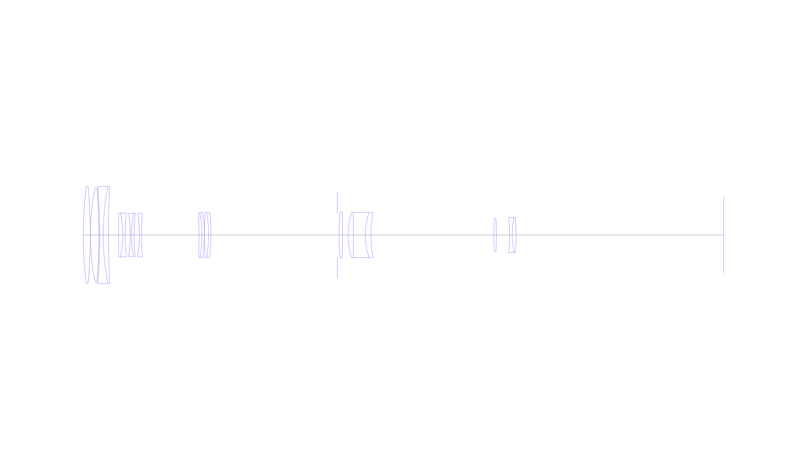
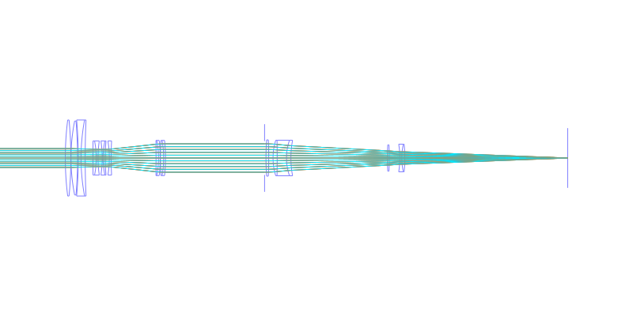
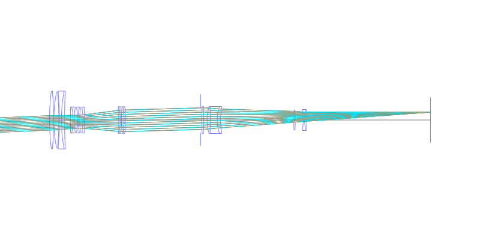
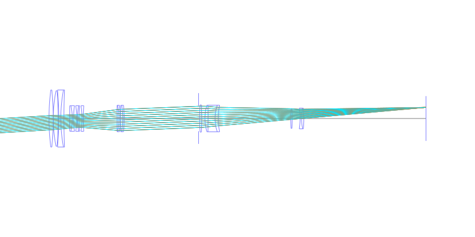
## Spot Diagrams
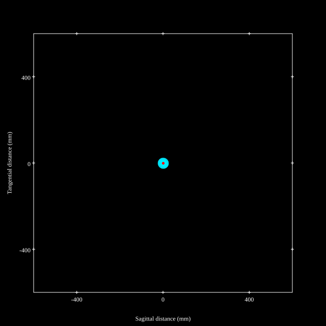
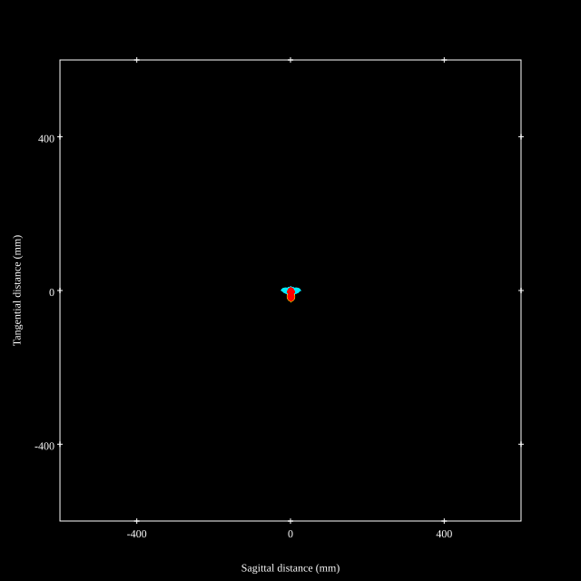
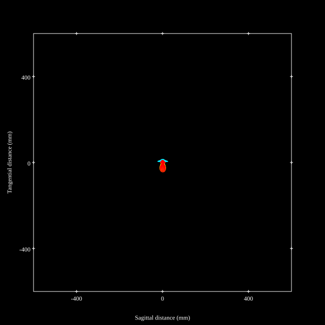
## Paraxial Parameters
| parameter | value |
| ---       | ---   |
| effective_focal_length |359.812
| back_focal_length | 235.049
| optical_invariant | 0.972
| object_distance | 1.0E10
| image_distance | 235.049
| power | 0.003
| pp1_H | 182.876
| ppk_H' | -124.763
| ffl_F | -176.936
| fno | 10.993
| enp_dist_P | 173.301
| enp_radius | 16.365
| exp_dist_P' | -134.561
| exp_radius | 16.812
| m | -0
| red | -2.779226706210901E7
| n_obj | 1
| n_img | 1
| img_ht | 21.377
| obj_ang | 3.4
| obj_na | 0
| img_na | -0.045|
## Spot Analysis
| Field | Spot Mean Radius | Spot Max Radius |
| ---   | ---              | ---             |
 | Field(x=0.0, y=0.0) | 4.073 | 8.48|
 | Field(x=0.0, y=0.1) | 4.194 | 10.652|
 | Field(x=0.0, y=0.2) | 4.573 | 11.924|
 | Field(x=0.0, y=0.3) | 4.903 | 12.695|
 | Field(x=0.0, y=0.4) | 5.309 | 12.828|
 | Field(x=0.0, y=0.5) | 5.944 | 17.273|
 | Field(x=0.0, y=0.6) | 6.872 | 22.035|
 | Field(x=0.0, y=0.7) | 8.025 | 27.094|
 | Field(x=0.0, y=0.8) | 9.346 | 32.415|
 | Field(x=0.0, y=0.9) | 10.815 | 37.96|
 | Field(x=0.0, y=1.0) | 12.743 | 41.201|
## Polychromatic Geometric MTF
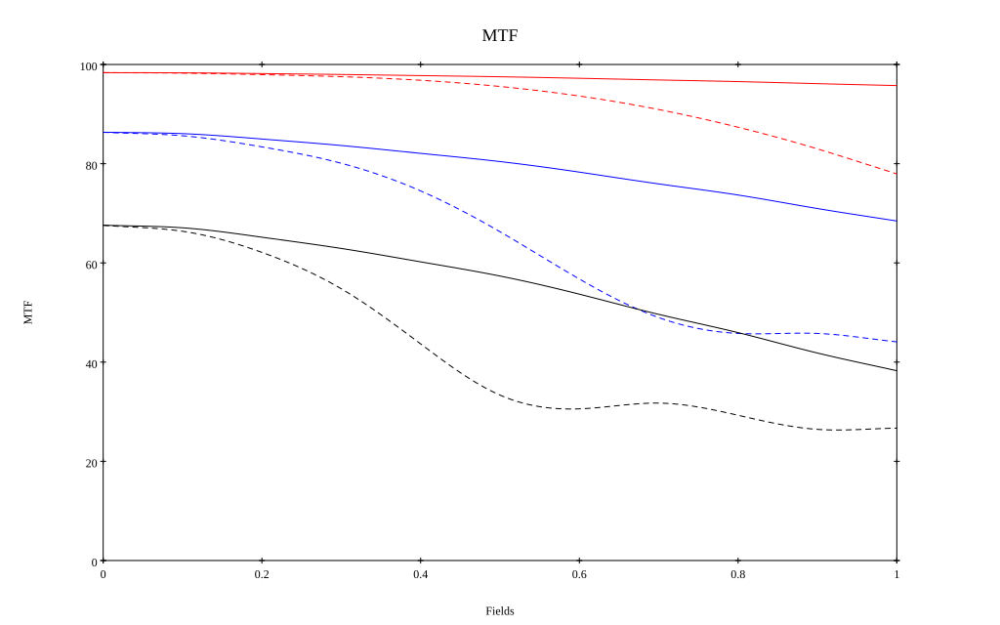
* 10,30,50 cycles/mm
* Black lines represent sagittal, blue tangential
* To generate above, MTFs for wavelengths 587.5618(d), 486.1327(F), 656.2725(C) were calculated across 10 fields, and then averaged
## Polychromatic Geometric MTF (Weighted)
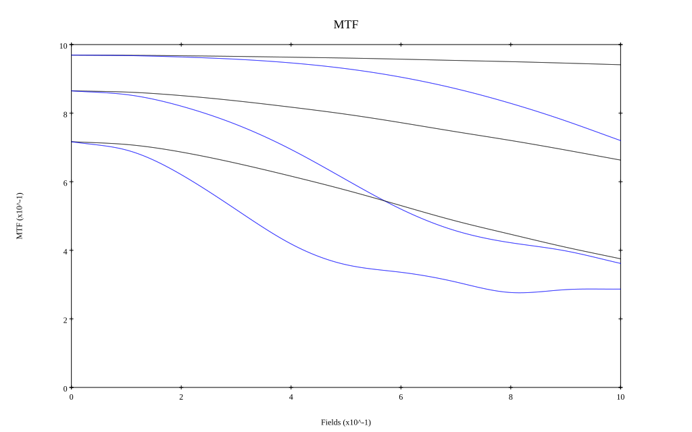
* 10,30,50 cycles/mm
* Black lines represent sagittal, blue tangential
* To generate above, MTFs for wavelengths 587.5618(d) wt(1.0), 656.2725(C) wt(0.475), 546.074(e) wt(0.98), 486.1327(F) wt(0.49), 435.8343(g) wt(0.15) were calculated across 10 fields, and then combined using weighted average
# 1200mm f11
## Layouts
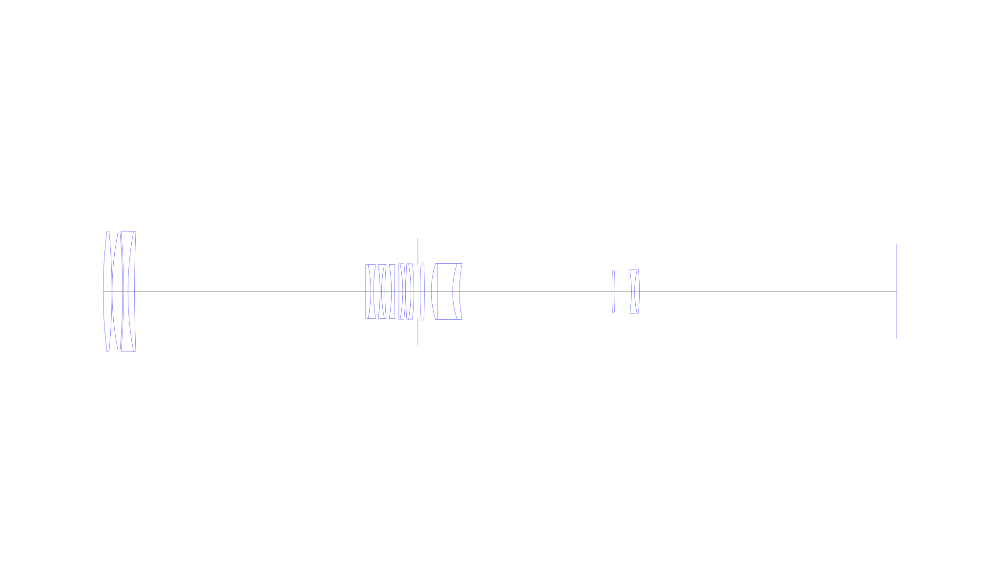
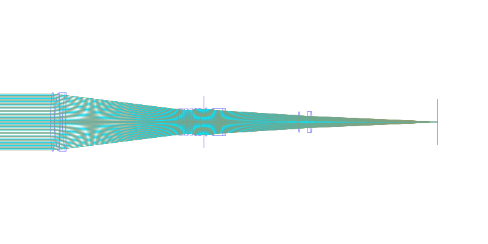
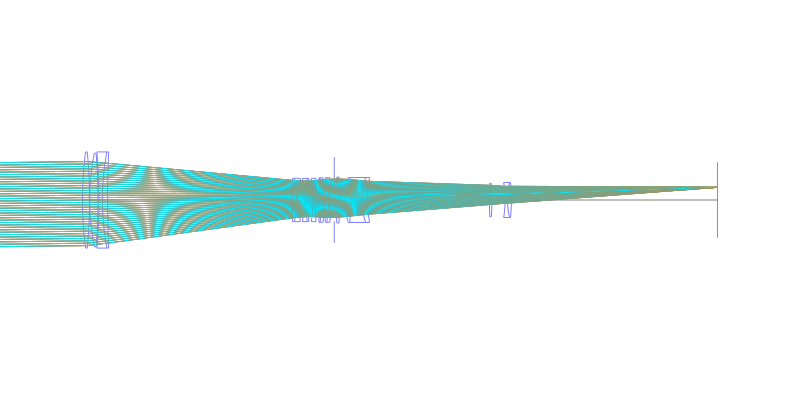
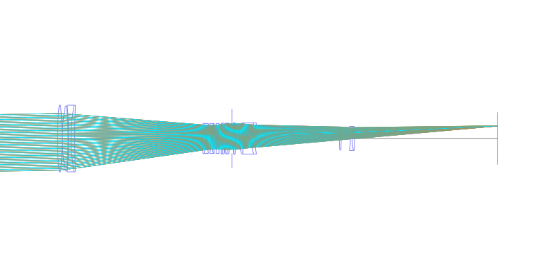
## Spot Diagrams
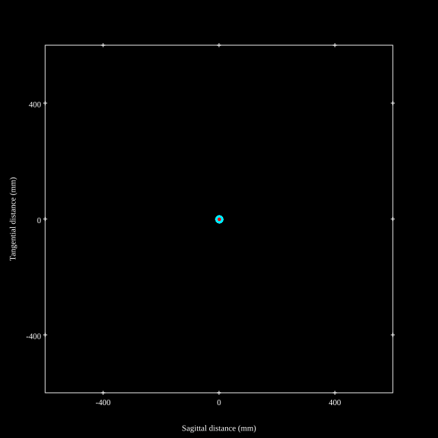
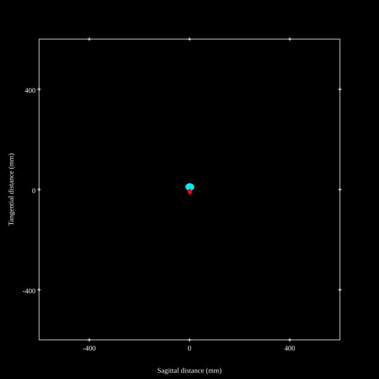
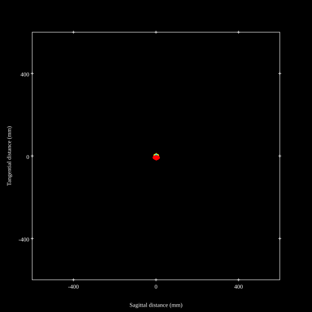
## Paraxial Parameters
| parameter | value |
| ---       | ---   |
| effective_focal_length |1187.655
| back_focal_length | 235.209
| optical_invariant | 0.943
| object_distance | 1.0E10
| image_distance | 235.209
| power | 0.001
| pp1_H | -1909.743
| ppk_H' | -952.446
| ffl_F | -3097.398
| fno | 10.989
| enp_dist_P | 716.806
| enp_radius | 54.038
| exp_dist_P' | -134.741
| exp_radius | 16.826
| m | -0
| red | -8419949.704672586
| n_obj | 1
| n_img | 1
| img_ht | 20.731
| obj_ang | 1
| obj_na | 0
| img_na | -0.045|
## Spot Analysis
| Field | Spot Mean Radius | Spot Max Radius |
| ---   | ---              | ---             |
 | Field(x=0.0, y=0.0) | 3.66 | 8.518|
 | Field(x=0.0, y=0.1) | 3.733 | 8.732|
 | Field(x=0.0, y=0.2) | 3.911 | 9.063|
 | Field(x=0.0, y=0.3) | 4.25 | 9.592|
 | Field(x=0.0, y=0.4) | 4.709 | 10.298|
 | Field(x=0.0, y=0.5) | 5.269 | 11.163|
 | Field(x=0.0, y=0.6) | 6.116 | 12.319|
 | Field(x=0.0, y=0.7) | 6.838 | 13.479|
 | Field(x=0.0, y=0.8) | 7.612 | 14.766|
 | Field(x=0.0, y=0.9) | 8.438 | 16.595|
 | Field(x=0.0, y=1.0) | 9.304 | 18.45|
## Polychromatic Geometric MTF
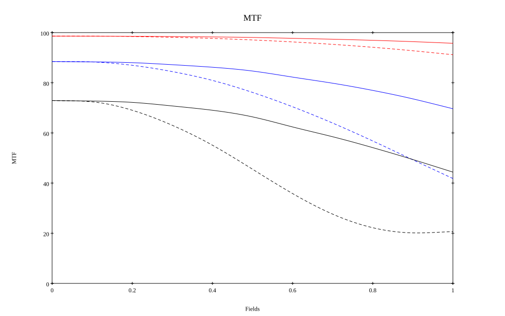
* 10,30,50 cycles/mm
* Black lines represent sagittal, blue tangential
* To generate above, MTFs for wavelengths 587.5618(d), 486.1327(F), 656.2725(C) were calculated across 10 fields, and then averaged
## Polychromatic Geometric MTF (Weighted)
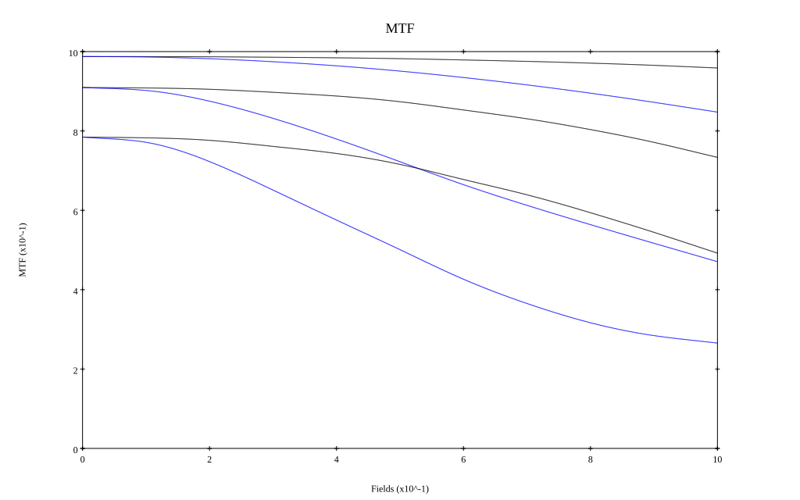
* 10,30,50 cycles/mm
* Black lines represent sagittal, blue tangential
* To generate above, MTFs for wavelengths 587.5618(d) wt(1.0), 656.2725(C) wt(0.475), 546.074(e) wt(0.98), 486.1327(F) wt(0.49), 435.8343(g) wt(0.15) were calculated across 10 fields, and then combined using weighted average
## Resources
* [OpticalBench Compatible Data File, tab delimited](./prescription.txt)
* [Zemax file](./US003743384_Example01.zmx)

Report / Zemax file generated using [Beam42](https://github.com/BeamFour/Beam42) on 2026-02-28
