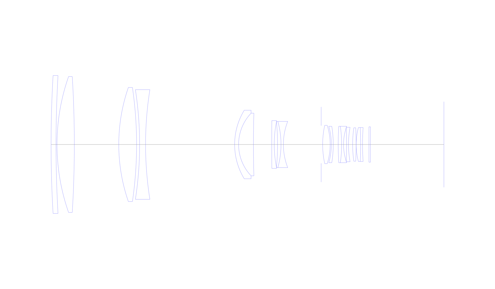
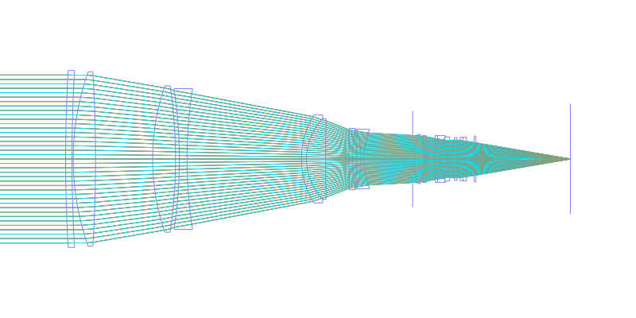
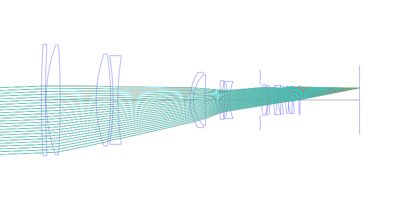
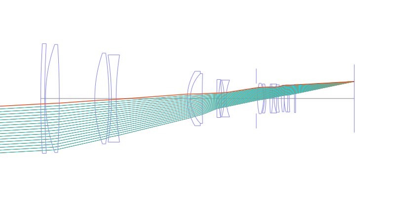
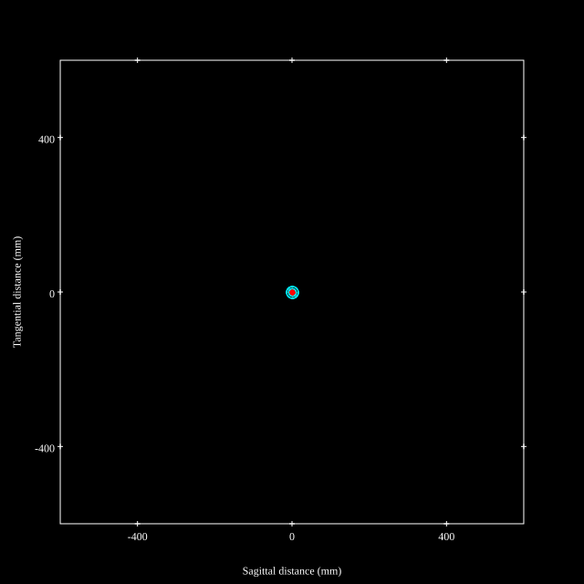
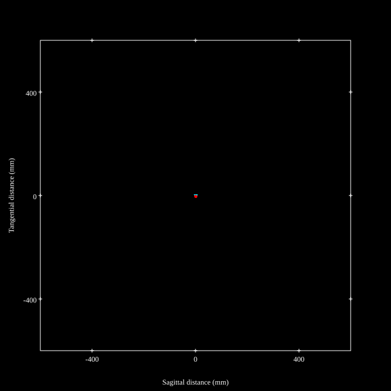
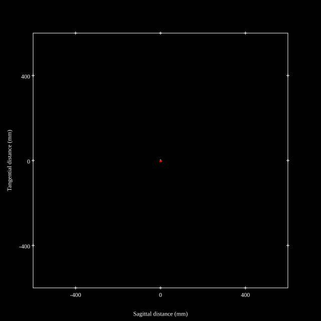
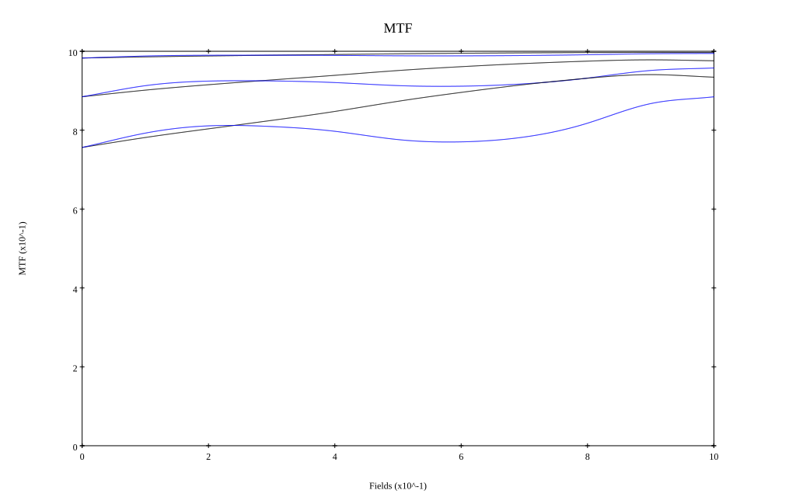
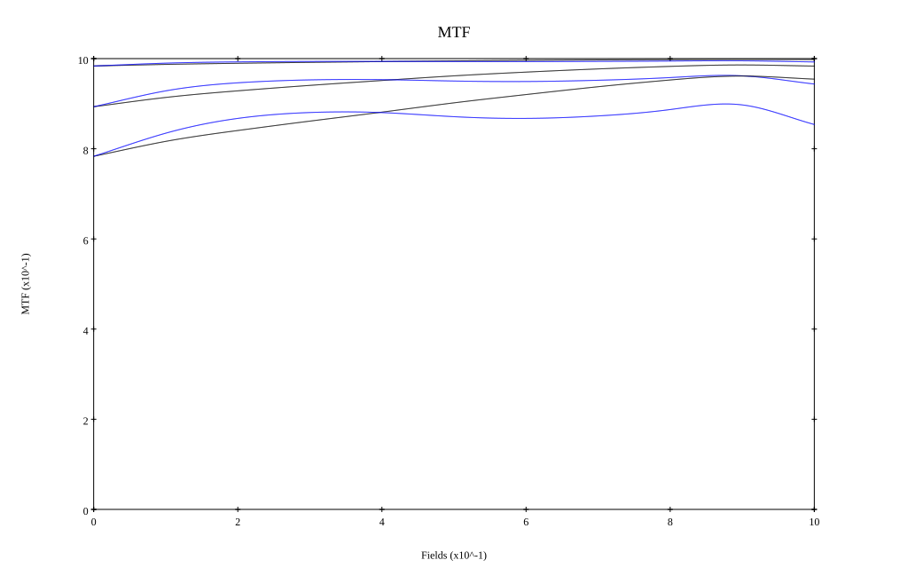

## Surface Data
Note that where glass types are shown the refractive index and abbe number is as per assigned glass type

| ID  | Radius | Thickness | Diameter | nd  | vd  | Glass Make | Glass |
| --- | ---    | ---       | ---      | --- | --- | ---        | ---   |
| 1 | 1200.3704 | 5.0 | 139.22 | 1.5168 | 64.13 | Hikari | J-BK7A |
| 2 | 1199.7897 | 1.0 | 139.22 |  |  |  |
| 3 | 207.0795 | 17.5 | 137.22 | 1.43384 | 95.26 | Hikari | NICF-A |
| 4 | -1127.5309 | 44.9 | 137.22 |  |  |  |
| 5 | 175.9698 | 18.0 | 115.22 | 1.43384 | 95.26 | Hikari | NICF-A |
| 6 | -397.2708 | 3.07 | 115.22 |  |  |  |
| 7 | -360.2396 | 6.0 | 110.72 | 1.61266 | 44.46 | Hikari | J-KZFH1 |
| 8 | 353.1837 | 90.0 | 110.72 |  |  |  |
| 9 | 66.4844 | 4.0 | 69.22 | 1.795 | 45.31 | Hikari | J-LASF017 |
| 10 | 45.9182 | 15.0 | 63.22 | 1.49782 | 82.57 | Hikari | J-FKH1 |
| 11 | 1114.1067 | 18.503 | 63.22 |  |  |  |
| 12 | 2992.5492 | 2.5 | 48.22 | 1.755 | 52.34 | Hikari | J-LASKH2 |
| 13 | 118.0399 | 3.35 | 46.72 |  |  |  |
| 14 | -241.6942 | 3.5 | 46.72 | 1.84666 | 23.8 | Hikari | J-SF03 |
| 15 | -86.4136 | 2.4 | 46.72 | 1.53996 | 59.52 | Hikari | J-BAK2 |
| 16 | 64.2643 | 38.179 | 46.72 |  |  |  |
| 17 | AS | 1.5 | 37.958 |  |  |  |
| 18 | 90.0336 | 7.6 | 38.72 | 1.48749 | 70.32 | Hikari | J-FK5 |
| 19 | -63.8039 | 1.2 | 38.72 |  |  |  |
| 20 | -65.9768 | 1.9 | 36.72 | 1.84666 | 23.8 | Hikari | J-SF03 |
| 21 | -114.8763 | 5.0 | 36.72 |  |  |  |
| 22 | 300.3587 | 3.5 | 36.72 | 1.84666 | 23.8 | Hikari | J-SF03 |
| 23 | -128.0558 | 1.9 | 36.72 | 1.59319 | 67.9 | Hikari | J-PSKH1 |
| 24 | 53.9004 | 3.1 | 36.72 |  |  |  |
| 25 | -347.5421 | 1.9 | 34.72 | 1.755 | 52.34 | Hikari | J-LASKH2 |
| 26 | 94.5337 | 4.19 | 34.72 |  |  |  |
| 27 | 118.3533 | 3.5 | 33.72 | 1.7725 | 49.62 | Hikari | J-LASF016 |
| 28 | -384.3825 | 0.1 | 33.72 |  |  |  |
| 29 | 67.4622 | 4.5 | 34.22 | 1.64 | 60.19 | Hikari | J-LAK01 |
| 30 | -340.4206 | 1.9 | 34.22 | 1.84666 | 23.8 | Hikari | J-SF03 |
| 31 | 246.6417 | 6.5 | 34.22 |  |  |  |
| 32 | 0.0 | 1.5 | 35.72 | 1.5168 | 64.13 | Hikari | J-BK7A |
| 33 | 0.0 | 74.246 | 35.72 |  |  |  |
## Layouts

## Spot Diagrams

## Paraxial Parameters
| parameter | value |
| ---       | ---   |
| effective_focal_length |392.008
| back_focal_length | 74.225
| optical_invariant | 3.72
| object_distance | 1.0E10
| image_distance | 74.225
| power | 0.003
| pp1_H | 98.533
| ppk_H' | -317.783
| ffl_F | -293.474
| fno | 2.89
| enp_dist_P | 1028.268
| enp_radius | 67.82
| exp_dist_P' | -42.059
| exp_radius | 20.114
| m | -0
| red | -2.550971083692967E7
| n_obj | 1
| n_img | 1
| img_ht | 21.505
| obj_ang | 3.14
| obj_na | 0
| img_na | -0.17|
## Spot Analysis
| Field | Spot Mean Radius | Spot Max Radius |
| ---   | ---              | ---             |
 | Field(x=0.0, y=0.0) | 4.369 | 15.18|
 | Field(x=0.0, y=0.1) | 3.448 | 15.603|
 | Field(x=0.0, y=0.2) | 3.132 | 14.675|
 | Field(x=0.0, y=0.3) | 3.013 | 13.698|
 | Field(x=0.0, y=0.4) | 2.849 | 12.507|
 | Field(x=0.0, y=0.5) | 2.778 | 10.774|
 | Field(x=0.0, y=0.6) | 2.678 | 8.772|
 | Field(x=0.0, y=0.7) | 2.523 | 6.692|
 | Field(x=0.0, y=0.8) | 2.263 | 4.599|
 | Field(x=0.0, y=0.9) | 1.971 | 4.844|
 | Field(x=0.0, y=1.0) | 2.004 | 5.129|
## Polychromatic Geometric MTF

* 10,30,50 cycles/mm
* Black lines represent sagittal, blue tangential
* To generate above, MTFs for wavelengths 587.5618(d), 486.1327(F), 656.2725(C) were calculated across 10 fields, and then averaged
## Polychromatic Geometric MTF (Weighted)

* 10,30,50 cycles/mm
* Black lines represent sagittal, blue tangential
* To generate above, MTFs for wavelengths 587.5618(d) wt(1.0), 656.2725(C) wt(0.475), 546.074(e) wt(0.98), 486.1327(F) wt(0.49), 435.8343(g) wt(0.15) were calculated across 10 fields, and then combined using weighted average
## Resources
* [OpticalBench Compatible Data File, tab delimited](./prescription.txt)
* [Zemax file](./JP2019-152887_Example03P-Nikon-400mm-f2.8FL.zmx)

Report / Zemax file generated using [Beam42](https://github.com/BeamFour/Beam42) on 2026-05-02
