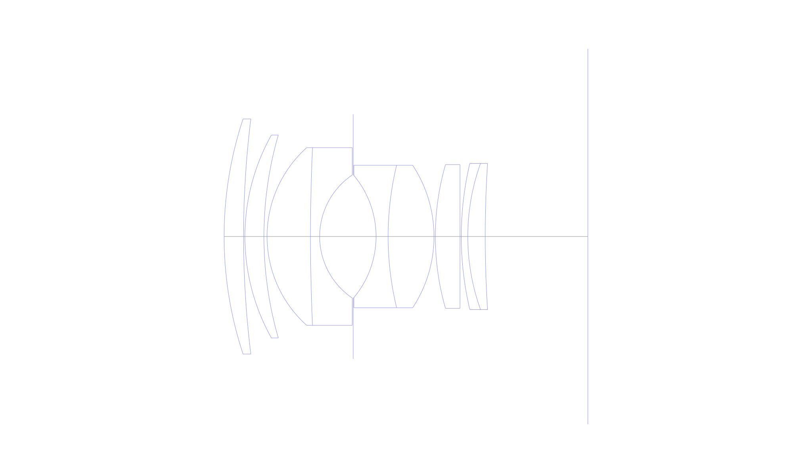
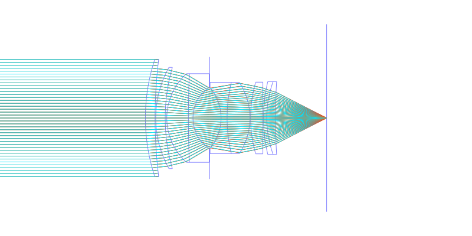
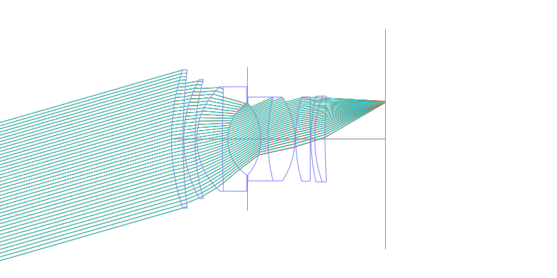
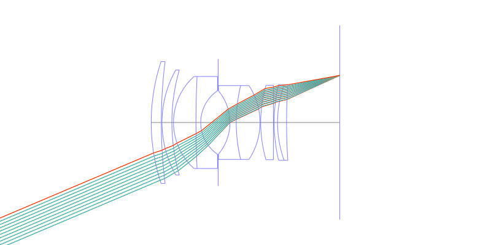
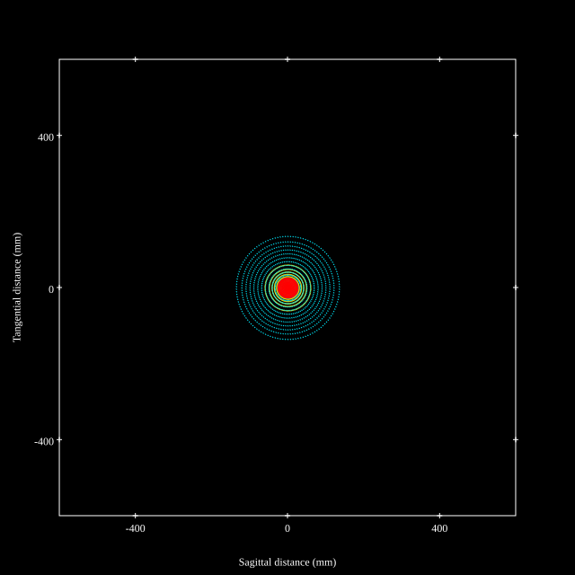
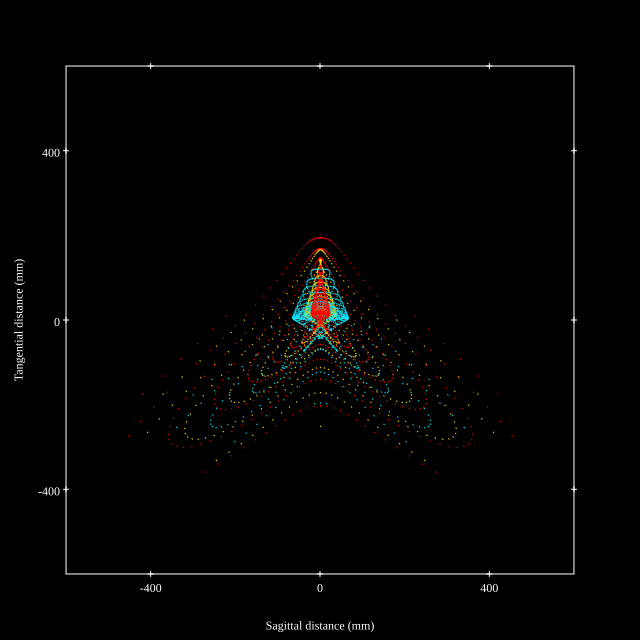
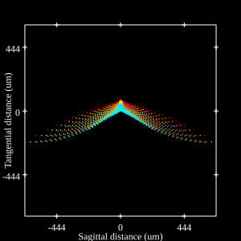
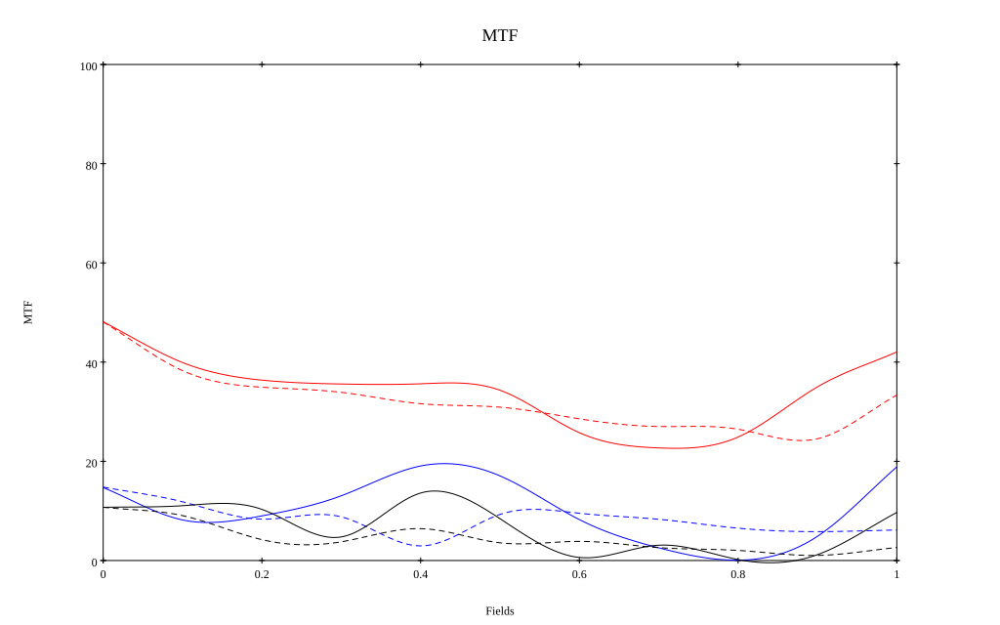

## Surface Data
Note that where glass types are shown the refractive index and abbe number is as per assigned glass type

| ID  | Radius | Thickness | Diameter | nd  | vd  | Glass Make | Glass |
| --- | ---    | ---       | ---      | --- | --- | ---        | ---   |
| 1 | 83.8 | 4.35 | 52.62 | 1.6073 | 59.5 |  |
| 2 | 214.15 | 0.3 | 52.62 |  |  |  |
| 3 | 46.5 | 4.25 | 45.39 | 1.6073 | 59.5 |  |
| 4 | 81.9 | 0.7 | 45.39 |  |  |  |
| 5 | 26.75 | 9.7 | 39.75 | 1.717 | 47.97 | Hikari | J-LAF3 |
| 6 | 435.9 | 2.05 | 39.75 | 1.5927 | 35.45 | Hoya | FF5 |
| 7 | 16.65 | 7.5 | 27.512 |  |  |  |
| 8 | AS | 5.1 | 27.367 |  |  |  |
| 9 | -21.3 | 2.7 | 27.304 | 1.64831 | 33.84 | Schott | SF12 |
| 10 | 67.85 | 10.25 | 31.89 | 1.717 | 47.97 | Hikari | J-LAF3 |
| 11 | -29.05 | 0.3 | 31.89 |  |  |  |
| 12 | 58.15 | 5.5 | 32.14 | 1.717 | 47.97 | Hikari | J-LAF3 |
| 13 | 0.0 | 0.3 | 32.14 |  |  |  |
| 14 | 71.15 | 1.45 | 32.7 | 1.6259 | 35.6 |  |
| 15 | 48.45 | 3.9 | 32.7 | 1.63854 | 55.34 | Hikari | J-SK18 |
| 16 | 258.95 | 22.94 | 32.7 |  |  |  |
## Layouts

## Spot Diagrams

## Paraxial Parameters
| parameter | value |
| ---       | ---   |
| effective_focal_length |49.927
| back_focal_length | 23.054
| optical_invariant | 9.633
| object_distance | 1.0E10
| image_distance | 23.054
| power | 0.02
| pp1_H | 42.086
| ppk_H' | -26.873
| ffl_F | -7.841
| fno | 1.1
| enp_dist_P | 35.982
| enp_radius | 22.694
| exp_dist_P' | -33.713
| exp_radius | 25.855
| m | -0
| red | -2.002928840718817E8
| n_obj | 1
| n_img | 1
| img_ht | 21.193
| obj_ang | 23
| obj_na | 0
| img_na | -0.414|
## Spot Analysis
| Field | Spot Mean Radius | Spot Max Radius |
| ---   | ---              | ---             |
 | Field(x=0.0, y=0.0) | 52.779 | 137.661|
 | Field(x=0.0, y=0.1) | 59.088 | 235.237|
 | Field(x=0.0, y=0.2) | 73.789 | 284.149|
 | Field(x=0.0, y=0.3) | 88.521 | 388.014|
 | Field(x=0.0, y=0.4) | 106.988 | 551.13|
 | Field(x=0.0, y=0.5) | 121.518 | 520.859|
 | Field(x=0.0, y=0.6) | 121.387 | 559.13|
 | Field(x=0.0, y=0.7) | 119.148 | 529.107|
 | Field(x=0.0, y=0.8) | 121.575 | 576.556|
 | Field(x=0.0, y=0.9) | 127.757 | 638.611|
 | Field(x=0.0, y=1.0) | 126.99 | 597.414|
## Geometric MTF

* 10,30,50 cycles/mm
* Black lines represent sagittal, blue tangential
## Resources
* [OpticalBench Compatible Data File, tab delimited](./US002828671_Example01.txt)
* [Zemax file](./US002828671_Example01.zmx)
