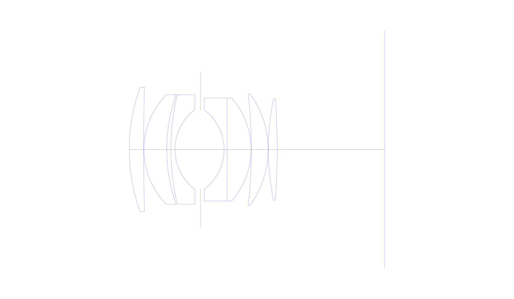
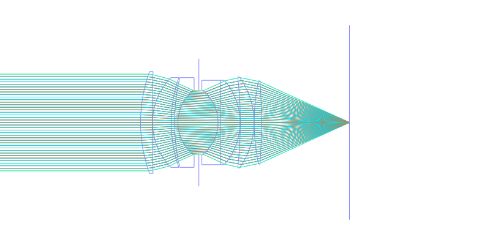
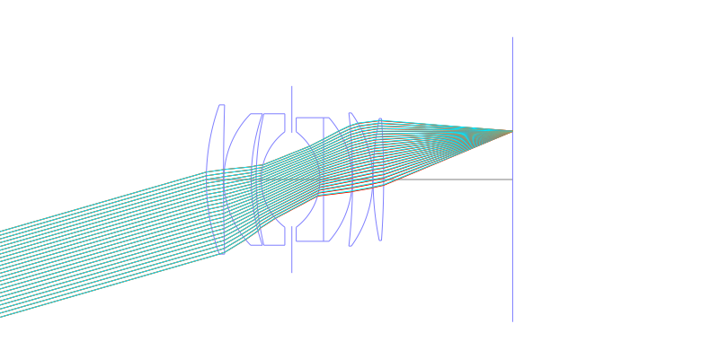
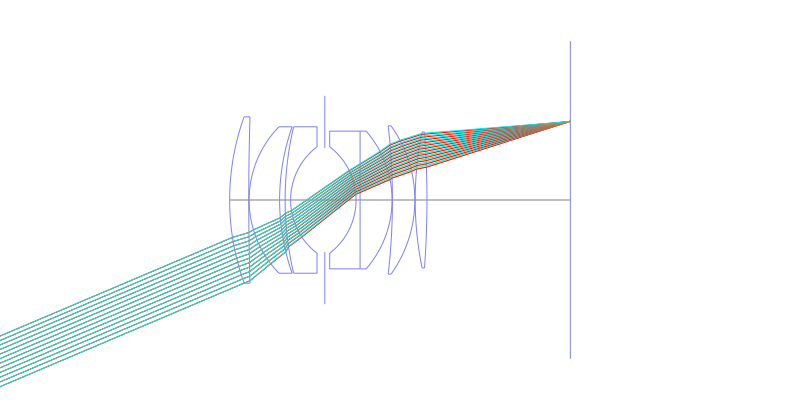
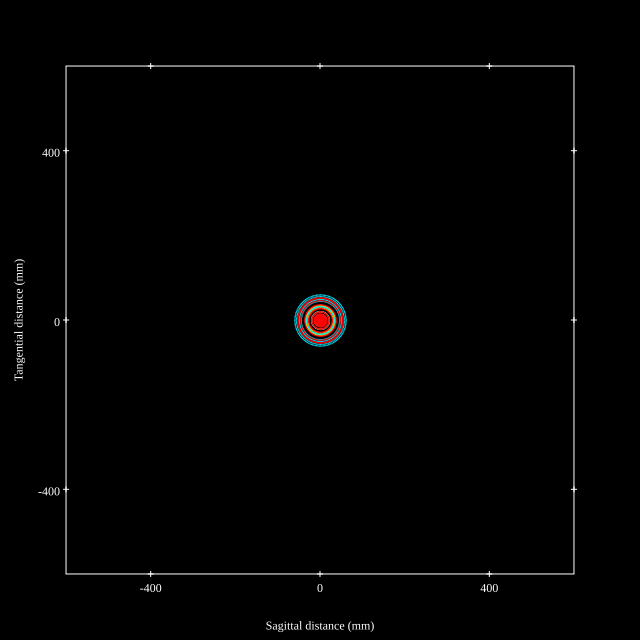
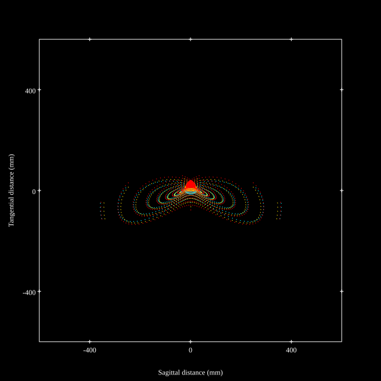
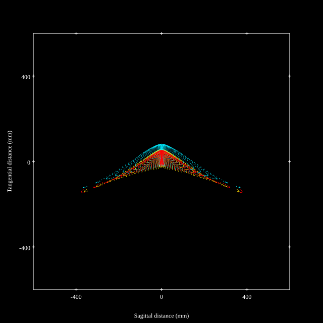

# AI Nikkor 50mm f1.2
## Patent Information
| Country | Patent Number | Example | Year of Application | Inventors | Organisation | Link |
| ---     | ---           | ---     | ---                 | ---       | ---          | ---  |
|US | US3738736 | EX 1 | 1972 | Yoshiyuki Shimizu | Nikon Corp | [link](https://patents.google.com/patent/US3738736A) |
## Surface Data
Note that where glass types are shown the refractive index and abbe number is as per assigned glass type

| ID  | Radius | Thickness | Diameter | nd  | vd  | Glass Make | Glass |
| --- | ---    | ---       | ---      | --- | --- | ---        | ---   |
| 1 | 67.0 | 5.2 | 45.26 | 1.79631 | 40.8 |  |
| 2 | 769.3 | 0.1 | 45.26 |  |  |  |
| 3 | 28.5 | 8.3 | 39.86 | 1.744 | 44.9 |  |
| 4 | 60.0 | 1.5 | 39.86 |  |  |  |
| 5 | 87.0 | 1.5 | 39.86 | 1.68893 | 31.1 |  |
| 6 | 18.19 | 9.3 | 28.96 |  |  |  |
| 7 | AS | 8.5 | 28.352 |  |  |  |
| 8 | -18.2 | 1.1 | 28.96 | 1.7847 | 26.1 |  |
| 9 | 0.0 | 8.7 | 37.48 | 1.74443 | 49.4 |  |
| 10 | -28.4 | 0.1 | 37.48 |  |  |  |
| 11 | -180.0 | 6.1 | 40.37 | 1.72 | 50.2 |  |
| 12 | -34.7 | 0.1 | 40.37 |  |  |  |
| 13 | 92.14 | 3.2 | 36.99 | 1.76684 | 46.6 |  |
| 14 | -259.79 | 39.08 | 36.99 |  |  |  |
## Layouts

## Spot Diagrams

## Paraxial Parameters
| parameter | value |
| ---       | ---   |
| effective_focal_length |51.6
| back_focal_length | 39.08
| optical_invariant | 9.126
| object_distance | 1.0E10
| image_distance | 39.08
| power | 0.019
| pp1_H | 55.86
| ppk_H' | 12.52
| ffl_F | 4.26
| fno | 1.2
| enp_dist_P | 32.309
| enp_radius | 21.5
| exp_dist_P' | -55.844
| exp_radius | 39.552
| m | 0
| red | -1.9379826885676593E8
| n_obj | 1
| n_img | 1
| img_ht | 21.903
| obj_ang | 23
| obj_na | 0
| img_na | -0.385|
## Spot Analysis
| Field | Spot Mean Radius | Spot Max Radius |
| ---   | ---              | ---             |
 | 0.0 | 14.724 | 36.173|
 | 0.7 | 90.599 | 404.094|
 | 1.0 | 113.805 | 482.687|
## Resources
* [OpticalBench Compatible Data File, tab delimited](./US003738736_Example01.txt)
* [Zemax file](./US003738736_Example01.zmx)
