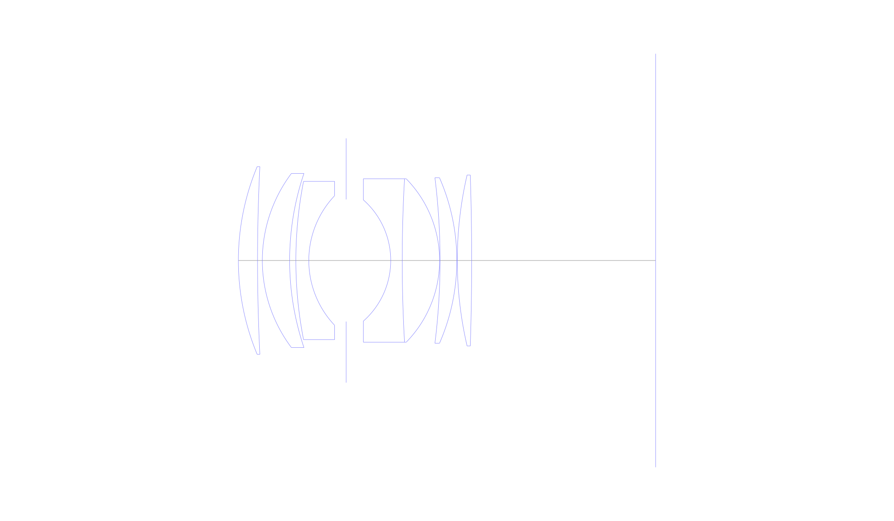
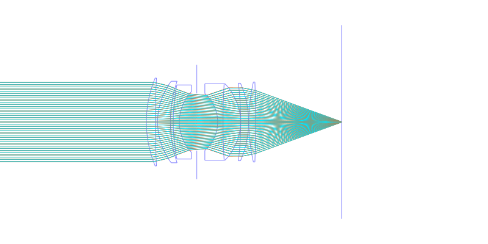
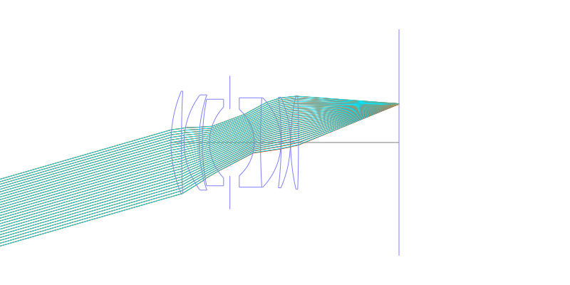
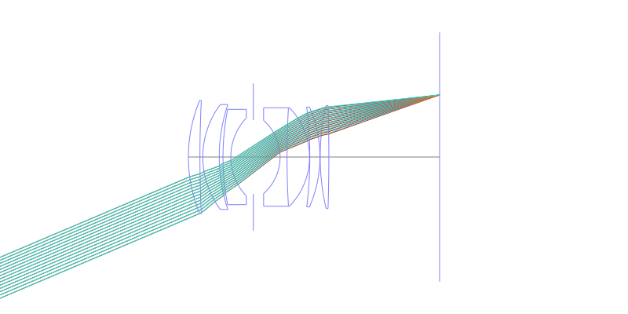
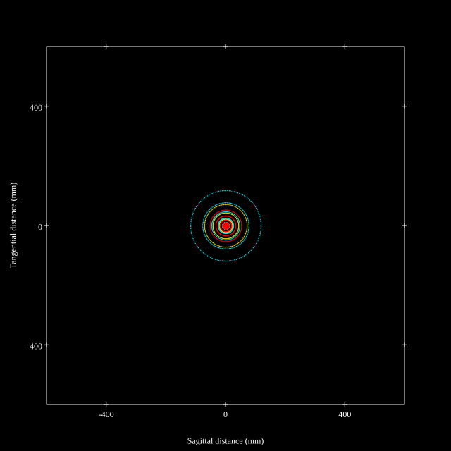
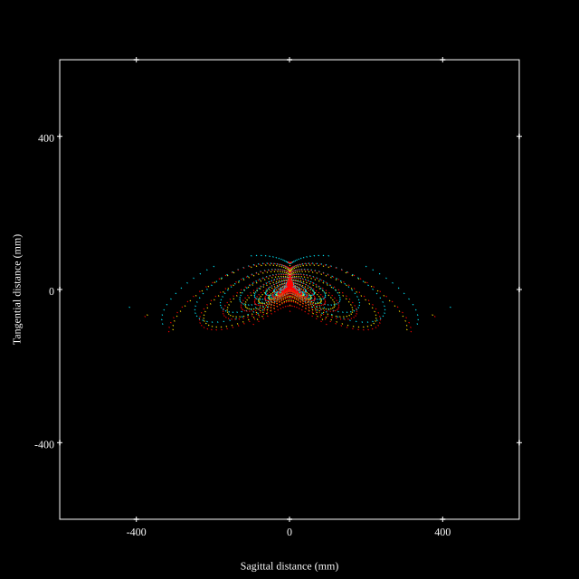
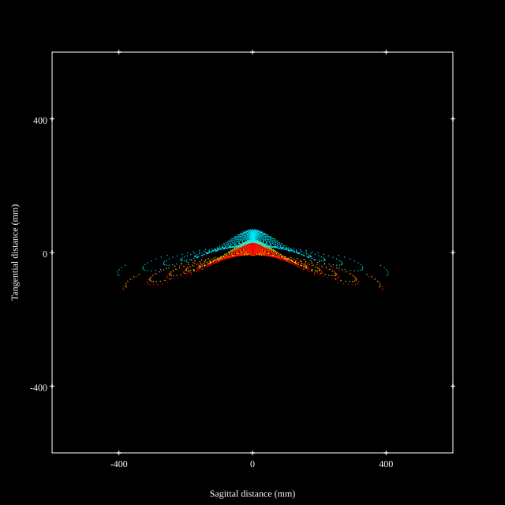
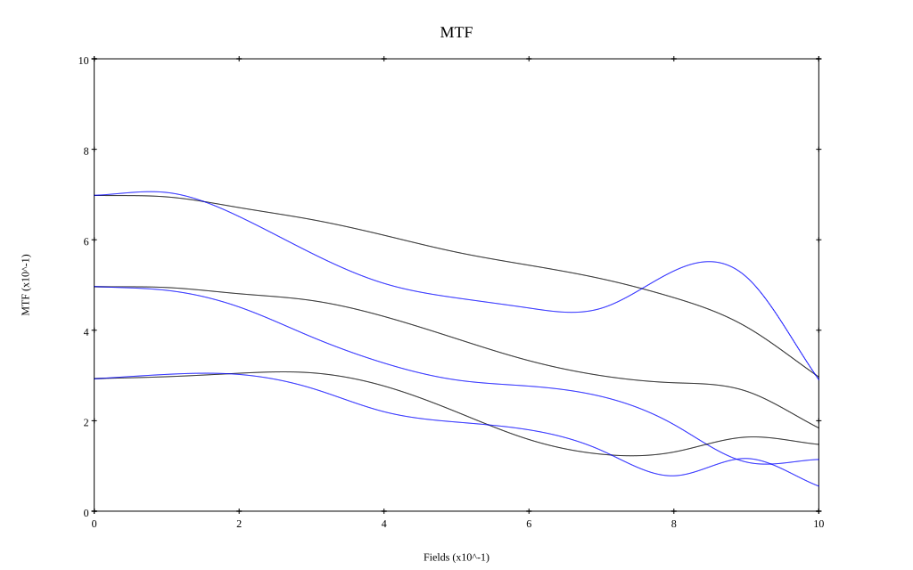
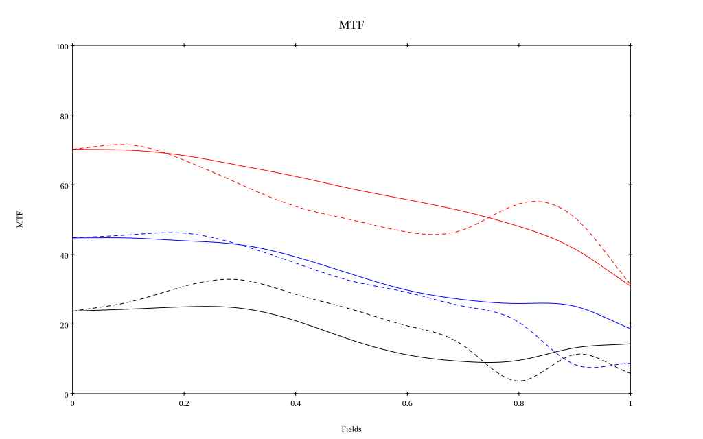

## Surface Data
Note that where glass types are shown the refractive index and abbe number is as per assigned glass type

| ID  | Radius | Thickness | Diameter | nd  | vd  | Glass Make | Glass |
| --- | ---    | ---       | ---      | --- | --- | ---        | ---   |
| 1 | 51.0 | 4.0 | 39.22 | 1.744 | 44.72 | Schott | LAF2 |
| 2 | 397.82 | 1.0 | 39.22 |  |  |  |
| 3 | 30.3 | 5.7 | 36.38 | 1.8045 | 39.64 | Hoya | NBFD3 |
| 4 | 56.891 | 1.3 | 36.38 |  |  |  |
| 5 | 85.9 | 2.7 | 33.06 | 1.71736 | 29.5 | Hoya | FD1 |
| 6 | 19.7 | 7.8 | 27.08 |  |  |  |
| 7 | AS | 9.3 | 25.517 |  |  |  |
| 8 | -16.9 | 2.4 | 25.34 | 1.74077 | 27.6 | Schott | SF13 |
| 9 | 300.0 | 7.8 | 34.14 | 1.79619 | 43.22 | CORNING | D96-43 |
| 10 | -24.41 | 0.1 | 34.14 |  |  |  |
| 11 | -140.0 | 3.5 | 34.6 | 1.6968 | 55.52 | Hikari | J-LAK14 |
| 12 | -43.126 | 0.1 | 34.6 |  |  |  |
| 13 | 79.0 | 3.0 | 35.72 | 1.6968 | 55.52 | Hikari | J-LAK14 |
| 14 | -547.717 | 38.4 | 35.72 |  |  |  |
## Layouts

## Spot Diagrams

## Paraxial Parameters
| parameter | value |
| ---       | ---   |
| effective_focal_length |51.609
| back_focal_length | 38.479
| optical_invariant | 7.823
| object_distance | 1.0E10
| image_distance | 38.479
| power | 0.019
| pp1_H | 47.82
| ppk_H' | -13.131
| ffl_F | -3.79
| fno | 1.4
| enp_dist_P | 26.879
| enp_radius | 18.43
| exp_dist_P' | -48.29
| exp_radius | 31.013
| m | -0
| red | -1.9376294444165394E8
| n_obj | 1
| n_img | 1
| img_ht | 21.907
| obj_ang | 23
| obj_na | 0
| img_na | -0.336|
## Spot Analysis
| Field | Spot Mean Radius | Spot Max Radius |
| ---   | ---              | ---             |
 | Field(x=0.0, y=0.0) | 32.736 | 117.977|
 | Field(x=0.0, y=0.1) | 36.426 | 176.034|
 | Field(x=0.0, y=0.2) | 51.312 | 195.349|
 | Field(x=0.0, y=0.3) | 50.79 | 221.549|
 | Field(x=0.0, y=0.4) | 54.972 | 258.87|
 | Field(x=0.0, y=0.5) | 63.276 | 308.094|
 | Field(x=0.0, y=0.6) | 69.002 | 374.495|
 | Field(x=0.0, y=0.7) | 76.52 | 421.457|
 | Field(x=0.0, y=0.8) | 84.964 | 462.519|
 | Field(x=0.0, y=0.9) | 95.412 | 488.993|
 | Field(x=0.0, y=1.0) | 101.083 | 409.66|
## Polychromatic Geometric MTF

* 10=red,30=blue,50=black cycles/mm
* Solid lines represent sagittal, dashed lines tangential
* To generate above, MTFs for wavelengths 587.5618(d), 486.1327(F), 656.2725(C) were calculated across 10 fields, and then averaged
## Polychromatic Geometric MTF (Weighted)

* 10=red,30=blue,50=black cycles/mm
* Solid lines represent sagittal, dashed lines tangential
* To generate above, MTFs for wavelengths 587.5618(d) wt(1.0), 656.2725(C) wt(0.475), 546.074(e) wt(0.98), 486.1327(F) wt(0.49), 435.8343(g) wt(0.15) were calculated across 10 fields, and then combined using weighted average
## Resources
* [OpticalBench Compatible Data File, tab delimited](./prescription.txt)
* [Zemax file](./JP1984-121015_Example01.zmx)

Report / Zemax file generated using [Beam42](https://github.com/BeamFour/Beam42) on 2026-07-17
