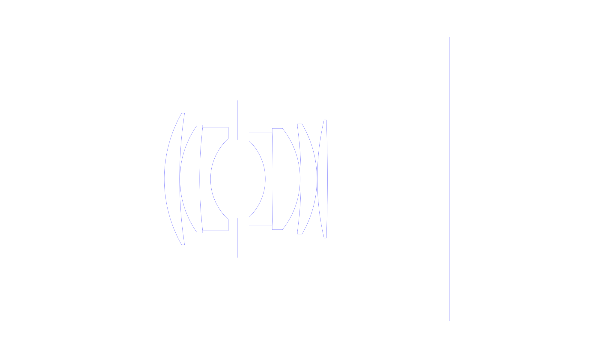
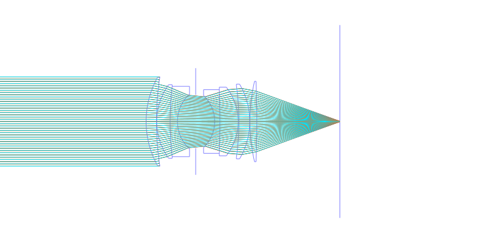
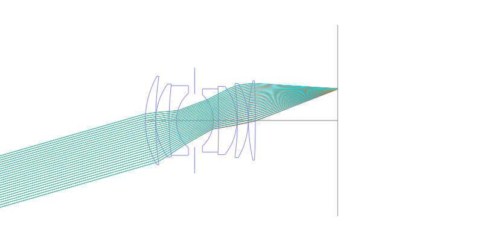
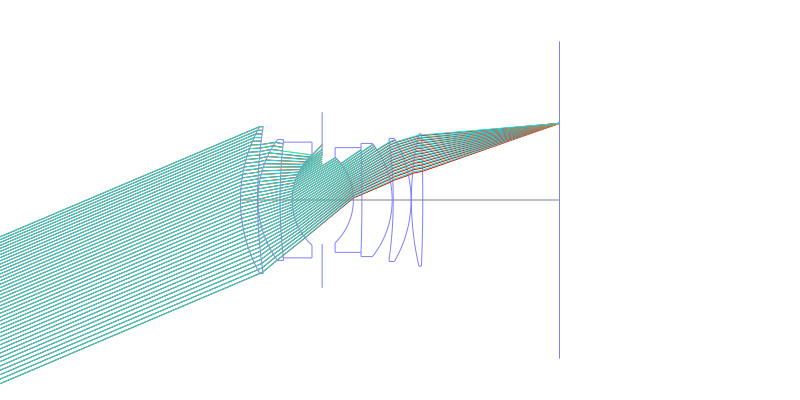
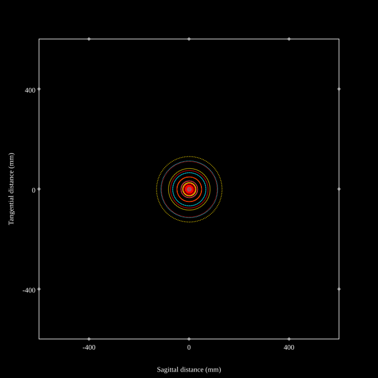
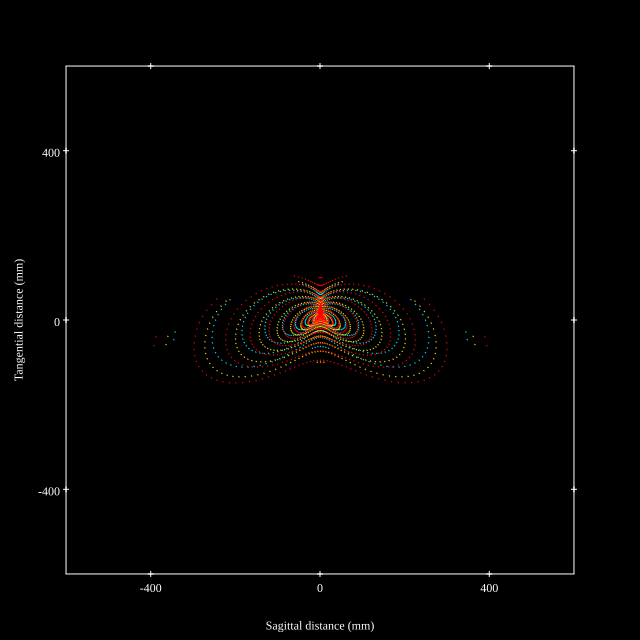
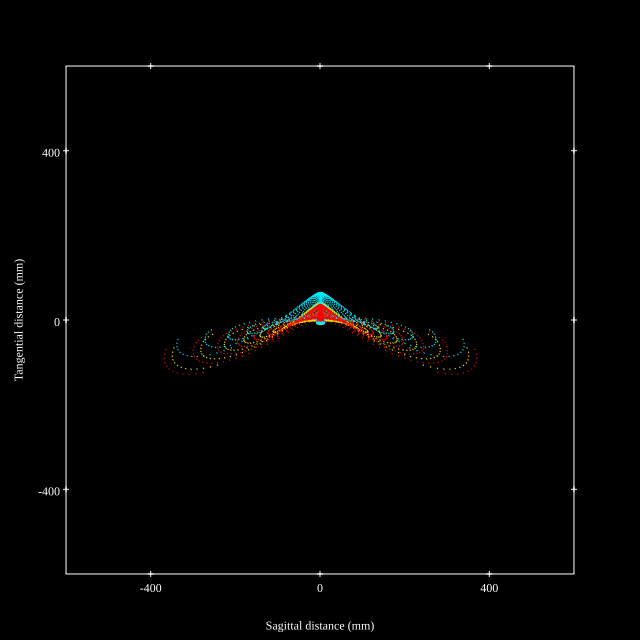
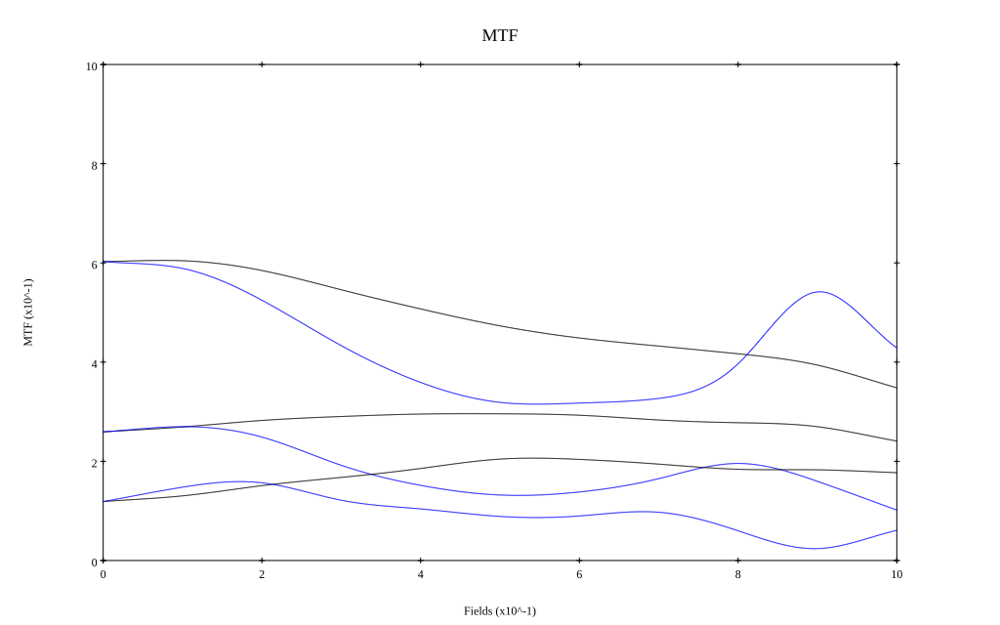
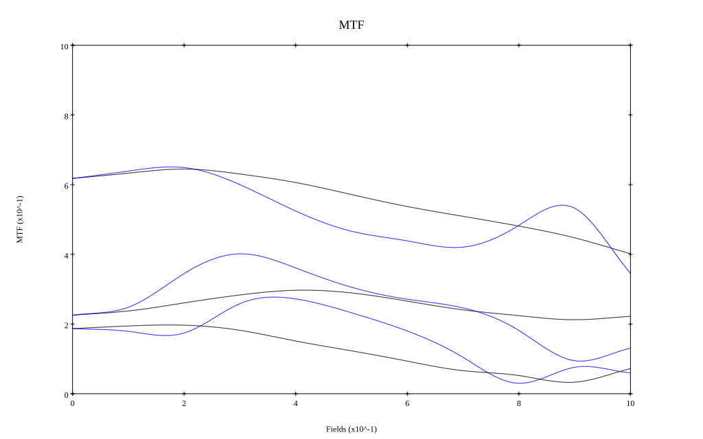

# Nikkor-S Auto 50mm F1.4
## Patent Information
| Country | Patent Number | Example | Year of Application | Inventors | Organisation | Link |
| ---     | ---           | ---     | ---                 | ---       | ---          | ---  |
|US | US3560079 | EX 2 | 1965 | Zenji Wakimoto, Yoshiyuki Simizu | Nikon Corp | [link](https://patents.google.com/patent/US3560079A) |
## Surface Data
Note that where glass types are shown the refractive index and abbe number is as per assigned glass type

| ID  | Radius | Thickness | Diameter | nd  | vd  | Glass Make | Glass |
| --- | ---    | ---       | ---      | --- | --- | ---        | ---   |
| 1 | 40.7 | 4.65 | 40.0 | 1.7495 | 34.95 | Schott | LAFN7 |
| 2 | 132.56 | 0.095 | 40.0 |  |  |  |
| 3 | 28.1 | 6.01 | 32.9 | 1.744 | 44.8 | Hikari | J-LAF2 |
| 4 | 135.66 | 3.295 | 31.5 | 1.69895 | 30.13 | Hikari | J-SF15 |
| 5 | 16.705 | 8.165 | 24.6 |  |  |  |
| 6 | AS | 8.5 | 23.9 |  |  |  |
| 7 | -16.135 | 2.325 | 23.3 | 1.71736 | 29.5 | Hoya | E-FD1 |
| 8 | -428.635 | 8.235 | 28.5 | 1.6779 | 55.52 | Hoya | LAC12 |
| 9 | -24.765 | 0.29 | 30.8 |  |  |  |
| 10 | -116.28 | 4.845 | 32.0 | 1.713 | 53.94 | Hoya | LAC8 |
| 11 | -33.05 | 0.095 | 33.5 |  |  |  |
| 12 | 79.455 | 3.1 | 36.0 | 1.713 | 53.94 | Hoya | LAC8 |
| 13 | -445.14 | 37.21 | 36.0 |  |  |  |
## Layouts

## Spot Diagrams

## Paraxial Parameters
| parameter | value |
| ---       | ---   |
| effective_focal_length |50.06
| back_focal_length | 37.279
| optical_invariant | 7.589
| object_distance | 1.0E10
| image_distance | 37.279
| power | 0.02
| pp1_H | 50.206
| ppk_H' | -12.782
| ffl_F | 0.146
| fno | 1.4
| enp_dist_P | 26.418
| enp_radius | 17.879
| exp_dist_P' | -58.04
| exp_radius | 34.067
| m | -0
| red | -1.9975857076021975E8
| n_obj | 1
| n_img | 1
| img_ht | 21.249
| obj_ang | 23
| obj_na | 0
| img_na | -0.336|
## Spot Analysis
| Field | Spot Mean Radius | Spot Max Radius |
| ---   | ---              | ---             |
 | Field(x=0.0, y=0.0) | 36.254 | 108.17|
 | Field(x=0.0, y=0.1) | 33.585 | 126.04|
 | Field(x=0.0, y=0.2) | 34.782 | 162.75|
 | Field(x=0.0, y=0.3) | 43.988 | 197.3|
 | Field(x=0.0, y=0.4) | 54.411 | 237.643|
 | Field(x=0.0, y=0.5) | 65.424 | 258.929|
 | Field(x=0.0, y=0.6) | 72.97 | 319.231|
 | Field(x=0.0, y=0.7) | 81.129 | 397.402|
 | Field(x=0.0, y=0.8) | 87.384 | 428.603|
 | Field(x=0.0, y=0.9) | 93.707 | 429.459|
 | Field(x=0.0, y=1.0) | 94.507 | 381.238|
## Geometric MTF

* 10,30,50 cycles/mm
* Black lines represent sagittal, blue tangential
* Wavelengths 587.5618(d), 486.1327(F), 656.2725(C) equal weight
## Geometric MTF (Weighted)

* 10,30,50 cycles/mm
* Black lines represent sagittal, blue tangential
* Wavelengths 587.5618(d), 656.2725(C), 546.074(e), 486.1327(F), 435.8343(g) weighted 1.0,0.475,0.98,0.49,0.15
## Resources
* [OpticalBench Compatible Data File, tab delimited](./US003560079_Example02.txt)
* [Zemax file](./US003560079_Example02.zmx)
