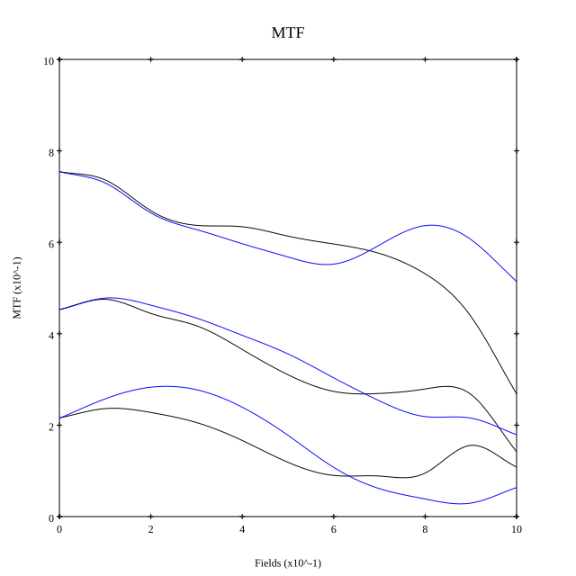
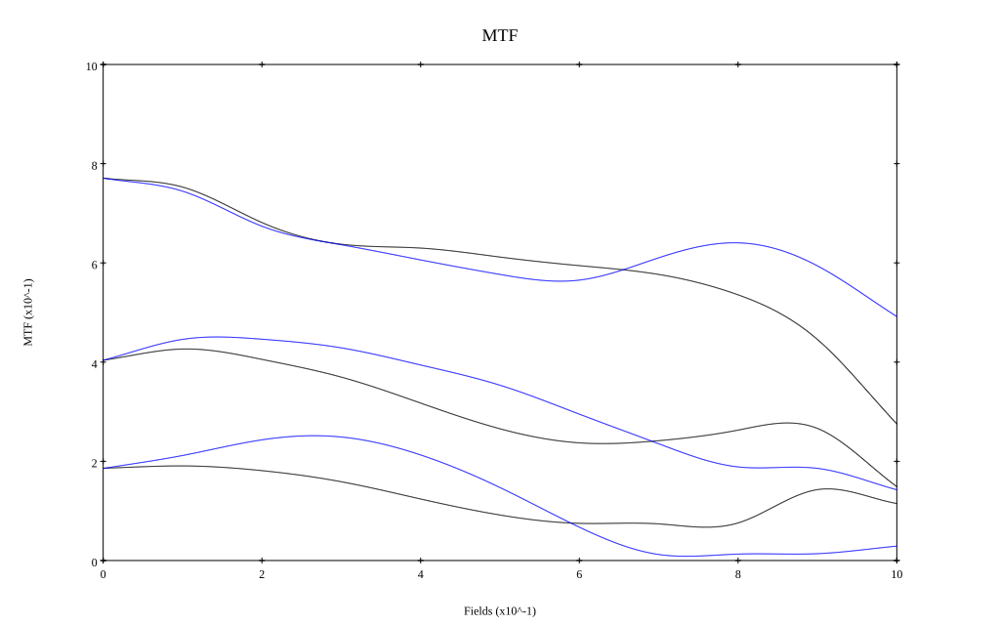

# AF Nikkor 50mm f1.4D / 50mm f1.4 AIS
## Patent Information
| Country | Patent Number | Example | Year of Application | Inventors | Organisation | Link |
| ---     | ---           | ---     | ---                 | ---       | ---          | ---  |
|US | US4448497 | EX 1 | 1981 | Koichi Wakamiya | Nikon Corp | [link](https://patents.google.com/patent/US4448497) |
## Surface Data
Note that where glass types are shown the refractive index and abbe number is as per assigned glass type

| ID  | Radius | Thickness | Diameter | nd  | vd  | Glass Make | Glass |
| --- | ---    | ---       | ---      | --- | --- | ---        | ---   |
| 1 | 40.43 | 5.1 | 36.95 | 1.7945 | 45.39 | Hoya | TAF2 |
| 2 | 242.25 | 0.1 | 36.95 |  |  |  |
| 3 | 25.95 | 4.7 | 32.76 | 1.7725 | 49.62 | Hoya | TAF1 |
| 4 | 38.38 | 1.52 | 30.59 |  |  |  |
| 5 | 71.28 | 1.2 | 30.59 | 1.6727 | 32.21 | Schott | SF5 |
| 6 | 17.71 | 7.9 | 26.0 |  |  |  |
| 7 | AS | 7.1 | 25.523 |  |  |  |
| 8 | -17.75 | 1.0 | 25.19 | 1.74 | 28.28 | Ohara | PBH3 |
| 9 | -1500.0 | 6.4 | 29.41 | 1.7725 | 49.62 | Hoya | TAF1 |
| 10 | -30.47 | 0.2 | 30.96 |  |  |  |
| 11 | -77.41 | 4.3 | 32.25 | 1.788 | 47.49 | Hoya | TAF4 |
| 12 | -29.87 | 0.1 | 32.25 |  |  |  |
| 13 | 146.87 | 2.6 | 30.24 | 1.788 | 47.49 | Hoya | TAF4 |
| 14 | -130.66 | 38.32 | 30.24 |  |  |  |
## Layouts

## Spot Diagrams

## Paraxial Parameters
| parameter | value |
| ---       | ---   |
| effective_focal_length |51.66
| back_focal_length | 38.385
| optical_invariant | 7.832
| object_distance | 1.0E10
| image_distance | 38.385
| power | 0.019
| pp1_H | 38.385
| ppk_H' | -13.275
| ffl_F | -13.275
| fno | 1.4
| enp_dist_P | 24.959
| enp_radius | 18.45
| exp_dist_P' | -31.35
| exp_radius | 24.928
| m | -0
| red | -1.9357422773784596E8
| n_obj | 1
| n_img | 1
| img_ht | 21.928
| obj_ang | 23
| obj_na | 0
| img_na | -0.336|
## Spot Analysis
| Field | Spot Mean Radius | Spot Max Radius |
| ---   | ---              | ---             |
 | Field(x=0.0, y=0.0) | 18.271 | 51.673|
 | Field(x=0.0, y=0.1) | 18.885 | 62.879|
 | Field(x=0.0, y=0.2) | 24.996 | 82.172|
 | Field(x=0.0, y=0.3) | 32.628 | 121.075|
 | Field(x=0.0, y=0.4) | 38.428 | 138.229|
 | Field(x=0.0, y=0.5) | 44.15 | 180.92|
 | Field(x=0.0, y=0.6) | 47.587 | 227.132|
 | Field(x=0.0, y=0.7) | 51.716 | 276.769|
 | Field(x=0.0, y=0.8) | 60.756 | 327.358|
 | Field(x=0.0, y=0.9) | 71.489 | 356.238|
 | Field(x=0.0, y=1.0) | 84.324 | 360.621|
## Geometric MTF

* 10,30,50 cycles/mm
* Black lines represent sagittal, blue tangential
* Wavelengths 587.5618(d), 486.1327(F), 656.2725(C) equal weight
## Geometric MTF (Weighted)

* 10,30,50 cycles/mm
* Black lines represent sagittal, blue tangential
* Wavelengths 587.5618(d), 656.2725(C), 546.074(e), 486.1327(F), 435.8343(g) weighted 1.0,0.475,0.98,0.49,0.15
## Resources
* [OpticalBench Compatible Data File, tab delimited](./US004448497_Example01a.txt)
* [Zemax file](./US004448497_Example01a.zmx)
