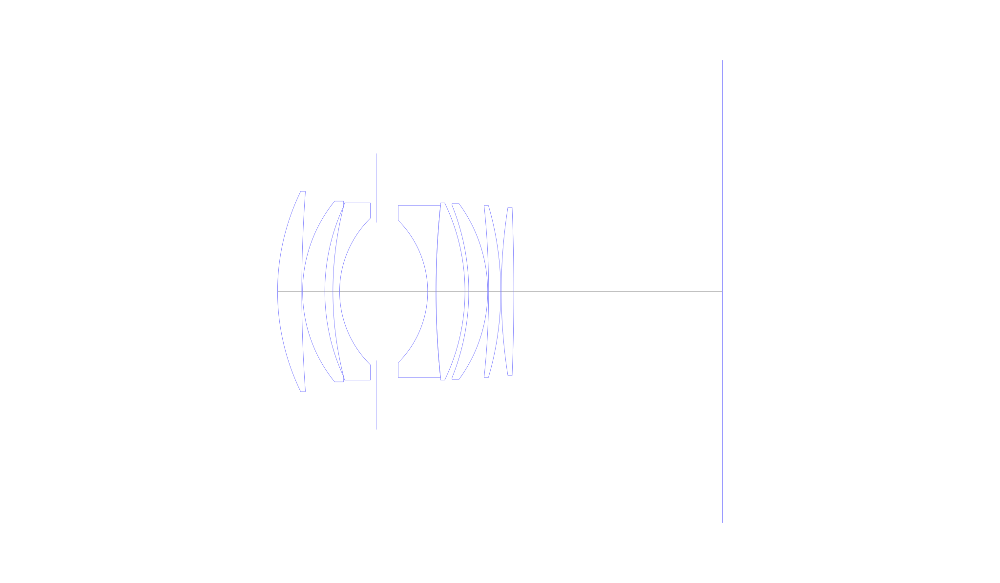
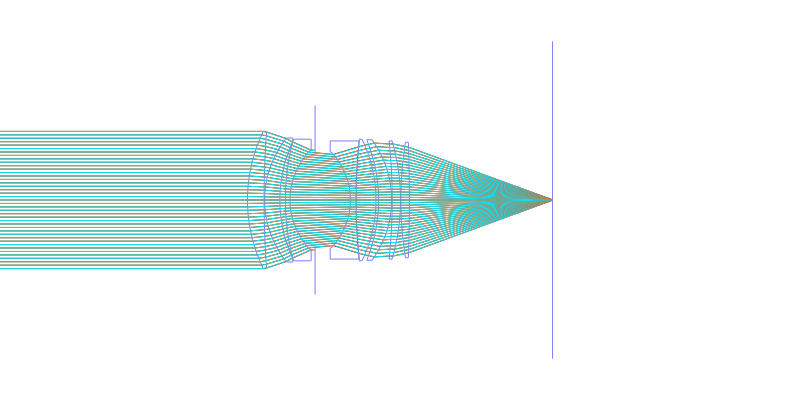
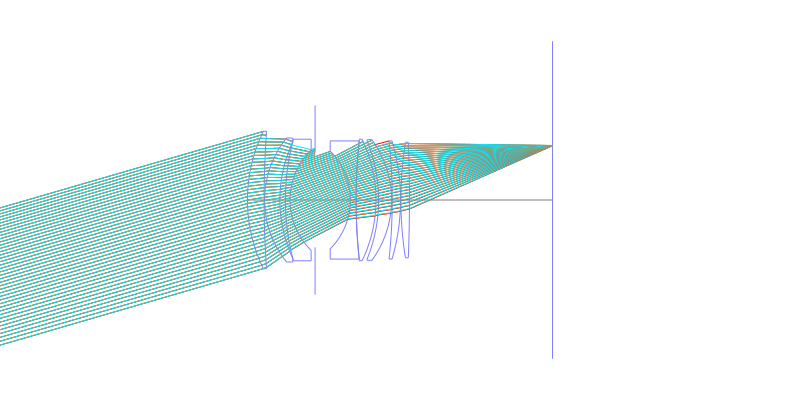
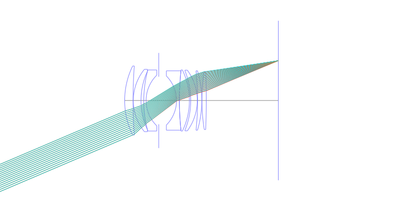
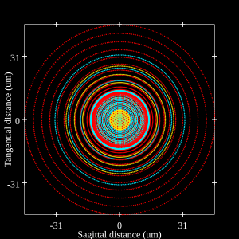
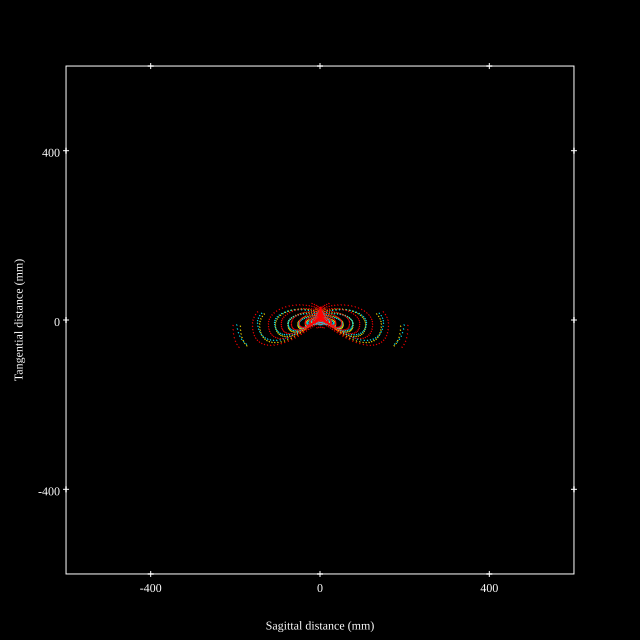
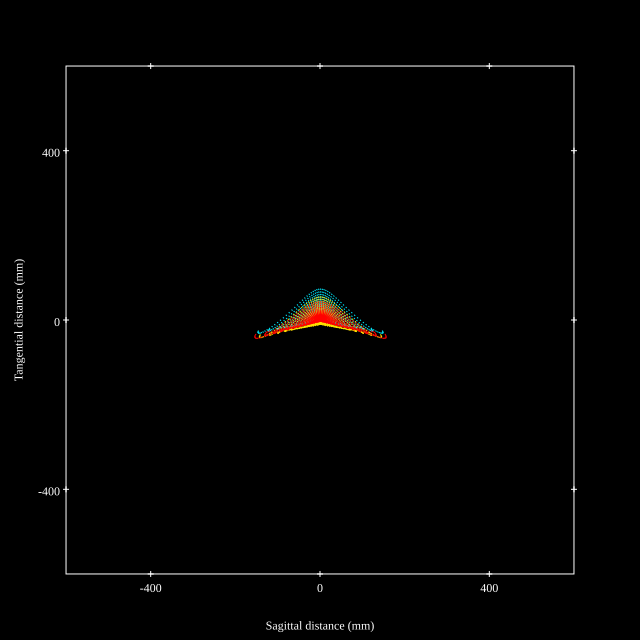
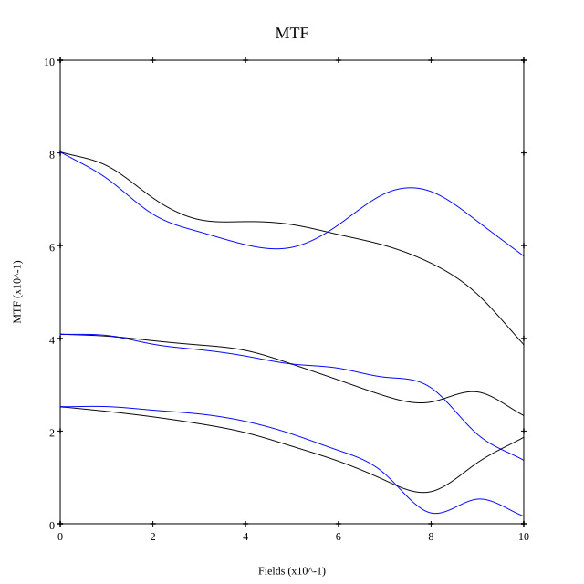
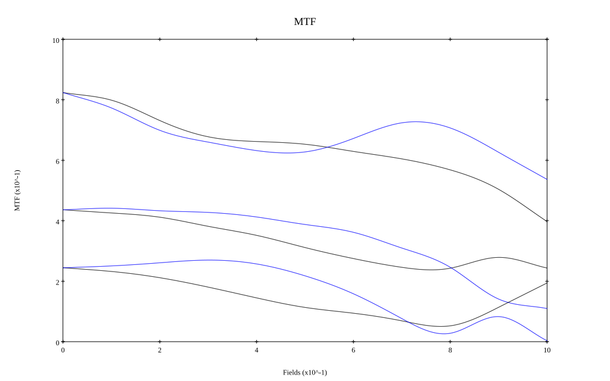

## Surface Data
Note that where glass types are shown the refractive index and abbe number is as per assigned glass type

| ID  | Radius | Thickness | Diameter | nd  | vd  | Glass Make | Glass |
| --- | ---    | ---       | ---      | --- | --- | ---        | ---   |
| 1 | 42.627 | 4.52 | 37.38 | 1.804 | 46.6 | Hikari | J-LASF015 |
| 2 | 258.15 | 0.15 | 37.38 |  |  |  |
| 3 | 26.811 | 4.15 | 33.75 | 1.90366 | 31.27 | Hikari | J-LASFH13 |
| 4 | 37.76 | 1.51 | 31.79 |  |  |  |
| 5 | 64.144 | 1.25 | 33.09 | 1.7552 | 27.57 | Hikari | J-SF4 |
| 6 | 19.2 | 6.822 | 27.4 |  |  |  |
| 7 | AS | 9.6123 | 25.771 |  |  |  |
| 8 | -18.804 | 1.55 | 26.58 | 1.7552 | 27.57 | Hikari | J-SF4 |
| 9 | 154.1 | 0.01 | 32.15 | 1.56732 | 42.82 | Ohara | S-TIL26 |
| 10 | 154.1 | 5.4 | 32.15 | 1.83481 | 42.73 | Hikari | J-LASF05 |
| 11 | -38.026 | 0.71 | 33.08 |  |  |  |
| 12 | -43.029 | 3.53 | 32.22 | 1.83481 | 42.73 | Hikari | J-LASF05 |
| 13 | -27.84 | 0.18 | 32.84 |  |  |  |
| 14 | -151.43 | 2.26 | 32.15 | 1.816 | 46.59 | Hikari | J-LASF09A |
| 15 | -57.077 | 0.1 | 32.15 |  |  |  |
| 16 | 100.548 | 2.33 | 31.44 | 1.72916 | 54.68 | Ohara | S-LAL18 |
| 17 | -400.0 | 38.93 | 31.44 |  |  |  |
## Layouts

## Spot Diagrams

## Paraxial Parameters
| parameter | value |
| ---       | ---   |
| effective_focal_length |51.599
| back_focal_length | 39.018
| optical_invariant | 7.609
| object_distance | 1.0E10
| image_distance | 39.018
| power | 0.019
| pp1_H | 40.761
| ppk_H' | -12.581
| ffl_F | -10.838
| fno | 1.45
| enp_dist_P | 20.837
| enp_radius | 17.793
| exp_dist_P' | -44.95
| exp_radius | 28.984
| m | -0
| red | -1.9380349224759132E8
| n_obj | 1
| n_img | 1
| img_ht | 22.067
| obj_ang | 23.155
| obj_na | 0
| img_na | -0.326|
## Spot Analysis
| Field | Spot Mean Radius | Spot Max Radius |
| ---   | ---              | ---             |
 | Field(x=0.0, y=0.0) | 17.639 | 43.184|
 | Field(x=0.0, y=0.1) | 21.051 | 68.819|
 | Field(x=0.0, y=0.2) | 27.1 | 91.063|
 | Field(x=0.0, y=0.3) | 29.3 | 95.359|
 | Field(x=0.0, y=0.4) | 32.22 | 118.472|
 | Field(x=0.0, y=0.5) | 35.81 | 144.503|
 | Field(x=0.0, y=0.6) | 40.282 | 189.728|
 | Field(x=0.0, y=0.7) | 44.875 | 211.203|
 | Field(x=0.0, y=0.8) | 50.219 | 218.804|
 | Field(x=0.0, y=0.9) | 51.704 | 205.91|
 | Field(x=0.0, y=1.0) | 47.887 | 162.146|
## Polychromatic Geometric MTF

* 10,30,50 cycles/mm
* Black lines represent sagittal, blue tangential
* To generate above, MTFs for wavelengths 587.5618(d), 486.1327(F), 656.2725(C) were calculated across 10 fields, and then averaged
## Polychromatic Geometric MTF (Weighted)

* 10,30,50 cycles/mm
* Black lines represent sagittal, blue tangential
* To generate above, MTFs for wavelengths 587.5618(d) wt(1.0), 656.2725(C) wt(0.475), 546.074(e) wt(0.98), 486.1327(F) wt(0.49), 435.8343(g) wt(0.15) were calculated across 10 fields, and then combined using weighted average
## Resources
* [OpticalBench Compatible Data File, tab delimited](./JP2015-041003_Example01MLP.txt)
* [Zemax file](./JP2015-041003_Example01MLP.zmx)
