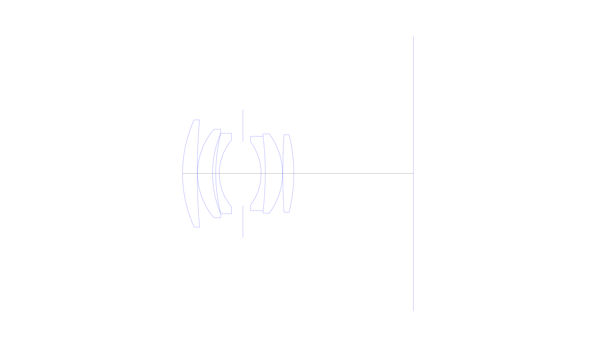
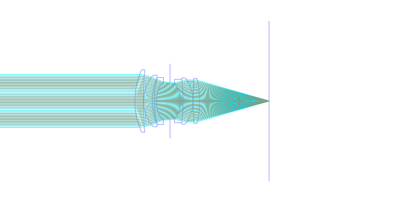
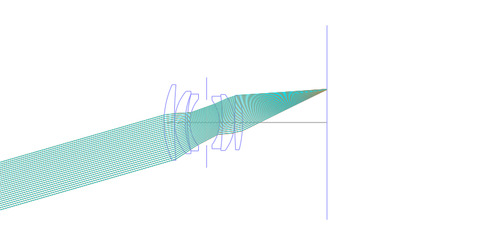
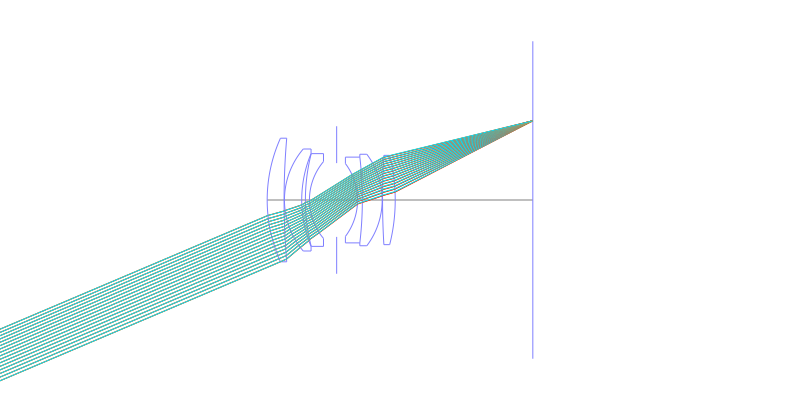
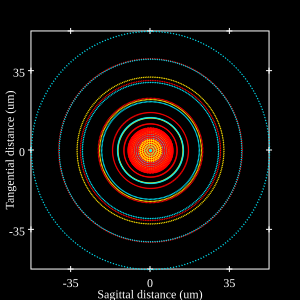
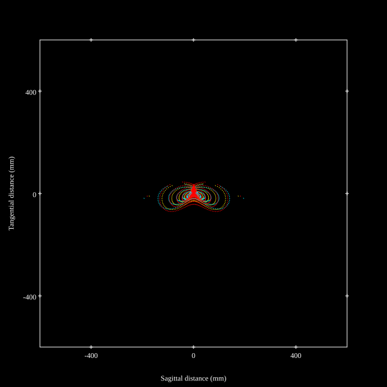
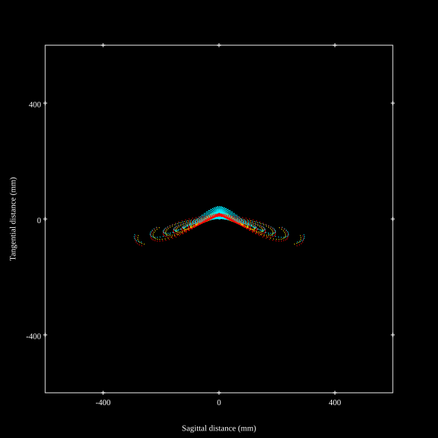
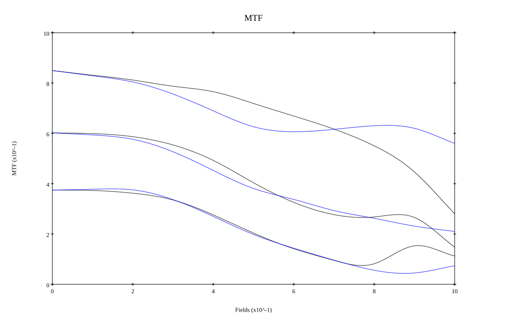
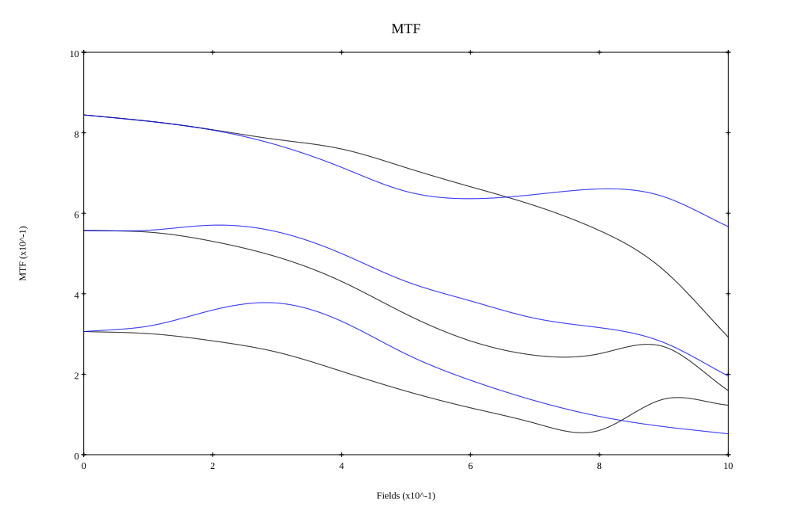

# AI NIKKOR 50mm f/1.8
## Patent Information
| Country | Patent Number | Example | Year of Application | Inventors | Organisation | Link |
| ---     | ---           | ---     | ---                 | ---       | ---          | ---  |
|US | US4139265 | EX 1 | 1976 | Sei Matsui | Nikon Corp | [link](https://patents.google.com/patent/US4139265A/en) |
## Surface Data
Note that where glass types are shown the refractive index and abbe number is as per assigned glass type

| ID  | Radius | Thickness | Diameter | nd  | vd  | Glass Make | Glass |
| --- | ---    | ---       | ---      | --- | --- | ---        | ---   |
| 1 | 40.999 | 4.6 | 33.64 | 1.7972 | 41.14 | Hoya | NBFD2 |
| 2 | 197.89 | 0.1 | 33.64 |  |  |  |
| 3 | 21.4 | 4.7 | 27.76 | 1.788 | 47.35 | Hikari | J-LASF014 |
| 4 | 32.59 | 1.0 | 25.24 |  |  |  |
| 5 | 50.99 | 1.1 | 25.24 | 1.74 | 28.25 | Hoya | FD3 |
| 6 | 16.199 | 7.41 | 20.91 |  |  |  |
| 7 | AS | 5.689 | 20.077 |  |  |  |
| 8 | -16.5 | 1.299 | 19.83 | 1.74 | 28.25 | Hoya | FD3 |
| 9 | -99.99 | 5.399 | 23.34 | 1.74429 | 50.77 | Schott | N-LAK28 |
| 10 | -20.64 | 0.1 | 24.9 |  |  |  |
| 11 | 204.299 | 3.449 | 24.3 | 1.7972 | 41.14 | Hoya | NBFD2 |
| 12 | -49.6521 | 37.45 | 24.3 |  |  |  |
## Layouts

## Spot Diagrams

## Paraxial Parameters
| parameter | value |
| ---       | ---   |
| effective_focal_length |51.554
| back_focal_length | 37.548
| optical_invariant | 6.079
| object_distance | 1.0E10
| image_distance | 37.548
| power | 0.019
| pp1_H | 27.372
| ppk_H' | -14.006
| ffl_F | -24.182
| fno | 1.8
| enp_dist_P | 22.742
| enp_radius | 14.321
| exp_dist_P' | -18.994
| exp_radius | 15.734
| m | -0
| red | -1.9397007191452408E8
| n_obj | 1
| n_img | 1
| img_ht | 21.884
| obj_ang | 23
| obj_na | 0
| img_na | -0.268|
## Spot Analysis
| Field | Spot Mean Radius | Spot Max Radius |
| ---   | ---              | ---             |
 | Field(x=0.0, y=0.0) | 14.714 | 58.891|
 | Field(x=0.0, y=0.1) | 17.405 | 73.863|
 | Field(x=0.0, y=0.2) | 20.143 | 91.914|
 | Field(x=0.0, y=0.3) | 22.59 | 85.825|
 | Field(x=0.0, y=0.4) | 22.469 | 95.736|
 | Field(x=0.0, y=0.5) | 25.47 | 117.378|
 | Field(x=0.0, y=0.6) | 30.413 | 148.707|
 | Field(x=0.0, y=0.7) | 36.647 | 195.226|
 | Field(x=0.0, y=0.8) | 46.515 | 234.229|
 | Field(x=0.0, y=0.9) | 61.538 | 267.663|
 | Field(x=0.0, y=1.0) | 75.588 | 300.237|
## Polychromatic Geometric MTF

* 10,30,50 cycles/mm
* Black lines represent sagittal, blue tangential
* To generate above, MTFs for wavelengths 587.5618(d), 486.1327(F), 656.2725(C) were calculated across 10 fields, and then averaged
## Polychromatic Geometric MTF (Weighted)

* 10,30,50 cycles/mm
* Black lines represent sagittal, blue tangential
* To generate above, MTFs for wavelengths 587.5618(d) wt(1.0), 656.2725(C) wt(0.475), 546.074(e) wt(0.98), 486.1327(F) wt(0.49), 435.8343(g) wt(0.15) were calculated across 10 fields, and then combined using weighted average
## Resources
* [OpticalBench Compatible Data File, tab delimited](./US004139265_Example01S.txt)
* [Zemax file](./US004139265_Example01S.zmx)
