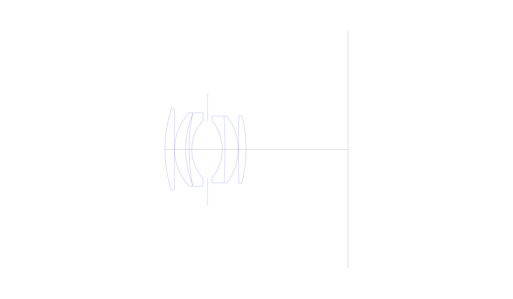
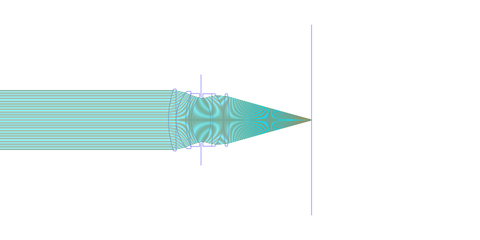
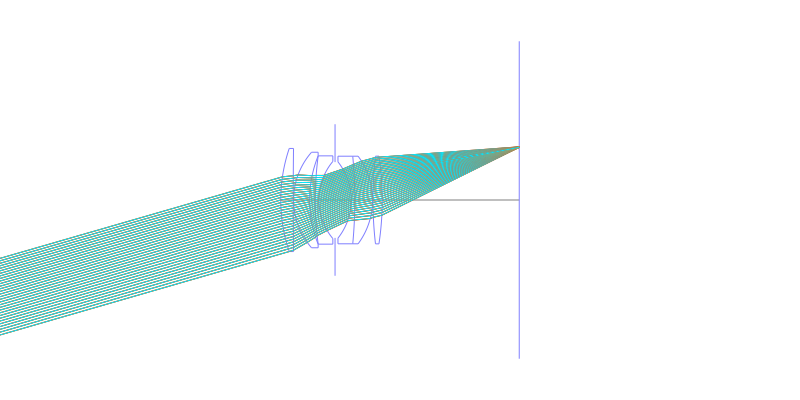
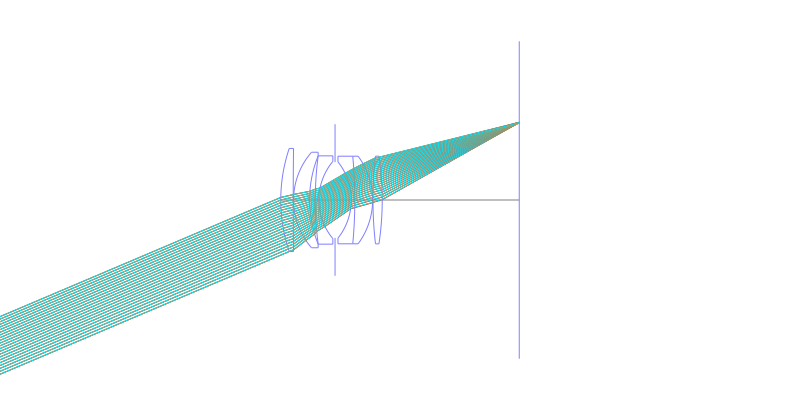
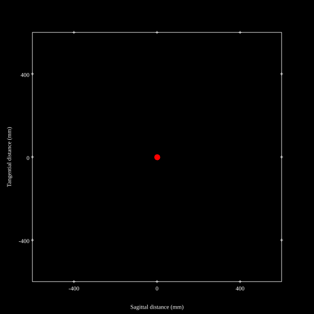
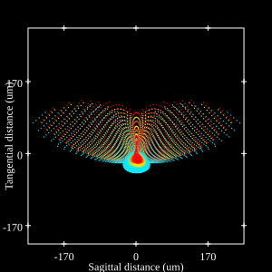
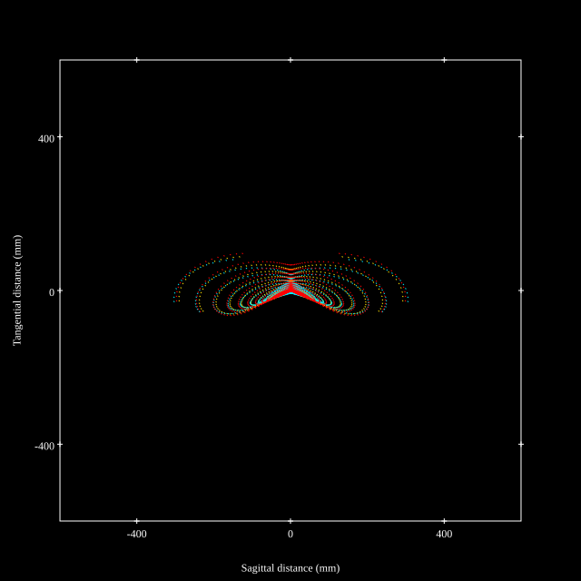
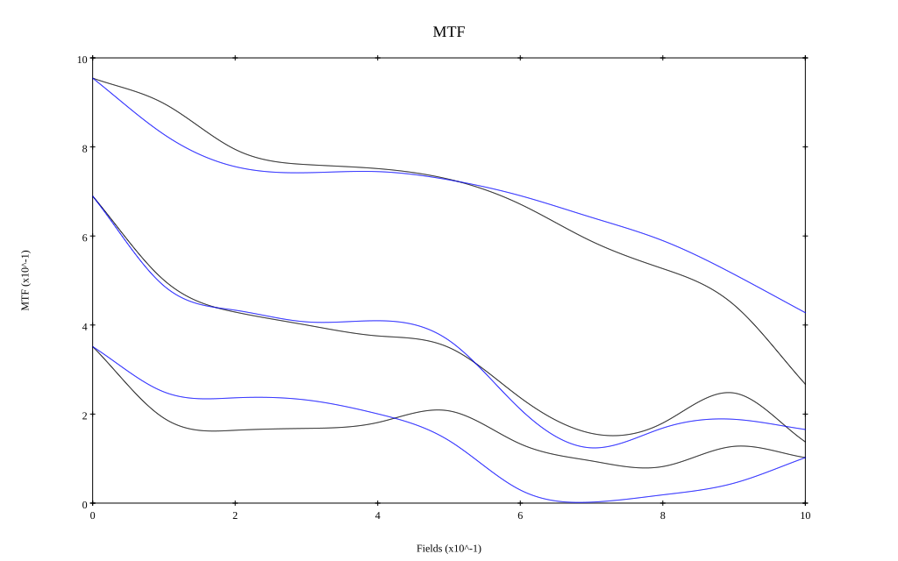

# AI NIKKOR 50mm f/1.8S
## Patent Information
| Country | Patent Number | Example | Year of Application | Inventors | Organisation | Link |
| ---     | ---           | ---     | ---                 | ---       | ---          | ---  |
|US | US4234242 | EX 4 | 1978 | Soichi Nakamura | Nikon Corp | [link](https://patents.google.com/patent/US4234242A/en) |
## Surface Data
Note that where glass types are shown the refractive index and abbe number is as per assigned glass type

| ID  | Radius | Thickness | Diameter | nd  | vd  | Glass Make | Glass |
| --- | ---    | ---       | ---      | --- | --- | ---        | ---   |
| 1 | 43.896 | 3.39 | 28.06 | 1.713 | 53.96 | Hikari | J-LAK8 |
| 2 | 1181.599 | 0.095 | 28.06 |  |  |  |
| 3 | 19.719 | 4.36 | 26.0 | 1.713 | 53.96 | Hikari | J-LAK8 |
| 4 | 32.171 | 1.55 | 24.03 |  |  |  |
| 5 | 92.055 | 0.97 | 24.03 | 1.64831 | 33.84 | Schott | SF12 |
| 6 | 16.376 | 4.41 | 21.0 |  |  |  |
| 7 | AS | 4.41 | 20.622 |  |  |  |
| 8 | -16.706 | 0.97 | 20.76 | 1.62004 | 36.4 | Hikari | J-F2 |
| 9 | -125.969 | 4.845 | 23.84 | 1.713 | 53.96 | Hikari | J-LAK8 |
| 10 | -19.961 | 0.095 | 23.84 |  |  |  |
| 11 | 104.454 | 2.52 | 23.87 | 1.713 | 53.96 | Hikari | J-LAK8 |
| 12 | -80.184 | 37.29 | 23.87 |  |  |  |
## Layouts

## Spot Diagrams

## Paraxial Parameters
| parameter | value |
| ---       | ---   |
| effective_focal_length |50.018
| back_focal_length | 37.368
| optical_invariant | 5.898
| object_distance | 1.0E10
| image_distance | 37.368
| power | 0.02
| pp1_H | 17.193
| ppk_H' | -12.65
| ffl_F | -32.826
| fno | 1.8
| enp_dist_P | 16.463
| enp_radius | 13.894
| exp_dist_P' | -13.311
| exp_radius | 14.1
| m | -0
| red | -1.9992758206281817E8
| n_obj | 1
| n_img | 1
| img_ht | 21.231
| obj_ang | 23
| obj_na | 0
| img_na | -0.268|
## Spot Analysis
| Field | Spot Mean Radius | Spot Max Radius |
| ---   | ---              | ---             |
 | Field(x=0.0, y=0.0) | 6.474 | 12.009|
 | Field(x=0.0, y=0.1) | 13.185 | 66.583|
 | Field(x=0.0, y=0.2) | 25.763 | 133.224|
 | Field(x=0.0, y=0.3) | 33.163 | 159.503|
 | Field(x=0.0, y=0.4) | 37.05 | 165.062|
 | Field(x=0.0, y=0.5) | 39.348 | 158.662|
 | Field(x=0.0, y=0.6) | 40.122 | 161.541|
 | Field(x=0.0, y=0.7) | 44.222 | 171.555|
 | Field(x=0.0, y=0.8) | 49.338 | 196.73|
 | Field(x=0.0, y=0.9) | 62.525 | 239.149|
 | Field(x=0.0, y=1.0) | 83.173 | 305.478|
## Geometric MTF

* 10,30,50 cycles/mm
* Black lines represent sagittal, blue tangential
## Resources
* [OpticalBench Compatible Data File, tab delimited](./US004234242_Example04a.txt)
* [Zemax file](./US004234242_Example04a.zmx)
